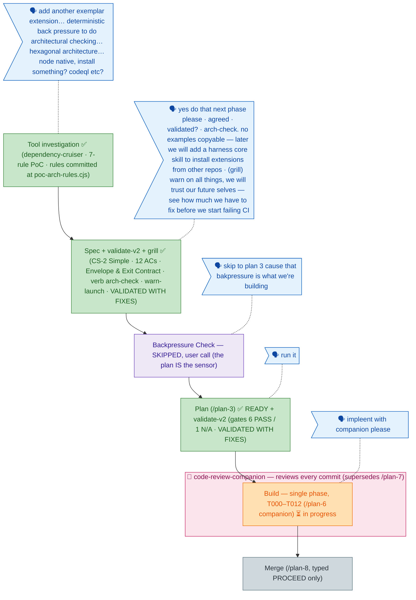

<!-- GENERATED FROM the-flow.json — do not hand-edit as the primary. -->
# Flight plan — arch-conformance-extension (016)

**Legend** — 🟩 done · 🟧 in progress · 🟦 known (designed) · ⬜ assumed (speculative) · 🗣 user input · 🟪 harness loop · 🩷 companion (live reviewer)

**Now**: **Build IN PROGRESS** — `/plan-6` companion variant launched post-compact on the READY plan (gates 6 PASS / 1 N/A; validate-v2 VALIDATED WITH FIXES). A live `code-review-companion` reviews every commit as it lands, superseding the separate `/plan-7` review step. Single phase: T000 boot → T001 devDependency → T002 rules config (all 7 at `warn` — warn-launch posture) → T003 RED fixtures/tests → T004 GREEN `mapToDecision` → T005 extension shell → T006 instructions → T007 manual E2E walk → T008 CI final step → T009 how-guide → T010 governance doc → T011 regression both cwds → T012 retro drain. Carried-in guardrails: vitest include widened **two** levels (`'../../.harness/extensions/**/*.test.ts'`), always `./node_modules/.bin/depcruise` (bare-npx scans 0 modules), violations sorted from→to→rule, rule changes ship alone · **Next**: phase lands → `/plan-8` merge analysis (typed `PROCEED` only)
