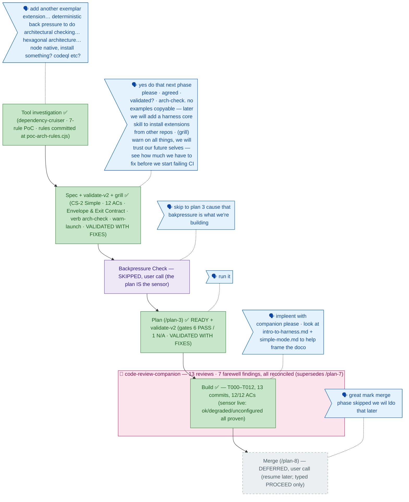

<!-- GENERATED FROM the-flow.json — do not hand-edit as the primary. -->
# Flight plan — arch-conformance-extension (016)

**Legend** — 🟩 done · 🟧 in progress · 🟦 known (designed) · ⬜ assumed (speculative) · 🗣 user input · 🟪 harness loop · 🩷 companion (live reviewer)

**Now**: **Build DONE, companion-reviewed** — T000–T012 in 13 commits (`af3b8b5..e27c6c4`), all 12 ACs evidenced. The sensor is live: `harness arch-check` reads `ok`/0 on the clean tree (66 modules / 112 deps); the seeded violation landed as `degraded`/0 naming `services-only-adapter-ports` with its comment quoted (warn-launch exactly as grilled); missing tool/config read `unconfigured`/2; CI runs the verb as the final `build-test` step with a `::warning::` on degraded. 378/378 tests from both cwds; doctor `ok` "3 loaded". Build discovery encoded same-session (gotcha #3): depcruise 17.4.3's json reporter exits 0 even on error violations → parse-first design. Mid-build user direction applied: the how-guide + briefing are framed in the harness-foundations vocabulary (inferred→deterministic worlds; encode-the-fix-not-the-memory; simple-mode Rule 3 epigraph). T012 drain materialised 12 entries (SUGG-010 P12-sanitized); buffer cleared. **Companion debrief**: a minih channel failure suppressed the companion's in-phase replies (silence read as clean) — its farewell then delivered 7 findings (5 HIGH / 2 MEDIUM, verdict REQUEST_CHANGES), all reconciled in a post-debrief fix commit: F001 absolute-path leak in flow files fixed (repo-relative), F004 parse schema-guards + comment fallback added (380/380), F006 stale governance claims fixed, F003 PoC header corrected (partial; spec stays historical), F002 refuted with evidence (engines ≥22 predates 016), F005/F007 ledger rebuilt honestly. Channel failure observe-filed as a minih bug candidate · **Merge: DEFERRED by user call (2026-06-10)** — the branch keeps its 15 unmerged commits locally; 016 joins 014 and 015 in the parked-merge set · **Next (when resumed)**: `/plan-8` merge analysis — executes **only** on explicit typed `PROCEED`
