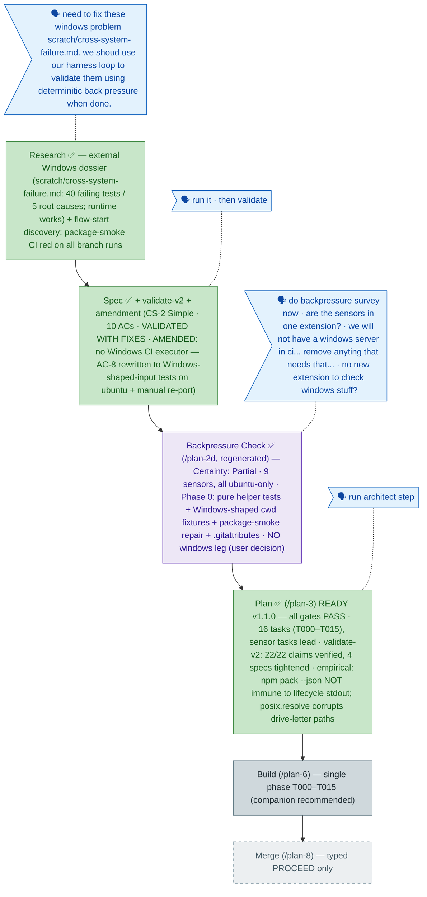

<!-- GENERATED FROM the-flow.json — do not hand-edit as the primary. -->
# Flight plan — windows-cross-platform-fixes (017)

**Legend** — 🟩 done · 🟧 in progress · 🟦 known (designed) · ⬜ assumed (speculative) · 🗣 user input · 🟪 harness loop

**Now**: The plan landed **READY** (v1.1.0, all gates PASS; G4 N/A — no ADRs): a single-phase Simple plan whose 16 task rows put the **backpressure Phase 0 first** — helper unit tests (RED) → POSIX path helper (GREEN) → separator-tolerant FakeFs → the five services converted with discovery as the *single POSIX origin* → path-safe assertions → the **Windows-shape sensor** (`FakeProcess.cwd()='C:\repo'` fixtures with post-`toPosix` FakeFs keys, plus a recorded revert-proof that the sensor actually fails on a native-join regression) → shell-free EPIPE test → gen-docs stderr/biome fixes → package-smoke repair → `.gitattributes` → idioms → full verification → retro drain. Two findings were verified **empirically** during planning: `npm pack --json` is *not* immune to lifecycle stdout on npm 11.10.0 (so the stderr move is the load-bearing fix and `jq` + the `*.tgz` assert are the loud guard), and `posix.resolve()` would corrupt drive-letter paths (the helper is normalize/join-only). validate-v2 (3 agents) confirmed all 22 factual claims and tightened four task specs, including the pin that Node's `posix.normalize` collapses a UNC leading `//`. **Next**: `/plan-6` — companion variant recommended; `/compact` first is the cleaner seam.
