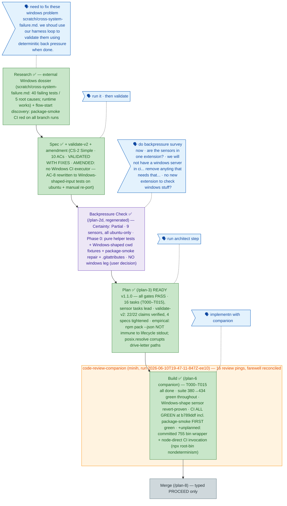

<!-- GENERATED FROM the-flow.json — do not hand-edit as the primary. -->
# Flight plan — windows-cross-platform-fixes (017)

**Legend** — 🟩 done · 🟧 in progress · 🟦 known (designed) · ⬜ assumed (speculative) · 🗣 user input · 🟪 harness loop · 🟠 companion

**Now**: The build is **done** — all 16 tasks (T000–T015), suite 380 → **434 green throughout**, arch-check ok, and **CI fully green at `b789ddf`**: build-test on Node 22 AND 24, plus **package-smoke's first green** (AC-9) — the deterministic backpressure the user mandated, end to end. The Windows-shape sensor (11 ubuntu-runnable tests over `FakeProcess.cwd()='C:\repo'` fixtures) was **proven by reverting** the discovery boundary to native join and watching it fail. One unplanned defect class surfaced on the way: `package.json#bin` pointed at untracked 644 tsc output and `npx --no-install` resolution of the repo's own bin turned out **nondeterministic across npm majors** — fixed in-theme with a committed 100755 bin wrapper + node-direct invocation in CI. The companion reviewed all 16 commits and its farewell carried **4 MEDIUM findings** (the inbox never surfaced them mid-phase — the DL-001 channel asymmetry again); all four were addressed inline post-farewell (UNC root-kind guard in `isWithin`, an AC-2 source guard banning `node:path` in the five services, idiom scope fix, self-repo invocation docs), landing the suite at **442/442**. The T015 drain + farewell materialized as `.harness/records/retro/2026-06-10/008…drain.md` and `009…companion-farewell.md`. **Next**: `/plan-8` merge analysis — the merge itself executes **only on a typed `PROCEED`**.
