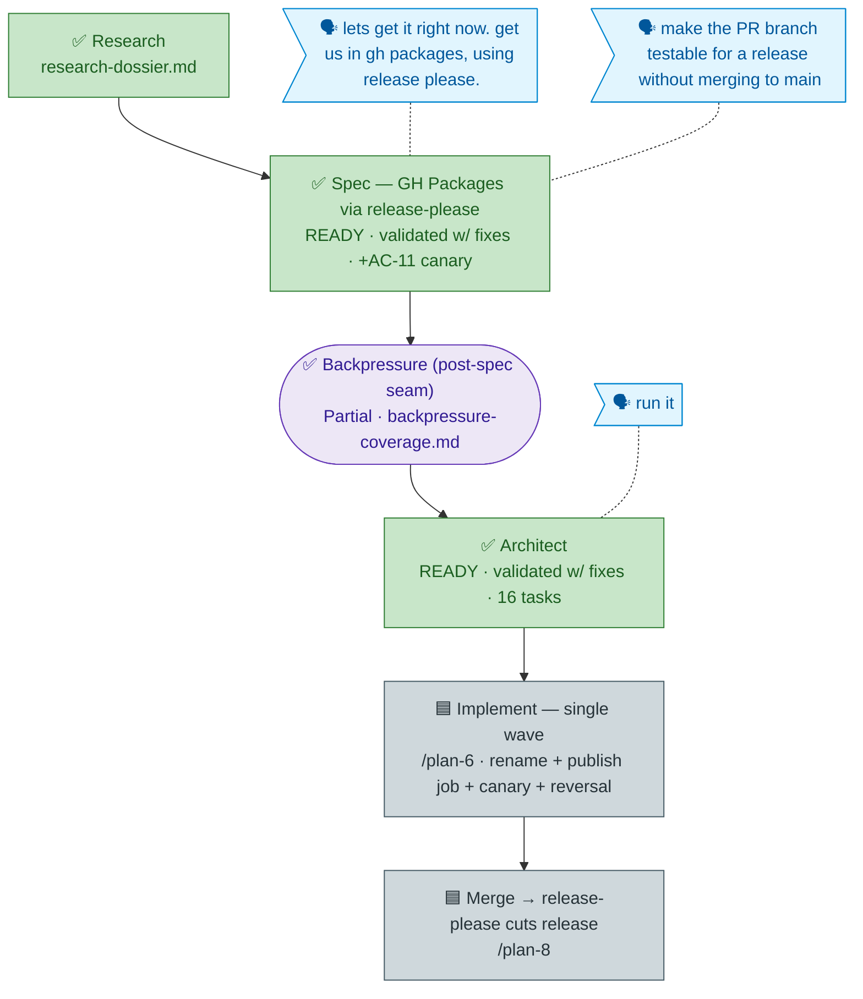

<!-- GENERATED from the-flow.json — do not hand-edit; regenerate from the JSON. -->
# Flight plan — gh-packages-release-please (018)

**Now:** plan READY + validated (single wave, 16 tasks) · **Next:** implement (`/plan-6`) → merge → release-please. validate-v2 fixed 1 CRITICAL (the release-please cross-job output gate was a silent no-op) + the canary `--tag`/version mechanics; Forward-Compat + Thesis both PASS.
