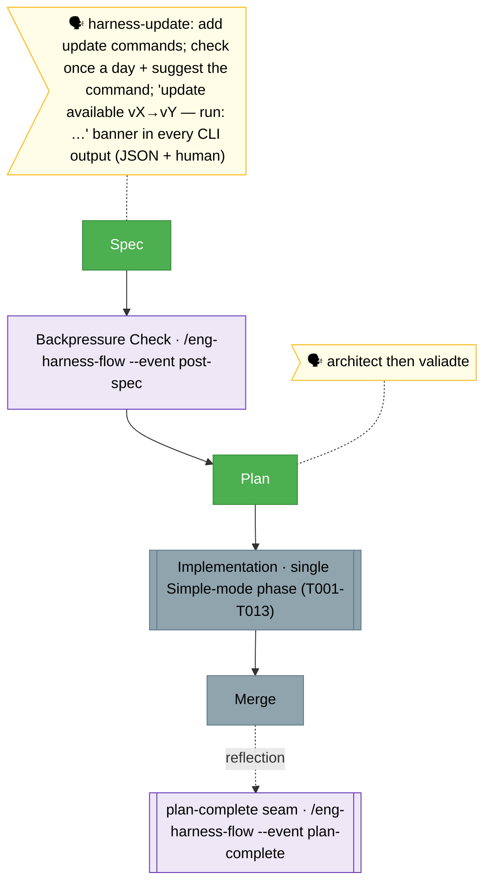

<!-- 🔄 RENDERED from the-flow.json — regenerate, never hand-edit this file as the primary. -->
# Flight plan — harness-update

**Plan**: harness-update · **Mode**: Simple · **Phases**: 1 (single Simple-mode phase, 13 tasks)
**Rail**: `[the-flow] ◆─◆─◇─◇`   ·   **now**: Plan done (READY, CS-4, Simple) · **next**: Build

**Legend**: 🟩 done · 🟧 in progress · 🟥 blocked · 🟦 known future (designed) · ⬜╴assumed future (dashed) · 🟨 🗣 verbatim user input · 🟪 harness seams (violet — routed via `/eng-harness-flow`)

_Generated from `the-flow.json`. Simple mode → one phase (13 tasks + 2 harness-seam rows), locked at `/the-flow 3 architect`. Spec + plan both done; the plan auto-ran `/validate-v2` (4 validators; READY; CRITICAL banner-chokepoint fix applied). Backpressure (post-spec) shown but not run; plan-complete seam shown because the router is installed (`~/.agents/skills/eng-harness-flow`)._
