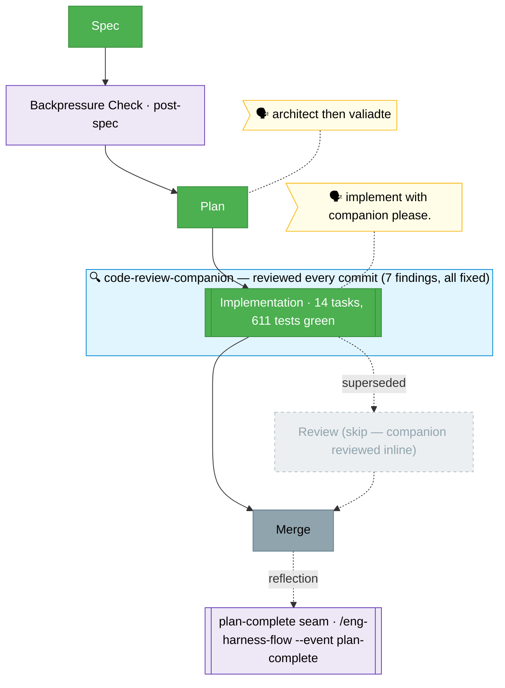

<!-- 🔄 RENDERED from the-flow.json — regenerate, never hand-edit this file as the primary. -->
# Flight plan — harness-update

**Plan**: harness-update · **Mode**: Simple · **Phases**: 1 (single Simple-mode phase, 14 tasks)
**Rail**: `[the-flow] ◆─◆─◆─◇`   ·   **now**: Build done (611 tests green, companion-reviewed) · **next**: Merge

**Legend**: 🟩 done · 🟧 in progress · 🟥 blocked · 🟦 known future · ⬜╴assumed/optional (dashed) · 🟨 🗣 verbatim user input · 🔵 companion (wraps the phases it reviewed) · 🟪 harness seams

_Generated from `the-flow.json`. Build ran via `/the-flow 6 implement --companion`: 14 tasks (T001–T013 + T006B), 15 commits (`c62f30b..169aa5d`) on branch `019-harness-update`, **611 tests green**, arch boundaries clean. The `code-review-companion` reviewed every commit (F001–F007, 3 HIGH, all fixed in `169aa5d`) → the review stage is **superseded**. Next: merge._
