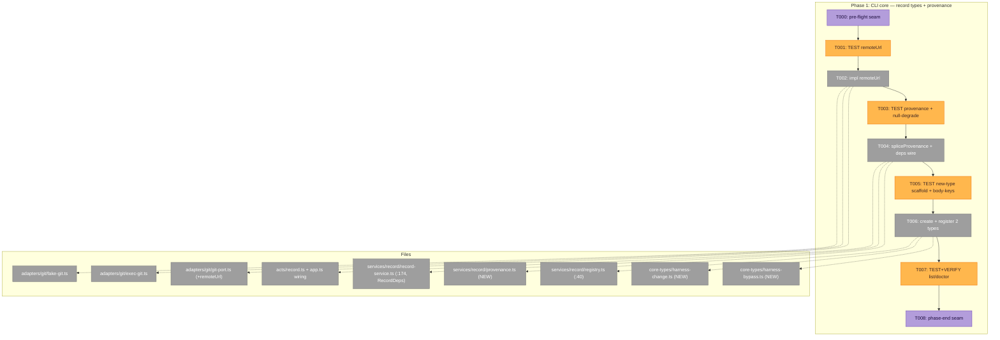
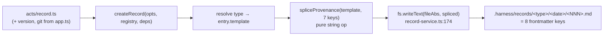
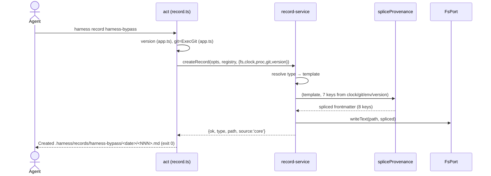

# Phase 1 — CLI core: record types + provenance stamping · Tasks & Context Brief

**Plan**: [harness-bypass-change-records-plan.md](../../harness-bypass-change-records-plan.md)
**Spec**: [harness-bypass-change-records-spec.md](../../harness-bypass-change-records-spec.md)
**Phase**: Phase 1 of 5 · **Primary domain**: `services/record` (+ `adapters/git`, `version`)
**Generated**: 2026-06-16 · **Status**: Ready for GO (no code written yet)

---

## Executive Briefing

**Purpose**: Land the two new committed record types (`harness-bypass`, `harness-change`) as core types, and make **every** record the CLI writes (including `retro`) carry a CLI-stamped provenance header — spliced into the frontmatter from injected ports, never agent-filled. This is the load-bearing phase: it establishes the frozen 8-key join contract the future (OOS) cross-repo scanner depends on.

**What We're Building**:
- A new `GitPort.remoteUrl(): string | null` (port + `ExecGit` + `FakeGit`).
- A pure `spliceProvenance(template, fields)` helper — splits on the first `---\n`, prepends the **7 environment/identity keys**, never touches `schema_version`, idempotent, zero I/O.
- `RecordDeps` (and `RecordActDeps`) gain `git: GitPort` + `version: string`; `record-service.ts:174` writes the spliced string.
- Two new core type files `core-types/harness-bypass.ts` + `harness-change.ts` (mirroring `retro.ts`), registered at `registry.ts:40`.
- Full test coverage: provenance-coverage, null-degradation, `remoteUrl` contract, frozen-body-keys, registry/doctor/list enumeration.

**Goals**:
- ✅ `harness record harness-bypass` / `harness-change` scaffold, return path, exit 0 (AC-1).
- ✅ Every written record carries **all 8** Frozen-Contract keys, exactly one each — 1 template-owned (`schema_version`) + 7 spliced (AC-3).
- ✅ Git-unavailable / detached / no-remote / no-plan → affected keys stamp `null`, write still succeeds (AC-4).
- ✅ The service stays I/O-free (Constitution P2) — `arch-check` proves it (G2/G3).
- ✅ `record --list` + `doctor` enumerate both new types `source: core` (AC-2).
- ✅ Both new types carry exactly the frozen body keys (`cause`/`change_type` enums, `resolves` ≤200) — pinned by the frozen-body-keys test (AC-6).

**Non-Goals** (❌ this phase):
- ❌ The `win` retro kind — that's Phase 2 (`schema_version` 1.0→1.1 bump lives there; Phase 1 must **not** hardcode the value).
- ❌ Any `RETRO_TEMPLATE` byte change (it stays byte-identical under the Phase-1 provenance mechanism — AC-5).
- ❌ `history.md` removal (Phase 3), capture-seam prose (Phase 4), measures doc (Phase 5).
- ❌ Any JSON-Schema/ajv validator (none in repo; new types have no schema file — body pinned by a frozen-key-set test, not a schema superset).
- ❌ The cross-repo scanner + DORA correlation (OOS for the whole plan).

---

## Pre-Implementation Check

*(All source line anchors below were re-verified against the working tree this turn.)*

| File | Exists? | Domain Check | Notes |
|------|---------|-------------|-------|
| `harness/cli/src/adapters/git/git-port.ts` | ✅ modify | adapters/git ✓ | interface at `:7`; only `isRepo()`/`currentBranch()` today — `remoteUrl` is **additive** |
| `harness/cli/src/adapters/git/exec-git.ts` | ✅ modify | adapters/git ✓ | real adapter; `remoteUrl` via `git remote get-url origin`, null on non-zero |
| `harness/cli/src/adapters/git/fake-git.ts` | ✅ modify | adapters/git ✓ | add `remoteUrl?` to fake state |
| `harness/cli/test/adapters/git/fake-git.test.ts` | ✅ modify | test ✓ | pin `remoteUrl` + null cases |
| `harness/cli/src/services/record/record-service.ts` | ✅ modify | services/record ✓ | `RecordDeps` at `:27` = `{fs,clock,proc}`; write at `:174` `fs.writeText(fileAbs, entry.template)` |
| `harness/cli/src/services/record/provenance.ts` | ❌ **create** | services/record ✓ | NEW pure helper (or inline in record-service) — **no `node:fs`/`node:child_process`** |
| `harness/cli/src/services/record/registry.ts` | ✅ modify | contract ✓ | `:40` `coreRecordTypes: HarnessRecordType[] = [retroRecordType]` — append 2 |
| `harness/cli/src/services/record/contract.ts` | ✅ read-only | contract ✓ | 4-field `HarnessRecordType` (`kind:'record'`, `type`, `description`, `template`) — no change |
| `harness/cli/src/services/record/core-types/retro.ts` | ✅ read-only | precedent ✓ | the shape to mirror (`RETRO_TEMPLATE` + `retroRecordType`, lines 19–57) |
| `harness/cli/src/services/record/core-types/harness-bypass.ts` | ❌ **create** | services/record ✓ | NEW template + `HarnessRecordType` |
| `harness/cli/src/services/record/core-types/harness-change.ts` | ❌ **create** | services/record ✓ | NEW template + `HarnessRecordType` |
| `harness/cli/src/acts/record.ts` | ✅ modify | services/record ✓ | `RecordActDeps` at `:13` = `{fs,proc,clock}`; `createRecord(...,deps)` at `:55` — add `git`+`version`+`env` |
| `harness/cli/src/adapters/env/{env-port,fake-env}.ts` | ✅ read-only | adapters/env ✓ | `EnvPort` + `FakeEnv` already exist (used by observe) — reuse for `agent`/`plan_id` + the null-degradation test |
| `harness/cli/src/version.ts` | ✅ read-only | bootstrap ✓ | `readVersion()` at `:15` reads `package.json` via `node:fs` (`:1`) — **must not** be called in the service (P2) |
| `harness/cli/src/app.ts` | ✅ modify (wiring) | composition ✓ | imports `readVersion` (`:46`), `ExecGit` (`:18`); `deps` (`VerbActDeps`) **already carries `git`+`env`** (verb.ts:17-18); `version` is a separate `buildProgram` local (`:252`); calls `registerRecordAct(program,io,deps,…)` (`:200`) — thread `git`/`env` via `deps`, pass `version` as a **new arg** (cf. `registerUpdateAct(…,version)` `:199`) |
| `harness/cli/test/services/record/record-service.test.ts` | ✅ modify | test ✓ | provenance-coverage + null-degradation + new-type scaffold/frozen-body-keys |
| `harness/cli/test/services/record/registry.test.ts` | ✅ modify | test ✓ | enumerate 2 new core types |
| `harness/cli/test/services/record/retro-template.test.ts` | ✅ read-only this phase | test ✓ | **untouched in Phase 1** (its `win`-enum + version-sync edits are Phase 2) |
| `harness/cli/test/acts/record.test.ts` | ✅ modify | test ✓ | `harness record harness-bypass`/`harness-change` verb wiring |
| `harness/cli/test/services/doctor/doctor-service.test.ts` | ✅ modify | test ✓ | doctor enumerates the 2 new types (source `core`) |

**Harness availability**: Router **installed** (`~/.agents/skills/eng-harness-flow` present) → the implement verb fires the pre-implement seam (T000) before any code and the phase-end seam (T008) at the end; verdicts narrated verbatim from the envelope.

**Duplication scan**: No existing `harness-bypass`/`harness-change`/`provenance` symbols — confirmed the three new files are genuinely absent. `coreRecordTypes` currently holds only `retroRecordType`.

---

## Architecture Map



**Data flow** — where the provenance header is born:



---

## Tasks

| Status | ID | Task | Domain | Path(s) | Done When | Notes |
|--------|-----|------|--------|---------|-----------|-------|
| [x] | T000 | **Harness pre-flight** — `/eng-harness-flow --event pre-implement --phase "Phase 1: CLI core: record types + provenance stamping" --plan-dir docs/plans/020-harness-bypass-change-records` | — | — | ✅ boot **healthy** (617 tests green) before any code | _Harness seam_; advisory, never gates |
| [x] | T001 | **TEST** `remoteUrl` contract + null cases: repo w/ remote → url; no remote → null; not-a-repo → null | adapters/git | `harness/cli/test/adapters/git/fake-git.test.ts` | ✅ RED confirmed (`remoteUrl is not a function`) | TDD (KF-07 additive pattern) |
| [x] | T002 | Add `remoteUrl(): string \| null` to `GitPort`; implement in `ExecGit` (`git remote get-url origin`; **null on non-zero exit OR empty trimmed stdout** — mirror `currentBranch`'s guard) + `FakeGit` (`state.remoteUrl ?? null`) | adapters/git | `git-port.ts`, `exec-git.ts`, `fake-git.ts` | ✅ GREEN (5/5); additive — no other consumers break | Additive to the port; `origin`-only is the deliberate Phase-1 contract (a non-`origin` remote → null) |
| [x] | T003 | **TEST** provenance-coverage + null-degradation in `record-service.test.ts`: (a) written frontmatter carries **all 8** Frozen-Contract keys, **exactly one each** (7 spliced from `FakeGit`/`FakeClock`/`version`/`FakeEnv` + `schema_version` template-owned); (b) assert `schema_version` is **present, value read from the template** (never hardcode `"1.0"` — Phase 2 bumps it); (c) splice is **idempotent**; (d) null-degradation: `FakeGit` null branch+remote, `FakeEnv` with no `HARNESS_PLAN_ID`/`HARNESS_AGENT` → those keys `null`, write still ok; (e) spliced keys land **inside the first frontmatter block** (after the opening `---\n`, before the closing `---`), never before the fence; (f) a value with a `/` (e.g. `branch=feat/x`) round-trips — spliced string values are double-quoted so the scanner's YAML parse stays unambiguous | services/record | `harness/cli/test/services/record/record-service.test.ts` | **RED** | KF-01/02/03; cross-phase hazard guarded (KF-01); env via `FakeEnv` |
| [x] | T004 | Add `git: GitPort` + `version: string` + **`env: EnvPort`** to `RecordDeps` **and `RecordActDeps`**; write `spliceProvenance(template, fields)` (pure: `template.split('---\n', 2)`, prepend the 7-key block **inside** the first frontmatter block, double-quote string values, **never** touch `schema_version`, idempotent, no I/O); update `record-service.ts:174` to write the spliced string. **Wiring**: `git`+`env` already ride in `VerbActDeps` (verb.ts:17-18) → thread into `RecordActDeps`/`deps`; **`version` is NOT in `VerbActDeps`** → pass it as a new `registerRecordAct(program, io, deps, recordRegistry, version)` arg (precedent: `registerUpdateAct(…, version)` at app.ts:199). Resolve `agent`=`env.get('HARNESS_AGENT')`, `plan_id`=`env.get('HARNESS_PLAN_ID')` (each `null` when unset) | services/record | `provenance.ts` (NEW), `record-service.ts`, `acts/record.ts`, `app.ts` | **GREEN**: T003 passes; existing `depsAt`/`depsWith` test helpers updated to supply `git`/`version`/`env` so **all prior record tests still compile + pass**; `npm run arch-check` clean (service imports no `node:*`) | KF-01/02/03 + env wiring (validate-v2); `readVersion` stays in act/wiring, never the service; **heaviest task — land pure `spliceProvenance` green before the 4-file composition wiring** |
| [ ] | T005 | **TEST** new-type scaffold + **frozen-body-keys** in `record-service.test.ts`: `harness record harness-bypass`/`harness-change` → returns path / exit 0 / unknown type E180 / no `.harness/` unconfigured (exit 2); written body carries exactly the frozen body keys — `harness-bypass`: `cause` (enum), `attempted`, `command`, `severity`; `harness-change`: `resolves` (≤200 chars), `change_type` (enum), `target`. **No schema file** for these types → assert against an expected key-set **in the test**, not a template↔schema-file superset | services/record | `harness/cli/test/services/record/record-service.test.ts` | **RED** | Frozen Frontmatter Contract; **AC-6**; finding C2 (reframe) |
| [ ] | T006 | Create `core-types/harness-bypass.ts` + `core-types/harness-change.ts` (mirror `retro.ts`: a `*_TEMPLATE` const with frontmatter `schema_version` + body keys & commented enum guidance, plus a 4-field `HarnessRecordType` export); append both to `coreRecordTypes` at `registry.ts:40` | services/record | `harness-bypass.ts` (NEW), `harness-change.ts` (NEW), `registry.ts` | **GREEN**: T005 passes | `retro.ts:19–57` precedent; enums from spec §Frozen Contract |
| [ ] | T007 | **TEST+VERIFY** `record --list` + `doctor` enumerate both new types `source: core`: extend `registry.test.ts`, `doctor-service.test.ts`, `acts/record.test.ts` | services/record | `registry.test.ts`, `doctor-service.test.ts`, `acts/record.test.ts` | **RED→GREEN**; doctor's `record-types` layer reports 3 core (`recordTypes[]` = retro + 2 new, each `source: core`; `detail` carries the count — match the actual shape, not a literal `record-types: 3` field) | Doctor/act need **no** code change (KF-07) — assertion-only |
| [ ] | T008 | **Harness phase-end** — `/eng-harness-flow --event phase-end --plan-dir docs/plans/020-harness-bypass-change-records` | — | — | Router envelope handled at phase end | _Harness seam_ |

**Status legend**: `[ ]` pending · `[~]` in progress · `[x]` complete · `[!]` blocked
**TDD cadence**: T001→T002, T003→T004, T005→T006 are red→green pairs; T007 is red→green on assertions only (no new production code).

---

## Context Brief

### Key findings from plan (Phase-1 relevant)
- **KF-01 (Critical)** — `schema_version` key-collision. `RETRO_TEMPLATE` already declares `schema_version: "1.0"`. The splice injects **only the 7 env/identity keys** (`record_kind`, `harness_version`, `branch`, `repo`, `created_at`, `agent`, `plan_id`); `schema_version` stays template-owned. Every written record = 8 keys (1 owned + 7 spliced). **Test asserts presence, never the literal value** so Phase 2's bump can't break Phase 1.
- **KF-02 (High)** — `version` must be an **injected string**. `readVersion()` reads `node:fs`; computing it inside the service breaks P2. Compute in `acts/record.ts`/`app.ts` wiring (already built there), inject `deps.version`.
- **KF-03 (High)** — splice is a **pure string op** after the first `---\n`, idempotent, no YAML-parse in the service.
- **KF-07 (Medium)** — `doctor` + the record act need **no code change**; types plug in at `registry.ts:40` only. Phase-1 doctor/list coverage is assertion-only.

### Frozen Frontmatter Contract (the 8 provenance keys — frozen, expensive to change later)

| Key | Source | Null when |
|-----|--------|-----------|
| `schema_version` | record-type constant (**template-owned — NOT spliced**) | never |
| `record_kind` | record-type constant (`harness-bypass`/`harness-change`/`retro`) | never |
| `harness_version` | CLI build constant (`version.ts`) | never |
| `branch` | `GitPort.currentBranch()` | detached / no repo |
| `repo` | `GitPort.remoteUrl()` (**new this phase**) | no remote |
| `created_at` | `Clock.nowIso()` | never |
| `agent` | `EnvPort.get('HARNESS_AGENT')` | no agent context |
| `plan_id` | `EnvPort.get('HARNESS_PLAN_ID')` → `null` *(branch/cwd inference deferred — retro has no code precedent for it; Phase 1 = env-or-null)* | no plan context |

> The **7 spliced** = every key except `schema_version`. `commit` (produced SHA) is intentionally absent (unknowable pre-commit; `branch` is the join). Base `HEAD` SHA is OUT (addable later, non-breaking).

### Frozen body keys (pinned by the in-test key-set, T005)
- **`harness-bypass`**: `cause` (enum `missing-command|command-failed|too-slow|unclear-output|no-coverage|policy|agent-could-not`), `attempted` (bool), `command` (string), `severity` (`blocking|degrading|annoying`).
- **`harness-change`**: `resolves` (free-form ref ≤200 chars), `change_type` (enum `new-command|sensor|fixture|template|doc|skill-edit|routing`), `target`.

### Domain dependencies (concepts/contracts this phase consumes)
- `adapters/git` (`GitPort`): `currentBranch()` (existing, → `branch`) + `remoteUrl()` (new, → `repo`).
- `adapters/clock` (`Clock.nowIso()`): → `created_at` and the date-stamp dir.
- `adapters/process` (`ProcessPort`): `cwd()` **only** — it exposes just `which()`/`cwd()`, **no env read**.
- `adapters/env` (`EnvPort.get`): → `agent` (`HARNESS_AGENT`) + `plan_id` (`HARNESS_PLAN_ID`). **Must be added to `RecordDeps`/`RecordActDeps`** (it isn't there today) — mirror `ObserveDeps.env` (`observe-service.ts:29`, read at `:93`).
- `services/record/contract.ts` (`HarnessRecordType`, 4 fields): the public shape both new types implement.
- `version.ts` (`readVersion`): → `harness_version` — **consumed only in the act/wiring**, never the service.

### Domain constraints (Constitution P2/P3/P10 — `arch-check` enforces)
- The **service** (`record-service.ts`, `provenance.ts`) imports **no** `node:fs` / `node:child_process` / `process.cwd()` — only injected ports. `arch-check` (dependency-cruiser) proves the inward rule.
- **Fakes over mocks** (Mock Usage B): hand-written `FakeGit`/`FakeFs`/`FakeClock`; never `vi.mock` of internals.
- **No new verb** (P10): types register at `registry.ts:40`; `harness record` is unchanged.
- Exit codes preserved: ok→0, error/E180→1, unconfigured→2.

### Harness context (router installed)
- **Entry point**: `/eng-harness-flow --event <seam> --phase "<Phase 1…>" --plan-dir docs/plans/020-harness-bypass-change-records --json` — the single door; child skills never named.
- **Pre-implement seam** (T000): fired by the implement verb at phase start; envelope decides what (if anything) happens; verdict narrated verbatim (`healthy / SLOW / UNHEALTHY / UNAVAILABLE`).
- **Phase-end seam** (T008): fired by the implement verb at phase end; router owns drain-vs-harvest.
- **Backpressure**: `backpressure-coverage.md` (Certainty **Partial**) — Phase 1's provable criteria (AC-1/2/3/4) ride as the test-first tasks T001/T003/T005/T007 (the folded "Phase 0").

### Reusable from prior phases
- None — Phase 1 is the first phase. Establishes the `spliceProvenance` helper + `remoteUrl` + the 2 type files that Phases 2–5 build on.

### Mermaid sequence — `harness record harness-bypass` at runtime


---

## Discoveries & Learnings

_Populated during implementation by the implement verb._

| Date | Task | Type | Discovery | Resolution | References |
|------|------|------|-----------|------------|------------|
| 2026-06-16 | T004 | decision | `RETRO_TEMPLATE` already declares `agent`/`plan_id`; a naive prepend of the 7 keys would create **duplicate** YAML keys (a scanner's YAML parse would read the placeholder, not the stamped value) — breaking AC-3 "exactly one each" + AC-3 "stamped not placeholdered" for retro. | `spliceProvenance` **strips any existing top-level decl of the 7 keys, then prepends** the stamped block. Every written record (incl. retro) carries all 8 keys exactly once, stamped. `schema_version` never in the 7 → untouched (KF-01). | provenance.ts; spec L48/L60-61/L72; AC-3/AC-5 |
| 2026-06-16 | T004 | gotcha | The dossier suggested `template.split('---\n', 2)` to split the frontmatter, but `split` with a limit **drops the remainder** (the closing fence + body would be lost). | Used `indexOf`/`slice` to split on the first `---\n` while preserving everything after. | provenance.ts |

**Types**: `gotcha` | `research-needed` | `unexpected-behavior` | `workaround` | `decision` | `debt` | `insight`

**Seed (carry into T004)**: `VerbActDeps` (the `deps` at app.ts:200) **already carries `git` + `env`** (verb.ts:17-18) — so those two thread straight into `RecordActDeps`. But **`version` is NOT in `VerbActDeps`**: it's a separate `buildProgram(version, …)` local, so pass it as a new `registerRecordAct(program, io, deps, recordRegistry, version)` arg — exact precedent `registerUpdateAct(…, version)` at app.ts:199. `agent`/`plan_id` come from `EnvPort.get(...)`, **never** `ProcessPort` (which has only `which()`/`cwd()`). Keeps the service P2-pure.

---

## Directory layout

```
docs/plans/020-harness-bypass-change-records/
  ├── harness-bypass-change-records-plan.md
  ├── harness-bypass-change-records-spec.md
  ├── backpressure-coverage.md
  └── tasks/phase-1-cli-core-record-types-provenance-stamping/
      ├── tasks.md            # this file
      └── execution.log.md    # created by the implement verb
```

**STOP** — no code changes yet. Dossier ready; awaiting human GO to implement Phase 1.

---

## Validation Record (2026-06-16 · validate-v2, 4 agents)

**Validation thesis**: the dossier must give the implement verb an unambiguous, source-grounded, test-first build sequence for Phase 1 (record types + CLI-stamped provenance) so coding needs no re-derivation. Proof target = **Implementation**. Failure consequences: splicing `schema_version` (dup-key YAML break), hardcoding its value, calling `readVersion()` in the service (P2 break), or inventing body keys.

| Agent (lens) | Verdict | Issues |
|---|---|---|
| Source-Truth | **SOURCE-ACCURATE** | 0 defects — every file:line anchor verified against the working tree (registry.ts:40, record-service.ts:174, git-port.ts:7, acts/record.ts:13/55, version.ts:15, app.ts:18/46/200/229/252); 3 new files confirmed absent; `retro-template.test.ts` confirmed enum-free (Phase-2 untouched) |
| Cross-Reference | **FAITHFUL** | 1:1 plan→task mapping; both enum sets reproduced byte-exact; frozen 8-key contract matches spec field-for-field; 3 minor traceability nits (AC-6 label, `agent` source cell, `--phase` label) |
| Completeness | **MATERIAL-GAPS** → fixed | **CRIT**: `agent`/`plan_id` (2 of 7 spliced keys) had no injected port — needs `env: EnvPort` (pattern: `ObserveDeps.env`); brief mis-attributed them to `ProcessPort`; `plan_id` "infer as retro does" has no code precedent. **MATERIAL**: required deps fields break `depsAt`/`depsWith` helpers; `version` not in `VerbActDeps`. Plus remoteUrl empty-string, YAML escaping, splice-position, doctor done-when shape |
| Thesis + Forward-Compat | **Advanced / Strong** | Thesis fenced to Phase 1; all 4 failure-consequences pinned by a named test; frozen 8-key contract honored intact for the scanner; 1 LOW (the `version`-threading wording) |

### Forward-Compatibility Matrix

| Consumer | Requirement | Verdict | Evidence |
|----------|-------------|---------|----------|
| `/the-flow 6 implement` | file:line + locked decisions + RED→GREEN pairs | ✅ (post-fix) | verified anchors; env+version wiring now explicit in T004 + Seed |
| `/the-flow 7 review` | deterministic testable Done-When | ✅ | T005 frozen-body-keys pins exact enums; T007 done-when restated to the real doctor shape |
| Future OOS scanner | frozen 8-key join contract honored | ✅ | T003 asserts all 8 present exactly-once; splice touches only 7; `schema_version` present-not-valued; null-degradation keeps writes succeeding |

### Fixes applied (11)
1. **T004** — add `env: EnvPort` to `RecordDeps`/`RecordActDeps`; resolve `agent`/`plan_id` via `env.get(...)` (closes the CRITICAL — 2 of 7 keys had no source).
2. **T004 / Seed / app.ts row** — `version` is **not** in `VerbActDeps`; thread it as a new `registerRecordAct(…, version)` arg (precedent `registerUpdateAct` :199); `git`+`env` ride in `VerbActDeps` already.
3. **T004 Done-When** — update `depsAt`/`depsWith` helpers so all prior record tests still compile + pass.
4. **Context Brief** — corrected `ProcessPort` (cwd-only, no env) → `EnvPort` for `agent`/`plan_id`.
5. **8-key table** — `agent`/`plan_id` source → `EnvPort.get(...)`; `plan_id` branch/cwd inference explicitly **deferred** (Phase 1 = env-or-null).
6. **T003(e)** — assert spliced keys land inside the first frontmatter block (not before the fence).
7. **T003(f)** — special-char value (`branch=feat/x`) round-trips; spliced values double-quoted for unambiguous YAML.
8. **T002** — `remoteUrl` null on empty trimmed stdout too (mirror `currentBranch`); `origin`-only is the deliberate contract.
9. **T005 / Goals** — AC-6 label restored.
10. **T007 Done-When** — restated to the real doctor shape (`recordTypes[]` + `detail`), not a literal `record-types: 3` field.
11. **T004 Notes** — flagged as the heaviest task; land pure `spliceProvenance` green before the 4-file composition wiring.

> **Upstream note**: the env-wiring gap is inherited from the plan (Phase 1.4 lists only `git`+`version`). Fixed here in the dossier (the implementer's direct input); the plan's KF-02/Phase-1.4 would benefit from the same `env` mention if it's revised.

**Outcome alignment**: the OUTCOME — *"You can't answer 'is the harness creating value?' with positive signals alone… This plan records the signals in-repo"* — is advanced: Phase 1 establishes and test-pins the frozen 8-key join contract every downstream record depends on, and the previously-unsourced `agent`/`plan_id` keys now have a real port.

**Overall: ⚠️ VALIDATED WITH FIXES** — source-accurate and plan-faithful from the start; one real material gap (env wiring for 2 of 7 provenance keys) caught and closed before implementation.
