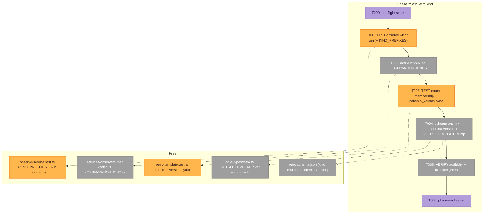
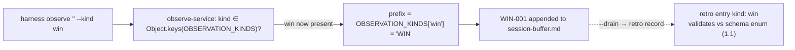
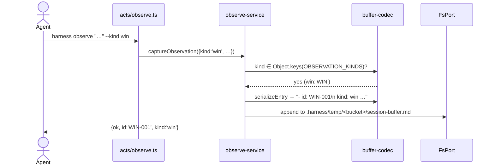

# Phase 2 — `win` retro kind · Tasks & Context Brief

**Plan**: [harness-bypass-change-records-plan.md](../../harness-bypass-change-records-plan.md)
**Spec**: [harness-bypass-change-records-spec.md](../../harness-bypass-change-records-spec.md)
**Phase**: Phase 2 of 5 · **Primary domain**: `services/observe` + retro schema
**Generated**: 2026-06-16 · **Status**: Ready for GO (no code written yet)

---

## Executive Briefing

**Purpose**: Make `win` ("this worked well / the harness was effective") a first-class observation/retro kind — the **positive** counterpart to `difficulty`. It must round-trip through `harness observe --kind win`, validate against `retro.schema.json`, and be tagged with a bumped `schema_version` (1.0 → **1.1**, a backward-compatible minor). This is what lets the measures doc (Phase 5) answer "is the harness creating value?" with **positive** signals, not just friction.

**What We're Building**:
- `win: 'WIN'` added to `OBSERVATION_KINDS` (the observe buffer codec) — an 8th kind with a unique `WIN` ID prefix.
- `"win"` added to the retro schema's entry `kind` enum.
- A bumped `schema_version` (1.0 → 1.1) carried in lockstep by **both** the schema (a new self-version anchor) and the `RETRO_TEMPLATE` constant — coordinated, sync-tested.
- Tests: an `observe --kind win` round-trip, an enum-membership assertion, and a `schema_version`-sync red-line. All additive; existing 1.0 retros keep validating.

**Goals**:
- ✅ `harness observe "<x>" --kind win` succeeds and writes a `WIN-001` entry (AC-7).
- ✅ `win` is in the schema `kind` enum; `schema_version` bumped (minor); existing retros (no `win`) still validate (AC-7).
- ✅ The template ↔ schema version stays in sync (a red-line test prevents skew — KF-06/R6).
- ✅ Fully additive: no existing observe/record test regresses except the **one** exact-match assertion this phase deliberately updates (`OBSERVATION_KINDS` `toEqual`).

**Non-Goals** (❌ this phase):
- ❌ Any change to `harness-bypass.ts` / `harness-change.ts` — their `schema_version: "1.0"` is their **own** independent contract (no schema file, not the retro schema). **Leave them at 1.0.**
- ❌ The retro SKILL.md `win` "what worked well?" capture beat + the `--drain` bypass backstop — that prose is **Phase 4** (in-repo capture seams).
- ❌ The forward version-coverage *documentation* (scanner reports % readable) — **Phase 5** (measures doc) + Phase 4 (retro skill). This phase only proves the additivity holds; it doesn't write the doc.
- ❌ Any ajv/JSON-Schema runtime validator (none in repo — enum-membership is the deterministic proof, KF-05).
- ❌ Provenance mechanics (Phase 1, done), `history.md` removal (Phase 3), the cross-repo scanner/DORA (OOS).

---

## Prior Phase Context

### Phase 1 — CLI core: record types + provenance stamping ✅ COMPLETE (633 tests green)

**A. Deliverables**
- `GitPort.remoteUrl(): string | null` (port + `ExecGit` + `FakeGit`) — `origin`-only, null-degrading.
- `harness/cli/src/services/record/provenance.ts` — pure `spliceProvenance(template, fields)`.
- `core-types/harness-bypass.ts` + `core-types/harness-change.ts`; `coreRecordTypes = [retro, harness-bypass, harness-change]` at `registry.ts:40`.
- `RecordDeps` + `RecordActDeps` gained `git: GitPort`, `env: EnvPort`, `version: string`; every record write carries the 8-key provenance header.

**B. Dependencies Exported (available to later phases)**
- The 8-key Frozen Frontmatter Contract is **test-pinned** (`record-service.test.ts`): `schema_version` (template-owned) + 7 spliced.
- `spliceProvenance` strips any existing top-level decl of the 7 keys then prepends — idempotent, P2-pure, zero I/O.

**C. Gotchas & Debt (carry into Phase 2)**
- ⭐ **The load-bearing handoff**: `record-service.test.ts` was deliberately written (Phase-1 T003b) to read `schema_version` **dynamically from `RETRO_TEMPLATE`** (`RETRO_TEMPLATE.match(/^schema_version:.*$/m)`) and assert *presence, never the literal value* — **precisely so this phase's 1.0 → 1.1 bump can't break it.** Phase 2 leans on this: bumping `RETRO_TEMPLATE` is safe for the provenance tests. Verify it holds (T005).
- `RETRO_TEMPLATE` already declares `agent`/`plan_id` (handled by strip-then-prepend) — not relevant to Phase 2's edits, but don't reintroduce duplicate keys when editing the template.
- The synthetic local `TEMPLATE = '---\nschema_version: "1.0"\n…'` in `record-service.test.ts:332` is a **fixture for the pure-splice test**, NOT `RETRO_TEMPLATE` — bumping the real template does not touch it.

**D. Incomplete Items**: none. `win` was **intentionally deferred** to this phase (Phase 1 was forbidden from hardcoding `schema_version`'s value, and didn't).

**E. Patterns to Follow**
- Full TDD: RED→GREEN pairs; **fakes over mocks** (never `vi.mock` internals).
- Additive changes only (mirror the `remoteUrl` additive-port pattern).
- **Path-scoped commits** to `harness/cli/` + the plan dir — the working tree has **pre-existing staged presentation deletions** (`docs/harness-presentations/…`); leave them untouched (never `git commit` the whole index).
- Assertion-only where no production code changes (KF-07).

---

## Pre-Implementation Check

*(All source line anchors below were re-verified against the working tree this turn.)*

| File | Exists? | Domain Check | Notes |
|------|---------|-------------|-------|
| `harness/cli/src/services/observe/buffer-codec.ts` | ✅ modify | services/observe ✓ | `OBSERVATION_KINDS` at `:12` (7 kinds). Add `win: 'WIN'` → 8th. `ObservationKind` type + `ID_PATTERN`/parse auto-cover it |
| `harness/cli/test/services/observe/observe-service.test.ts` | ✅ modify | test ✓ | **⚠️ BREAKER**: `:344` `expect(OBSERVATION_KINDS).toEqual(KIND_PREFIXES)` is **exact** — adding `win` to the codec flips it RED until `KIND_PREFIXES` (`:37`) gains `win: 'WIN'`. Titles "7 schema kinds" (`:82`, `:343`) → "8". The `:82` happy-path loop iterates `KIND_PREFIXES`, so adding `win` there **is** the `--kind win` round-trip |
| `skills/eng-harness-loop/eng-harness-4-retro/references/retro.schema.json` | ✅ modify | retro schema (contract) ✓ | `kind` property at `$defs.Entry.properties.kind` (`:64`); the **7 enum values at `:66–74`** (`:75` is the property `description`). Add `"win"` to the enum + a top-level `x-schema-version`. **No self-version literal exists** (see decision below) |
| `harness/cli/src/services/record/core-types/retro.ts` | ✅ modify | services/record ✓ | `RETRO_TEMPLATE` `schema_version: "1.0"` at `:20` → `"1.1"`; kind-enumeration comment at `:31` → add `win`. **The only `RETRO_TEMPLATE` edit in the whole plan** (AC-5 scope) |
| `harness/cli/test/services/record/retro-template.test.ts` | ✅ modify | test ✓ | Today has **zero enum assertions** (only required-superset + `system` object). Add: (b) enum-membership ∋ `win`; (c) `schema_version` sync red-line |
| `harness/cli/src/acts/observe.ts` | ✅ read-only | services/observe ✓ | `:48` builds the kinds list from `Object.keys(OBSERVATION_KINDS)` → **auto-includes `win`**, no edit |
| `harness/cli/src/services/observe/observe-service.ts` | ✅ read-only | services/observe ✓ | `:111` validates against `Object.keys(OBSERVATION_KINDS)`; `:157` looks up the prefix → **both auto-cover `win`**, no edit |
| `harness/cli/src/services/instructions/core-instructions.ts` | ✅ modify | services/instructions ✓ | **⚠️ stale prose mirror**: `:59–60` hand-lists `Kinds: difficulty \| … \| confusion` (the agent-facing runtime instructions). Add `win` here in Phase 2 so the CLI doesn't tell agents the wrong kind set. Isolated — its test (`instructions-service.test.ts`) is self-referential `toBe(CORE_INSTRUCTIONS)` + substring `toContain`s (no kind count), so no test breaks; **not** generated (safe to edit by hand) |
| `docs/how/{record-and-record-types,dogfood-harness-flow}.md` → `docs-content.ts` | ⏭️ **defer to Phase 5** | docs/how ✓ | The published kind list also lives in these two markdown sources (regenerated into `docs-content.ts` by `gen:docs`). Adding `win` there is Phase 5's docs-sync job — **flag**: `record-and-record-types.md` is in Phase 5 task 5.2, but `dogfood-harness-flow.md` is **not** in the plan's Phase 5 scope → surface to Phase 5 so `check:docs` doesn't ship a stale kind list |
| `harness/cli/test/services/record/record-service.test.ts` | ✅ read-only (verify) | test ✓ | Reads `schema_version` **dynamically** (`:290–296`) → the 1.0→1.1 bump is **safe**; the `:332` synthetic `TEMPLATE` is not `RETRO_TEMPLATE`. Confirm green in T005 |
| `harness/cli/src/services/record/core-types/{harness-bypass,harness-change}.ts` | ✅ **DO NOT TOUCH** | services/record ✓ | Each declares its own `schema_version: "1.0"` — **independent** of the retro schema. Leave at 1.0 (Non-Goal) |

**Harness availability**: Router **installed** (`~/.agents/skills/eng-harness-flow` present) → the implement verb fires the pre-implement seam (T000) before any code and the phase-end seam (T006) at the end; verdicts narrated verbatim from the envelope.

**Duplication scan**: `win` is absent from `OBSERVATION_KINDS`, the schema `kind` enum, and `KIND_PREFIXES` — confirmed genuinely new. The `WIN` prefix does not collide (existing: DL, MW, GFT, INS, COORD, SUGG, CONF). **Prose mirrors of the 7-kind list** also exist and omit `win` — `core-instructions.ts:59–60` (updated this phase, above) and the two `docs/how/*.md` sources (deferred to Phase 5, above). None is pinned by a test, so none is a build breaker; both are surfaced so the kind set doesn't silently go stale.

### Decision (DECIDED — committed) — give the schema a self-version anchor

The plan (KF-06 / task 2.1c) calls for a **`schema_version`-sync** test: *"template `RETRO_TEMPLATE` `schema_version` == schema `schema_version` (both 1.1)."* But `retro.schema.json` **carries no version value** — `schema_version` appears only as a `required` field name and a property *definition* (it describes the field that retro *documents* declare; the schema never declares its own current version). So "template == schema" has nothing on the schema side to compare against today — the plan's 2.1c is literally unsatisfiable as written.

**DECISION (committed in this dossier — not deferred to GO):** add a top-level annotation **`"x-schema-version": "1.1"`** to `retro.schema.json`. JSON Schema 2020-12 **ignores unknown keywords**, so it's safe; the `x-` prefix marks it as an annotation (no confusion with `properties.schema_version`). The sync test asserts `RETRO_TEMPLATE.schema_version === schema['x-schema-version'] === '1.1'` — a real cross-checked invariant, not a hardcoded literal.

> **Why committed, not deferred** (validate-v2 Forward-Compat D1): the marker key **name** `x-schema-version` is an *outgoing contract* — Phase 5's measures doc cites "the `x-schema-version` anchor" and a future scanner may key off it. Leaving the choice open-to-GO risks a Phase 2→Phase 5 shape mismatch (under a fallback the key wouldn't exist). Freezing it now removes that seam risk. T003/T004 are single-valued for this path.

- **Alt A** *(rejected)* — encode the version in `$id`. Breaks the test's `SCHEMA_PATH` URL resolution; uglier.
- **Alt B** *(documented fallback only, if `x-schema-version` proves problematic at implement)* — drop the schema-side compare; assert only that the template literal is `"1.1"` **and** the enum contains `win`. Weaker (the red-line sync degrades to a hardcoded literal), so it is the fallback, not the plan.

---

## Architecture Map



**Two independent red→green pairs** — the observe codec (T001→T002) and the retro schema/template (T003→T004) are decoupled; either may land first. T005 verifies the whole is additive.



---

## Tasks

| Status | ID | Task | Domain | Path(s) | Done When | Notes |
|--------|-----|------|--------|---------|-----------|-------|
| [x] | T000 | **Harness pre-flight** — `/eng-harness-flow --event pre-implement --phase "Phase 2: win retro kind" --plan-dir docs/plans/020-harness-bypass-change-records` | — | — | ✅ Router `route`→boot; verdict **healthy** (633 green baseline) | _Harness seam_; advisory, never gates |
| [x] | T001 | **TEST** the observe codec for `win` (RED): in `observe-service.test.ts` — (a) add `win: 'WIN'` to the local `KIND_PREFIXES` map (`:37`), which makes the existing exact-match `expect(OBSERVATION_KINDS).toEqual(KIND_PREFIXES)` (`:344`) the RED driver, and retitle "7 schema kinds" → "8 schema kinds (incl. win)" at `:82`, `:343`, **and the validation title at `:130`** ("…the 7 allowed values named"); (b) the `:82` happy-path loop iterating `KIND_PREFIXES` covers the `observe --kind win` → `WIN-001` round-trip — add an explicit assertion that a `win` capture returns `id: 'WIN-001'`, `kind: 'win'`; (c) **positive additivity proof** — add a `parseBuffer` assertion that a hand-written `- id: WIN-001 / kind: win / description: …` legacy block parses with `malformed: 0` (mirror the `:258` "continues over legacy entries" pattern). This is the *positive* backward-compat regression the verify step (T005) leans on, not mere "existing cases stay green" | services/observe | `harness/cli/test/services/observe/observe-service.test.ts` | RED: `toEqual` fails (`win` not in `OBSERVATION_KINDS`); the `win` capture + the `win` legacy block are both rejected as an unknown kind (malformed) | TDD; AC-7. **The breaker is intentional** — this drives T002 |
| [x] | T002 | Add `win: 'WIN'` to `OBSERVATION_KINDS` (`buffer-codec.ts:12–20`) as the 8th kind; **also** add `win` to the hand-maintained `Kinds:` list in `core-instructions.ts:59–60` (runtime agent instructions — keep the kind set honest) | services/observe | `harness/cli/src/services/observe/buffer-codec.ts`, `harness/cli/src/services/instructions/core-instructions.ts` | GREEN: T001 passes; `acts/observe.ts:48` + `observe-service.ts:111/157` pick up `win` with **no edit**; the unknown-kind/severity rejection tests still pass; instructions test still green (substring assertions, no kind count) | Additive; `WIN` prefix unique; published `docs/how/*` kind list deferred to Phase 5 |
| [x] | T003 | **TEST** the schema/template version contract (RED): in `retro-template.test.ts` (which has **no** enum assertions today), add (b) **enum-membership** — parse the schema JSON, read `$defs.Entry.properties.kind.enum`, assert it contains `"win"`; (c) **`schema_version` sync red-line** — extract `RETRO_TEMPLATE`'s `schema_version` value from the frontmatter (reuse the `frontmatter()` helper + the `/^schema_version:.*$/m` idiom) and assert `RETRO_TEMPLATE.schema_version === schema['x-schema-version'] === '1.1'` (the committed-decision path). Reuse the existing `JSON.parse(readFileSync(SCHEMA_PATH))` already in this file | services/observe + schema | `harness/cli/test/services/record/retro-template.test.ts` | RED: `win` not in the enum yet; `x-schema-version` absent + template still `"1.0"` | KF-05, KF-06; single-valued per the committed decision (Alt B is the documented fallback only) |
| [x] | T004 | Bump the schema + template in lockstep: (1) add `"win"` to `retro.schema.json` `$defs.Entry.properties.kind.enum`; (2) add top-level `"x-schema-version": "1.1"` to `retro.schema.json`; (3) bump `RETRO_TEMPLATE` `schema_version` `"1.0"` → `"1.1"` (`retro.ts:20`) and add `win` to the kind-enumeration comment (`retro.ts:31`); (4) *(optional, cheap)* add `WIN (win)` to the schema's recommended-prefix doc string (`retro.schema.json:62`) so the schema prose isn't a 7-prefix list against an 8-value enum. **Do NOT touch** `harness-bypass.ts`/`harness-change.ts` (stay 1.0) | services/observe + schema | `retro.schema.json`, `harness/cli/src/services/record/core-types/retro.ts` | GREEN: T003 passes; this is the sole `RETRO_TEMPLATE` byte change in the plan (AC-5 scope) | KF-06; R6 |
| [x] | T005 | **VERIFY** additivity + no regression: (a) backward-compat is proven **positively** by the T001(c) `win`-legacy-parse round-trip going GREEN — and note explicitly that, since **there is no runtime validator** (KF-05), "existing 1.0 retros still validate" *reduces to* "the 7 original kinds remain in the 1.1 enum (a superset)" + the existing legacy-parse cases staying green; (b) `record-service.test.ts` provenance tests stay green (they read `schema_version` dynamically — Phase-1 design, verified); (c) full suite green; (d) typecheck + biome clean. Note: forward version-coverage **prose** is Phase 5 (measures doc) / Phase 4 (retro skill), not here | services/observe + schema | `cd harness/cli && npx vitest run`; `npx tsc -p harness/cli/tsconfig.json --noEmit`; `npx biome check harness/cli` | All green; existing retros unaffected; the `win` legacy block now parses (`malformed: 0`) | AC-7 additivity; R2 forward-compat. **No `arch-check`/`skills-check` script exists at repo root** — N/A this phase (no service-graph change anyway); the three commands above are the real, runnable gates |
| [x] | T006 | **Harness phase-end** — `/eng-harness-flow --event phase-end --plan-dir docs/plans/020-harness-bypass-change-records` | — | — | ✅ Router `route`→`--drain` (buffer non-empty: 1 stale entry). Surfaced, not auto-actioned (user's `[e]/[d]` call); phase not blocked | _Harness seam_ |

**Status legend**: `[ ]` pending · `[~]` in progress · `[x]` complete · `[!]` blocked
**TDD cadence**: T001→T002 (observe codec) and T003→T004 (schema/template) are independent red→green pairs; T005 verifies additivity across both. Commit path-scoped.

---

## Context Brief

### Key findings from plan (Phase-2 relevant)
- **KF-05 (High)** — **no ajv/JSON-Schema validator anywhere** in the CLI. "`win` is in the enum / old records still validate" therefore has no runtime sensor. **Cheapest deterministic proof (no new dep)**: read `…kind.enum` from the schema and assert `∋ win` (T003b); a `schema_version`-sync assertion (T003c). Full ajv validation is OOS.
- **KF-06 (High)** — **byte-identical vs the bump.** AC-5's "template constants are byte-identical" is scoped to the **Phase-1 provenance mechanism**. The **sole** `RETRO_TEMPLATE` edit in the whole plan is this phase's `schema_version` 1.0→1.1 bump — a *coordinated* schema change, sync-tested in T003c. Not a contradiction; surfaced to validate-v2 + user-confirm.
- **Phase-1 handoff (gotcha C)** — `record-service.test.ts` reads `schema_version` dynamically by design so this bump is safe there. Verify (T005b).

### Frozen contract touchpoints (this phase is additive — nothing frozen is broken)
- The retro schema `kind` enum grows from 7 → 8 values (additive; `additionalProperties:false` is unaffected — `kind` was already constrained, we widen the allowed set).
- `OBSERVATION_KINDS` grows 7 → 8; `ObservationKind` (keyof) widens automatically.
- `schema_version` minor bump 1.0 → 1.1: a 1.0 document (no `win`) is still valid under 1.1 (the enum is a superset; readers reject only unknown **major** versions — schema property doc, `:13`).

### Domain dependencies (concepts/contracts this phase consumes)
- `services/observe/buffer-codec.ts` (`OBSERVATION_KINDS`): the single source of truth for valid kinds + ID prefixes; `observe-service` + `acts/observe` both derive from it.
- `retro.schema.json` `$defs.Entry.properties.kind.enum`: the canonical retro-entry kind contract; `RETRO_TEMPLATE` is its deployment echo (the `retro-template.test.ts` superset test keeps them honest).
- `core-types/retro.ts` (`RETRO_TEMPLATE`): the template agents fill; carries the document's `schema_version`.

### Domain constraints (Constitution — `arch-check` enforces)
- This phase touches **no service I/O surface** — `buffer-codec.ts` is a pure grammar module; `arch-check` is unaffected (no new `node:*` imports).
- **No `yaml` runtime dep** — the codec stays a hand-rolled serializer/parser (P10). Don't introduce a YAML lib to read the schema in the test; `JSON.parse(readFileSync(...))` (the existing `retro-template.test.ts` pattern) is the idiom.
- **No new verb** — `harness observe` is unchanged; `win` plugs into the existing kind set.

### Harness context (router installed)
- **Entry point**: `/eng-harness-flow --event <seam> --phase "Phase 2: win retro kind" --plan-dir docs/plans/020-harness-bypass-change-records --json` — the single door; child skills never named.
- **Pre-implement seam** (T000) + **phase-end seam** (T006): fired by the implement verb; envelope decides what happens; verdict narrated verbatim (`healthy / SLOW / UNHEALTHY / UNAVAILABLE`).
- **Backpressure**: `backpressure-coverage.md` (Certainty **Partial**) — Phase 2's provable criterion (AC-7) rides as the test-first tasks T001/T003 (the folded "Phase 0": `observe --kind win` round-trip + `win`-enum + version-sync).
- **Dogfood note**: `win` is the kind this very plan would use to record "the harness/companion worked well" once Phase 4's capture beat ships.

### Reusable from Phase 1
- The **path-scoped commit discipline** (avoid the staged presentation deletions) and the **full-TDD + fakes** cadence.
- `retro-template.test.ts`'s existing `JSON.parse(readFileSync(SCHEMA_PATH))` + `frontmatter()`/`topLevelKeys()` helpers — reuse them for the enum + version-sync assertions (extract the frontmatter `schema_version` value with the same regex idiom).

### Mermaid sequence — `harness observe "…" --kind win` at runtime


---

## Discoveries & Learnings

_Populated during implementation by the implement verb._

| Date | Task | Type | Discovery | Resolution | References |
|------|------|------|-----------|------------|------------|
| 2026-06-16 | T002 | insight | `:130` "unknown kind" error message is built from `kinds.join(', ')`, so adding `win` to the codec auto-listed it | Strengthened that test with `toContain('win')` — the "8 kinds" rename is now a real assertion, not just a title | `observe-service.ts:117` |
| 2026-06-16 | T002 | gotcha | Pathspec-less `git commit` swept the 93 pre-staged presentation deletions into commit A (they were already staged in the index) | `git reset --soft HEAD~1` → re-commit with `-F msg -- <explicit paths>`; local-only, never pushed. Always commit with explicit pathspec when unrelated WIP is pre-staged | `271c731` |

**Types**: `gotcha` | `research-needed` | `unexpected-behavior` | `workaround` | `decision` | `debt` | `insight`

**Seed (carry into T001/T004)**:
1. The existing `expect(OBSERVATION_KINDS).toEqual(KIND_PREFIXES)` (`observe-service.test.ts:344`) is an **exact** match — adding `win` to the codec without adding it to `KIND_PREFIXES` fails it. This is the intended RED; update the test's expected map + the three "7 kinds"/"7 allowed values" titles (`:82`, `:343`, `:130`) in T001.
2. `retro.schema.json` has **no self-version literal** — the `schema_version`-sync test is satisfied by adding a top-level `x-schema-version: "1.1"` annotation. **This is committed (not a GO-time choice)** so the key name is a stable contract Phase 5 can cite; Alt B (template literal only) is the documented fallback if the annotation proves problematic at implement.
3. Prove additivity **positively**: T001(c) adds a `win` legacy-block `parseBuffer` round-trip (RED now → GREEN after T002). "Existing retros still validate" = "the 7 kinds stay in the 1.1 enum superset" since there is no ajv (KF-05).
4. Bumping `RETRO_TEMPLATE` is **safe for `record-service.test.ts`** (Phase-1 made it read the value dynamically) — but `record-service.test.ts:332`'s synthetic `TEMPLATE` literal `"1.0"` is a separate fixture, untouched.
5. **Do not** bump `harness-bypass.ts`/`harness-change.ts` `schema_version` — they are independent of the retro schema (Non-Goal).
6. The 7-kind list also appears as prose in `core-instructions.ts:59–60` (update in T002) and `docs/how/{record-and-record-types,dogfood-harness-flow}.md` (defer to Phase 5; `dogfood-harness-flow.md` is not yet in the plan's Phase 5 scope — flag it).

---

## Directory layout

```
docs/plans/020-harness-bypass-change-records/
  ├── harness-bypass-change-records-plan.md
  ├── harness-bypass-change-records-spec.md
  ├── backpressure-coverage.md
  └── tasks/
      ├── phase-1-cli-core-record-types-provenance-stamping/   # ✅ complete
      └── phase-2-win-retro-kind/
          ├── tasks.md            # this file
          └── execution.log.md    # created by the implement verb
```

**STOP** — no code changes yet. Dossier ready; awaiting human GO to implement Phase 2.

---

## Validation Record (2026-06-16 · validate-v2, 4 agents)

**Validation thesis**: the dossier must give the implement verb an unambiguous, source-grounded, test-first build sequence for the `win` retro kind so coding needs no re-derivation, and the additive/backward-compatible nature is provable **without** an ajv validator. Proof target = **Implementation**. Failure consequences: wrong file:line anchors (edit the wrong lines), a missed `toEqual` breaker (surprise RED), or an unwritable version-sync test (no schema-side anchor).

| Agent (lens) | Verdict | Issues |
|---|---|---|
| Source-Truth | **SOURCE-ACCURATE** | 0 CRIT/HIGH/MED — every anchor verified against the working tree (`OBSERVATION_KINDS:12`, breaker `toEqual:344`, titles `:82/:343/:130`, schema enum `:66–74`, no self-version literal, `RETRO_TEMPLATE:20/:31`, the dynamic-read at `record-service.test.ts:293`, synthetic fixture `:332` separate, auto-propagation at `acts/observe.ts:48`+`observe-service.ts:111/157`, both new types' independent `1.0`). 2 cosmetic LOW (enum-range end `:74`; stale `:130` title) |
| Cross-Reference | **FAITHFUL** | 0 CRIT/HIGH/MED — every plan task 2.0–2.z maps to T000–T006; the 2.1→T001/T003 + 2.2→T002/T004 RED/GREEN split is plan-endorsed; AC-5 scope + the `harness-bypass/change` stay-at-1.0 Non-Goal reproduced; the `x-schema-version` decision judged a **necessary, faithful** refinement (plan 2.1c is literally unsatisfiable as written). 2 LOW (AC-7 forward-doc correctly deferred; citation drift where the dossier is *more* accurate than the plan) |
| Completeness + Thesis | **COMPLETE** | **1 HIGH** — additivity was proven inferentially ("existing cases stay green") not positively; **1 MED** — two un-surfaced stale 7-kind prose mirrors (`core-instructions.ts`, two `docs/how/*.md`); 2 LOW (`arch-check` referenced but no script; no prefix-uniqueness test). Thesis: **Advanced**, Implementation proof level backed by verified anchors |
| Forward-Compatibility | **MINOR-RISK** | **1 MED (D1)** — the `x-schema-version` key *name* is an outgoing contract Phase 5 cites, left "lock at GO" instead of frozen → Phase 2→5 shape-mismatch risk; 2 LOW (no in-band decision-capture step — dissolves once D1 committed; schema doc-string not refreshed) |

### Fixes applied (this dossier was edited before GO)
1. **HIGH (Completeness)** — added a **positive** backward-compat proof: T001(c) now adds a `win` legacy-block `parseBuffer` round-trip (RED → GREEN after T002), and T005(a) states "validates" = "kinds stay in the 1.1 enum superset" since there's no ajv.
2. **MED (Completeness)** — surfaced the stale 7-kind prose mirrors: `core-instructions.ts:59–60` added to the Pre-Impl table + T002 scope (in-phase, runtime instructions); the two `docs/how/*.md` sources flagged as Phase-5 docs-sync, calling out that `dogfood-harness-flow.md` is **not** in the plan's Phase 5 scope.
3. **MED (Forward-Compat D1)** — promoted `x-schema-version` from "decision to lock at GO" to the **committed default**; Alt B demoted to a documented fallback. Freezes the key name as a stable Phase-5 contract; T003/T004 are now single-valued. (D2 dissolves as a result.)
4. **LOW** — enum-range precision (`:66–74`, not `:64–75`); `:130` title added to the T001 retitle set; `arch-check` footnoted as "no script — N/A this phase" (the three real commands stay); optional `:62` recommended-prefix doc-string refresh added to T004.

### Forward-Compatibility Matrix (post-fix)

| Consumer | Requirement | Verdict | Evidence |
|----------|-------------|---------|----------|
| `/the-flow 6 implement` | file:line + RED→GREEN + locked decision | ✅ | All anchors source-verified; two decoupled RED→GREEN pairs; the version-anchor decision now committed (single-valued T003/T004) |
| `/the-flow 7 review` | deterministic testable Done-When | ✅ | T001/T003 RED conditions concrete; T005 names real commands + the positive `win`-parse gate |
| Phase 4 (capture seams ref `win`) | exact kind name + `WIN` prefix exist | ✅ | `win` (lowercase) + `WIN` exported; collision-checked |
| Phase 5 (measures doc) | stable `1.1` + stable `x-schema-version` name | ✅ (post-fix) | Key name frozen by fix #3; `dogfood-harness-flow.md` gap flagged |
| Future OOS scanner | 1.0 readable under 1.1; no unknown-MAJOR reject | ✅ | Minor bump honors the "reject only unknown MAJOR" rule; enum is a superset |

**Outcome alignment**: the OUTCOME — *"You can't answer 'is the harness creating value?' with positive signals alone… records the signals in-repo"* — is **advanced**: this dossier makes `win`, the positive signal, a buildable first-class kind that round-trips through `harness observe --kind win` and validates against the schema — the exact in-repo substrate the Phase-5 measures doc reads — with the `x-schema-version` anchor now frozen so that downstream citation can't drift.

**Overall: ⚠️ VALIDATED WITH FIXES** — source-accurate and plan-faithful from the start; the one HIGH (inferential additivity proof) and two MED (stale prose mirrors; unfrozen marker-key name) caught and closed in the dossier before implementation.
