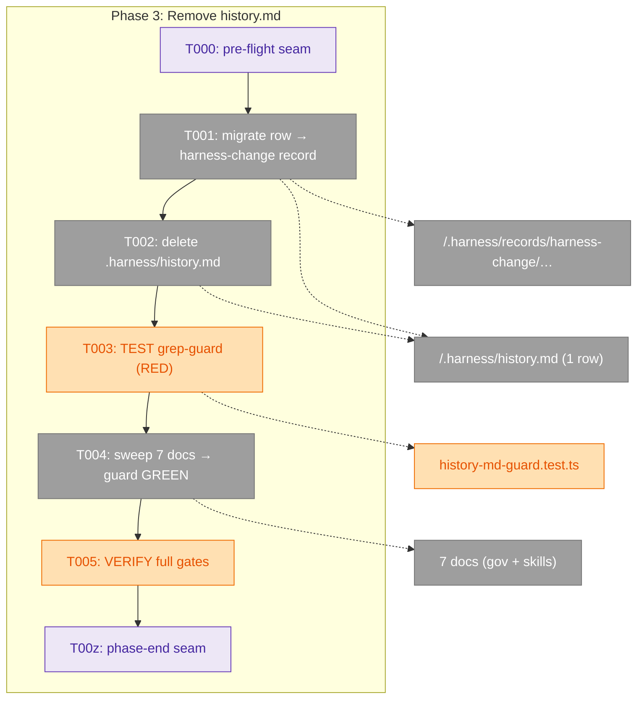
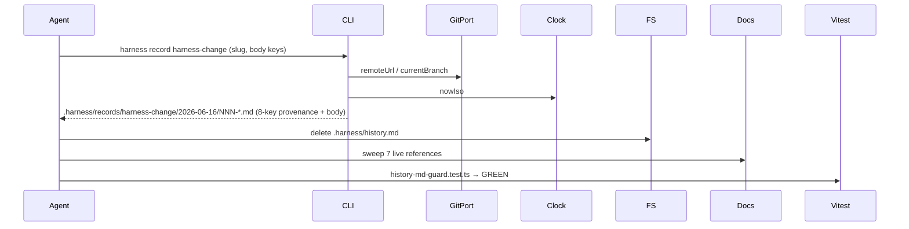

# Phase 3 — Remove `history.md` · Tasks & Context Brief

**Plan**: [harness-bypass-change-records-plan.md](../../harness-bypass-change-records-plan.md) · **Phase 3 of 5** · **Mode**: Full · **CS-2**
**Generated**: 2026-06-16
**Depends on**: Phase 1 (the `harness-change` core type — shipped, registered at `registry.ts:42`)

---

## Executive Briefing

- **Purpose**: Retire the `.harness/history.md` concept entirely. The `harness-change` record ledger (shipped in Phase 1) *is* the harness changelog/trajectory now — so this phase migrates the one existing `history.md` row into a `harness-change` record, deletes the file, re-points every live reader, and adds a **deterministic grep-guard** so the removal can't silently regress.
- **What We're Building**: One migrated `harness-change` record + a deleted file + a prose sweep across **7 docs** + a new `history-md-guard.test.ts`. This is mostly prose surgery; the only executable artifact is the guard test (the folded Phase-0 sensor for AC-8).
- **Goals**:
  - ✅ The 2026-06-10 cwd-independent-test-suite row preserved as a `harness-change` record before the file is deleted (data safety: migrate **then** delete).
  - ✅ `.harness/history.md` deleted; `git status` shows the deletion.
  - ✅ No live doc/skill instructs writing or reading `history.md` as a live ledger; the **L3 maturity rung** reads in `harness-change` terms.
  - ✅ A mandatory grep-guard turns the ~17-op sweep from an eyeball checklist into a regression gate (RED before sweep → GREEN after).
- **Non-Goals**:
  - ❌ **Capture-seam prose** (retro `--drain` backstop, `win` "what worked well?" beat, router `bypass_recommended` envelope, add-extension Step 4) — that's **Phase 4**.
  - ❌ **The `| win` Kinds-list update at `eng-harness-4-retro/SKILL.md:85`** — companion-tracked drift, owned by **Phase 4** (which already edits that SKILL.md for the win beat). Phase 3 touches retro SKILL.md **only** at the `history.md` field-source comment (`:385`). Do **not** fold the `:85` Kinds line in here.
  - ❌ **`docs/how/*` + `AGENTS_README.md` kind-list / measures-doc work** — that's **Phase 5** (gen:docs sources).
  - ❌ Any change to `harness-bypass.ts` / `harness-change.ts` source (Phase 1 owns them; their `replaces history.md` comments are correct and **outside** the guard's grep scope).

---

## Prior Phase Context

### Phase 1 — CLI core: record types + provenance *(the dependency)*

- **A · Deliverables consumed here**: `harness-change` core type at `harness/cli/src/services/record/core-types/harness-change.ts`, registered in `coreRecordTypes` at `registry.ts:42`. Invoked as **`harness record harness-change`** → writes `.harness/records/harness-change/<YYYY-MM-DD>/<NNN>[-slug].md`.
  - **Body keys (agent-filled)**: `change_type` (enum: `new-command|sensor|fixture|template|doc|skill-edit|routing`), `target` (string — what the change touches), `resolves` (string ≤200 chars — flexible ref: record path / `issues/123` / `org/repo#45` / `retro_id:entry_id`).
  - **Frontmatter**: `schema_version` template-owned (stays `"1.0"` — `harness-change` is an independent contract, **not** the retro `1.1` bump).
- **B · Provenance auto-stamped on the migrated record** (no agent action): `harness_version`, `branch`, `repo`, `created_at`, plus `agent`/`plan_id` (`null` if `HARNESS_AGENT`/`HARNESS_PLAN_ID` unset). `spliceProvenance` strips-then-prepends, so all 8 frozen-contract keys land exactly once. **Note**: `created_at` stamps the *migration* moment (2026-06-16), so preserve the **original 2026-06-10** date in the record body for fidelity.
- **C · Gotcha carried forward (CRITICAL)**: the working tree has **93 pre-staged presentation deletions** that must **never** be committed. Phase 1 + Phase 2 both established: with unrelated staged WIP in the index, `git add <files> && git commit` (no pathspec) sweeps them in — **always commit with an explicit pathspec** (`git commit -F <msgfile> -- <paths>`; `-F`/`-m` **before** `--`).
- **E · Patterns to follow**: path-scoped commits; trailer `Co-Authored-By: Claude Opus 4.8 <noreply@anthropic.com>`; vitest + hand-written fakes; architecture guards resolve paths from `import.meta.url` (not `process.cwd()`).

### Phase 2 — `win` retro kind *(orthogonal; one boundary to respect)*

- **Tracked drift owned by later phases — do NOT do here**: `eng-harness-4-retro/SKILL.md:85` (`| win` Kinds list) → **Phase 4**; `AGENTS_README.md:193` + `docs/how/*` kind lists → **Phase 5**. Phase 3's retro SKILL.md edit is scoped to the `history.md` field-source comment at `:385` only.
- **Dogfood note**: prior-session friction landed in execution logs, not the `harness observe` buffer (the integration-dossier gap). Phase 3's own friction should be recorded the same disciplined way.

---

## Pre-Implementation Check

| File | Exists? | Domain | Action | Notes |
|------|---------|--------|--------|-------|
| `.harness/history.md` | ✅ | governance | migrate row → delete | 1 data row (2026-06-10). Migrate **before** delete. |
| `.harness/records/harness-change/2026-06-16/` | ➕ create | services/record | new record | CLI scaffolds via `harness record harness-change`. |
| `.harness/engineering-harness.md` | ✅ | governance | reword `:100` | "see `.harness/history.md` row 1" → point at the migrated `harness-change` record. |
| `skills/…/eng-harness-flow/references/governance-doc.md` | ✅ | governance | reword + **delete G3 §** | live refs at `:3, :7, :35, :41–49 (G3 section), :64 (G5 row)`. |
| `skills/…/eng-harness-flow/references/maturity-assessment.md` | ✅ | governance | reword **L3 + L4** | `:5` trajectory, `:30` L3 rung + evidence col, `:31` L4 cadence. |
| `skills/…/eng-harness-flow/references/getting-started.md` | ✅ | governance | reword | `:91, :186` loop-beats; `:220` **remove** file-tree line; `:261` ladder prose. |
| `skills/…/eng-harness-1-boot/SKILL.md` | ✅ | harness-loop skills | reword | `:148` status prose; `:154` compounding-value paragraph. |
| `skills/…/eng-harness-4-retro/SKILL.md` | ✅ | harness-loop skills | reword `:385` **only** | field-source comment. **Leave `:85` Kinds list for Phase 4.** |
| `skills/…/eng-harness-flow/SKILL.md` | ✅ | harness-loop skills | reword `:342` | **⚠ 7th file — under-listed in plan task 3.3.** References-table line names "the `.harness/history.md` changelog semantics". Confirmed live by repo grep + `research-dossier.md` § history.md removal (HIST line 244). Must sweep or guard goes RED. **Phase-3 scope = the `:342` history ref only**; the `bypass_recommended` envelope doc at this file is Phase 4. |
| `harness/cli/test/architecture/history-md-guard.test.ts` | ➕ create | services/record (test) | new guard | Mirror `no-direct-node-io.test.ts` (`import.meta.url` root, recursive walk, regex, `expect(offenders).toEqual([])`). |

**Out-of-scope matches (do not touch / not in guard scope)**: `harness/cli/src/services/record/core-types/harness-change.ts:5,23,32` (the new type's own "replaces history.md" comments — under `harness/cli/src/`, **outside** the guard's `skills/`+`docs/how/`+`.harness/` scope); all `docs/plans/0NN-*` docs (historical discussion of the removal — not grepped).

**gen:docs safety (verified during validate-v2)**: none of the 7 swept files appear in `harness/cli/src/services/docs/docs-manifest.json` (the gen:docs sources) — so the sweep **cannot** dirty generated `docs-content.ts`. T005's `check:docs` is the safety belt, not the gate; if a diff ever appears, a swept file was misclassified → stop and move it to Phase 5.

---

## Architecture Map



---

## Tasks

| Status | ID | Task | Domain | Path(s) | Done When | Notes |
|--------|-----|------|--------|---------|-----------|-------|
| [x] | T000 | **Harness pre-flight** — `/eng-harness-flow --event pre-implement --phase "Phase 3: Remove history.md" --plan-dir docs/plans/020-harness-bypass-change-records` | — | — | Router envelope handled; boot verdict narrated verbatim before any change | _Harness seam_ |
| [x] | T001 | **Migrate the one row** → `harness record harness-change` (suggest slug `migrate-cwd-independent-test-suite`). Fill `change_type: fixture`, `target` (the cli test suite — cwd-independent path resolution via `import.meta.url`), `resolves` (ref the plan-014 orchestrator retro OH-001/OH-003). Body: carry the row's Improvement + Trigger + Evidence text **and the original 2026-06-10 date** | services/record | `.harness/records/harness-change/2026-06-16/<NNN>-migrate-cwd-independent-test-suite.md` | Record exists with migrated content + auto-stamped 8-key provenance header; body preserves the 2026-06-10 date | The one data row (KF-04). Migrate **before** delete |
| [x] | T002 | **Delete** `.harness/history.md` | governance docs | `.harness/history.md` | File gone; `git status` shows deletion | After T001 only |
| [x] | T003 | **TEST (RED — mandatory guard, AC-8 sensor)** — add `history-md-guard.test.ts`: recursive-walk `.md` under `skills/` + `docs/how/` + `.harness/` (**exclude** `.harness/records/` + `.harness/temp/`), assert **no** file contains `/\.harness\/history\.md/`. Resolve repo root from `import.meta.url` (`join(CLI_ROOT,'..','..')`), mirroring `no-direct-node-io.test.ts`. Run it → **RED** (the 7 live doc refs still present) | services/record (test) | `harness/cli/test/architecture/history-md-guard.test.ts` | Test compiles and **fails**, listing the live offenders | TDD RED. Precedent: CI `rename-guard` + the two existing arch guards |
| [x] | T004 | **Sweep the 7 docs → GREEN.** Reword/delete every live `history.md` reference so the harness-change ledger replaces it (full surface in the Sweep Map below). Includes **deleting the G3 section** in `governance-doc.md` and **rewording the L3 rung + L4 cadence** in `maturity-assessment.md`. Re-run T003 → **GREEN** | governance docs / skills | the 7 files in the Pre-Implementation Check | `history-md-guard.test.ts` passes (zero live refs); L3 rung reads in `harness-change` terms | TDD GREEN. **Do not** touch retro SKILL.md:85 (Phase 4) |
| [x] | T005 | **VERIFY (no-regression gate)** — `cd harness/cli && npx vitest run` (baseline 637 + the new guard test, all green); `tsc -p harness/cli/tsconfig.json --noEmit` clean; `npx biome check harness/cli` clean; `npm run check:docs` exit 0 (the swept skill/gov docs are **not** gen:docs sources → no `docs-content.ts` diff expected; if a diff appears, a swept file was a gen source — stop and reclassify to Phase 5) | services/record | — | All gates green; guard catches a deliberate re-introduced ref when spot-checked; **and** `ls .harness/records/harness-change/2026-06-16/` shows the migration record (proves the "row migrated" leg of AC-8 — the guard alone only proves "no live refs") | Confirms the sweep is complete, nothing leaked into generated docs, and the data was actually migrated |
| [ ] | T00z | **Harness phase-end** — `/eng-harness-flow --event phase-end --plan-dir docs/plans/020-harness-bypass-change-records` | — | — | Router envelope handled at phase end (drain-vs-harvest is the router's call) | _Harness seam_ |

### T001 — migration record shape (explicit, so nothing is guessed at implement time)

`harness record harness-change` scaffolds the template; fill the frozen body keys + a markdown body that maps the `history.md` row 1:1.

- **Frontmatter** (provenance auto-stamped; you fill the 3 body keys):
  - `change_type: fixture`
  - `target: "harness/cli test suite — cwd-independent path resolution (import.meta.url) in arch guards + NodeFs real-tree probes"`
  - `resolves: "plan-014 orchestrator retro OH-001/OH-003"` *(≤200 chars)*
- **Markdown body** (first line carries the original date — `created_at` will stamp the migration moment 2026-06-16, so this preserves fidelity):
  ```markdown
  **Original date:** 2026-06-10

  **Improvement:** Test suite made cwd-independent — architecture guards + NodeFs
  real-tree probes resolve from their own file location (`import.meta.url`), not
  `process.cwd()`; the docs byte-compare failure now names its fix ("stale dist —
  run `npm run build`").

  **Trigger:** Plan 014 orchestrator magic wand (retro OH-001/OH-003: 4 false-alarm
  failures + one undiagnosable stale-dist red across the build session).

  **Evidence:** suite 317/317 green from BOTH `harness/cli` and the repo root.
  ```
- Do **not** invent a 5th frontmatter key for the date — it lives in the body (the frozen contract is exactly `change_type`/`target`/`resolves` + provenance).

### T003 — guard skeleton (exclusion predicate spelled out)

Mirror `no-direct-node-io.test.ts`. The only new logic is `.md`-filtering + the two excludes + the regex:

```ts
// REPO_ROOT = two levels above CLI_ROOT (test lives at harness/cli/test/architecture/)
const REPO_ROOT = join(dirname(fileURLToPath(import.meta.url)), '..', '..', '..', '..');
const SCAN_DIRS = ['skills', 'docs/how', '.harness'].map((d) => join(REPO_ROOT, d));
const HISTORY_REF = /\.harness\/history\.md/;
function mdFiles(dir: string): string[] { /* recursive readdirSync, withFileTypes, *.md only;
  SKIP any path containing `.harness/records` or `.harness/temp` */ }
const offenders = SCAN_DIRS.flatMap(mdFiles)
  .filter((f) => HISTORY_REF.test(readFileSync(f, 'utf8')))
  .map((f) => relative(REPO_ROOT, f));
expect(offenders).toEqual([]);
```

Exclude predicate (apply inside `mdFiles` or as a post-filter): `!p.includes(`${sep}records${sep}`) && !p.includes(`${sep}temp${sep}`)` scoped under `.harness/`. Guard a missing `docs/how` dir gracefully (it exists, but `existsSync` keeps the test portable).

### Sweep Map (T004 — every live reference, grounded in repo grep)

| File:line | Current | Reword to |
|-----------|---------|-----------|
| `.harness/engineering-harness.md:100` | "see `.harness/history.md` row 1" | point at the migrated `harness-change` record (e.g. "see the `harness-change` record under `.harness/records/harness-change/`") |
| `governance-doc.md:3` | intro names "the companion `history.md` changelog" | "the `harness-change` record ledger" |
| `governance-doc.md:7` | "**`history.md` = changelog**" separation-of-concerns bullet | "**`harness-change` records = changelog**" |
| `governance-doc.md:35` | "the trajectory lives in `history.md`" | "the trajectory lives in the `harness-change` record ledger" |
| `governance-doc.md:41–49` | **G3 section** "`.harness/history.md` is a changelog, not a log" | **Delete the section.** Recommended: replace its body with a one-line pointer ("G3 · The change ledger = `harness-change` records") to keep G4/G5 numbering stable (other docs cite G-numbers); do **not** renumber |
| `governance-doc.md:64` | G5 Improve-beat row "a row is appended to `.harness/history.md`" | "a `harness-change` record is written (`harness record harness-change`)" |
| `maturity-assessment.md:5` | "the *trajectory* … lives in `.harness/history.md`" | "… lives in the `harness-change` record ledger" |
| `maturity-assessment.md:30` | **L3 rung** "(a `history.md` row exists)" + evidence "`history.md` non-empty" | "(a `harness-change` record exists)" + evidence "≥1 `harness-change` record" |
| `maturity-assessment.md:31` | **L4** "sustained `history.md` cadence" | "sustained `harness-change` record cadence" |
| `getting-started.md:91` | "then `.harness/history.md` gains a row" | "then a `harness-change` record is written" |
| `getting-started.md:186` | "the Improve beat ships a fix; .harness/history.md gains a row. ↺" | "…; a `harness-change` record is written. ↺" |
| `getting-started.md:220` | file-tree line "├── history.md ← sparse changelog…" | **Remove the line** (file deleted); ensure `records/` is represented as the ledger |
| `getting-started.md:261` | "the trajectory lives in `.harness/history.md`" | "the trajectory lives in the `harness-change` record ledger" |
| `eng-harness-1-boot/SKILL.md:148` | "If a `.harness/history.md` changelog exists, the most recent encoded-improvement row…" | read trajectory from the `harness-change` record ledger (or drop the history-conditional); boot still writes nothing |
| `eng-harness-1-boot/SKILL.md:154` | compounding-value paragraph "The `.harness/history.md` changelog — one row per encoded improvement … is the trajectory" | "the `harness-change` record ledger — one record per encoded improvement … is the trajectory" |
| `eng-harness-4-retro/SKILL.md:385` | field-source comment "`null` whatever `.harness/history.md` doesn't supply" | "`null` whatever the `harness-change` record ledger doesn't supply" (**only** edit to this file in Phase 3) |
| `eng-harness-flow/SKILL.md:342` | references-table "the `.harness/history.md` changelog semantics, and the write conditions" | "the `harness-change` record ledger semantics, and the write conditions" |

---

## Context Brief

**Key findings from plan**:
- **KF-04** (`history.md` has zero code writers — pure prose): removal is safe at runtime; the risk is *doc rot*, which the grep-guard (T003/T004) converts into a deterministic gate.
- **AC-8** is the phase's contract: file deleted, row migrated, no doc instructs writing it, L3 rung reworded. The guard proves the "no doc instructs it" leg deterministically.

**Domain dependencies (consumed)**:
- `services/record`: `harness-change` core type (`harness record harness-change`) — Phase 1's deliverable; produces the migration record with auto-stamped provenance.

**Domain constraints**:
- Prose-only edits to governance/skill docs — **no CLI source change** this phase (the guard test is the only new code; it lives under `test/`, not `src/`, so Constitution P2 is untouched).
- Path-scoped commits; never stage the 93 presentation deletions.

**Harness context** (router installed — confirmed all session):
- **Entry point**: `/eng-harness-flow --event <seam> --plan-dir <p> --json` — single door; child skills never named.
- **Pre-implement seam** (T000) fires at phase start; **phase-end seam** (T00z) at phase end (router decides drain-vs-harvest). Verdicts narrated verbatim.
- **Backpressure**: `backpressure-coverage.md` rated AC-8 **ABSENT→BUILDABLE** with the grep-guard as the buildable sensor — exactly what T003/T004 deliver (the folded Phase-0 task for this phase).
- **Dogfood**: this phase edits the very capture surfaces (governance/maturity/retro) the loop reads — and writes its first real `harness-change` record (the migration). Record Phase-3 friction as a `harness observe` entry where it occurs.

**Reusable from prior phases**:
- The two architecture guards (`no-direct-exit.test.ts`, `no-direct-node-io.test.ts`) are the **exact template** for `history-md-guard.test.ts` (`import.meta.url` root resolution + recursive `readdirSync` walk + regex over file contents + `expect(offenders).toEqual([])`).

**Mermaid flow** (states):


**Mermaid sequence** (migration):


---

## Discoveries & Learnings

_Populated during implementation by the implement verb._

| Date | Task | Type | Discovery | Resolution | References |
|------|------|------|-----------|------------|------------|
| 2026-06-16 | T004 (pre-flight, tasks stage) | gotcha | Plan task 3.3 enumerated **6** sweep files; repo grep + `research-dossier.md` § history.md removal show a **7th** live ref — `eng-harness-flow/SKILL.md:342`. Missing it would make the mandatory guard (T003) go RED. | Sweep Map includes all 7; flagged in Pre-Implementation Check. | grep `\.harness/history\.md`; dossier HIST line 244 |

---

## Directory layout

```
docs/plans/020-harness-bypass-change-records/
  ├── harness-bypass-change-records-plan.md
  └── tasks/phase-3-remove-history-md/
      ├── tasks.md
      └── execution.log.md   # created by the implement verb
```

**STOP** — dossier only. No code/prose edits yet; awaiting GO to implement Phase 3.
