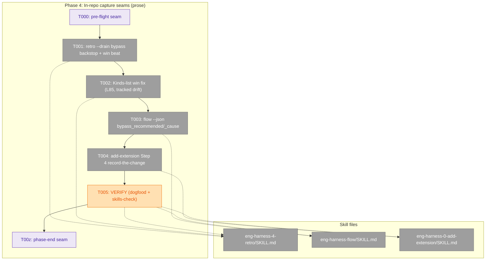
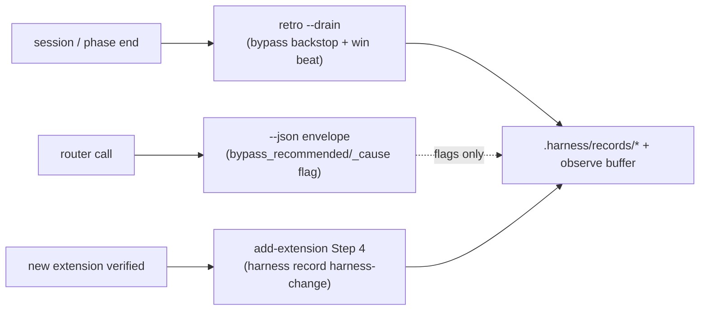
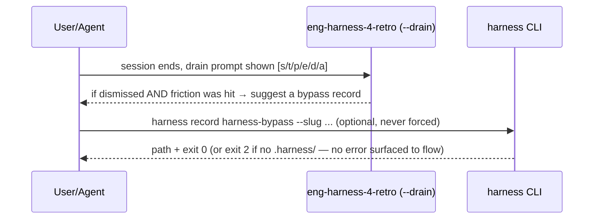

# Phase 4 — In-repo capture seams · Tasks & Context Brief

**Plan**: [harness-bypass-change-records-plan.md](../../harness-bypass-change-records-plan.md)
**Phase**: Phase 4: In-repo capture seams
**Mode**: Full · **Complexity**: CS-2 (small) — S1·I1·D0·N0·F1·T1 = 4
**Domain**: harness-loop skills (prose only)
**Depends on**: Phases 1–2 (the `harness-bypass`/`harness-change` types + the `win` kind must exist — this phase's prose references them; inert until they shipped, which they have)
**Generated**: 2026-06-16

---

## Executive Briefing

- **Purpose**: Make the three new signals *actually get recorded* by adding highly-suggestive, **non-blocking** capture prompts at the in-repo harness seams — with **no dependency on user-global the-flow** (the in-repo guarantee is the retro `--drain` backstop). This closes AC-9.
- **What We're Building**: Three prose edits to harness-loop skill markdown + one tracked-drift one-liner + a dogfood/skills-check verify. No code, no tests-that-compile — the deliverable is skill instructions.
  1. `eng-harness-4-retro/SKILL.md` — a `--drain` **bypass backstop** + a `win` "what worked well?" capture beat (new subsection), leaving the `[s/t/p/e/d/a]` menu intact; **plus** the tracked-drift fix: add `| win` to the Kinds list at line 85 (same file).
  2. `eng-harness-flow/SKILL.md` — document a **stateless** `bypass_recommended`/`bypass_cause` field in the `--json` envelope (the router only *flags*, never writes/blocks). **Body only — the `description:` is 882 chars, near the 900 warn band; do not touch it.**
  3. `eng-harness-0-add-extension/SKILL.md` — a **Step 4 "record the change"** on verification pass (best-effort: "if the harness is set up, `harness record harness-change …`"; never errors when the type is absent).
- **Goals**:
  - ✅ Each seam *prompts* the right record/kind, with the exact field/enum names shipped in Phases 1–2 (zero typos).
  - ✅ Prompts are advisory — they never gate, block, or error if the harness/type is absent.
  - ✅ `eng-harness-flow`'s `description:` stays under the 900-char `skills-check` warn band.
  - ✅ The `win` contract-widening (Phase 2) can't ship with stale 7-kind guidance — the Kinds list at `:85` is corrected here.
- **Non-Goals**:
  - ❌ No code, no CLI behavior change, no new verb (the router only *flags* `bypass_recommended` — it does not write records or block).
  - ❌ No edit to any `description:` frontmatter (all prose lands in skill **bodies** — KF-08).
  - ❌ No dependency on user-global `/the-flow` (D10/KF — the retro `--drain` backstop is the in-repo guarantee).
  - ❌ Not the measures doc, the docs bundle, or `AGENTS_README.md:193` — that **second** `win` tracked-drift surface (crc2 F1) is **Phase 5's** to fix; this phase corrects only `:85` in `eng-harness-4-retro/SKILL.md`.
  - ❌ Not touching the `[s/t/p/e/d/a]` drain menu or the Phase-3 field-source comment at `eng-harness-4-retro/SKILL.md:383`.

---

## Prior Phase Context

### Phase 1 — CLI core: record types + provenance *(source of the two types this phase prompts)*

**A. Deliverables**: `harness-bypass` + `harness-change` core types registered at `registry.ts:40`; `spliceProvenance` helper; `GitPort.remoteUrl()`; provenance stamped on every write. 633 green at the time; companion 0 findings.

**B. Dependencies Exported** *(the exact shapes Phase 4 prose must name — verified against `core-types/harness-bypass.ts` + `harness-change.ts`)*:
- **`harness-bypass`** frontmatter: `schema_version: "1.0"` (template-owned) · `cause` enum = `missing-command | command-failed | too-slow | unclear-output | no-coverage | policy | agent-could-not` · `attempted` (bool) · `command` (string) · `severity` enum = `blocking | degrading | annoying`. No body keys (optional HTML-comment narrative).
- **`harness-change`** frontmatter: `schema_version: "1.0"` · `resolves` (free-form, ≤200 chars — e.g. a record path, `issues/123`, `org/repo#45`, or `<retro_id>:<entry_id>`) · `change_type` enum = `new-command | sensor | fixture | template | doc | skill-edit | routing` · `target` (string — what the change touches).
- **Scaffold path**: `.harness/records/<type>/<YYYY-MM-DD>/<NNN>[-slug].md`.
- **CLI form**: `harness record <type> [--slug <slug>]`. Path + exit 0 on success; unknown type → **E180**; no `.harness/` → **exit 2** (unconfigured). These are the "never errors when absent" semantics Phase 4 leans on.

**C. Gotchas & Debt**: provenance keys degrade to `null` (no remote / detached / no `HARNESS_PLAN_ID`/`HARNESS_AGENT`) — the write still succeeds. So an add-extension Step-4 prompt is safe even in a bare repo.

**D. Incomplete Items**: none carried into Phase 4.

**E. Patterns to Follow**: name the enums **verbatim** as above; the prompt copy should show the real CLI form (`harness record harness-bypass`), not a paraphrase.

### Phase 2 — `win` retro kind *(source of the `win` beat this phase prompts)*

**A. Deliverables**: `win: 'WIN'` in `OBSERVATION_KINDS` (8th kind); `win` in `retro.schema.json` `kind` enum; schema + `RETRO_TEMPLATE` `schema_version` 1.0→1.1. 637 green; companion crc2 found 1 MED.

**B. Dependencies Exported**:
- **Kinds set** (full): `difficulty | magic-wand | gift | insight | coordination | improvement-suggestion | confusion | win`.
- **CLI form**: `harness observe "<what>" --kind win` (round-trips to a `WIN-NNN` buffer entry).

**C. Gotchas & Debt** — **the tracked drift (crc2 finding F1)**: `eng-harness-4-retro/SKILL.md:85` still lists only the **7** original kinds — `win` is **absent**. crc2 routed this fix to **Phase 4** (this phase already edits that file). Folding it in here means the `win` contract-widening doesn't ship with stale user-facing guidance. *(A second F1 surface, `AGENTS_README.md:193`, was routed to Phase 5 — out of scope here.)*

**D. Incomplete Items**: the `:85` Kinds-list update (now task T002 below).

**E. Patterns to Follow**: `win` is the positive/effectiveness signal ("this worked well / the harness was effective") — frame the beat that way, not as another difficulty.

### Phase 3 — Remove history.md *(touched the same retro file — edit-boundary awareness only)*

**A. Deliverables**: migrated the one row → a `harness-change` record, deleted `.harness/history.md`, added a grep-guard, swept 7 docs. 638 green; companion crc3 0 findings.

**C. Gotchas & Debt — edit boundary**: Phase 3 edited `eng-harness-4-retro/SKILL.md` at exactly **one** spot — the field-source comment now at **line 383** (`- \`entries.*\` counts by \`system.compound.status\`…`). Phase 4 must **preserve it intact**; the capture-seam prose and the Kinds-list fix are in different parts of the file (lines ~85 and the `--drain` region ~121–302).

**E. Patterns to Follow**: this plan **dogfoods** the very seams it edits — when friction shows up while editing, capture it live with `harness observe` (the discipline Phase 2 missed and Phase 3 corrected).

---

## Pre-Implementation Check

| File | Exists? | Domain Check | Notes |
|------|---------|-------------|-------|
| `skills/eng-harness-loop/eng-harness-4-retro/SKILL.md` | ✅ | harness-loop skills | **modify** — add a capture-seams subsection (bypass backstop + `win` beat) in the `--drain` region; add `\| win` to Kinds list at **L85**. KEEP the `[s/t/p/e/d/a]` menu (**L162**) and the field-source comment (**L383**) intact. `description:` well under 900 (`skills-check` authoritative; T005 confirms). |
| `skills/eng-harness-loop/eng-harness-flow/SKILL.md` | ✅ | harness-loop skills | **modify BODY ONLY** — add `bypass_recommended`/`bypass_cause` to the `--json` envelope (`### The \`--json\` routing envelope`, **L173–194**, JSON example **L177–193**). ⚠️ `description:` is **nearest the 900 warn band** (plan notes ~882; `skills-check` is authoritative) — **do not edit the frontmatter**. |
| `skills/eng-harness-setup/eng-harness-0-add-extension/SKILL.md` | ✅ | harness-loop skills | **modify** — add **Step 4 "record the change"** after Step 3 ("Verify — show the proof", **L84–96**). `description:` = 184 chars (safe). |

No contract changes (prose only). No new files. No code paths touched → no compile/test risk; the gate is `skills-check` + dogfood, not vitest.

---

## Architecture Map



---

## Acceptance Criteria coverage (AC-9)

| AC-9 requirement | Task(s) |
|---|---|
| retro `--drain` bypass backstop + `win` beat | T001 (+ T002 Kinds-list fix) |
| router `bypass_recommended`/`bypass_cause` envelope doc | T003 |
| add-extension Step 4 change record | T004 |
| dogfood + `skills-check` verify (never-block; description band) | T005 |

## Tasks

| Status | ID | Task | Domain | Path(s) | Done When | Notes |
|--------|-----|------|--------|---------|-----------|-------|
| [x] | T000 | **Harness pre-flight** — `/eng-harness-flow --event pre-implement --phase "Phase 4: In-repo capture seams" --plan-dir docs/plans/020-harness-bypass-change-records` | — | — | Router envelope handled; boot verdict narrated verbatim before any edit | _Harness seam_ (router installed); maps to plan 4.0 |
| [x] | T001 | In `eng-harness-4-retro/SKILL.md`, add a capture-seams subsection in the `--drain` region: **(a)** a **bypass backstop** — when the drain prompt is dismissed/skipped or a friction was clearly hit but nothing was captured, suggest (never force) `harness record harness-bypass` and name a `cause` from the enum; **(b)** a **`win` "what worked well?" beat** pointing at `harness observe "<what>" --kind win`. **Suggested placement**: a new `### Capture seams` subsection at the **end of the `--drain` mode block** (after `### What \`--drain\` does NOT do`, before `## Mode: --harvest`) so the `[s/t/p/e/d/a]` flow above is untouched. Leave the `[s/t/p/e/d/a]` menu (L162) and the field-source comment (L383) intact. | harness-loop skills | `skills/eng-harness-loop/eng-harness-4-retro/SKILL.md` | Prose exists in the `--drain` flow; references `harness record harness-bypass` + a real `cause` value + `--kind win` with **zero typos**; menu + field-source comment intact; **all prose in the body, never the `description:`** (KF-08); **lands together with T002** (same file — the `win` widening must not ship with the stale 7-kind list) | AC-9; KF-08. Enum source: Prior Phase Context §1B/§2B |
| [x] | T002 | In the **same file**, fix the tracked drift: add `\| win` to the Kinds list at **L85** so it reads the full 8-kind set `difficulty \| magic-wand \| gift \| insight \| coordination \| improvement-suggestion \| confusion \| win`. | harness-loop skills | `skills/eng-harness-loop/eng-harness-4-retro/SKILL.md` | Kinds list names all 8 kinds; matches `OBSERVATION_KINDS` + the schema enum exactly | Tracked drift (P2 companion crc2 F1) — **contract-widening safeguard**: the `win` kind (Phase 2) must not ship with stale 7-kind guidance. **Sibling of T001** (same file — land them together). |
| [x] | T003 | In `eng-harness-flow/SKILL.md` **body**, document a **stateless** `bypass_recommended` (bool) + `bypass_cause` (one of the `harness-bypass` `cause` enum, or null) field in the `### The \`--json\` routing envelope` block. Add the two keys **inside the JSON example block (L177–193)** + one prose line after it. State explicitly: the router *reads/derives* the flag for routing context — it **never writes a record and never blocks** (consistent with the stateless contract). | harness-loop skills | `skills/eng-harness-loop/eng-harness-flow/SKILL.md` | Envelope field documented in the body with a one-line "flags, never writes/blocks" note; ⚠️ `description:` frontmatter **untouched** (nearest the 900 warn band — see Pre-Impl Check) | AC-9; D2; KF-08. Do NOT edit the description |
| [x] | T004 | In `eng-harness-0-add-extension/SKILL.md`, add a **Step 4 "record the change"** after Step 3's verification block (~L96): best-effort prose — "if the harness is set up, run `harness record harness-change --slug <slug>` to log this extension (set `change_type`, `target`, `resolves`)". Must read as optional/non-blocking and never error when the type/harness is absent (exit-2/E180 semantics from Phase 1). | harness-loop skills | `skills/eng-harness-setup/eng-harness-0-add-extension/SKILL.md` | A Step 4 exists after Step 3; references `harness record harness-change` + real frontmatter keys (`change_type`/`target`/`resolves`); framed optional/best-effort | AC-9. `change_type` likely `new-command` or `sensor` for a new extension — mention as examples |
| [x] | T005 | **VERIFY (dogfood + skills-check)**: (1) re-read each edited seam and confirm the prose would actually *fire* at the intended moment (drain dismissal, router envelope emit, extension verification pass); (2) **grep the edited files for the exact enum/kind strings** from Phases 1–2 (the `cause`/`change_type`/`severity` enums + the 8-kind set) — each must appear with zero typos; (2b) **negative scope check** — confirm no edited file references `AGENTS_README`, `harness-value-measures`, or `gen:docs` (all Phase 5); (3) run `skills-check --json` and confirm **no** edited skill's `description:` is in the 900–1024 band (esp. `eng-harness-flow`, the one nearest the band). | harness-loop skills | (all three above) | Dogfood pass narrated; zero name mismatches; no Phase-5 scope leak; `skills-check` shows no description in the warn band (warn-only is acceptable per AC-11 nuance) | AC-9; AC-11; KF-08. `skills-check` ships WARN/exit-0 — "clean" means no description-band hit |
| [x] | T00z | **Harness phase-end** — `/eng-harness-flow --event phase-end --plan-dir docs/plans/020-harness-bypass-change-records` | — | — | Router envelope handled at phase end (drain-vs-harvest is the router's call) | _Harness seam_; maps to plan 4.z |

**Legend**: `[ ]` pending · `[~]` in progress · `[x]` complete · `[!]` blocked. · T000/T00z are **harness seams** (fire the router; no file artifact); T001–T005 are the prose deliverables.

---

## Context Brief

**Key findings from plan** (the ones live for Phase 4):
- **KF-08 (High)** — skill `description:` frontmatter sits near the 900-char `skills-check` warn band (`eng-harness-flow` ~882). **All seam prose goes in the skill body, never the `description:`.** T005 re-checks the band via `skills-check`.
- **KF-06** — the `win` widening (Phase 2) is the contract change this phase's prose catches up to; the `:85` Kinds-list fix (T002) is the user-facing half of that widening.
- **AC-9** — the acceptance bar: in-repo capture seams *prompt* the records (prose, dogfood-verified, never blocks). Three seams: retro `--drain` bypass backstop + `win` beat; router `bypass_recommended`/`bypass_cause` envelope doc; add-extension Step 4.

**Domain dependencies** (what this phase's prose consumes — from Phases 1–2):
- `services/record`: `harness record harness-bypass` / `harness-change` (CLI verb, `[--slug]`) — the bypass backstop + add-extension Step 4 reference these. Enums: `cause`, `change_type`, `severity` (named verbatim in Prior Phase Context).
- `services/observe`: `harness observe "<what>" --kind win` — the `win` beat references this.
- `eng-harness-flow` `--json` envelope contract — T003 extends it with two **stateless, advisory** fields.

**Domain constraints**:
- **Never gate/block/write from the router** — `bypass_recommended` is a *flag* in a stateless dispatcher; it must not imply the router records anything (it doesn't). Keep the envelope doc consistent with `eng-harness-flow`'s stateless contract.
- **No user-global the-flow dependency** — the in-repo guarantee is the retro `--drain` backstop (D10). Do not write prose that assumes `/the-flow` is installed.
- **Skills are deployable** — if any new prose adds a cross-reference to this repo's docs, it must be a **full GitHub URL** (skills ship to other repos); CLI commands and target-repo runtime paths stay as-is. Most Phase-4 prose references CLI commands, so this rarely bites — but watch any doc links.
- **Harness = one door** — never name the router's child skills in `eng-harness-flow` prose; the envelope is the contract surface.

**Harness context** (router IS installed — `~/.agents/skills/eng-harness-flow`):
- **Entry point**: `/eng-harness-flow --event <seam> [--phase <id>] [--plan-dir <p>] --json` — the single door; child skills private, never named.
- **Pre-implement seam** (T000): fired by the implement verb before any edit; verdict narrated verbatim (`healthy / SLOW / UNHEALTHY / UNAVAILABLE`). `UNAVAILABLE` ≠ error.
- **Phase-end seam** (T00z): fired by the implement verb at phase close; the router owns drain-vs-harvest.
- **Backpressure**: `backpressure-coverage.md` classed AC-9 as **legit-inferential** (dogfood, not a deterministic sensor) — that's by design; the "sensor" here is `skills-check` (description band) + a dogfood read, not a unit test.
- **Dogfood note**: this phase edits the very capture seams it rides — capture any live friction with `harness observe` as you go.

**Reusable from prior phases**:
- Exact enum/kind strings (Prior Phase Context §1B, §2B) — copy them verbatim into prose.
- The path-scoped commit discipline (commit `-F <msg> -- <paths>`; never `git add` a deleted path) — the repo carries 93 pre-staged presentation deletions that must never be committed (DL-001 from the Phase-3 drain). Commit only the three skill files.

**Mermaid flow diagram** (where each seam fires):


**Mermaid sequence diagram** (the drain bypass backstop):


---

## Discoveries & Learnings

_Populated during implementation by the implement verb._

| Date | Task | Type | Discovery | Resolution | References |
|------|------|------|-----------|------------|------------|

**Types**: `gotcha` | `research-needed` | `unexpected-behavior` | `workaround` | `decision` | `debt` | `insight`

---

## Directory layout

```
docs/plans/020-harness-bypass-change-records/
  ├── harness-bypass-change-records-plan.md
  └── tasks/phase-4-in-repo-capture-seams/
      ├── tasks.md          # this file
      └── execution.log.md  # created by the implement verb
```

**STOP** — dossier only. No code/prose edits until human GO.
