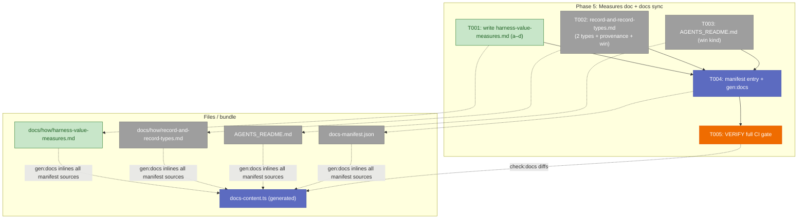
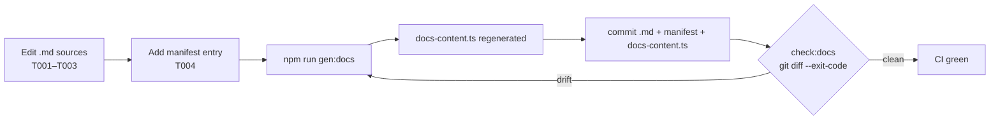

# Phase 5 — Measures doc + docs sync · Tasks Dossier

**Plan**: [`harness-bypass-change-records-plan.md`](../../harness-bypass-change-records-plan.md) · **Phase**: 5 of 5 (final build phase) · **Domain**: `docs/how` (+ docs bundle)
**Complexity**: **CS-2** — prose + one manifest entry + one regenerated file + a full-CI verify. No code logic; the only real care is (a) zero-typo citation of the shipped contract and (b) the `gen:docs` regeneration loop. Nothing structural, no contract changes.

> **STOP-before-code dossier.** This file plans Phase 5; it changes no source. The implement verb consumes it.

---

## Executive Briefing

- **Purpose**: Phase 5 makes the value story *documented and discoverable*. It writes the load-bearing **measures design doc** (`docs/how/harness-value-measures.md`) that explains how the now-recorded signals (`harness-bypass`, `harness-change`, the `win` kind, the 8-key provenance header) would be turned into rates and correlated with DORA — and it finishes the **docs sync** that Phases 1–2 deferred, keeping the published-CLI-docs bundle green.
- **What we're building**: One new guide doc; edits to the existing record guide and the agent drop-file to catalog the two new types, document the provenance header, and add the `win` kind to the two remaining observation-kind lists; a `docs-manifest.json` entry; a regenerated, committed `docs-content.ts`; and a full-CI verification pass.
- **Goals**:
  - ✅ AC-10: `harness-value-measures.md` is load-bearing — it **describes** the measures (bypass/change rate, denominator, DORA correlation, anti-Goodhart) and proves the frontmatter is a sufficient join contract via hand-traced examples. It does **not** build anything.
  - ✅ AC-11: the full CI gate passes; skill `description:` values stay under the 900-char warn band (untouched this phase).
  - ✅ Finish the `win`-kind doc sweep (the 2nd tracked-drift surface) at `record-and-record-types.md:167` + `AGENTS_README.md:193`.
  - ✅ The two new record types + the provenance header are documented for humans, not just in source.
- **Non-Goals**:
  - ❌ **Build the cross-repo rate scanner or the DORA correlation** — explicitly OOS (spec + AC-10). The doc *describes* the measures; no SQL, no scanner code, no dashboard, no correlation implementation.
  - ❌ Touch any CLI source, schema, or skill `SKILL.md` frontmatter (no `description:` edits — those are Phase 1–4 territory and are already committed/green).
  - ❌ Re-open the AC-5 / `schema_version` / `win` schema decisions (locked in Phases 1–2).
  - ❌ Hand-edit `docs-content.ts` — it is generated and committed, never authored.

---

## Prior Phase Context

> Synthesized from the committed Phase 1–4 artifacts and **source-verified** this turn (the contract strings below were quoted directly from the shipped files — see Context Brief § Frozen contract). Phase 5 consumes mainly Phases 1–2 (it documents them); Phases 3–4 are noted for completeness.

### Phase 1 — CLI core: record types + provenance (committed)
- **A. Deliverables**: `harness record harness-bypass` / `harness record harness-change` (two committed core record types); `core-types/harness-bypass.ts`, `core-types/harness-change.ts`; the pure `provenance.ts` splice helper; `GitPort.remoteUrl()` (`git-port.ts` / `exec-git.ts` / `fake-git.ts`); registry + doctor enumerate both types `source: core`.
- **B. Dependencies exported (what Phase 5 documents)**:
  - **8-key Frozen Frontmatter Contract** = template-owned `schema_version` **+ 7 CLI-spliced keys** in order: `record_kind, harness_version, branch, repo, created_at, agent, plan_id`.
  - **harness-bypass body keys**: `cause` ∈ `missing-command|command-failed|too-slow|unclear-output|no-coverage|policy|agent-could-not`; `attempted` (bool); `command` (string); `severity` ∈ `blocking|degrading|annoying`.
  - **harness-change body keys**: `change_type` ∈ `new-command|sensor|fixture|template|doc|skill-edit|routing`; `target` (string); `resolves` (free-form ref ≤200 chars).
  - **Scaffold path**: `.harness/records/<type>/<YYYY-MM-DD>/<NNN>[-slug].md`; exit 0 / E180 unknown / exit 2 unconfigured.
- **C. Gotchas & debt**: `schema_version` is **template-owned, never spliced** (KF-01 — splicing it would duplicate the YAML key). The splice strips any existing top-level dup first, then prepends — idempotent. `version` is injected as a **string** into `RecordDeps` to keep the service P2-pure (KF-02).
- **D. Incomplete items (carried to Phase 5)**: the two new types are **not yet documented** in `record-and-record-types.md`; there is **no provenance-header section** in any human doc (source-only).
- **E. Patterns to follow**: cite the contract **verbatim from source**; the measures doc's hand-traced examples must show the real scaffold layout (7 spliced keys, then `schema_version`, then body keys) exactly as `harness record` emits it.

### Phase 2 — `win` retro kind (committed)
- **A. Deliverables**: `win:'WIN'` in `OBSERVATION_KINDS` (`buffer-codec.ts`); `win` added to `retro.schema.json` `kind` enum; schema + `RETRO_TEMPLATE` `schema_version` bumped 1.0→1.1 (`x-schema-version: "1.1"`).
- **B. Dependencies exported**: the full 8-kind set — `difficulty | magic-wand | gift | insight | coordination | improvement-suggestion | confusion | win`.
- **C. Gotchas & debt**: AC-5's "byte-identical" was scoped to the Phase-1 provenance mechanism; the 1.0→1.1 `RETRO_TEMPLATE` bump is the sole sanctioned template edit (KF-06).
- **D. Incomplete items (carried to Phase 5)**: two doc surfaces still list **7** kinds and omit `win` — `record-and-record-types.md:167` (Kinds bullet) and `AGENTS_README.md:193` (bash-comment kinds line). Phase 4 already fixed the retro skill's Kinds list (`SKILL.md:85`); these two are the remainder.
- **E. Patterns to follow**: `win` slots **last** in the kinds list, after `confusion` (matches source order).

### Phase 3 — remove `history.md` (committed)
- **A/B**: `.harness/history.md` deleted, its one row migrated to a `harness-change` record; `history-md-guard.test.ts` greps `skills/` + `docs/how/` + `.harness/` and fails on any non-whitelisted live ref; 7 docs swept.
- **D. Carried to Phase 5**: **none** — the guard is green. Phase 5 must **not** reintroduce a `.harness/history.md` reference in the new doc (the guard would fail). Frame the changelog story as "`harness-change` records *are* the ledger."
- **E**: `record-and-record-types.md` is already clean of `history.md` (verified — zero hits).

### Phase 4 — in-repo capture seams (committed)
- **A/B**: retro `--drain` bypass-backstop + `win` beat subsection; `bypass_recommended`/`bypass_cause` stateless `--json` envelope field in `eng-harness-flow`; add-extension Step 4 "record the change." `eng-harness-flow` description = 859 chars (nearest the band; **do not touch this phase**).
- **D. Carried to Phase 5**: none. Phase 5 is docs-only and edits **no** `SKILL.md`.
- **E**: capture is highly-suggestive, never-blocking — the measures doc's framing must match (voluntary capture, team-level-only).

---

## Pre-Implementation Check

| File | Exists? | Domain | In docs bundle? | Notes |
|------|---------|--------|-----------------|-------|
| `docs/how/harness-value-measures.md` | ❌ create | docs/how | will be added (T004) | NEW load-bearing doc (AC-10) |
| `docs/how/record-and-record-types.md` | ✅ modify | docs/how | **yes** (`record-and-record-types`) | editing it regenerates `docs-content.ts` |
| `AGENTS_README.md` | ✅ modify | docs/how | **yes** (`agents-readme`) | editing it regenerates `docs-content.ts` |
| `harness/cli/src/services/docs/docs-manifest.json` | ✅ modify | docs/how | — | add one entry (id/title/summary/audience/sourcePath) |
| `harness/cli/src/services/docs/docs-content.ts` | ✅ generated | docs/how | — | **never hand-edit** — `npm run gen:docs` writes it; commit the result |

- **No new concepts / no duplication risk** — the doc names existing, shipped contracts.
- **No contract changes** — additive docs + one manifest row.
- **Harness routing available** via `/eng-harness-flow` — the implement verb fires the pre-implement seam (T000) before any edit and the phase-end seam (T00z) after. (Router installed; verified.)

---

## Architecture Map



**The coupling that bites**: `gen:docs` inlines **every** manifest source. Because `record-and-record-types.md` *and* `AGENTS_README.md` are both in the manifest, T002 and T003 also change `docs-content.ts` — not just the new doc. So **do all doc edits (T001–T003) first, then run `gen:docs` once (T004), then commit `docs-content.ts` a single time.** Running `gen:docs` before the edits are done = a second diff and a failing `check:docs`.

---

## Acceptance Criteria coverage

| AC | Criterion (abbrev.) | Task(s) | Evidence at done |
|----|---------------------|---------|------------------|
| **AC-10** | Load-bearing measures doc: (a) bypass+change rate + denominator; (b) **two** hand-traced examples — one `harness-bypass`, one `harness-change` — each showing every frozen field + a join-key sufficiency note **naming the 8 keys** (`schema_version` + the 7 spliced); (c) DORA leading/lagging, not a 5th metric; (d) anti-Goodhart / team-level-only + R6 under-reporting defense | T001 (+ T002 for the type/provenance reference docs) | all four sub-parts present; both examples show all 8 provenance keys + body keys; no scanner built |
| **AC-11** | Full CI gate green; skill `description:` under 900-char band | T005 | biome / build / check:docs / typecheck / vitest+coverage / arch-check / skills-check / package-smoke all pass; no `SKILL.md` touched so descriptions unchanged |

---

## Tasks

> Legend: `[ ]` pending · `[~]` in progress · `[x]` complete · `[!]` blocked. **T000 / T00z are harness seams** (router-fired by the implement verb) — advisory scaffolding, never gates; they touch no files.

| Status | ID | Task | Domain | Path(s) | Done When | Notes |
|--------|-----|------|--------|---------|-----------|-------|
| [x] | T000 | **Harness pre-flight** — `/eng-harness-flow --event pre-implement --phase "Phase 5: Measures doc + docs sync" --plan-dir docs/plans/020-harness-bypass-change-records` | — | — | Router envelope handled; verdict narrated verbatim before any edit | Harness seam (plan 5.0) |
| [x] | T001 | **Write `docs/how/harness-value-measures.md`** (AC-10), four sub-parts: **(a)** bypass rate + change rate (encoded-mitigation ratio) + denominator (**PRs primary**, plans/sessions secondary; "measure the event where truth is cheapest to prove"); **(b)** one hand-traced **harness-bypass** + one **harness-change** example showing **all 8 provenance keys** (7 spliced + template-owned `schema_version`) **and** the type body keys, plus a note that these fields are a sufficient **join contract** for a future scanner; **(c)** DORA as a **leading/lagging correlation, not a 5th metric**; **(d)** anti-Goodhart / **team-level-only** / no-individual-attribution + the **R6 under-reporting defense** ("zero bypasses = not measured, not perfect"). | docs/how | `docs/how/harness-value-measures.md` | All four (a–d) present; both examples show every frozen field verbatim; the doc **describes**, never builds, the scanner/correlation | AC-10; grounds on `harness-foundations/source-notes/notes3.md` (bypass=item 9, encoded-mitigation=item 11, canonical joins L129–133, DORA L82–84, anti-Goodhart L244–260/L53) |
| [ ] | T002 | **Update `docs/how/record-and-record-types.md`**: (1) catalog the two new core types (`harness-bypass`, `harness-change`) with their body-key contracts; (2) add a **provenance-header section** documenting the 8-key Frozen Contract (template-owned `schema_version` + 7 CLI-spliced keys, stamped at write time, idempotent); (3) add `win` to the Kinds bullet (currently 7 kinds, omits `win`). | docs/how | `docs/how/record-and-record-types.md` | Both types + the 8-key header documented; Kinds bullet ends `… confusion \| win`; zero `history.md` references reintroduced | AC-10; Kinds bullet at **L167**; type names/enums copied verbatim from source (see Context Brief) |
| [ ] | T003 | **Update `AGENTS_README.md`**: add `win` to the observation-kinds comment line (currently 7 kinds). Only the kinds line changes — record guidance changed (Phase 2 shipped `win`, confirmed in `buffer-codec.ts` + `retro.schema.json`). | docs/how | `AGENTS_README.md` | The `# kinds:` comment ends `… confusion \| win` | AC-10; **part of plan 5.2** (T002 covers `record-and-record-types.md`). Comment at **L193** (`# kinds: difficulty \| … \| confusion`); bash comment, not a table |
| [ ] | T004 | **Add manifest entry + regenerate the bundle**: append `{ "id": "harness-value-measures", "title": "Harness value measures", "summary": "Measures for harness value — bypass rate, change rate, the PR denominator, DORA correlation, and the anti-Goodhart / team-level framing.", "audience": "both", "sourcePath": "docs/how/harness-value-measures.md" }` to `docs-manifest.json`; then run `npm run gen:docs`; commit the regenerated `docs-content.ts`. | docs/how | `harness/cli/src/services/docs/docs-manifest.json`, `harness/cli/src/services/docs/docs-content.ts` | `npm run check:docs` exits 0 (gen + `git diff --exit-code` clean) | KF-07 doc-sync. **Run gen:docs ONCE after T001–T003** — it also inlines the edited `record-and-record-types.md` + `AGENTS_README.md`. If `check:docs` shows drift, confirm all of T001–T003 are saved, then re-run `gen:docs` once. Never hand-edit `docs-content.ts`. |
| [ ] | T005 | **VERIFY full CI gate** (AC-11): `biome`, `build`, **`check:docs`**, `typecheck`, `vitest`+coverage, `arch-check`, `skills-check`, `package-smoke`, **`ci-required`** (the summary job). Plus a **negative scope check** — grep the new doc for implementation markers that would mean we built (not described) the scanner: no `SELECT`/SQL, no scanner/parser source, no dashboard/correlation *implementation* — only prose + the example records. And confirm **no `SKILL.md` frontmatter changed** (descriptions unchanged, still under 900). | docs/how | — | CI green; negative checks clean | AC-11. `check:docs` is the doc-sync gate (KF-07) — re-runs `gen:docs` and fails on any `docs-content.ts` drift. "Green" ≠ "zero warnings": `arch-check`/`skills-check` ship WARN/exit-0, coverage is report-only |
| [ ] | T00z | **Harness phase-end** — `/eng-harness-flow --event phase-end --plan-dir docs/plans/020-harness-bypass-change-records` | — | — | Router envelope handled at phase end | Harness seam (plan 5.z) |

---

## Context Brief

**Key findings from plan (Phase 5-relevant)**:
- **KF-07 (doc-sync obligation)**: editing/adding any manifest source obliges a `gen:docs` + committed `docs-content.ts`, gated by `check:docs`. → T004.
- **KF-08 / R6 (under-reporting framing must be explicit)**: voluntary capture means low/zero counts are an *absence of evidence*, not perfection. The measures doc must say so and lean on the PR denominator. → T001(d).
- **AC-10 OOS boundary**: the doc is a *design* doc — it describes the scanner's inputs, it does not build the scanner. → T001 + T005 negative check.

**Frozen contract (cite VERBATIM — source-verified this turn)**:
- **8 provenance keys**: `schema_version` (template-owned) + spliced `record_kind, harness_version, branch, repo, created_at, agent, plan_id` (`provenance.ts` `PROVENANCE_KEYS`).
- **harness-bypass**: `cause: missing-command|command-failed|too-slow|unclear-output|no-coverage|policy|agent-could-not`, `attempted` (bool), `command` (string), `severity: blocking|degrading|annoying`.
- **harness-change**: `change_type: new-command|sensor|fixture|template|doc|skill-edit|routing`, `target` (string), `resolves` (≤200-char free-form ref).
- **observation kinds (8)**: `difficulty | magic-wand | gift | insight | coordination | improvement-suggestion | confusion | win`.
- **Real scaffold layout** (what `harness record harness-bypass` emits — mirror in the AC-10 example): 7 spliced keys first, then `schema_version: "1.0"`, then the body keys; under `.harness/records/harness-bypass/<YYYY-MM-DD>/<NNN>-<slug>.md`.

**Domain dependencies (consumed)**:
- `docs/how` (the published-docs bundle): `docs-manifest.json` → `scripts/gen-docs.mjs` → `docs-content.ts`. Entry shape = `{ id, title, summary, audience, sourcePath }`; `sourcePath` is repo-root-relative; manifest order = output order; no dedupe.
- `services/record` (read-only reference): the shipped templates + `provenance.ts` are the source of truth for every string the doc quotes.

**Domain constraints**:
- `docs-content.ts` is **generated + committed** — author the `.md`, run `gen:docs`, commit both; never hand-edit the generated file.
- Do not reintroduce `.harness/history.md` (the `history-md-guard` test greps `docs/how/` and fails on live refs).
- Touch no CLI source / schema / `SKILL.md` — Phase 5 is docs + manifest only.

**Harness context** (router installed):
- **Entry point**: `/eng-harness-flow --event <seam> --plan-dir docs/plans/020-harness-bypass-change-records --json` — the single door; child skills never named here.
- **Pre-implement seam**: fired at phase start (T000); **phase-end seam**: fired at phase end (T00z). Verdicts narrated verbatim from the envelope.
- **Backpressure**: `backpressure-coverage.md` exists in the plan dir; for a docs phase the relevant sensor is `check:docs` (deterministic drift gate) + the full CI gate (T005) — there is no behaviour/architecture sensor for prose (legitimately inferential, by design).
- This phase **dogfoods** the very records it documents — the AC-10 examples can be cross-checked against a real `harness record` scaffold.

**Reusable from prior phases**:
- The exact contract strings above (from Phases 1–2) — paste, don't paraphrase.
- The Phase-4 `win`-kind edit pattern (`… confusion | win`, appended last) — repeat for T002/T003.

**Mermaid flow diagram** (the doc-sync loop):


**Mermaid sequence diagram** (gen → gate):
```mermaid
sequenceDiagram
    actor Dev
    Dev->>docs sources: edit + add new measures doc
    Dev->>docs-manifest.json: append entry
    Dev->>gen-docs.mjs: npm run gen:docs
    gen-docs.mjs-->>docs-content.ts: inline every manifest source
    Dev->>git: commit .md + manifest + docs-content.ts
    CI->>check:docs: gen:docs && git diff --exit-code
    check:docs-->>CI: exit 0 (no drift) ✅
```

---

## Discoveries & Learnings

_Populated during implementation by the implement verb._

| Date | Task | Type | Discovery | Resolution | References |
|------|------|------|-----------|------------|------------|

**Types**: `gotcha` | `research-needed` | `unexpected-behavior` | `workaround` | `decision` | `debt` | `insight`

---

## Directory layout

```
docs/plans/020-harness-bypass-change-records/
  ├── harness-bypass-change-records-plan.md
  └── tasks/phase-5-measures-doc-docs-sync/
      ├── tasks.md            # this file
      └── execution.log.md    # created by the implement verb
```
