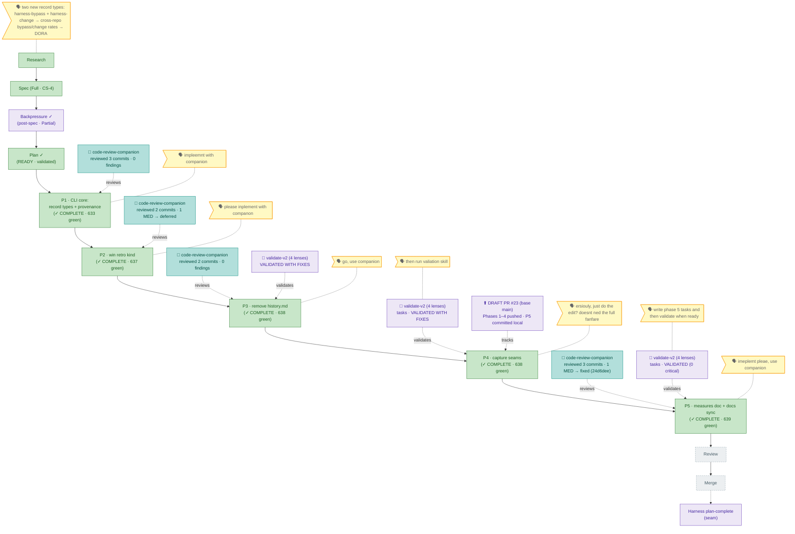

<!-- GENERATED FROM the-flow.json — do not hand-edit; regenerated every guided turn. -->
# Flight plan — harness-bypass-change-records

**Legend** — 🟩 done · 🟧 in progress · 🟥 blocked · 🟦 known (designed) · ⬜ assumed (speculative) · 🗣 your words · 🟪 harness loop / validation

_Cursor: **Phase 5 — COMPLETE → all 5 phases built** (the last build phase, CS-2, docs-only, with a live `code-review-companion`). Phase 5 wrote `docs/how/harness-value-measures.md` — the 4-part measures **design** doc: bypass/change rate + the **PR denominator** · **two** hand-traced records (a `harness-bypass` and the `harness-change` that `resolves` it) proving the **8-key** frozen-frontmatter join contract · DORA as a **leading/lagging correlation, not a 5th metric** · anti-Goodhart / team-level / R6 under-reporting; it **describes**, never builds, the scanner (OOS). It synced `record-and-record-types.md` (2 new core types + a provenance-header section + `| win` at `:167`) and `AGENTS_README.md` (`| win` at `:193`), and added the manifest entry + ran `gen:docs` **once** (6→7 docs). **Full gate GREEN** — biome / build / `check:docs` (exit 0) / typecheck / **vitest 639 passed** / coverage 90.85%; negative scope clean (**0** `SKILL.md` / schema / CLI-src outside `services/docs`). The **companion** (crc5) raised **1 MEDIUM** — the docs called an unset `agent` "omitted", but `provenance.ts` always stamps it (`null` when unset; the key is always present) — **verified against source and FIXED** in both docs (`24d6dee`); it re-reviewed the fix with **no new finding** and stopped clean. **3 path-scoped commits** (`b48b032` / `ec314fb` / `24d6dee`); the **93 staged presentation deletions stayed untouched**. **Next: Review** (stage 7, the inferential tier) — the companion already reviewed every commit for Phases 1/2/3/5 (supersedes a post-hoc pass for those); **Phase 4 had no companion**, so a review covering Phases 4+5 is the reasonable scope, else straight to **Merge** (base `main`; executes only on typed `PROCEED`; DRAFT PR #23 marked ready at/around merge). `/compact` recommended first (post-build seam)._
