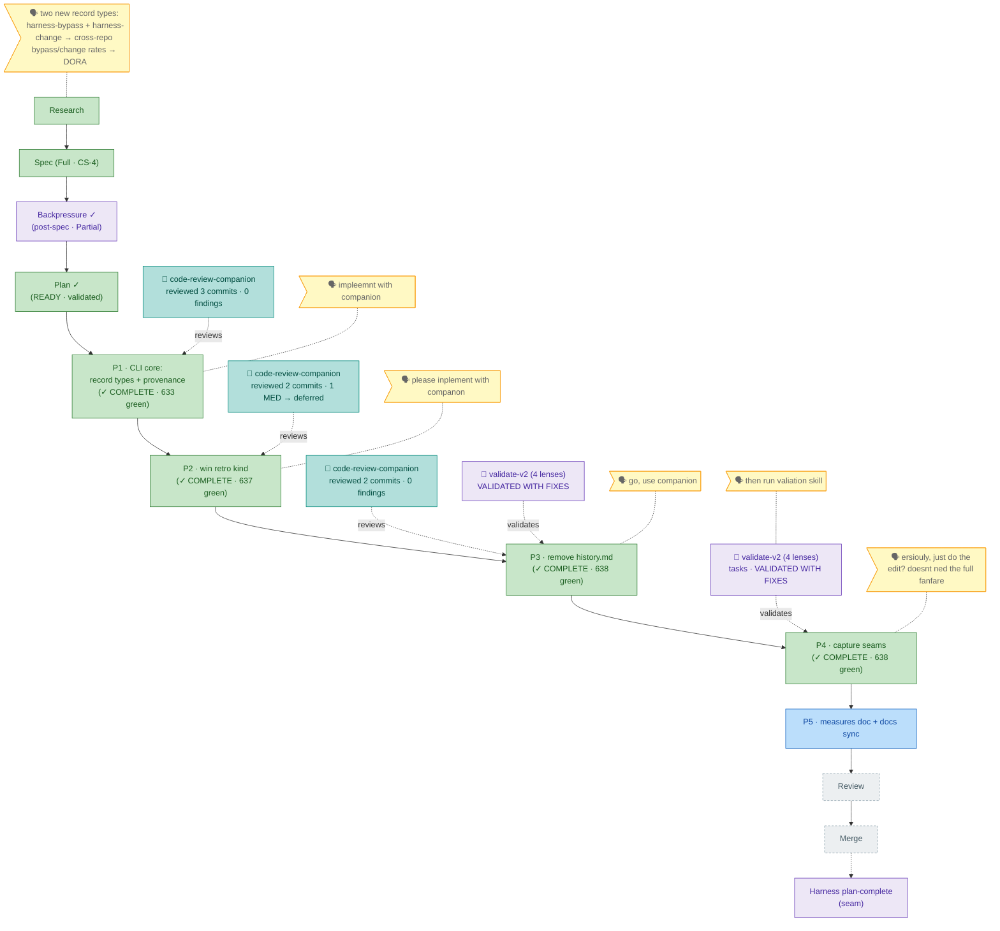

<!-- GENERATED FROM the-flow.json — do not hand-edit; regenerated every guided turn. -->
# Flight plan — harness-bypass-change-records

**Legend** — 🟩 done · 🟧 in progress · 🟥 blocked · 🟦 known (designed) · ⬜ assumed (speculative) · 🗣 your words · 🟪 harness loop / validation

_Cursor: **Phase 4 — COMPLETE** (In-repo capture seams, CS-2, prose-only, no companion). Three skill edits: **retro** gained a `### Capture seams` subsection at the end of the `--drain` block (**bypass backstop** → `harness record harness-bypass` with the full `cause` enum verbatim + a `win` "what worked well?" beat → `harness observe --kind win`), leaving the `[s/t/p/e/d/a]` menu + field-source comment untouched; **eng-harness-flow** documents a **stateless** `bypass_recommended`/`bypass_cause` `--json` envelope field (router only *flags* — never writes/blocks); **add-extension** gained a best-effort `### 4. Record the change` step (`harness record harness-change`, exits `unconfigured`/2 when absent). Tracked drift folded in: `| win` added to the Kinds list at `eng-harness-4-retro/SKILL.md:85` (full 8-kind set). **Verify**: enum/kind/CLI strings zero-typo; negative scope check clean (no `AGENTS_README`/measures/`gen:docs` — Phase-5 boundary held); descriptions 834/859/461 all <900, none edited; architecture guards 3/3 incl. `history-md-guard`; full suite **638 green**. Pre-build, **validate-v2** (vv4, 4 lenses) ran on the tasks dossier → VALIDATED WITH FIXES (0 CRITICAL; 9 refinements). Not committed. **Next: Phase 5 tasks** (measures doc + docs sync — the last build phase; carries the 2nd `| win` surface at `AGENTS_README.md:193`)._
