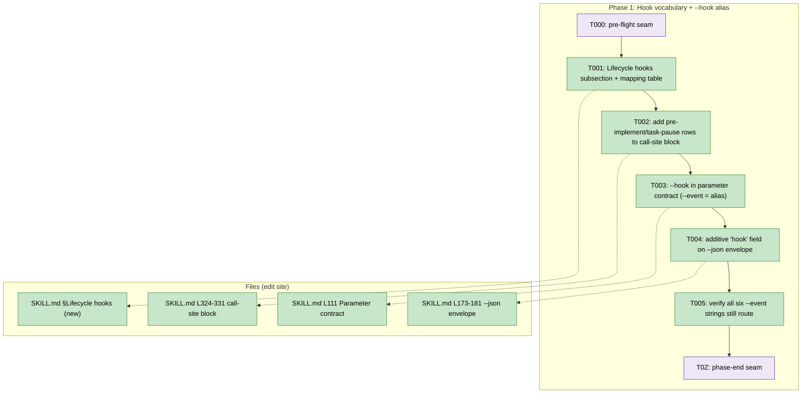

# Phase 1 Tasks — Hook vocabulary + `--hook` alias

**Plan**: [harness-flow-hooks-plan.md](../../harness-flow-hooks-plan.md)
**Phase**: Phase 1: Hook vocabulary + `--hook` alias
**Plan Version**: 1.2.0
**Generated**: 2026-06-17
**Status**: Ready for implementation (waiting for human GO)

---

## Executive Briefing

- **Purpose**: Introduce the five-hook lifecycle vocabulary (`pre-flight · pre-coding · coding · post-coding · post-flight`) into the `eng-harness-flow` router and add `--hook <name>` as the primary invocation that **aliases** `--event` — with zero breakage for the dozens of existing `--event` call sites. This phase is the vocabulary + alias foundation; the discovery manifest (`--hooks`) and `--help` come in Phase 2.
- **What we're building**: Markdown edits to one skill (`skills/eng-harness-loop/eng-harness-flow/SKILL.md`): a new "Lifecycle hooks" subsection with the closed five-hook spine and the corrected `--event → --hook` mapping table; the two missing seam rows (`pre-implement`, `task-pause`) in the integration call-site block; `--hook <name>` documented in the parameter contract; and one **additive** `hook` field on the `--json` routing envelope.
- **Goals**:
  - ✅ Five-hook vocabulary defined with the correct seam→hook mapping (incl. the `phase-end → post-coding` / `plan-complete → post-flight` split, and `task-pause → coding`).
  - ✅ `--hook <name>` documented as primary; `--event` documented as a permanent transparent alias.
  - ✅ All **six** `--event` seam strings still route, verified (the alias holds — zero break).
  - ✅ The `--json` routing envelope gains only the additive `hook` field; no existing field reshaped.
- **Non-Goals**:
  - ❌ The `--hooks` discovery manifest and `--help` synopsis (Phase 2).
  - ❌ `--emit-injection` (deferred to v2 — WS-3).
  - ❌ Any line-count net-removal work (that lands in Phase 2 alongside `--help`, which replaces prose).
  - ❌ Editing `the-flow` or any consumer (it migrates itself later — neutrality, AC-07).
  - ❌ Any CLI code (skill-first per WS-1; a CLI phase inserts only behind the escalation trigger).

---

## Pre-Implementation Check

| File | Exists? | Domain | Notes |
|------|---------|--------|-------|
| `skills/eng-harness-loop/eng-harness-flow/SKILL.md` | ✅ (347 lines) | eng-harness-flow | **Primary edit site.** Budget is exactly 347 — **zero headroom**. Phase 1 *adds* (vocabulary subsection + mapping table + `--hook` doc + envelope field); the offsetting prose removals are a **Phase 2** task (2.3), not here. Phase 1 will push the count over 347 temporarily — that is expected and acceptable; the line-count guard (AC-03) is a Phase 2/3 gate, not a Phase 1 one. |
| `skills/eng-harness-loop/eng-harness-flow/references/getting-started.md` | ✅ | eng-harness-flow | **Not edited in Phase 1** — docs sync is Phase 3 (task 3.1). Listed for awareness only. |
| `skills/eng-harness-loop/eng-harness-flow/references/governance-doc.md` | ✅ | eng-harness-flow | Not edited in Phase 1 (Phase 3 if the inject handshake changes). |

**Anchor lines verified in the live SKILL.md (347 lines):**
- **L111** — `## Parameter contract` (where `--hook <name>` is added as primary; `--event` stays documented as alias). Task 1.2.
- **L129–130** — the six `--event` seam strings: `session-start | post-spec | pre-implement | task-pause | phase-end | plan-complete`. The mapping table (task 1.1) is anchored against these six.
- **L173–181** — `### The --json routing envelope` (the `hook` field is added additively here). Task 1.3.
- **L324–331** — the integration call-site block (`## Called repeatedly along an externally-managed flow`). It currently carries **only four** `--event` rows (`session-start`, `post-spec`, `phase-end`, `plan-complete`) — **`pre-implement` and `task-pause` rows are genuinely absent** → task 1.1's "add the rows; no such row exists today" is confirmed against source.

**Contract-change flag (higher risk)**: the `--json` routing envelope is a frozen, MCP-stable contract (KF-03). The live envelope has **grown since the research snapshot** — it now carries `bypass_recommended` / `bypass_cause` (plan 020) at L188–189, and `harness init` now **ships** (FX001, confirmed at L166: "stamp governance via `harness init`") rather than being the "owed/deferred" writer the research assumed. **Implication for this phase**: AC-09's additive-only check must be made against the *current* envelope shape, not the research-era one. The `hook` field is purely additive; touch nothing else.

---

## Architecture Map



---

## Tasks

| Status | ID | Task | Domain | Path(s) | Done When | Notes |
|--------|-----|------|--------|---------|-----------|-------|
| [x] | T000 | **Harness pre-flight** — `/eng-harness-flow --hook pre-flight --plan-dir docs/plans/021-harness-flow-hooks` | — | — | Router envelope handled; verdict narrated verbatim (`healthy / SLOW / UNHEALTHY / UNAVAILABLE`) before any edit | _Harness seam (advisory, never gates); fired by the implement verb. Plan task 1.0._ |
| [x] | T001 | Add a **"Lifecycle hooks"** subsection to SKILL.md defining the **five** hooks (`pre-flight`, `pre-coding`, `coding`, `post-coding`, `post-flight`) + the `--event → --hook` mapping table. Mapping: `session-start` + `pre-implement` → **pre-flight** (both fire `harness-boot`); `post-spec` → **pre-coding**; `task-pause` → **coding** (`kind: silent` — the in-flight capture seam); `phase-end` → **post-coding** (per-phase drain); `plan-complete` → **post-flight** (terminal close-out — harvest + present improvements + encode) | eng-harness-flow | `skills/eng-harness-loop/eng-harness-flow/SKILL.md` (new subsection; anchor the mapping to the six seams at L129–130) | All five hooks defined; mapping table present and matches **KF-01** (`pre-implement → pre-flight`, not pre-coding) + **KF-08** (`post-coding`/`post-flight` split); `coding` marked silent; no child-skill slug named | Per KF-01, KF-08, **AC-06**; upholds one-door (KF-07) — note AC-08 is formally *verified* in Phase 2 task 2.4, so this task only *upholds* it, it doesn't satisfy it. The closed five-hook spine — never grow the count. |
| [x] | T002 | **Add** the `pre-implement → pre-flight` and `task-pause → coding` rows to the integration call-site block (L324–331, `## Called repeatedly…`) so all six seams appear with their hook. The block has only four rows today (`session-start`, `post-spec`, `phase-end`, `plan-complete`) | eng-harness-flow | `skills/eng-harness-loop/eng-harness-flow/SKILL.md` L324–331 | All six seams represented in the call-site block, each annotated with its hook; rows are additive (existing four unchanged) | Per KF-01. Source-verified: pre-implement/task-pause rows absent today. |
| [x] | T003 | Add `--hook <name>` to the **Parameter contract** (L111) as the **primary** invocation; document `--event <seam>` as a permanent **transparent alias** (no deprecation). Leave the slug-resolution map untouched | eng-harness-flow | `skills/eng-harness-loop/eng-harness-flow/SKILL.md` §Parameter contract (L111+) | `--hook` documented as primary; `--event` explicitly marked a permanent alias; slug map unaffected | Per KF-02, AC-05. `--event` must stay zero-break for ~88 call sites. |
| [x] | T004 | Add the resolved hook to the `--json` **routing envelope** as one **additive** field (`hook`, per § Manifest contract). A routing call (`--hook X --json`) returns the existing envelope + `hook` only — it does **NOT** embed the manifest | eng-harness-flow | `skills/eng-harness-loop/eng-harness-flow/SKILL.md` §The --json routing envelope (L173–181) | New `hook` field only; **no existing envelope field reshaped or renamed** (check against the *current* envelope incl. `bypass_recommended`/`bypass_cause`) | Per KF-03, AC-09. Contract-change risk — additive only. |
| [x] | T005 | **Validation**: confirm all **six** `--event` strings (`session-start`, `post-spec`, `pre-implement`, `task-pause`, `phase-end`, `plan-complete`) still resolve to the correct hook via the alias mapping — `task-pause → coding` included | eng-harness-flow | `skills/eng-harness-loop/eng-harness-flow/SKILL.md` (read-back of the mapping table + call-site block) | Each of the six seams maps to exactly one hook, matching T001's table; AC-05 holds (zero-break); no seam left unmapped | TDD-style check. Mapping replay is the proof — the `validate-harness-flow` extension exercises it end-to-end in Phase 3. |
| [x] | T0Z | **Harness phase-end** — `/eng-harness-flow --hook post-coding --plan-dir docs/plans/021-harness-flow-hooks` | — | — | Router envelope handled at phase end (per-phase drain) | _Harness seam (advisory, never gates); fired by the implement verb. Plan task 1.z._ |

- `Status`: `[ ]` pending · `[~]` in progress · `[x]` complete · `[!]` blocked
- T000 / T0Z are **harness seams** — advisory scaffolding the implement verb auto-fires via `/eng-harness-flow`; never gates. Omit if the router weren't installed (it is).

---

## Context Brief

**Key findings from plan (driving this phase):**
- **KF-01 (Critical)**: `--event pre-implement` fires the `harness-boot` node → maps to **pre-flight**, NOT pre-coding (the naming trap the research agent initially mis-binned). Encoded in T001/T002; AC-06 verifies.
- **KF-02 (Critical)**: dozens of `--event` call sites (~88 raw occurrences), no version-gating, most in the *separate* `the-flow` repo. `--hook` is primary; `--event` stays a transparent alias for all six. T003; AC-05.
- **KF-03 (High)**: the `--json` envelope is a frozen, MCP-stable contract — additive fields safe, reshaping is not. T004; AC-09.
- **KF-08 (High)**: `phase-end` (per-phase drain) and `plan-complete` (terminal harvest + improve) are distinct lifecycle positions — collapsing both into `post-coding` would bury the **Improve** beat. Hence the dedicated fifth hook `post-flight`. T001; AC-06.

**Domain constraints:**
- Single domain: `eng-harness-flow` (the router skill). No `docs/domains/registry.md` in this repo — the plan's tables are the whole context.
- **One-door discipline (KF-07, AC-08)**: hook names are stage-neutral; the envelope/prose names the *invocation* (`/eng-harness-flow --hook …`), **never** a child-skill slug.
- **Neutrality (AC-07)**: edits touch only `eng-harness-flow` + its references. `the-flow` is **not** edited in this repo.
- **Statelessness (KF-05)**: the five-hook spine is a closed, fixed set — never stored, derived every call. Phase 1 only introduces the vocabulary; the derived manifest is Phase 2.

**Harness context (router installed — `/eng-harness-flow` present):**
- **Entry point**: `/eng-harness-flow --hook <name> [--phase <id>] [--plan-dir <p>] --json` — the single door; child skills are private and never named here.
- **Pre-implement seam**: fired by the implement verb at phase start (T000) — the router's envelope decides what happens; verdict narrated verbatim.
- **Phase-end seam**: fired by the implement verb at phase end (T0Z).
- **Backpressure**: `backpressure-coverage.md` was not captured (optional; not required for this phase).
- **Recursion note**: this phase edits the very router these seams call — using the harness loop to build the harness loop's own interface.

**Reusable / prior context:** none — this is Phase 1 (no prior phases).

**Mapping (the contract this phase encodes):**
```
--event session-start  ─┐
--event pre-implement  ─┴─→  --hook pre-flight    (fire;  harness-boot)
--event post-spec       ──→  --hook pre-coding    (fire;  backpressure)
--event task-pause      ──→  --hook coding        (silent; in-flight capture / harness observe)
--event phase-end       ──→  --hook post-coding   (fire;  per-phase drain)
--event plan-complete   ──→  --hook post-flight   (fire;  terminal: harvest + present improvements + encode)
```

---

## Discoveries & Learnings

_Populated during implementation by the implement verb._

| Date | Task | Type | Discovery | Resolution | References |
|------|------|------|-----------|------------|------------|

**Types**: `gotcha` | `research-needed` | `unexpected-behavior` | `workaround` | `decision` | `debt` | `insight`

---

## Directory layout

```
docs/plans/021-harness-flow-hooks/
  ├── harness-flow-hooks-plan.md
  └── tasks/phase-1-hook-vocabulary-hook-alias/
      ├── tasks.md
      └── execution.log.md   # created by the implement verb
```

STOP — no code edited. Dossier ready; waiting for human GO.
