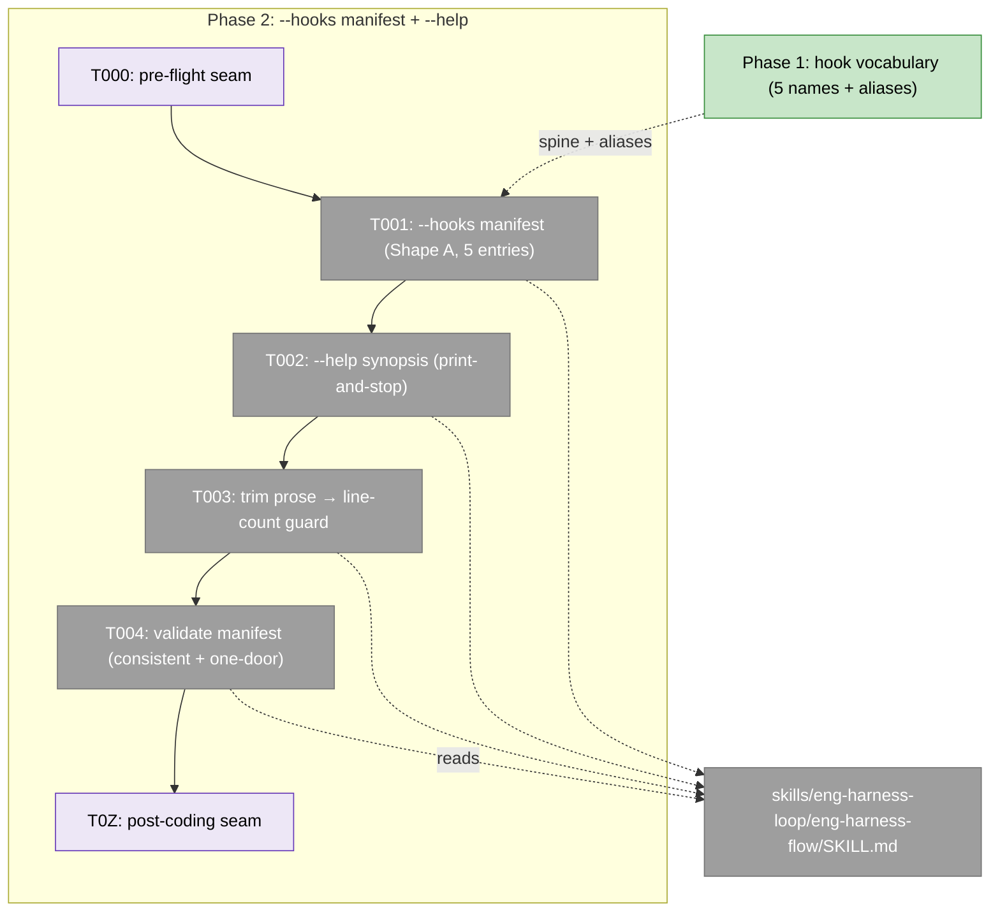
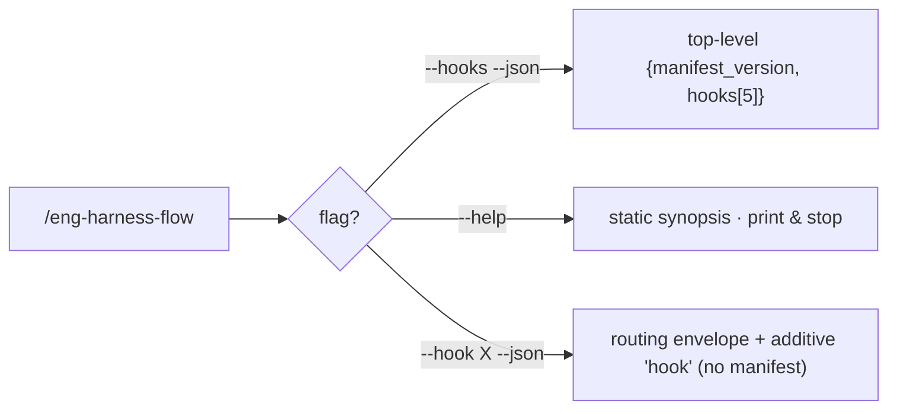
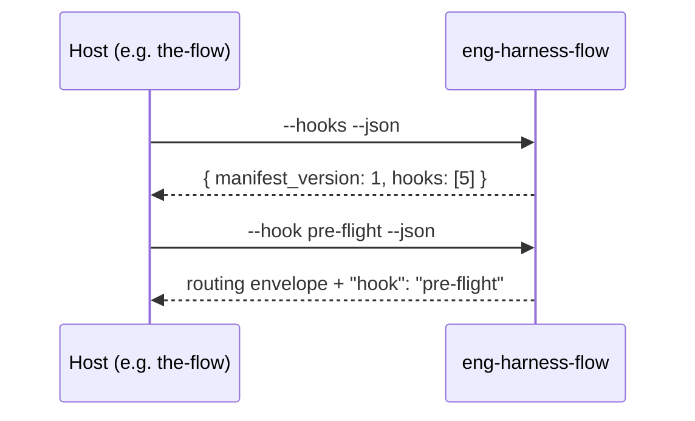

# Tasks — Phase 2: `--hooks` manifest + `--help`

**Plan**: [harness-flow-hooks-plan.md](../../harness-flow-hooks-plan.md) · **Mode**: Full · **Phase**: 2 of 3 · **Generated**: 2026-06-17
**Edit site**: `skills/eng-harness-loop/eng-harness-flow/SKILL.md` (single domain: `eng-harness-flow`)

---

## Executive Briefing

- **Purpose**: Phase 1 gave the router a *vocabulary* (the five lifecycle hooks + `--hook` aliasing `--event`). Phase 2 makes that vocabulary **discoverable and self-describing**: a derived `--hooks` manifest (the machine-readable five-hook contract) and a concise, print-and-stop `--help`. It also pays back Phase 1's +40-line prose debt by replacing longhand with the synopsis.
- **What We're Building**: Two new dispatch surfaces on `eng-harness-flow` — `--hooks [--json]` (Shape A: top-level `{ manifest_version, hooks[5] }`) and `--help` (synopsis + hooks + flags, no detection/routing) — plus a prose trim guarded by a line-count check.
- **Goals**:
  - ✅ `--hooks --json` emits **exactly five** entries + `manifest_version: 1`, per § Manifest contract (Shape A); `coding` = `kind: silent`, `post-flight` = terminal fire.
  - ✅ A routing call (`--hook <name> --json`) stays **envelope + additive `hook`** — it never embeds the manifest (the routing-vs-discovery boundary holds).
  - ✅ `--help` prints a synopsis and stops — no signal reads, no state, no routing.
  - ✅ Net SKILL.md line delta surfaced honestly against the AC-03 budget (≤ 347) — overage raised for a human call, never silently passed.
  - ✅ Manifest is one-door-clean: no child-skill slug names anywhere.
- **Non-Goals**:
  - ❌ `--emit-injection` / idiom renderers — **deferred to v2** (WS-3); not built here.
  - ❌ Any `the-flow` edits (neutrality is verified in Phase 3).
  - ❌ Touching the Per-turn UX block — **off-limits** for trimming (KF-06).
  - ❌ A variable/per-repo hook registry — the spine is **fixed-5**; per-repo variability rides in each entry's `preconditions` only (KF-05).

---

## Prior Phase Context

_Synthesised from Phase 1's [execution.log.md](../phase-1-hook-vocabulary-hook-alias/execution.log.md) (read directly — the artifact is the source of truth)._

**A. Deliverables** (all in `skills/eng-harness-loop/eng-harness-flow/SKILL.md`):
- `### Lifecycle hooks` subsection — the five-hook definition table (`pre-flight`/`pre-coding`/`coding`[silent]/`post-coding`/`post-flight`) + the `--event → --hook` mapping table + two load-bearing callouts (commit `8e1b4ed`).
- Two new rows in the `## Called repeatedly…` integration block: `pre-implement → pre-flight`, `task-pause → coding (silent)`; the existing four rows kept byte-identical + a one-line seam→hook pointer (`f53b323`).
- `--hook <name>` added to the parameter contract as **primary**; `--event` reframed as a **permanent, transparent, never-deprecated alias** (`0b853dc`).
- One **additive** `hook` field on the `--json` routing envelope — no existing field reshaped (`b55bf20`).
- F001 fix: stale `at=<seam>` example corrected to `--hook` (`f115f15`).

**B. Dependencies exported** (Phase 2 consumes these):
- The **five hook names** and their canonical order — the manifest's `hooks[]` spine.
- The `--event → --hook` mapping — becomes each manifest entry's `aliases[]` (the migration map).
- The `coding` = silent designation and the `post-coding`/`post-flight` split (KF-08) — drive `kind` and the per-entry `intent`/`run_at`.
- The existing `--json` envelope shape **plus** the `hook` field — Phase 2's routing-vs-discovery boundary depends on this being the *only* envelope change.

**C. Gotchas & debt carried forward**:
- **SKILL.md grew 347 → 387 (+40)**. The offsetting prose removal is **this phase's task 2.3**; the AC-03 ≤ 347 guard is a Phase 2/3 gate. This is the phase's central tension (see Watch-outs).
- The done-when "additive vs unchanged" tension from Phase 1's T002 — resolved by keeping existing rows byte-identical. Same discipline applies to 2.3's prose trim: remove longhand, don't reshape live contracts.

**D. Incomplete items**: none — Phase 1 closed clean (T005 read-back verified all six `--event` seams resolve to exactly one hook each; AC-05 holds).

**E. Patterns to follow**:
- **Additive-only on contracts**; neutral prose (don't leak plan-internal "Phase N" wording into shipped skill text — Phase 1 phrased the manifest note as "never embeds a hooks manifest").
- One commit per task; companion-reviewable diffs.
- Ground the manifest in § Manifest contract verbatim — do not improvise field names.

---

## Pre-Implementation Check

| File | Exists? | Domain | Notes |
|------|---------|--------|-------|
| `skills/eng-harness-loop/eng-harness-flow/SKILL.md` | ✅ (387 lines) | eng-harness-flow | **Modify only.** Add `--hooks` manifest + `--help` (§ Manifest contract is the spec); trim prose at the named removal targets (~L16–27 stateless-contract bullets, ~L111–142 parameter-contract longhand). Per-turn UX block (KF-06) is **off-limits**. Contract change → higher risk (the `--json` surfaces are a public contract) — additive discipline required. |

- **No `docs/domains/registry.md`** in this repo → no domain.md/registry updates (single conceptual domain: `eng-harness-flow`).
- **No new concepts to dedup** — `--hooks`/`--help` are new flags on an existing surface, not new shared concepts.
- **Harness availability**: router installed (`~/.agents/skills/eng-harness-flow/SKILL.md` ✓). The implement verb fires the pre-flight seam (T000) before any edit and the post-coding seam (T0Z) at phase end. `backpressure-coverage.md` was **not** captured for this plan, so there are no sensor rows to cite for these criteria — verification is by inspection + the Phase 3 `validate-harness-flow` replay.

---

## Architecture Map



---

## Tasks

| Status | ID | Task | Domain | Path(s) | Done When | Notes |
|--------|-----|------|--------|---------|-----------|-------|
| [x] | T000 | **Harness pre-flight** — `/eng-harness-flow --hook pre-flight --phase "Phase 2: --hooks manifest + --help" --plan-dir docs/plans/021-harness-flow-hooks` | — | — | Router envelope handled; verdict narrated verbatim before any edit | Harness seam (fired by the implement verb). `--event pre-implement` is the alias. Omit if router not installed. |
| [x] | T001 | Implement the `--hooks` manifest per **§ Manifest contract**: top-level `{ manifest_version: 1, hooks: [5] }` (Shape A, **not** wrapped in `data`). Each entry: `hook`, `intent`, `run_at`, `kind` (`fire`\|`silent`), `invoke`, `aliases` (string[] — the `--event` seams it subsumes), `produces` (\|null), `needs` (string[]), `preconditions` (string[] — `["S2-governance","S4-boot"]` for `pre-flight`, `[]` otherwise). `coding` = `kind: silent`; `post-flight` = terminal fire (harvest + present improvements + encode). A routing call (`--hook <name> --json`) **stays envelope + `hook`** and must NOT embed the manifest. | eng-harness-flow | `skills/eng-harness-loop/eng-harness-flow/SKILL.md` | `--hooks --json` lists exactly **5** entries with `manifest_version: 1`; `coding` is `silent`; every entry's `aliases` matches Phase 1's mapping; routing-vs-discovery `--json` boundary holds (routing call has no `hooks[]`/`manifest_version`) | KF-05 (fixed spine; variability only in `preconditions`), KF-03 (no envelope reshape) / AC-02. **The spec is § Manifest contract (`harness-flow-hooks-plan.md` L222–227) — do not improvise field names**; Phase 3 task 3.1 syncs `getting-started.md` to this exact shape, so pin all 9 fields. |
| [x] | T002 | Add a concise `--help` synopsis block: **synopsis line + the five hooks (one line each) + the flag list**. Print-and-stop — **no** signal detection, **no** state, **no** routing. Matches CLI `--help` spirit. | eng-harness-flow | `skills/eng-harness-loop/eng-harness-flow/SKILL.md` | `--help` does zero routing/state; output is a static synopsis; the five hooks + flags are listed; nothing fires | Per finding 06 / AC-03. Keep it terse — it is *replacing* prose, not adding to it. |
| [x] | T003 | **Replace** longhand prose with the synopsis so net SKILL.md delta trends to ≤ 0. Concrete removal targets: the stateless-contract bullets (§ "The stateless contract", ~L16–27) and parameter-contract longhand (~L111–142). The **Per-turn UX block is off-limits** (KF-06). **If the math cannot close, surface the overage** — print the line accounting and the human-decision options; never silently pass. | eng-harness-flow | `skills/eng-harness-loop/eng-harness-flow/SKILL.md` | Either `wc -l SKILL.md` ≤ **347**, **or** a clearly surfaced overage: the before/after line count, what was trimmed, and concrete options for the human (e.g. revise the AC-03 budget, or push more prose to `getting-started.md` in Phase 3) | line-count guard / AC-03. **Expected tension** — see Watch-outs: the named removal targets (~44 lines) likely do **not** offset Phase 1's +40 *plus* the manifest+help additions, so a surfaced overage is the probable honest outcome. A surfaced overage is **recorded as an accepted, documented decision carried forward to Phase 3 task 3.4** (whose `≤ 347` guard then reads against that decision, not a clean slate) — never silently passed. |
| [x] | T004 | Validation: confirm the `--hooks` manifest is internally consistent (5 entries; each `aliases` round-trips to a real `--event` seam; `kind`/`run_at`/`preconditions` match § Manifest contract) and **one-door-clean** — no child-skill slug names anywhere in the manifest or `--help`. | eng-harness-flow | `skills/eng-harness-loop/eng-harness-flow/SKILL.md` | Manifest self-consistent; no slug names (`eng-harness-0-*`/`-1-*`/`-2-*`/`-4-*`); stage-neutral language throughout | Per finding 07 / AC-08. Read-back / grep check — produces no code change if clean. |
| [x] | T0Z | **Harness phase-end** — `/eng-harness-flow --hook post-coding --plan-dir docs/plans/021-harness-flow-hooks` | — | — | Router envelope handled at phase end (per-phase drain) | Harness seam (fired by the implement verb). `--event phase-end` is the alias. Omit if router not installed. |

> Harness-seam rows (T000/T0Z) are **advisory scaffolding, never gates** — the router decides what (if anything) the harness does at each seam; no child skill is named. They use the new `--hook` vocabulary (dogfooding Phase 1's surface); `--event` aliases still work.

---

## Context Brief

**Key findings from plan** (applied this phase):
- **KF-05** (closed spine): the manifest is **fixed-5**; per-repo variability lives only in each entry's `preconditions[]`, never as extra/missing hooks. Guards against the manifest drifting into a variable registry.
- **KF-03** (frozen envelope): the routing `--json` envelope is additive-only; `--hooks` is a *separate discovery surface* — a routing call must not start embedding the manifest.
- **KF-06** (anti-bloat): `--help` and the manifest must **replace** prose, not pile on; the Per-turn UX block is protected.
- **KF-08** (post-coding ≠ post-flight): `post-coding` = per-phase drain (fire); `post-flight` = terminal harvest + present-improvements + encode (fire) — reflected in each entry's `intent`/`run_at`.

**Domain dependencies**: none external — single domain `eng-harness-flow`; this phase consumes only Phase 1's in-file vocabulary.

**Domain constraints**:
- One-door rule (AC-08): no child-skill slug ever appears in shipped prose, the manifest, or `--help`.
- Additive-only on the `--json` contract (AC-09 discipline from Phase 1 continues): do not reshape envelope fields.
- Neutrality (AC-07): no `the-flow` files touched (verified in Phase 3).

**Harness context** (router installed):
- **Entry point**: `/eng-harness-flow --hook <name> [--phase <id>] [--plan-dir <p>] --json` — the single door; `--event <seam>` is the back-compat alias.
- **Pre-flight seam** (`--hook pre-flight`, alias `--event pre-implement`): fired by the implement verb at phase start (T000); verdict narrated verbatim (`healthy / SLOW / UNHEALTHY / UNAVAILABLE`); `UNAVAILABLE` is not an error.
- **Post-coding seam** (`--hook post-coding`, alias `--event phase-end`): fired at phase end (T0Z) — per-phase drain.
- **Backpressure**: `backpressure-coverage.md` not captured for this plan → no sensor rows to cite; this phase verifies by inspection + the Phase 3 `validate-harness-flow` replay.
- **Inject handshake (S3)**: Phase 2 is **additive** to the governance inject map — `--hooks`/`--help` advertise and document the wiring but don't change *where* a host calls the router (`--event` stays a permanent alias, AC-05). Phase 3 task 3.2's conditional therefore resolves to *verify consistency, no inject change required*.

**Reusable from Phase 1**:
- The five hook names + canonical order, and the `--event → --hook` mapping (becomes `aliases[]`).
- The `--json` envelope shape (the routing-call baseline the discovery call must stay distinct from).
- The neutral-phrasing pattern for shipped notes ("never embeds a hooks manifest").

**Flow diagram** (the two new surfaces vs the routing path):


**Sequence diagram** (a host discovering the contract, then routing):


---

## Discoveries & Learnings

_Populated during implementation by the implement verb._

| Date | Task | Type | Discovery | Resolution | References |
|------|------|------|-----------|------------|------------|

**Types**: `gotcha` | `research-needed` | `unexpected-behavior` | `workaround` | `decision` | `debt` | `insight`

---

## Directory layout

```
docs/plans/021-harness-flow-hooks/
  ├── harness-flow-hooks-plan.md
  └── tasks/
      ├── phase-1-hook-vocabulary-hook-alias/
      │   ├── tasks.md
      │   └── execution.log.md
      └── phase-2-hooks-manifest-help/
          ├── tasks.md          # this file
          └── execution.log.md  # created by the implement verb
```

---

## Validation Record (2026-06-17)

### Validation Thesis

**Raison d'être**: Make Phase 2 (`--hooks` manifest + `--help`) implementable in one pass — bind plan tasks 2.1–2.4 to the single edit site so the implementer needn't re-derive the manifest shape (Shape A), the AC-03 line-budget tension, or the seam wiring.

**Value claim**: Phase 2 implementation is faster/safer/self-consistent because the manifest contract, the 347-line budget reality, and the one-door constraint are pre-resolved and pinned to § Manifest contract.

**Artifact promise**: An implementing agent builds Phase 2 with minimal clarification, and the line-budget reality is surfaced honestly (overage raised for a human call, never silently passed).

**Intended beneficiaries**: implement verb (primary); reviewer; Phase 3 (inherits budget + neutrality guards).

**Proof target**: Implementation.

**Evidence standard**: SKILL.md source/line match, plan↔dossier alignment, § Manifest contract field fidelity, one-door cleanliness.

**Thesis source**: `harness-flow-hooks-plan.md` Phase 2 table (L229–244) + § Manifest contract (L222–227) + Acceptance Coverage Map (L267–279); tasks-verb contract.

**Thesis verdict**: Advanced.

**Main thesis risk**: The line-budget overage (managed by honest surfacing + a documented carry-forward to Phase 3 3.4, not eliminated).

---

| Agent | Lenses Covered | Thesis Axes Covered | Issues | Verdict |
|-------|---------------|---------------------|--------|---------|
| Source Truth | Factual Accuracy, Concept Documentation, Hidden Assumptions, Evidence Sufficiency | Evidence Sufficiency | 0 | ✅ |
| Cross-Reference + Completeness | Integration & Ripple, Edge Cases, Hidden Assumptions, Domain Boundaries, Proof-Level Fit | Implementation Readiness, Attention Reduction | 0 | ✅ |
| Thesis Alignment | Thesis Alignment, Proof-Level Fit, User/Product Value Preservation | Thesis Alignment, Implementation Readiness | 0 | ✅ |
| Forward-Compatibility | Forward-Compatibility, Integration & Ripple, Contract Integrity | Downstream Usefulness, Contract Integrity | 1 adjudicated HIGH→MEDIUM + 2 MEDIUM, 3 fixed | ⚠️ → ✅ |

### Forward-Compatibility Matrix (post-fix)

| Consumer | Requirement | Failure Mode | Verdict | Evidence |
|----------|-------------|--------------|---------|----------|
| implement verb (Phase 2) | ordered tasks + concrete done-when + manifest spec ref + runnable seams | contract drift | ✅ | T000–T0Z sequenced; T001–T004 concrete; T003 overage now an explicit carry-forward |
| Phase 3 task 3.1 (docs sync to `--hooks`) | settled 9-field Shape A manifest | shape mismatch | ✅ | T001 task cell enumerates all 9 fields + Notes now cite § Manifest contract L222–227 |
| Phase 3 task 3.2 (inject handshake) | clarity on whether `--hooks` changes the inject story | contract drift | ✅ | Context Brief now states Phase 2 is additive to S3; 3.2's conditional = verify-only |
| Phase 3 task 3.4 (line-budget guard) | ≤ 347 **or** a pre-documented, accepted overage | lifecycle ownership | ✅ | T003 records a surfaced overage as an accepted decision carried to 3.4 |
| execution.log.md (created by implement) | task IDs + Discoveries scaffold | test boundary | ✅ | IDs T000–T0Z + empty Discoveries & Learnings table present |

**Thesis alignment**: Value claim advanced (Yes) at the target proof level (target = actual = Implementation), evidence Strong; the main thesis risk is the line-budget overage, which the dossier manages by honest surfacing rather than a silent pass.

**Outcome alignment**: *(echoed verbatim from the Forward-Compatibility agent)* "As written, the dossier **advances the trajectory toward 'hooks discoverable + neutral + lean'** in mechanics (T001–T004 are sound), but **creates a forward-compatibility trap** in Phase 3's guard logic (Issue #1: T003's escape clause vs. 3.4's hard requirement). The manifest shape (Issue #2) and injection handshake (Issue #3) are secondary but compound the risk. **Fix required before handoff to Phase 3.**" — *Synthesizer note: the three fixes applied this run (T003 carry-forward, T001 § citation, inject-handshake clarification) close Issues #1–#3; the trajectory now advances without the trap.*

**Standalone?**: No — downstream consumers exist (implement verb; Phase 3 tasks 3.1/3.2/3.4; execution.log.md).

Overall: **VALIDATED WITH FIXES**
