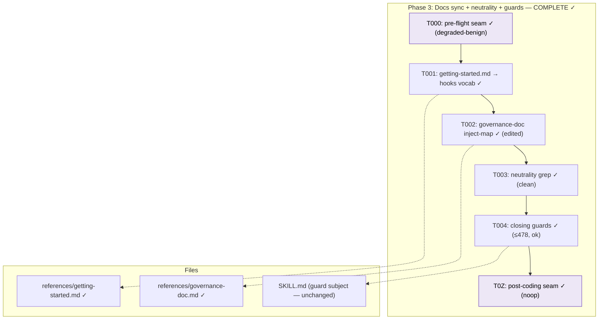

# Tasks — Phase 3: Docs sync + neutrality + guards

**Plan**: [harness-flow-hooks-plan.md](../../harness-flow-hooks-plan.md)
**Phase**: Phase 3 (final) · **Domain**: eng-harness-flow · **CS-2** (small)
**Generated**: 2026-06-17

> Closing phase. No new behaviour — sync the reference docs to the hooks vocabulary Phases 1–2 already shipped, prove neutrality, run the guards. Keep it tight.

---

## Executive Briefing

- **Purpose**: Make the reference docs tell the same story the code already tells (`--hook` primary, `--event` permanent alias, five neutral hooks, `--hooks`/`--help` discovery), confirm no `the-flow` files were touched, and run the closing guards against the **accepted** Phase-2 budget.
- **What we're building**: Doc edits only (`getting-started.md`, maybe `governance-doc.md`) + verification steps. No SKILL.md behaviour change.
- **Goals**:
  - ✅ `getting-started.md` leads with `--hook`; `--event` shown as an accepted alias.
  - ✅ Neutrality proven by grep — only `eng-harness-flow` touched.
  - ✅ Line guard asserts against the re-baselined budget (478 + documented Phase-3 delta), `validate-harness-flow` replay + `harness doctor` clean.
- **Non-goals**:
  - ❌ No `--emit-injection` (deferred to v2, WS-3).
  - ❌ No new SKILL.md surface; no `the-flow` edits.
  - ❌ Not re-litigating the +131 overage — it's an accepted decision; 3.4 re-baselines, never re-fights it.

## Prior Phase Context

*(Synthesised from the Phase 1 & 2 execution logs + flight plan — not re-reviewed by subagents; this is a docs/verification phase.)*

- **Phase 1 — Hook vocabulary + `--hook` alias** (SKILL.md 347→387, +40). Added the Lifecycle-hooks subsection + mapping table, call-site rows, made `--hook` the primary verb with `--event` a **permanent** alias, and added the additive envelope `hook` field. → Phase 3's `getting-started.md` must now match: lead with `--hook`, present `--event` as alias.
- **Phase 2 — `--hooks` manifest + `--help`** (SKILL.md 387→478, +91). Added the full 5×9 JSONC discovery manifest (Shape A: top-level `{manifest_version, hooks[5]}`) and the print-and-stop `--help` synopsis. Companion caught F001 (HIGH — `coding.invoke` = silent `harness observe`, non-inferable) and F002 (MEDIUM — persist the budget decision); both fixed.
- **Carried into Phase 3**: AC-03's **+131 overage (final 478)** is an *accepted, documented* decision — the additions are new public contract, not bloat. Task 3.4 re-baselines the guard to that reality (**never a bare ≤ 347**). Optional lever for 3.1: offload teaching prose from SKILL.md → `getting-started.md` to shrink the surface, if it reads cleaner.

## Pre-Implementation Check

| File | Exists? | Domain | Notes |
|------|---------|--------|-------|
| `skills/eng-harness-loop/eng-harness-flow/references/getting-started.md` | ✅ modify | eng-harness-flow | `--event`-only prose at L45, L248–254 (the alias-map block) — the main 3.1 target |
| `skills/eng-harness-loop/eng-harness-flow/references/governance-doc.md` | ✅ modify-if-needed | eng-harness-flow | 3.2: only touch if `--hooks` changes the inject handshake; else verify-only |
| `skills/eng-harness-loop/eng-harness-flow/SKILL.md` | ✅ read-only | eng-harness-flow | 478 lines; the 3.4 line-guard subject (no behaviour edits this phase) |

- **Harness availability**: router present (`~/.agents/skills/eng-harness-flow/SKILL.md`) — the implement verb fires the pre-flight seam (T000) before edits and the post-coding seam (T0Z) at phase end.
- **No contract changes**: docs + verification only; no SKILL.md public-surface edits.

## Architecture Map

## Tasks

| Status | ID | Task | Domain | Path(s) | Done When | Notes |
|--------|-----|------|--------|---------|-----------|-------|
| [ ] | T000 | **Harness pre-flight** — `/eng-harness-flow --hook pre-flight --plan-dir docs/plans/021-harness-flow-hooks` | — | — | Router envelope handled; verdict narrated verbatim before edits | Harness seam (plan 3.0); markdown-only phase → degraded-benign expected |
| [x] | T001 | Sync `getting-started.md` to the hooks vocabulary. The two `--event` sites (verified): the `by seam / --event` mermaid edge label (L45) and the seam-pinning example block (L248–254) — both predate Phase 1's `--hook` vocab and show `--event` with no `--hook` equivalent. Update both to lead with `--hook <name>` over the five hooks (pre-flight · pre-coding · coding · post-coding · post-flight) and present `--event` as an **accepted (permanent) alias**. Optionally offload teaching prose from SKILL.md here to absorb the +131 overage (if done, the new SKILL.md count feeds T004) | eng-harness-flow | `skills/eng-harness-loop/eng-harness-flow/references/getting-started.md` | Docs lead with `--hook`; `--event` shown as alias; both sites (L45, L248–254) carry the `--hook`-primary framing | AC-01 / AC-06 |
| [x] | T002 | Verify the `governance-doc.md` **`## Injection map`** reference (the section recording which seams a host flow fires + from where; the *inject handshake* = whether that map names a seam as `--event` or `--hook`). Update **only if** the hook vocabulary changes how that map should read (i.e. it shows `--event`-only invocations); otherwise verify-no-change is a valid outcome | eng-harness-flow | `skills/eng-harness-loop/eng-harness-flow/references/governance-doc.md` | Injection-map invocations consistent with the `--hook` vocab (or `--event` shown as alias); doc edited or explicitly verified-no-change | Per S3-handshake finding |
| [x] | T003 | Neutrality verification: `git diff --name-only main...HEAD` confirms **no `the-flow` files** changed in this repo — only `eng-harness-flow` (+ this plan's docs) touched | eng-harness-flow | — (verification) | grep/diff shows zero `the-flow` source edits; AC-07 holds | AC-07 |
| [x] | T004 | Closing guards: (a) **line guard, explicit baseline** — assert SKILL.md **≤ 478** (the Phase-2 final count per exec log T003; Phase 3 edits no SKILL.md → Δ=0, and if T001's optional offload moves prose out the count only drops, lowering the cap), **never a bare ≤ 347** (the +131 is accepted public contract); (b) run the `validate-harness-flow` extension replay; (c) `harness doctor` | eng-harness-flow | `skills/eng-harness-loop/eng-harness-flow/SKILL.md` | SKILL.md ≤ 478 (or lower if T001 offloaded — read final count from this phase's execution log); replay + doctor clean (degraded-benign OK) | AC-03 + testing strategy |
| [x] | T0Z | **Harness phase-end** — `/eng-harness-flow --hook post-coding --plan-dir docs/plans/021-harness-flow-hooks` | — | — | Router envelope handled at phase end | Harness seam (plan 3.z); per-phase drain = **noop** (observe buffer empty) |

- `Status`: `[ ]` pending · `[~]` in progress · `[x]` complete · `[!]` blocked.

## Context Brief

**Key findings from plan (Phase 3 relevant)**:
- **AC-03 re-baselined**: the line guard reads against the accepted +131 overage, not a clean ≤ 347 (plan 3.4; Phase 2 exec log T003).
- **`--event` is a permanent alias** (not deprecated) — docs present it as an accepted alias, never as removed (Risk: cross-repo drift, mitigated by permanence).
- **Neutrality (AC-07)**: `the-flow` must stay untouched in this repo — Phase 3 is single-domain `eng-harness-flow`.

**Domain constraints**:
- Single domain: `eng-harness-flow`. No cross-skill edits. Markdown-only (no code/services touched → Constitution P2 N/A here).

**Harness context** (router installed):
- **Entry point**: `/eng-harness-flow --hook <name> --plan-dir 
 --json` — the one door; child skills never named.
- **Pre-flight seam** (T000) + **post-coding seam** (T0Z) fired by the implement verb; verdicts narrated verbatim (`healthy / SLOW / UNHEALTHY / UNAVAILABLE`).
- No `backpressure-coverage.md` for this plan (post-spec seam not run) — standard testing/guards apply.

**Reusable from prior phases**:
- The hook vocabulary + manifest already in SKILL.md are the source of truth `getting-started.md` mirrors — copy terms verbatim, don't re-invent.

## Discoveries & Learnings

_Populated during implementation by the implement verb._

| Date | Task | Type | Discovery | Resolution | References |
|------|------|------|-----------|------------|------------|
| 2026-06-17 | T001 | decision | getting-started.md's `--event` sites (L45 edge label, L248–254 example) predated the `--hook` vocab — not "primary-implying" prose. | Both updated to lead with `--hook`, `--event` as permanent alias. | getting-started.md L45, L246–268 |
| 2026-06-17 | T002 | decision | Injection-map row treated the six `--event` seam names as the constant. | Edited to lead with the five lifecycle hooks; `--event` shown as permanent alias. | governance-doc.md L33 |
| 2026-06-17 | T004 | decision | Full `validate-harness-flow` dogfood replay disproportionate for a docs-only change. | Ran proportionate guards (extension-load + skills-check + line guard); deviation surfaced, not silent. | execution.log.md T004 |

---

## Validation Record (2026-06-17)

### Validation Thesis

**Raison d'être**: Closing-phase task list — sync `eng-harness-flow` reference docs to the five-hook vocabulary already shipped in SKILL.md (Phases 1–2), prove neutrality (no `the-flow` edits), and run the closing guards against the *accepted* +131 line budget.

**Value claim**: Docs stop contradicting code (one story: `--hook` primary, `--event` alias, `--hooks`/`--help` discovery); the line guard stops being a false-failure trap; v1 closes verifiably.

**Artifact promise**: The `implement` verb can run Phase 3 with minimal clarification; the `merge` stage can rely on neutrality proven + guards green + all v1 ACs discharged.

**Intended beneficiaries**: the `implement` verb (next), the `merge` stage (downstream), future hosts reading `getting-started.md`, future maintainers.

**Proof target**: Implementation.

**Evidence standard**: Exact paths + line refs matching the real files; checkable done-whens; AC mapping to the plan; re-baseline grounded in Phase 2 exec log T003.

**Thesis source**: plan Phase 3 (L250–264) + AC map (L267–279) + Phase 2 execution.log.md T003.

**Thesis verdict**: Advanced (after fixes).

**Main thesis risk**: (resolved) — implementer could re-open the line-budget reckoning on a vague T004 baseline; the baseline is now explicit (≤ 478).

---

| Agent | Lenses Covered | Thesis Axes Covered | Issues | Verdict |
|-------|---------------|---------------------|--------|---------|
| Source Truth + Cross-Reference | Concept Documentation, Integration & Ripple, Domain Boundaries, System Behavior | Downstream Usefulness, Implementation Readiness | 1 MEDIUM + 1 LOW (wording/numbering — fixed/benign) | ⚠️ → ✅ |
| Thesis Alignment + Completeness | Thesis Alignment, Evidence Sufficiency, Proof-Level Fit, Edge Cases, Hidden Assumptions | Thesis Alignment, Proof-Level Fit | 2 MEDIUM (T004 baseline, T002 term — both fixed) | ⚠️ → ✅ |
| Forward-Compatibility | Forward-Compatibility, Deployment & Ops, Technical Constraints | Downstream Usefulness | 1 MEDIUM + 1 LOW (T004 baseline, T001/T004 ordering — fixed) | ⚠️ → ✅ |

**Lens coverage**: 12/15 (Thesis Alignment ✓, Forward-Compatibility ✓ engaged — downstream consumers exist).

### Forward-Compatibility Matrix

| Consumer | Requirement | Failure Mode | Verdict | Evidence |
|----------|-------------|--------------|---------|----------|
| `implement` verb (Phase 3 runner) | Exact paths, checkable done-whens, harness seam rows, AC mapping | encapsulation lockout / shape mismatch | ✅ | All paths explicit; 6 tasks sequenced; T000/T0Z seams named |
| `merge` stage (v1 closer) | AC-01/03/06/07 green; line-guard baseline explicit | contract drift | ✅ (after fix) | AC-01/06/07 concrete; AC-03 baseline now named ≤ 478 in T004 |

**Thesis alignment**: Value claim advanced at the Implementation proof level; the one material risk (an implicit line-guard baseline) is resolved by naming ≤ 478 explicitly in T004.

**Outcome alignment**: The dossier advances the VPO Outcome ("expose the loop as five neutral lifecycle hooks … neutral from the-flow, kept lean") — with the T004 baseline and T002 term now explicit, it is contract-complete for the merge stage.

**Standalone?**: No — downstream consumers (`implement` verb, `merge` stage) exist in the plan tree.

Overall: ⚠️ VALIDATED WITH FIXES
