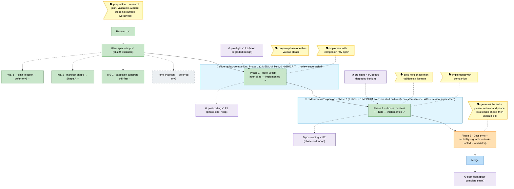

# Flight Plan — harness-flow-hooks

**Mode**: Full · **now**: Phase 3 tasks **tabled** (CS-2, lean) + **validated** — 6 tasks (T000 pre-flight seam · T001 `getting-started.md` sync `--hook` primary/`--event` alias, sites L45 + L248–254 · T002 governance-doc injection-map verify-or-edit · T003 neutrality grep · T004 closing guards: line guard **explicit ≤ 478** + `validate-harness-flow` replay + `harness doctor` · T0Z post-coding seam). validate-v2 narrow (3 agents) = **VALIDATED WITH FIXES**: 2 MEDIUM fixed inline (T004 baseline made explicit ≤ 478; T002 "inject handshake" defined) + L45/L248–254 wording tightened · **next**: **implement** Phase 3 (final) — optional `--companion` live reviewer (as P1/P2), then merge

_Legend: 🟩 done · 🟧 in-progress · 🟥 blocked · 🟦 known (designed future) · ⬜ assumed (speculative) · 🗣 user input · 🟪 harness loop (↺) · 🤝 companion (reviews live)._
