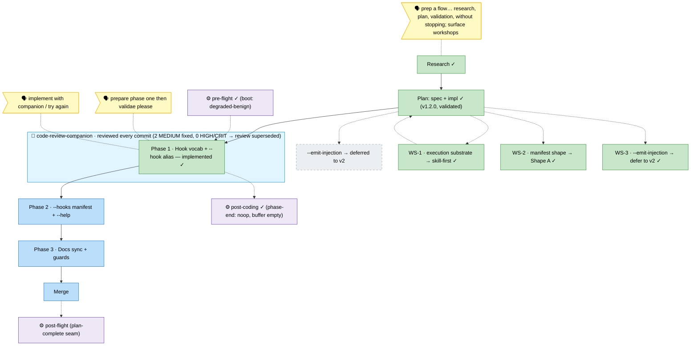

# Flight Plan — harness-flow-hooks

**Mode**: Full · **now**: Phase 1 implemented (5 tasks + 2 seams) with live companion review — 2 MEDIUM drift fixed (F001 `f115f15`, F002 dossier superseded), 0 HIGH/CRIT; review superseded. SKILL.md 347→387 · **next**: Phase 2 tasks (`--hooks` manifest + `--help`) — or `/compact` then tasks

_Legend: 🟩 done · 🟧 in-progress · 🟥 blocked · 🟦 known (designed future) · ⬜ assumed (speculative) · 🗣 user input · 🟪 harness loop (↺) · 🤝 companion (reviews live)._
