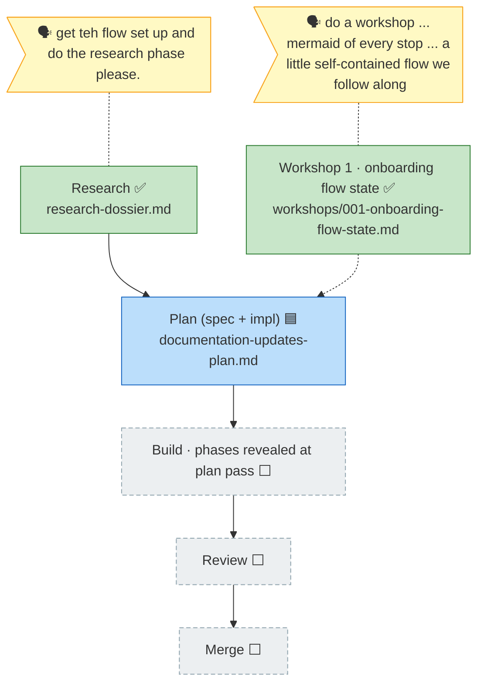

<!-- GENERATED FROM the-flow.json — do not hand-edit; regenerate from the JSON. -->
# Flight plan · 023-documentation-updates

**Mode**: unknown (set at the `plan` pass) · **Cursor**: research (done) · **Next**: plan

**Legend**: 🟩 done · 🟧 in-progress · 🟥 blocked · 🟦 known (designed) · ⬜ assumed (speculative) · 🗣 user input · 🟪 harness loop (none emitted yet — appears at the plan pass / phase edges).
