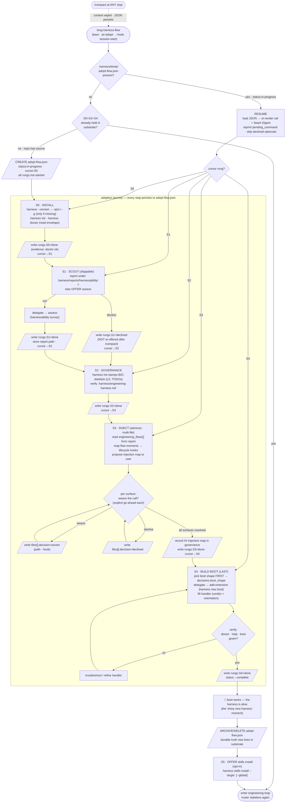

# Workshop 001 — Onboarding flow state: durable JSON thread vs. markdown-substrate presence-checks

**Plan**: 023-documentation-updates
**Type**: State Machine / CLI Flow
**Generated**: 2026-06-18
**Status**: Decision reached (recommendation below) — heading toward Contract (JSON schema sketched, not yet finalised)
**Proof level**: Decision → Contract
**Value axes**: Agent Readiness · Implementation Readiness · Onboarding / Accessibility · Safety to Change · Knowability

> A working reference for *how onboarding remembers where it is*. Keep it open while
> implementing the adopt UX. The question it settles: should the onboarding journey
> carry a small **durable JSON state** (in a temp location) the agent can follow
> across `/compact` — like `the-flow` — instead of re-deriving position from
> markdown/substrate presence-checks every call?

---

## 1. The concern, stated precisely

`eng-harness-flow` is **stateless by design**: it stores nothing and **re-derives** position every call from substrate signals (`harness doctor`, the governance doc, a harnessability report, plan-dir artifacts, the retro buffer). For the **engineering loop** (Boot → Backpressure → Observe → Retro → Improve) this is correct — the loop is *cyclic* and its position genuinely *is* observable in substrate.

But **adoption is different**. It is a **finite, linear, multi-step journey with transient decisions** — and those decisions are *not yet in substrate*, because the substrate they would write to is the very thing adoption is building. Today the adopt verb re-derives its position from **presence-checks on markdown/substrate**:

| Rung | Re-derived from (today) |
|---|---|
| S0 · Install | `harness --version` resolves; `harness doctor` envelope |
| S1 · Scout | a file exists under `.harness/reports/harnessability/` |
| S2 · Governance | `.harness/engineering-harness.md` exists |
| S3 · Inject | the governance doc has a `## Injection map` section |
| S4 · Boot | a boot extension exists and boots clean |

The user's worry: **presence-checks lose the transient state that lives *between* the rungs.** A cold agent after `/compact` cannot recover:

1. **Declined optionals.** The router's own `00-routing.md` admits this (limit #1): "a declined scout/backpressure offer comes back next call." After compaction the user is re-asked to scout even though they already said no.
2. **Mid-step progress.** S3 (inject) weaves calls into multiple files, each needing its own go-ahead. After compaction: which files were woven? which declined? which still pending? Presence-checks can't tell — the `## Injection map` is written *once at the end*, so a half-done weave looks like "not started."
3. **Decisions made but not yet materialised.** In S4 we *agree on a boot shape* before building it. Compact between the decision and `harness new` and the decision is gone — re-litigated from scratch.
4. **The narration thread.** What was just explained, what the user is mid-conversation about — all lost.

`the-flow` solves exactly this with `.the-flow-state.json` (+ the `the-flow.json` flight plan): durable, survives compaction, and re-invoking `/the-flow` reloads it and resumes at the cursor. The user wants the **same self-contained pattern for onboarding** — "a little flow is set up and then we follow it along."

**The user is right**, and — importantly — the fix does **not** break the stateless thesis. The router stays stateless; the *adopt verb* (a child skill) owns a small, ephemeral, self-cleaning flow file. See §4.

---

## 2. Why this isn't a contradiction of "stateless by design"

The router's own unifying rule already contains the escape hatch (`SKILL.md`, verbatim):

> *"State that must persist lives in deterministic substrate a child skill owns — never in this router. The moment the router would need to remember something across calls, that something belongs in substrate a child skill owns — not here."*

Adoption needs to remember transient decisions across calls. Therefore that memory **belongs in substrate the adopt verb owns** — not in the router. The adopt verb is a child; `.harness/temp/adopt-flow.json` is substrate it owns (the same way the `retro` verb owns the observe buffer under `.harness/temp/`). The router merely *reads* the file as one more detection signal and stays a pure dispatcher.

So the distinction that resolves the tension:

| | Owner | Lifetime | Committed? |
|---|---|---|---|
| Engineering-loop position | re-derived by the router | none (stateless) | — |
| **Onboarding journey state** | **the `adopt` verb** | **ephemeral — created at S0, deleted at completion** | **no (`.harness/temp/`, gitignored)** |
| Durable harness truth | the CLI / governance doc | permanent | yes (`.harness/`) |

The onboarding state is **journey scaffolding, not a contract.** It exists only while adoption is in flight, and self-deletes the moment the durable substrate (governance doc + working boot) can answer "are we adopted?" on its own. The router is stateless before adoption and stateless after — the temp file is a bridge across the one stretch where substrate can't yet speak.

---

## 3. Detailed mermaid — every stop the onboarding process makes

Each stop **reads and writes** `.harness/temp/adopt-flow.json`. `/compact` at any stop wipes conversation context but leaves the JSON; re-invoking `/eng-harness-flow` resumes at `cursor`.



### Companion: state-transition table

| Stop | Reads from JSON | Writes to JSON | Resume-after-compact behaviour |
|---|---|---|---|
| **Detect** | whole file | — | file present + `in-progress` → resume; absent + gate fails → create |
| **S0 Install** | `cursor` | `rungs.S0`, `cursor` | re-checks `harness --version`; skips reinstall if present |
| **S1 Scout** | `rungs.S1` | `rungs.S1` (`done`/`declined`), report path | **declined ⇒ never re-offered** (fixes limit #1) |
| **S2 Governance** | `cursor` | `rungs.S2`, `cursor` | idempotent — `harness init` never clobbers |
| **S3 Inject** | `S3.files[]` | per-file `decision`, then `rungs.S3` | resumes the weave at the first `pending` file |
| **S4 Boot** | `decisions.boot_shape` | `decisions.boot_shape`, `rungs.S4`, `status` | the agreed shape survives compaction; build resumes |
| **Done/Archive** | `status` | deletes the file | once gone, router is stateless again |

---

## 4. The state file — shape sketch (Contract-level, draft)

Location: **`.harness/temp/adopt-flow.json`** — the gitignored agent-scratch tree the CLI already self-heals and `harness doctor` already checks. (The observe buffer lives here too, so this is a known-good home for ephemeral, machine-local, child-owned state.) Never committed; machine-local; one per repo-per-machine.

```jsonc
{
  "schema_version": 1,
  "kind": "adopt-flow",
  "repo": "/abs/path/to/repo",
  "created": "2026-06-18T09:00:00Z",
  "updated": "2026-06-18T09:14:00Z",
  "status": "in-progress",            // in-progress | complete | declined
  "cursor": "S3-inject",              // the rung we are AT
  "rungs": {
    "S0-install":    { "status": "done",       "evidence": "harness doctor: ok", "at": "…" },
    "S1-scout":      { "status": "declined",   "note": "user declined the survey", "at": "…" },
    "S2-governance": { "status": "done",       "at": "…" },
    "S3-inject": {
      "status": "in-progress",
      "files": [
        { "path": "AGENTS.md",               "decision": "woven",    "hook": "session-start" },
        { "path": ".github/workflows/ci.yml","decision": "declined" },
        { "path": "CONTRIBUTING.md",         "decision": "pending" }
      ]
    },
    "S4-boot":       { "status": "not-started" }
  },
  "decisions": {
    "boot_shape": null,               // e.g. "build+test" | "compose-up+health" | "dev-server+smoke"
    "skills_install_targets": []      // S5 opt-in answers
  },
  "pending_command": "/eng-harness-flow (resume S3 inject — 1 file pending)",
  "narration_thread": "Installed CLI, doctor green. Scout declined. Governance stamped. Mid-inject: AGENTS.md woven, CI declined, CONTRIBUTING pending."
}
```

**Field intent** (the parts presence-checks can't carry):
- `rungs.*.status` includes **`declined`** — the value markdown-substrate has no way to express.
- `S3.files[].decision` — **per-file weave progress**, the gap in #2.
- `decisions.boot_shape` — **a decision made before it is materialised**, the gap in #3.
- `narration_thread` / `pending_command` — lets resume re-render the **coach digest** verbatim, the gap in #4.

**Who writes**: the `adopt` verb only. **Who reads**: the `adopt` verb (to resume) and the router (one extra detection signal — "is an adoption in flight?"). The router never writes it.

**Lifecycle**: created at first S0 entry → updated at every stop → **deleted (or renamed `adopt-flow.done.json`) when `status:complete`**. After deletion the durable truth (governance doc + working boot) answers "adopted?" on its own, and the router returns to pure re-derivation. *This self-cleaning is what keeps the statelessness thesis intact.*

---

## 5. Resume-across-compaction (the the-flow parity we're buying)

```
adopt (mid-S3): "AGENTS.md woven ✓, CI declined ✓ — CONTRIBUTING.md next. /compact is fine here."
        ▼
USER types:  /compact          ← wipes conversation context; adopt-flow.json untouched
        ▼
USER types:  /eng-harness-flow  ← no memory of the session
        ▼
router:  reads .harness/temp/adopt-flow.json (status:in-progress, cursor:S3-inject)
         → re-renders the 🧰 rail + Seam Digest from the file
         → S1 shows "scout: declined" (NOT re-offered)
         → resumes the weave at the first pending file (CONTRIBUTING.md)
        ▼
USER continues exactly where they left off.
```

This is the direct analogue of `the-flow`'s `/compact` resume handshake — **self-contained inside onboarding**, exactly as asked.

---

## 6. How it composes with the coach (this session's other thread)

The coach already renders the 🧰 adoption rail and (once ported) the **Seam Digest** from the `--json` envelope's `rail`/`now`/`next`/`flags`/`insight` fields. With the state file present, those fields become a **pure read of `adopt-flow.json`** rather than a re-inference:

- `rail.cursor` ← `adopt-flow.json.cursor`; `adopt_pips` ← the `rungs.*.status` vector (`done`→◆, cursor→◐, else ◇; `declined` renders ◆ with a muted note).
- The Seam Digest's **Just did / Next up / Watch-outs** lift straight from `rungs[]`, `pending_command`, and `flags`.
- **Mirror-as-todos** maps 1:1 onto the five rungs — the agent's native checklist *is* the `rungs` object.

So the JSON state and the coach port are complementary: the state makes the rail/digest **survive compaction**; the coach makes them **pleasant**.

---

## 7. Options considered

| Option | What | Verdict |
|---|---|---|
| **A — Status quo** (markdown/substrate presence-checks, stateless adopt) | Re-derive rungs from file existence every call | ❌ Loses declined-optionals, mid-weave progress, pre-materialised decisions, narration. The user's documented pain. |
| **B — Ephemeral child-owned JSON in `.harness/temp/`** ✅ **recommended** | `adopt` verb owns `adopt-flow.json`; created at S0, self-deletes at completion; router reads it as a signal | ✅ Buys the-flow-grade resume **without** making the router stateful. Consistent with the router's own escape-hatch rule and the existing `.harness/temp/` convention. |
| **C — Full the-flow-style durable state machine** (committed `.json` + flight plan) | A permanent, committed onboarding journey file | ❌ Over-built. Committing journey state makes the router depend on a parallel state file that can drift from substrate — the exact failure the stateless thesis avoids. Onboarding is one-shot per machine; no need to commit. |

---

## 8. Decision

**Adopt Option B.** During onboarding, the `adopt` verb stands up a small, self-contained, ephemeral flow at **`.harness/temp/adopt-flow.json`** and follows it along — created at S0, updated at every stop, deleted at completion. The router stays stateless and simply gains one detection signal ("is an adoption in flight?"). This delivers the user's requirement (a self-contained onboarding flow that survives `/compact`, like the-flow) while preserving the architecture's core invariant.

**Rationale**:
1. It is the architecture's *own* prescribed move (state that must persist → substrate a child owns).
2. It reuses an existing, gitignored, CLI-managed home (`.harness/temp/`).
3. It is self-cleaning, so it never becomes durable state the router leans on.
4. It directly closes the four documented gaps and reaches the-flow resume parity.

---

## 9. Rejected alternatives & why

- **Put it in the governance doc.** No — governance is a committed *contract*; transient journey state is neither committed nor a contract. Mixing them would leave half-finished journeys in version control.
- **Make the router itself stateful.** No — violates the load-bearing thesis; the router must stay a pure dispatcher.
- **Encode declines as marker files** (e.g. `.harness/temp/scout.declined`). Works for #1 but not #2/#3/#4, and proliferates marker files. One JSON is cleaner and carries the narration thread.

---

## 10. Open questions

1. **Schema ownership** — does the CLI ship/validate the `adopt-flow.json` schema (like the retro/harnessability schemas), or does the verb own it loosely? Leaning: a lightweight CLI-shipped schema for forward-compat, mirroring the retro schema pattern.
2. **Concurrency** — two agents adopting the same repo on one machine. Last-writer-wins is probably fine for a one-shot journey; confirm.
3. **Staleness** — an `adopt-flow.json` left behind by an abandoned attempt weeks ago. Add a `created`-age check on resume ("this adoption started 12 days ago — resume or restart?").
4. **Archive vs delete** — keep `adopt-flow.done.json` as a breadcrumb of how the repo was adopted, or delete outright? Archive is cheap and aids debugging; lean archive.
5. **Does S5 (skills install) belong inside the flow file** or after archive? Currently drawn after archive; revisit if we want its answers to survive compaction too.

---

## 11. Consequences — what this changes

- **`adopt` verb** (`skills/eng-harness-flow/references/stages/adopt.md`): gains the create/update/resume/archive lifecycle for `adopt-flow.json`. Still "no committed artifacts of its own" — temp scratch is not a committed artifact.
- **Router `00-routing.md`**: adds one detection signal ("adoption-in-flight: `.harness/temp/adopt-flow.json` with `status:in-progress`"), routed *before* the substrate gate (resume beats re-derive).
- **`coach.md`**: rail + Seam Digest read from the file when present (no envelope change — the fields already exist).
- **CLI**: optionally ships an `adopt-flow.schema.json` and ensures `.harness/temp/` gitignore covers it (already does).
- **No change** to the loop's statelessness, the governance contract, or the byte-stable `--hook`/`--event`/`--hooks`/`--json` public surface.

---

## 12. Evidence ledger

| Claim | Evidence |
|---|---|
| Router is stateless and re-derives each call | `skills/eng-harness-flow/SKILL.md` "Stateless by design"; `references/coach.md` §1 "recomputed from substrate every call" |
| Declined optionals re-offer after compaction | `references/00-routing.md` "Where statelessness has limits" #1 |
| The escape-hatch rule (persist → child substrate) | `SKILL.md` "The unifying rule" |
| `.harness/temp/` is gitignored, CLI-managed scratch | `references/stages/adopt.md` Step 1.3; `references/stages/retro.md` (observe buffer location) |
| the-flow's resume handshake reads `.the-flow-state.json` | `the-flow/references/coach.md` "The `/compact` resume handshake" |
| Coach already renders rail/digest from envelope fields | `00-routing.md` `--json` envelope (`rail`/`now`/`next`/`flags`/`insight`); `coach.md` §1–§3 |

---

## Workshop success summary

- **Type**: State Machine / CLI Flow
- **Proof level reached**: Decision (markdown-vs-JSON settled → Option B) + draft Contract (schema sketched)
- **Value axes**: Agent Readiness · Implementation Readiness · Onboarding/Accessibility · Safety to Change · Knowability
- **Key questions answered**: Does onboarding need durable JSON state? (yes, ephemeral) · Where does it live? (`.harness/temp/adopt-flow.json`) · Does it break statelessness? (no — child-owned + self-cleaning) · Every onboarding stop + its state I/O (mermaid §3, table §3)
- **Open**: schema ownership, concurrency, staleness expiry, archive-vs-delete, S5 placement (§10)
- **Related**: this session's coach-port thread (Seam Digest + mirror-as-todos) and the CLI cold-start breadcrumb gap — both belong to plan 023.
