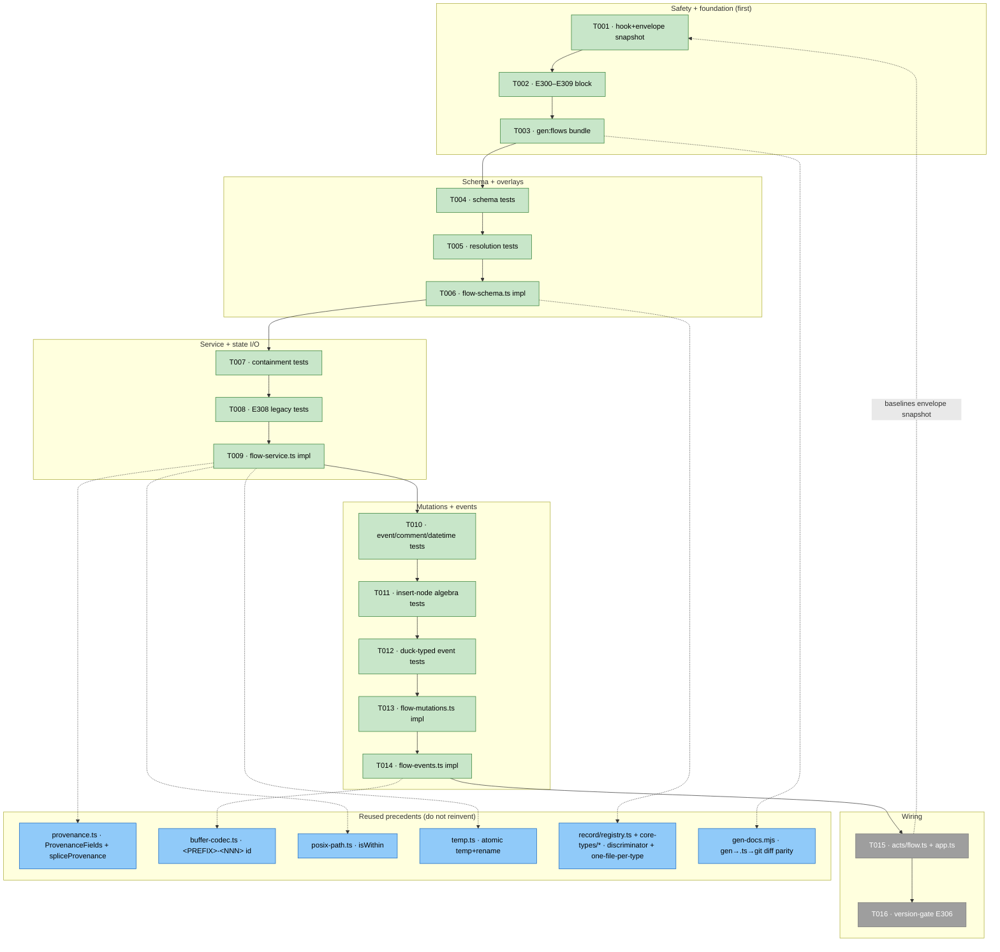
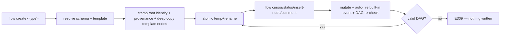

# Phase 1 — Flow engine: schema, state, mutations, event log

**Plan**: [first-class-flow-system-plan.md](../../first-class-flow-system-plan.md) · **Mode**: Full · **CS-4**
**Phase**: 1 of 3 · **Domain**: harness-cli·flow · **Depends on**: None
**Generated**: 2026-06-18 · **Status**: Ready for GO

> Tasks dossier is **output** — the 7-column table is the contract. Notes terse; the table + maps carry the detail. (Elegance: `00-routing.md` § Shared conventions.)

---

## Executive Briefing

- **Purpose**: Stand up the `harness flow` verb family as the **single deterministic owner of flow mechanics** — schema (shared-core + per-flow overlay), atomic state I/O, fine-grained mutations (incl. `insert-node` edge-splice), an embedded event log + per-node comments + datetime, the bundled harness-loop overlay, a frozen contract-snapshot safety sensor, and the `E308` clean-break path. **Renderer is Phase 2** — not here.
- **What We're Building**: A new `harness/cli/src/services/flow/*` module + `acts/flow.ts` (the first *nested* subcommand group), a `gen:flows` build step that inlines harness-owned schemas into a committed `.ts` (mirroring `gen:docs`), and an additive `E300–E309` error block. All TDD — failing tests first, real fixtures + Fake ports, no mocking libraries.
- **Goals**:
  - ✅ `flow create/new/show/list/cursor/status/add-node/set-node/insert-node/comment/event` returning the standard `Envelope` with correct exit codes + `E3xx`.
  - ✅ Shared-core schema validates **two distinct overlays** (harness-loop + a fixture overlay) via `kind` discriminator + `oneOf`; status vocabulary is **overlay-declared**; the optional `authority` field + the `decision` node type exist (forward-compat + workshop 003).
  - ✅ Built-in events auto-fire on mutation; duck-typed custom events; `created_at`/`modified_at`/`ran_at` + `comments[]{at}`; provenance stamped once (record 7-key reuse); event ids `<PREFIX>-<NNN>` (observe reuse).
  - ✅ `insert-node` splices `next[]` deterministically (`--after`/`--before`/`--branch-of`), **DAG-re-checked before the atomic write** → `E309` on cycle/orphan; per-edge `node-updated{edge_op}` audit (no new event kind).
  - ✅ Harness-owned schemas bundled byte-stably (`gen:flows`), zero runtime fs; `E308` rejects pre-CLI flows on a *positive* legacy signature (a freshly-created empty-log flow must **not** trip it).
- **Non-Goals**:
  - ❌ The renderer (`flow-renderer.ts`, `flow render`, `check:flows`) → **Phase 2**.
  - ❌ `the-flow` migration / capability precheck / deploy → **Phase 3**.
  - ❌ Any harness-loop *driver*, `flow agent`, or routing-Graph logic (schema-only; cut by grill).
  - ❌ Reproducing the old hand-rendered shape (renderer supplants it — Phase 2 concern).

---

## Prior Phase Context

**N/A — Phase 1 is the foundation** (no prior phase). All `services/flow/*` files are greenfield (confirmed: no `services/flow` dir exists).

---

## Pre-Implementation Check

| File | Exists? | Domain Check | Notes |
|------|---------|-------------|-------|
| `harness/cli/src/acts/flow.ts` | **NEW** | acts (thin) ✓ | First *nested* subcommand group; mirror `registerObserveAct` shape (`acts/observe.ts`) |
| `harness/cli/src/services/flow/flow-service.ts` | **NEW** | services (pure) ✓ | create/new/show/list + atomic state I/O + template scaffold |
| `harness/cli/src/services/flow/flow-schema.ts` | **NEW** | services (contract) ✓ | shared-core+overlay types; resolution `--schema › .harness/schemas/flows/ › bundled` |
| `harness/cli/src/services/flow/flow-mutations.ts` | **NEW** | services (pure) ✓ | cursor/status/add/set/**insert-node**/comment + event firing + DAG re-check |
| `harness/cli/src/services/flow/flow-events.ts` | **NEW** | services (pure) ✓ | event log + duck-typing + comments + datetime |
| `harness/cli/src/services/flow/schemas/flow.schema.json` | **NEW** | contract ✓ | shared-core **node field set** (Context Brief) — incl. `decision` type, `user_input`, `comments[]`, datetime trio, optional `authority`, overlay-declared status, **tolerated** `agents[]`/`output`/`error` |
| `harness/cli/src/services/flow/schemas/harness-loop.schema.json` | **NEW** | contract ✓ | bundled overlay #1 |
| `harness/cli/src/services/flow/schemas/*.template.json` | **NEW** | contract ✓ | template skeleton, sibling of each bundled schema (AC-01 / ws-003 T1/T2) — see ⚠️ sharp edge below |
| `harness/cli/src/services/flow/schemas-content.ts` | **NEW (generated)** | contract ✓ | `gen:flows` output; byte-stable; CI-guarded (guard wired Phase 2 task 2.4) |
| `scripts/gen-flows.mjs` | **NEW** | build ✓ | mirrors `scripts/gen-docs.mjs` |
| `harness/cli/src/output/error-codes.ts` | MODIFY | output (cross-domain) ✓ | **additive only** — append `E300–E309`; highest current = `E204`; `E108 INVALID_ARGS` already present (reused for mutual-exclusivity) |
| `harness/cli/src/app.ts` | MODIFY | harness-cli (cross-domain) ✓ | additive — `import { registerFlowAct }`, call in `buildProgram`, reserve `flow` |
| `package.json` (root) | MODIFY | build ✓ | `build` → `gen:docs && gen:flows && tsc`; add `gen:flows` script (`check:flows` is Phase 2) |
| `harness/cli/test/contract/hooks-snapshot.test.ts` | **NEW (+ dir)** | test ✓ | `test/contract/` is a new dir; snapshot must commit + pass on **unmodified main first** |
| `harness/cli/test/services/flow/*`, `test/acts/flow.test.ts` | **NEW** | test ✓ | Fake adapters + real fixtures |
| `harness/cli/test/services/flow/fixtures/*` | **NEW** | test ✓ | 2nd overlay schema; legacy-format flow; fresh-empty flow; multi-predecessor DAG |
| `harness/cli/src/services/flow/flow-renderer.ts` | — | — | **Phase 2 — NOT in this phase** |

⚠️ **Sharp edge (default chosen; confirm at T003/T009 + log a Discovery)**: bundled (harness-owned) types need their `*.template.json` with **zero runtime fs**. **Default: `gen:flows` inlines each type's template alongside its schema** (so `create harness-loop` scaffolds without `--bare`); the `--bare`-only fallback is the escape hatch if inlining proves awkward. `the-flow` supplies its flight-plan create-seed via `--template` in Phase 3 (task 3.3), so this only bites harness-loop.

---

## Architecture Map



---

## Tasks

| Status | ID | Task | Domain | Path(s) | Done When | Notes |
|--------|----|------|--------|---------|-----------|-------|
| [x] | T001 | **Frozen contract-snapshot sensor.** Capture current `--hook/--event/--hooks/--json` output bytes as a committed snapshot, **created + passing on unmodified `main` BEFORE any other task**. Add a *second* snapshot of the new `harness flow` Envelope `data` shapes (`create`/`show`/`event`) — baselined at end of phase (after T015) | harness-cli·flow | `/Users/jordanknight/substrate/harness-engineering/harness/cli/test/contract/hooks-snapshot.test.ts` | Hook snapshot test (`hooks-snapshot.test.ts`) committed + **green (0 failures) on unmodified main before any other task** (blocking gate, re-run in 3.1); checkpoint 2 (flow-Envelope `data` shapes) created + **committed in T015 as the final Phase-1 act** (see T015) | plan 1.1; Finding 01; AC-08; **two-checkpoint gate** — checkpoint 2 deferred to after T015 |
| [x] | T002 | **Allocate the `E3xx` flow error block** (`E300` schema-invalid, `E301` not-found, `E302` write-failed, `E303` path-escape, `E304` type-unknown, `E305` node-not-found **or** illegal-transition *(one code, two related causes — documented)*, `E306` schema-version, `E307` ambiguous-target, `E308` legacy-format, `E309` edge-invalid) | harness-cli·output | `harness/cli/src/output/error-codes.ts` | All 10 codes defined + commented in `ErrorCodes`; `E300–E309` confirmed free (highest existing = `E204`); `E108 INVALID_ARGS` reused (not re-allocated) for insert-node mutual-exclusivity | plan 1.11; AC-07/14/15; **additive only** |
| [x] | T003 | **`gen-flows.mjs` + `schemas-content.ts` bundle** for harness-owned schemas (shared-core + harness-loop). Change root `build` to `gen:docs && gen:flows && tsc`; add `gen:flows` npm script. Land **with/before T006** so the bundled-resolution branch is testable. **Default per the ⚠️ sharp edge: inline each harness-owned type's `<type>.template.json` alongside its schema** (zero runtime fs) | harness-cli·flow | `scripts/gen-flows.mjs`, `harness/cli/src/services/flow/schemas-content.ts`, `package.json` | `gen:flows` inlines harness-owned schemas **+ their templates** into a committed, biome-normalised `.ts`; `build` regenerates before `tsc`; bundle exists before T006's loader test runs; **the inline-vs-`--bare` choice logged to Discoveries** | plan 1.12; AC-11; mirrors `gen-docs.mjs`; `check:flows` CI guard is **Phase 2 task 2.4** |
| [x] | T004 | **TESTS — schema validation.** Shared-core + **two** distinct overlays (harness-loop + a fixture overlay) with `kind` discriminator + `oneOf` node constraints (wrong-flow node rejected). Fixture overlay declares a status absent from harness-loop (e.g. `declined`) **+ a populated `authority` tag** → asserts core accepts overlay-declared statuses + the reserved slot. **`decision` node type validates.** State I/O round-trip + atomic temp+rename | harness-cli·flow | `harness/cli/test/services/flow/flow-schema.test.ts`, `harness/cli/test/services/flow/fixtures/<overlay>.schema.json` | Failing tests define: the **shared-core node field set** (Context Brief) incl. `user_input`/`comments[]`/datetime trio + **tolerated `agents[]`/`output`/`error` round-trip**; distinct-record-types proof; **extensibility proof** (overlay-owned status + `authority`); the `decision` type; the atomic-write contract | plan 1.2; AC-03/10/15; Findings 03/05/02b; ws-003 |
| [x] | T005 | **TESTS — schema resolution precedence.** `--schema <path>` (incl. **absolute out-of-repo**, canonicalized + JSON-only + size-capped) › `.harness/schemas/flows/<type>.schema.json` › bundled built-in (**shared-core + harness-loop only**) › **`E304`** | harness-cli·flow | `harness/cli/test/services/flow/flow-schema.test.ts` | All four resolution branches covered; out-of-repo `--schema` tested via a **temp out-of-repo fixture** (the-flow's real skill-home path is exercised in Phase 3 task 3.2, not here) | plan 1.2b; AC-11/02; ws-001 §D4 *(bundled-list superseded by grill 6/7)* |
| [x] | T006 | **IMPL — shared-core `flow.schema.json` + harness-loop overlay + `flow-schema.ts` loader.** Core defines the full **shared-core node field set** (Context Brief: identity incl. `decision` type, datetime trio, `user_input`, `comments[]`, optional `authority`, tolerated `agents[]`/`output`/`error`) + **overlay-declared status-vocabulary hooks**. Loader resolves per T005 precedence | harness-cli·flow | `harness/cli/src/services/flow/flow-schema.ts`, `harness/cli/src/services/flow/schemas/flow.schema.json`, `harness/cli/src/services/flow/schemas/harness-loop.schema.json` | Loader + schema implemented (hexagonal: pure service, ports-injected); **T004 + T005 pass unmodified**; overlays validate distinct record types; status validated against the *resolved overlay's* declared set, **not** a hard-coded enum | plan 1.5; AC-03/10/11; Finding 02b; mirror `record/registry.ts` + `core-types/*` |
| [x] | T007 | **TESTS — path containment.** A **write path** (`--path`/`--output`) outside the repo root rejected via `isWithin` → `E303` + `next_action`; **`--schema` is NOT subject to `isWithin`** (out-of-repo skill schemas allowed) | harness-cli·flow | `harness/cli/test/services/flow/flow-service.test.ts` | Write-escape paths rejected; in-repo write redirects accepted; out-of-repo `--schema` read accepted | plan 1.2a; AC-07; reuse `posix-path.ts` `isWithin` (:82) |
| [x] | T008 | **TESTS — `E308 FLOW_LEGACY_FORMAT`.** A pre-CLI flow (bare-integer `schema_version` and/or **absent `provenance`**) rejected with an honest *hedging* `next_action`; **a freshly-`create`d flow with empty `events[]` must NOT trip `E308`**; no tolerant-load; intra-format log tolerance preserved | harness-cli·flow | `harness/cli/test/services/flow/flow-service.test.ts`, `harness/cli/test/services/flow/fixtures/legacy-flow.json`, `.../fresh-empty-flow.json` | Legacy fixture → `E308`; fresh-empty fixture → ok | plan 1.2c; AC-14; grill 3/8 — detector keys on a **positive** legacy signature, never on empty `events[]` |
| [x] | T009 | **IMPL — `flow-service.ts`** (create/new/show/list) + atomic state I/O (temp+rename). `create` resolves the type's template (sibling of the schema, `--template` override), **deep-copies template nodes verbatim + stamps root identity** (`schema_version`/`kind`/`slug`/`cursor`/`created_at`/`provenance` incl. `branch`=`created_from_branch`); **`--bare`** = root-only. `new` scaffolds a schema template into `.harness/schemas/flows/` (name-validated, `--force`). `show`/`list` are read-only | harness-cli·flow | `harness/cli/src/services/flow/flow-service.ts` | T007 + T008 pass; `create` **deep-copies the resolved template's `nodes[]` verbatim** (preserve `next[]`/`branch_of`/all fields) + stamps root identity (or `--bare` = root-only); a missing/invalid `--template` → `E300`; `new` scaffolds; `show`/`list` round-trip read + discovery | plan 1.6; AC-01/02/07; ws-003 T1/T2; reuse `provenance.ts` (`ProvenanceFields`, `spliceProvenance`) + `temp.ts` (atomic) + `posix-path.ts` |
| [x] | T010 | **TESTS — mutations fire built-in events; comment + datetime + provenance.** Mutations fire built-in events; `comment` appends a timestamped `{at,text,source?,kind?,refs?}` entry; datetime trio stamped via `Clock` (`created_at` at create, `modified_at` every mutation, **`ran_at` on `in_progress→done`/`blocked`**); provenance stamped **once** at the root | harness-cli·flow | `harness/cli/test/services/flow/flow-mutations.test.ts` | `events[]`/`comments[]` populated; datetime trio asserted; provenance = record 7-key block (`branch`=`created_from_branch`) | plan 1.3; AC-04/05; ws-002 §E2/E5; reuse `FakeClock` |
| [x] | T011 | **TESTS — `insert-node` edge algebra.** `--after X` (out-edges move to N: `N.next = old X.next`, `X.next=[N]`); `--before X` (in-edges move to N incl. **multi-predecessor** reverse-scan, `N.next=[X]`); `--branch-of X` (excursion: `N.branch_of=X`, `N.next=[X]` or `--rejoin`, **`X.next` unchanged**); **post-splice DAG re-check rejects a cycle/orphan with `E309`, nothing written**; mutually-exclusive placement flags → `E108`; missing target → `E305`; fires `node-created` + **one `node-updated{edge_op}` per rewired edge** | harness-cli·flow | `harness/cli/test/services/flow/flow-mutations.test.ts`, `harness/cli/test/services/flow/fixtures/multi-predecessor.json` | Each mode's `next[]` rewiring asserted incl. multi-edge; cycle rejected **pre-write** (file unchanged); audit events carry `edge_op` (`splice-after\|splice-before`) | plan 1.3a; AC-15; ws-003 I2–I4; **no new event kind** (reuses ws-002 `node-updated`) |
| [x] | T012 | **TESTS — duck-typed `flow event`.** `type` auto-selected by value shape (`boolean`→bool; ISO-8601-UTC→date; `^-?(0\|[1-9]\d*)$`→int; fractional→float; **leading-zero→string**; else string; `--type` overrides) and **stored explicitly**; event id `<PREFIX>-<NNN>` via observe's id helper | harness-cli·flow | `harness/cli/test/services/flow/flow-events.test.ts` | Each branch covered; `type` + id persisted | plan 1.4; AC-05; ws-002 §E3/E6; reuse `buffer-codec.ts` `<PREFIX>-<NNN>` (:42) |
| [x] | T013 | **IMPL — `flow-mutations.ts`** (cursor/status/add-node/set-node/comment **+ `insert-node`**) + built-in event firing. Implements the 3-mode edge algebra + **pre-write DAG re-check (`E309`)**; `cursor --recommend` sets `recommended_next` **without** moving the cursor; `node-updated` fires on `set-node`/`comment`/`insert-node` (insert carries `edge_op`); `modified_at`/`ran_at` set | harness-cli·flow | `harness/cli/src/services/flow/flow-mutations.ts` | T010 + T011 pass; events auto-logged; insert-node splices + DAG-re-checks; `--recommend` does not move cursor | plan 1.7; AC-04/05/15; ws-002 §E2; ws-003 I2–I4 |
| [x] | T014 | **IMPL — `flow-events.ts`** (event log + duck-typed custom events + comments + duration-source timestamps) | harness-cli·flow | `harness/cli/src/services/flow/flow-events.ts` | T012 pass; durations **derivable at read time** (not stored); ids via observe helper; provenance once | plan 1.8; AC-05; ws-002 §E4 |
| [ ] | T015 | **WIRE — `acts/flow.ts`** (subcommand dispatcher, Envelope, `E3xx`, exit 0/1/2) + register `registerFlowAct` in `app.ts` + reserve `flow` as a core command. **Then baseline T001 checkpoint 2** (flow-Envelope `data` shapes for `create`/`show`/`event`) | harness-cli·flow | `harness/cli/src/acts/flow.ts`, `harness/cli/src/app.ts` | `harness flow …` returns correct Envelope + exit codes; `flow` reserved; **flow-Envelope snapshot (`create`/`show`/`event`) created + committed here as the final Phase-1 act — frozen before Phase 2 opens** (→ T001 checkpoint 2, re-run 3.1) | plan 1.9; AC-07/08; ws-001 §D1; mirror `registerObserveAct` + `formatOk/Error/Unconfigured` + `exitWithEnvelope` |
| [ ] | T016 | **IMPL — version-gated schema validation.** `schema_version` unknown-major → **`E306`**; ships gated (Open Question resolved) | harness-cli·flow | `harness/cli/src/services/flow/flow-schema.ts` | Unknown major rejected with `E306`; known majors validate | plan 1.10; AC-07; Open Question → resolved |

**Legend**: `[ ]` pending · `[~]` in progress · `[x]` complete · `[!]` blocked.
**TDD ordering invariant**: each test task (T004/T005/T007/T008/T010/T011/T012) lands *before* its impl pair (T006/T009/T013/T014) and is red→green. **T001 is the hard first task** (snapshot on unmodified main); **T003 must precede T006** (bundle before loader test).

---

## Context Brief

### Key findings from plan (action required)
- **Finding 01 (Critical)** — hook-contract blast radius → **T001 first, on unmodified main**; re-run in Phase 3 (3.1). Migration stays additive/reversible.
- **Finding 02 (High)** — clean break → `E308` keyed on a *positive* legacy signature (T008), never on empty `events[]`.
- **Finding 02b (High, forward-compat)** — overlay-declared status vocabulary **+** reserved optional `authority` field; proven by the T004 fixture overlay (`declined` + populated `authority`). This is the extension room for the staged adopt plan — **no adopt features ship**.
- **Finding 03 (High)** — two surfaces (`events[]` + `comments[]`), datetime queryable, durations derived at read time (T010/T012/T014).
- **Finding 04 (High)** — CLI patterns ready → **reuse, don't reinvent** (precedents below).
- **Finding 05 (High)** — schema split: bundle shared-core + harness-loop only (T003); the-flow supplies flight-plan via `--schema` (Phase 3).

### Shared-core node field set (the contract T006 implements, T004 asserts, Phase 2 renders, Phase 3 freezes)
Overlays add/constrain, never remove. **These names are the Phase 2 / Phase 3 consumer contract** — frozen by T001 checkpoint 2.
- **Identity**: `id`, `type` (enum **incl. `decision`**), `label`, `status` (**overlay-declared** vocabulary), `next[]`, `branch_of?`.
- **Datetime**: `created_at`, `modified_at`, `ran_at?` — queryable; durations derived at read time, never stored.
- **Narrative**: `user_input?` (the genesis directive → Phase 2's one 🗣 bubble); `comments[]` each `{at, text, source?, kind?, refs?}` (→ Phase 2's `💬N` badge + markdown body-log).
- **Forward-compat**: optional `authority` (`cursor|substrate`, default `cursor`, unused in v1 — the adopt-plan hook).
- **Tolerated pass-through** (preserved on round-trip, **not** v1-written, renderer-tolerant): `agents[]` (companion/worker bookkeeping; `flow agent` is v2), `output?`/`error?` (artifact refs seen in real flows incl. 024's own `the-flow.json`).
- **Root**: `schema_version`, `kind`, `slug`, `cursor`, `recommended_next?`, `created_at`, `provenance` (once), `events[]`, `nodes[]`.

### Reused precedents (confirmed in-tree — do not reinvent)
- `services/record/provenance.ts`: `ProvenanceFields` (`record_kind, harness_version, branch, repo, created_at, agent, plan_id`) + `spliceProvenance(template, fields)`; `branch: string|null` ← `created_from_branch`. **(T009/T010)**
- `services/observe/buffer-codec.ts`: the `<PREFIX>-<3+ digits>` id format + (de)serialize helpers → event ids. **(T012/T014)**
- `services/shared/posix-path.ts`: `isWithin(dir, candidate)` (:82) → write containment + `E303`. **(T007/T009)**
- `services/shared/temp.ts`: `ensureTemp()` + temp-dir mechanics → atomic temp+rename via FsPort. **(T009)**
- `services/record/registry.ts` + `services/record/core-types/{harness-bypass,harness-change,retro}.ts`: the `kind` discriminator, core∪extension merge, `recordTypeShapeIssues`, "one file per type" → model for overlay resolution + bundled schemas. **(T006)**
- `acts/observe.ts`: act shape — `registerObserveAct(program, io, deps)`, `formatOk/formatError/formatUnconfigured` (`output/envelope.ts`), `exitWithEnvelope`, commander `.action()`. **(T015)**
- `app.ts`: each act imported + registered in `buildProgram`; `flow` registers identically + is reserved. **(T015)**
- `scripts/gen-docs.mjs` + `package.json` (`check:docs = gen:docs && git diff --exit-code …docs-content.ts`): the gen→`.ts`→git-diff parity precedent → `gen:flows`/`schemas-content.ts` (guard in Phase 2). **(T003)**

### Domain constraints (hexagonal — `docs/project-rules/architecture.md`)
- **acts thin, services pure, ports injected.** `acts/flow.ts` only wires Commander → service; all logic in `services/flow/*`; I/O via `FsPort`/`Clock`/`GitPort`/`EnvPort` (Fake adapters in tests). `arch-check` enforces in CI.
- **No `docs/domains/` registry** — boundaries are the architecture layers; `domain.md` scaffolding is N/A.
- **`flow` is a core reserved command** (workshop 001) — first nested subcommand group; other acts stay flat.
- **Envelope discipline**: every verb returns `ok`/`error`/`unconfigured` → exit 0/1/2 with an `E3xx` + `next_action`.

### Reusable from prior phases
- None (Phase 1). Downstream: Phase 2 consumes the stable data model + `gen:flows` bundle; Phase 3 consumes the frozen flow-Envelope shapes (T001 checkpoint 2).

### System flow (create → mutate → event)


### Actor interactions (insert-node splice)
```mermaid
sequenceDiagram
    actor Agent
    Agent->>flow act: insert-node --id N --after X
    flow act->>flow-mutations: splice(after, X, N)
    flow-mutations->>flow-mutations: N.next = old X.next; X.next = [N]
    flow-mutations->>flow-mutations: DAG re-check (cycle/orphan?)
    alt valid
        flow-mutations->>flow-events: fire node-created + node-updated{edge_op}
        flow-mutations->>flow-service: atomic write
        flow-service-->>Agent: ok Envelope (path)
    else cycle/orphan
        flow-mutations-->>Agent: error Envelope E309 (nothing written)
    end
```

---

## Discoveries & Learnings

_Populated during implementation by the implement verb._

| Date | Task | Type | Discovery | Resolution | References |
|------|------|------|-----------|------------|------------|
| 2026-06-18 | T001 | insight | `--hook/--hooks/--json` is **skill-owned** (`skills/eng-harness-flow/`), not a CLI command — there is no executable emitting it (plan 021 WS-1: routing is irreducibly skill). | Snapshot freezes the skill-doc **bytes** of the 3 contract sections via a substring-heading extractor; re-run in 3.1 catches drift. the-flow `harness-seams.md` mirror stays a manual cross-repo check (not vendored). | AC-08; 00-routing.md |
| 2026-06-18 | T003 | decision | Dossier ordering tension: T003 must inline schemas the generator can't bundle until they exist (T006). | T003 stands up the **pipeline + committed empty bundle** (gen-docs pattern: the `.ts` is a regenerated artifact); schemas authored in T006 then re-run `gen:flows`. Preserves test-first for the schema (T004/T005 written before T006). Generator tolerates empty/absent schemas dir + `mkdir -p`s its greenfield output dir. | T003; T006; AC-11 |
| 2026-06-18 | T006 | decision | AC-03 says "kind discriminator + oneOf node constraints" (JSON-Schema vocab), but the repo has **no** JSON-Schema validator dep + deliberately stays dep-light (`recordTypeShapeIssues` precedent). | **Hand-rolled validator over a CLI-OWNED schema descriptor** (shared-core field-shape + per-overlay kind/statuses/nodeTypes), not ajv/full-JSON-Schema. The existing `flight-plan.schema.json` is **REFERENCE-ONLY** (its own `$comment`: "NO runtime validator"); grill 6/7 gave the CLI schema ownership + the-flow conforms via `--schema`. **Phase-3 implication**: the-flow re-ships its flight-plan schema in the CLI descriptor format (already budgeted in 3.2/3.3). | T006; AC-03/11; grill 6/7 |
| 2026-06-18 | T002 | decision | Companion (code-review-companion) MEDIUM contract-drift finding: the `E307` comment overlapped `E108`'s mutual-exclusivity rule. | Fixed (`7533e1a`): `E307` = ambiguous-TARGET (resolves to >1 node); mutually-exclusive placement FLAGS = `E108`; target-matches-nothing = `E305` (AC-15). | T002; AC-15; companion |
| 2026-06-18 | T009 | decision | `FsPort` had no `rename` — atomic temp+rename needs one. | Added `FsPort.rename(from,to)` (additive) + `NodeFs` (`renameSync`) + `FakeFs` (in-memory move + `renames[]` history, throws on missing source like NodeFs). The one write op that THROWS rather than swallowing — a failed rename must not look like a successful write. | T009; AC-07; FsPort |
| 2026-06-18 | T009 | decision | The bundled `harness-loop` had a schema but no create-seed, so `create harness-loop` would need `--bare` (contradicts the ws-003 default "inline templates so it scaffolds"). | Authored `schemas/harness-loop.template.json` (the 5-node Boot→…→Improve loop skeleton) + re-ran `gen:flows` → `BUNDLED_FLOW_TEMPLATES` now carries it. `create` deep-copies template nodes verbatim (`structuredClone`) + stamps root identity; absent template (custom type, no `--bare`) falls back gracefully to root-only. | T009; AC-01; ws-003 T1/T2 |
| 2026-06-18 | T009 | decision | `FlowProvenance` could import `ProvenanceFields` from `services/record/`, but that couples two services. | Defined `FlowProvenance` inline in `flow-events.ts` mirroring the record 7-key SHAPE (Finding 04 reuse intent = the field set + `branch`=created_from_branch, honored) — keeps `flow-events.ts` a clean leaf with zero cross-service imports. | T009; ws-002 §E5; Finding 04 |
| 2026-06-18 | T011 | insight | A FRESH-node `insert-node` (after/before/branch-of) **structurally cannot create a cycle** — all three ops only add edges INTO the new node (after: X→N; before: P→N) or out of it (branch-of: N→X), and N is new, so no back-edge into the existing DAG is formed. | The pre-write DAG re-check (`E309`) is therefore a **defensive safety net** for malformed input (a hand-edited near-cycle the splice completes, or a degenerate `--rejoin <self>` → `N.next=[N]`). Tested both ways: `--rejoin self` (insert-created self-cycle) end-to-end + `dagIssue` unit (pre-cyclic + orphan). It runs BEFORE the write, so a rejected splice writes nothing (verified: input doc unmutated). | T011; AC-15; ws-003 |
| 2026-06-18 | T013 | decision | E305 documents "node-not-found OR illegal-transition", but enforcing a status-transition table would contradict grill (2) "no external enforcement of good usage". | Mutations enforce only node EXISTENCE (→ `E305`); they do NOT hard-block backwards/odd status moves (agent judgment). Status VALUE validity vs the overlay vocabulary is caught by the act's post-mutation `validateFlowDoc`. Mechanical integrity (auto-events/timestamps) enforced; narrative quality is the agent's. Mutations are also PURE (clone-and-return) so a rejected mutation never touches the caller's doc. | T013; grill (2); AC-04 |

**Types**: `gotcha` · `research-needed` · `unexpected-behavior` · `workaround` · `decision` · `debt` · `insight`

---

## Directory layout

```
docs/plans/024-first-class-flow-system/
  ├── first-class-flow-system-plan.md
  └── tasks/phase-1-flow-engine-schema-state-mutations-event-log/
      ├── tasks.md
      └── execution.log.md   # created by the implement verb
```

---

## Validation Record (2026-06-18)

### Validation Thesis

**Raison d'être**: Convert plan 024's Phase 1 into an actionable, TDD-ordered task dossier so an implementation agent builds the `harness flow` engine with minimal re-derivation — reusing existing CLI precedents, without breaking the byte-stable `--hook/--event/--hooks/--json` contract.

**Value claim**: Implementation becomes faster/safer/more repeatable — the implementer codes to concrete done-when + real reuse symbols; the TDD ordering + the "T001 snapshot on unmodified main FIRST" safety constraint are explicit.

**Artifact promise**: every Phase 1 plan task is covered by a T-task with testable done-when; reuse precedents are real; the renderer is correctly deferred to Phase 2; the schema's node field set is the frozen Phase 2 / Phase 3 consumer contract.

**Intended beneficiaries**: implementation agents (primary), reviewers, Phase 2 (render) + Phase 3 (the-flow migration) consumers.

**Proof target**: Implementation. **Evidence standard**: source-code match, per-task done-when, AC linkage, dependency ordering, TDD pairing.

**Thesis source**: plan 024 Phase 1 task table + ACs + Domain Manifest + Key Findings + Validation Records.

**Thesis verdict**: **Advanced** (post-fix) at the Implementation proof target — the done-when sharpenings + the explicit shared-core node field set closed the proof-level gaps the Thesis + FC agents flagged.

**Main thesis risk**: the bundled-template sharp edge — **resolved** with a stated default (`gen:flows` inlines templates; `--bare` fallback) so T006's loader test can't deadlock on an open decision.

---

| Agent | Lenses Covered | Thesis Axes | Issues | Verdict |
|-------|---------------|-------------|--------|---------|
| Source Truth | Evidence Sufficiency, Concept Documentation, Technical Constraints | Implementation Readiness | 0 | ✅ PASS — every symbol/path/line independently re-verified (`E204` highest, `E300–E309` free, `E108` present, all reuse symbols current) |
| Cross-Reference + Completeness | Integration & Ripple, Edge Cases, Hidden Assumptions, Deployment & Ops, Domain Boundaries | Downstream Usefulness, Safety to Change | 1 MINOR fixed | ✅ PASS — 16/16 plan tasks mapped 1:1; AC linkage correct; ordering sound; scope clean |
| Thesis Alignment | Thesis Alignment, Proof-Level Fit | Implementation Readiness, Agent Readiness | 5 MED + 2 LOW → fixed/accepted | ⚠️→✅ — done-when sharpened (T001/T003/T006/T009/T005); LOW evidence-echo items accepted (Source Truth verified the facts) |
| Forward-Compatibility | Forward-Compatibility, System Behavior | Contract Integrity, Cross-Domain Coordination | 2 HIGH + 3 MED → fixed | ⚠️→✅ — node field set now enumerated in T004/T006; checkpoint 2 committed at Phase-1 end (T015) |

### Forward-Compatibility Matrix (post-fix)

| Consumer | Requirement | Failure Mode | Verdict | Evidence |
|----------|-------------|--------------|---------|----------|
| Phase 2 (render + CI + docs) | stable schema carrying `decision`, `user_input`, `comments[]` + tolerated `agents[]`/`output`/`error` to render | shape mismatch · encapsulation lockout | ✅ (post-fix) | T006 now defines the **shared-core node field set** (Context Brief); T004 asserts presence + tolerated round-trip; `gen:flows` bundle (T003) |
| Phase 3 (the-flow migration) | frozen `create`/`show`/`event` Envelope shapes + `--schema` out-of-repo + `insert-node` | contract drift | ✅ (post-fix) | T015 creates **+ commits** checkpoint 2 as the final Phase-1 act (frozen before Phase 2); T005 out-of-repo via fixture; T011/T013 insert-node |
| implement verb (stage 6) | testable done-when + real paths + ordering + discoverable phase-dir | test boundary | ✅ | 16 T-tasks with done-when + abs paths; `tasks/phase-1-flow-engine-…/tasks.md` matches discovery; TDD invariant stated |

**Thesis alignment**: The dossier advances the value claim at the Implementation proof target with Strong evidence (post-fix); the only residual risk — the bundled-template decision — is resolved with a stated default and a Discovery-log requirement.

**Outcome alignment** *(echoed verbatim from the Forward-Compatibility agent)*: "This Phase 1 tasks dossier, **as written, does advance this outcome** — the 16 tasks form a cohesive foundation for deterministic create/mutate/render with a stable data model and bundled schemas. However, **the forward-compatibility handoff to Phase 2 is incomplete**." → **The 5 named FC gaps are now closed by the fixes applied this pass** (node field set enumerated in T004/T006 + Pre-Impl Check; checkpoint 2 committed at Phase-1 end in T015), making the handoff complete.

**Standalone?**: No — downstream consumers exist (Phase 2, Phase 3, the implement verb).

### Fixes applied (this pass)
1. **Shared-core node field set** enumerated as a Context-Brief subsection; T006 (impl) + T004 (test) + Pre-Impl Check now require `user_input`, `comments[]`, datetime trio, `decision` type, optional `authority`, and tolerated `agents[]`/`output`/`error` round-trip (FC HIGH #1/#3/#4/#5).
2. **Checkpoint 2 frozen at Phase-1 end**: T015 now creates + commits the flow-Envelope snapshot as the final Phase-1 act, before Phase 2 opens (FC HIGH #2).
3. **Bundled-template default stated** (`gen:flows` inlines templates; `--bare` fallback) in T003 + the sharp-edge note + log-to-Discoveries (Thesis HIGH #2 / Cross-Ref MINOR).
4. **Done-when sharpened**: T001 (test invocation + commit), T006 (impl-vs-test separated), T009 (deep-copy semantics + invalid `--template`→`E300`), T005 (out-of-repo via fixture, the-flow path deferred to 3.2) (Thesis MED #1/#3/#4/#5).

**Overall: VALIDATED WITH FIXES** — all CRITICAL/HIGH issues fixed; proof level lifted to Implementation; Status **Ready for GO**.
