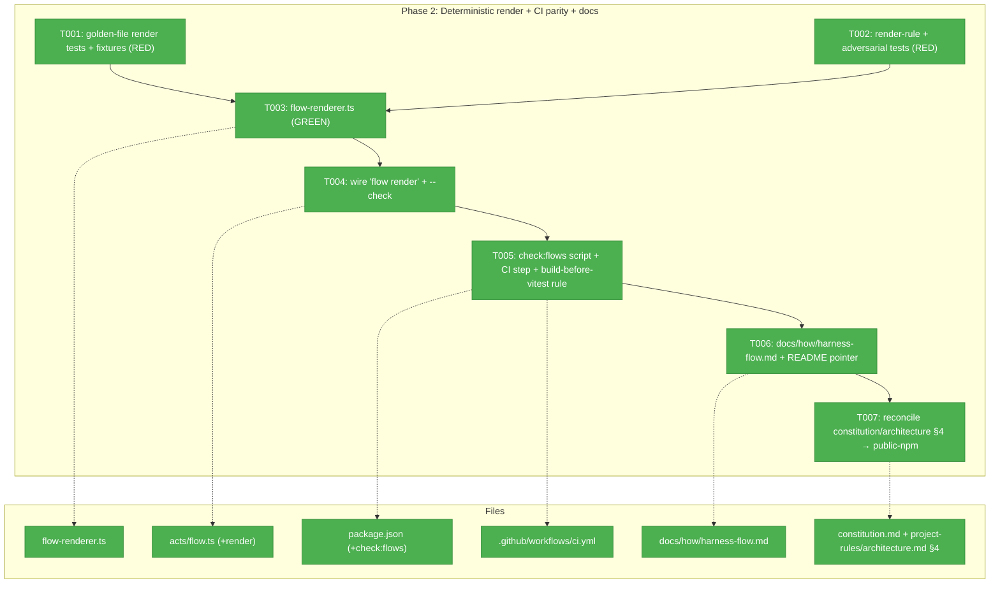
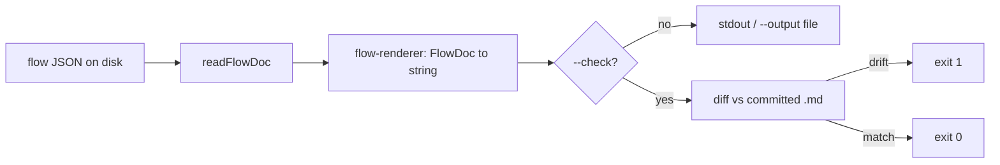
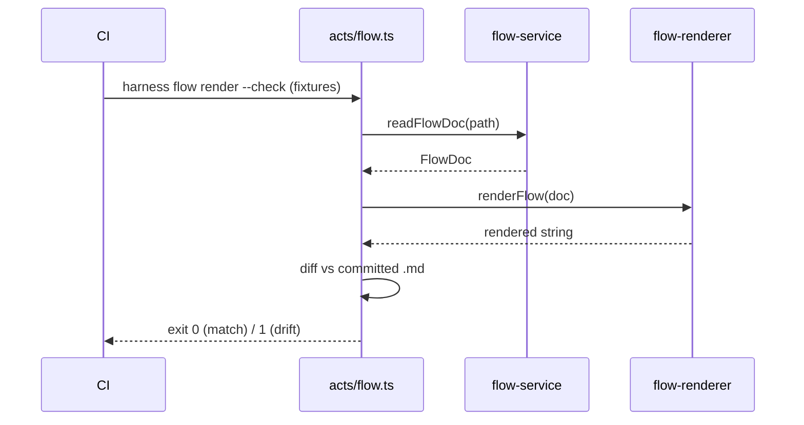

# Phase 2 — Deterministic render + CI parity + docs

> Tasks dossier for **Phase 2** of plan 024 (`first-class-flow-system`).
> Plan: [`first-class-flow-system-plan.md`](../../first-class-flow-system-plan.md) · Phase 1: ✅ 16/16 (719 green, companion-reviewed).
> CS-4 · Domain: `harness-cli·flow` + `docs`. TDD-first, commit-per-task.

---

## Executive Briefing

**Purpose**: Replace the by-hand mermaid flight-plan rendering with a **pure, deterministic `harness flow render`**, guard the committed `.md` as a derived (never hand-edited) artifact via a `check:flows` CI step, and document the now-complete `harness flow` CLI surface. This is the phase that makes "never hand-edit the rendered `.md`" a *machine-enforced* invariant rather than a convention.

**What we're building**:
- `flow-renderer.ts` — a pure service: `FlowDoc → string` (mermaid + markdown), implementing every render rule, tolerating unknown node types, never crashing on adversarial input.
- `harness flow render [--path|--slug] [--output] [--check]` — the act wiring; input resolved via the standard `resolveFlowPath` (same as `show`/`list`; `--input` accepted as an alias for `--path`); `--check` re-renders and exits non-zero on drift.
- `check:flows` npm script + its own CI step (after `check:docs`), plus the documented "**run `npm run build` before `vitest`**" rule.
- `docs/how/harness-flow.md` + README pointer.
- Reconcile the stale **GitHub-Packages → public-npm** contradiction in `constitution.md` §4 and `architecture.md` §4.

**Goals**:
- ✅ `harness flow render` produces **byte-identical** output across runs/OS (golden-file pinned).
- ✅ `--check` detects drift and exits non-zero (the enforcement hook).
- ✅ Every render rule covered: classDefs, spine + phase-node styling, excursions, harness-node conditional, status class, **genesis `user_input` 🗣 bubble (one per node)**, **`comments[]` → `💬N` badge + per-node markdown body-log**, **`decision` node distinct class**, agents subgraph (pre-populated fixture), legend, rail.
- ✅ Unknown node `type` → fallback class (never crash); adversarial text in `text`/`value`/`label`/comment cannot corrupt the rendered `.md` (mermaid-safe escaping).
- ✅ `check:flows` green in CI as a distinct step; no `check:docs` regression.
- ✅ Docs ship; stale npm-distribution contradiction fixed.

**Non-Goals** (❌ explicitly out of this phase):
- ❌ `the-flow` migration onto the CLI (Phase 3).
- ❌ A runtime writer for `agents[]` (Phase 2 only *renders* a pre-populated fixture; no v1 writer — deferred).
- ❌ Parsing the markdown body-log **back** into state — the body-log is **render-only, never a parsed contract** (locked by v1.2.0 validation; AC-06 + workshop 002 § Render surface).
- ❌ Asserting byte-parity with the *old hand-rendered* `the-flow.md` shape — golden fixtures are **fresh CLI artifacts**; we pin self-consistency + drift detection, not backward visual identity.
- ❌ Resolving whether public-npm vs GitHub-Packages is the *right* UX — task 2.6 is a **doc-reconcile to match shipped reality** (019 zero-auth public-npm), not a distribution-policy decision.

---

## Prior Phase Context (Phase 1 — flow engine)

**A. Deliverables** (all under `harness/cli/src/`):
- `services/flow/flow-events.ts` — types (`FlowDoc`, `FlowNode`, `FlowEvent`, `FlowComment`, `FlowProvenance`) + builders (`nextEventId`, `duckTypeValue`, `buildBuiltinEvent/ManualEvent/CustomEvent/Comment`, `prefixFor`).
- `services/flow/flow-service.ts` — `createFlow/newFlowSchema/showFlow/listFlows/readFlowDoc/writeFlowAtomic/fail`, `FlowServiceDeps`, `FlowFailure`, `FLOWS_DIR`.
- `services/flow/flow-mutations.ts` — `moveCursor/recommendNext/setStatus/addNode/setNode/addComment/insertNode/dagIssue`.
- `services/flow/flow-schema.ts` — `resolveFlowSchema/validateFlowDoc/checkSchemaVersion`, `SUPPORTED_SCHEMA_MAJOR`.
- `services/flow/schemas-content.ts` — **generated** by `gen:flows` (`BUNDLED_FLOW_SCHEMAS` + `BUNDLED_FLOW_TEMPLATES`).
- `services/flow/schemas/{flow.schema.json, harness-loop.schema.json, harness-loop.template.json}`.
- `acts/flow.ts` — `registerFlowAct(program, io, deps, version)`; 11 subcommands (create/new/show/list/cursor/status/add-node/set-node/insert-node/comment/event).
- `output/error-codes.ts` — additive `E300–E309` block.
- `scripts/gen-flows.mjs`; root `build` = `gen:docs && gen:flows && tsc`.

**B. Dependencies Exported** (the renderer's input contract — read every field):
```ts
interface FlowDoc { schema_version:number; kind:string; slug:string; cursor:string;
  recommended_next?:string; created_at:string; provenance:FlowProvenance;
  events:FlowEvent[]; nodes:FlowNode[]; [k:string]:unknown }
interface FlowNode { id:string; type:string; label:string; status:string; next:string[];
  branch_of?:string; created_at?:string; modified_at?:string; ran_at?:string;
  user_input?:string;          // → single 🗣 genesis bubble per node
  comments?:FlowComment[];     // → 💬N badge + markdown body-log
  authority?:string; [k:string]:unknown }   // tolerated pass-through incl. agents[]
interface FlowEvent { id:string; kind:string; origin:'engine'|'manual'; fired_at:string;
  description?:string; details?:Record<string,unknown>; name?:string; type?:string; value?:unknown }
interface FlowComment { at:string; text:string; source?:string; kind?:string; refs?:string[] }
type FlowProvenance = { record_kind:string; harness_version:string; branch:string|null;
  repo:string; created_at:string; agent:string; plan_id:string }
```
Act idiom to mirror for `render`: each subcommand is a `flow.command('<name>').option(...).action(opts => …)` block that resolves the path (`resolveFlowPath`), reads (`readFlowDoc`), does work, then `emit(io, envelope)` (typed `never`). `summary(doc, path)` standardizes `data` shape; `formatOk/formatError` + `exitWithEnvelope`.

**C. Gotchas & Debt** (render-relevant):
- Datetimes are ISO-8601-UTC `Z` strings (`clock.nowIso()`) — render as-is, no conversion. Durations are **derived at read time**, never stored.
- `events[]`/`comments[]` are **append-only, chronological by append order** (not re-sorted by timestamp).
- Event ids `<PREFIX>-<NNN>` (CRT/CUR/STA/NOD/UPD/BLD…), zero-padded per-prefix.
- `provenance` stamped **once** at create; `branch` may be `null`.
- Snapshots use `FakeClock` → deterministic ISO strings; golden render fixtures must use a fixed clock so datetimes are stable.
- `gen:flows` output is biome-normalised for byte stability — `check:flows`'s `git diff --exit-code` relies on that. **Same precedent as `gen:docs`/`check:docs`.**

**D. Incomplete Items carried in** → all are *this phase's* scope: `flow-renderer.ts`, `flow render`, `check:flows`, `docs/how/harness-flow.md`. The `agents[]` **writer** stays deferred (render a fixture only). Comment body-log render is Phase 2.

**E. Patterns to Follow**: act = thin Commander dispatcher (no I/O); service = pure, deps-injected (`{fs,clock,git,env}`), returns discriminated unions, never throws; ports faked in tests. Envelope → exit 0/1/2. Tests in `harness/cli/test/{services,acts,contract}/…`; fixtures are real `.json` under `test/services/flow/fixtures/`; golden/snapshot via vitest `__snapshots__` or committed golden files. **`npm run build` (runs `gen:flows`) must precede `vitest`** because golden fixtures come from the built CLI.

---

## Pre-Implementation Check

| File | Exists? | Domain check | Notes |
|------|---------|--------------|-------|
| `harness/cli/src/services/flow/flow-renderer.ts` | ❌ create | `harness-cli·flow` ✔ | new pure service; leaf consumer of `flow-events.ts` types |
| `harness/cli/src/acts/flow.ts` | ✅ modify | `harness-cli·flow` ✔ | add `render` subcommand after the `event` block; same idiom |
| `harness/cli/test/services/flow/flow-renderer.test.ts` | ❌ create | test | render-rule unit + golden + adversarial |
| `harness/cli/test/services/flow/fixtures/render/*` | ❌ create | test fixtures | CLI-authored flow JSON + golden `.md` (regen via documented cmd) |
| `package.json` (root) | ✅ modify | build | add `check:flows` + `gen:flow-fixtures`; mirror `check:docs` (scripts at lines 35–38) |
| `.github/workflows/ci.yml` | ✅ modify | CI | add `check:flows` step **after** the `check:docs` step (the `run:` at `ci.yml:81`; new step ~line 82) |
| `scripts/gen-flows.mjs` | ✅ exists | build | reused by `check:flows`'s `gen:flows && git diff` half |
| `docs/how/harness-flow.md` | ❌ create | `docs` | match house style of 7 existing `docs/how/*.md` (no collision — `dogfood-harness-flow.md` is a distinct file) |
| `README.md` (root) | ✅ modify | `docs` | add pointer to the new guide; README's npm-install section (`:73`/`:76`) is **already current** (public npm, no token) |
| `docs/project-rules/constitution.md` §4 | ✅ modify | `docs` | **stale** — "GitHub Packages + `read:packages` token" (≈lines 45, 164); update → public npm (matches 019 + README) |
| `docs/project-rules/architecture.md` §4 ("## 4. Packaging & Install Topology") | ✅ modify | `docs` | **confirmed path** (not `docs/architecture.md`); same stale GitHub-Packages wording (≈line 99) → public npm |

> ⚠️ **Direction of 2.6 (locked):** per the shipped **019** work (`zero-auth public-npm distribution`) the README is the truth; `constitution.md` §4 / `architecture.md` §4 are the stale docs to fix (GitHub-Packages → public-npm). Do **not** invert this and edit the README back to GitHub Packages.

---

## Architecture Map



---

## Tasks

| Status | ID | Task | Domain | Path(s) | Done When | Notes |
|--------|-----|------|--------|---------|-----------|-------|
| [x] | T001 | **Tests (RED): golden-file render parity.** Author **fresh CLI fixtures** under `fixtures/render/`: each is a flow `<name>.json` (a re-rendered 024-shaped flow + a synthetic flow exercising every node type/status, with **hard-coded ISO timestamps** for determinism) and its committed golden sibling `<name>.md`. The goldens are regenerated by the **`gen:flow-fixtures` npm script** (added in T005: `flow render --path fixtures/render/<name>.json --output <name>.md` for each) — **never hand-edited**. Golden-master test: render → assert byte-identical to the sibling `.md` (mermaid + markdown). Assert `render --check` exits non-zero on drift. **No** assertion of parity with the old hand-rendered shape. | harness-cli·flow | `harness/cli/test/services/flow/flow-renderer.test.ts`, `harness/cli/test/services/flow/fixtures/render/` | Failing tests pin byte-identical output + drift detection; goldens are produced by `gen:flow-fixtures` (named in test header + docs/how guide), never hand-edited | Plan 2.1; Finding 06; AC-06; grill 8; Risk #8. Fixed timestamps in fixture JSON for stable bytes (gotcha C). Goldens land GREEN (after T003/T004). |
| [x] | T002 | **Tests (RED): all render rules + safety.** Cover: classDefs; spine incl. **phase-node** styling; excursions (`branch_of`); harness-node conditional; status class; **`user_input` genesis 🗣 bubble (exactly one per node)**; **`comments[]` → `💬N` count badge + per-node markdown body-log (timestamped, `source`/`kind`-tagged)**; **`decision` node type → distinct labelled-fork class**; **agents subgraph via a pre-populated fixture** (no v1 writer); legend; rail; **unknown node `type` → fallback class (never crash)**; **adversarial fixture** (mermaid/markdown/newline chars in `text`/`value`/`label`/comment text) cannot corrupt output. | harness-cli·flow | `harness/cli/test/services/flow/flow-renderer.test.ts` | Each rule + badge/body-log + decision render + unknown-type tolerance + adversarial-input safety has a failing test | Plan 2.2; Finding 08; Risk #10; ws-002 § Render surface; ws-003 DP2. Body-log is **render-only** (Non-Goal). Extends the `flow-renderer.test.ts` file T001 creates. |
| [x] | T003 | **Implement `flow-renderer.ts` (GREEN).** Pure `FlowDoc → string` service (no I/O, no `Date`/`process`). Implement all render rules from T002 with **mermaid-safe escaping** of user-supplied `text`/`value`/`label`/comment text. Deterministic ordering (append order; no nondeterministic iteration). Leaf module — imports types from `flow-events.ts` only. | harness-cli·flow | `harness/cli/src/services/flow/flow-renderer.ts` | T001 + T002 pass; output deterministic + renders **every T002 rule** (best-fit, not byte-matched to the prototype); adversarial input cannot corrupt the `.md` | Plan 2.3; AC-06; Risk #10. Keep render rules table-driven where it reduces branching. |
| [x] | T004 | **Wire `harness flow render`.** Add the subcommand to `acts/flow.ts` after the `event` block, same idiom: `--path`/`--slug` resolve via `resolveFlowPath` (same as `show`/`list`; `--input` is an alias for `--path`; `--path`/`--input` win over `--slug`), `--output <file>` (default stdout), `--check` (re-render the resolved flow + diff its **committed sibling `.md`** — input path with `.json`→`.md` in the **same directory**, or `--against <path>` to override — non-zero on drift). Envelope + exit codes (0 ok / 1 drift-or-error / 2 unconfigured). | harness-cli·flow | `harness/cli/src/acts/flow.ts`, `harness/cli/test/acts/flow.test.ts` (or `flow-render.test.ts`) | `harness flow render` prints/writes deterministic output; `--check` drift → non-zero; act test proves exit codes + file-unchanged on `--check` | Plan 2.3 + 2.1 (`--check`); AC-06/AC-07. Mirrors read-verb path-resolution pattern. |
| [x] | T005 | **CI parity: `check:flows` + `gen:flow-fixtures` + build-order rule.** Add (a) a `gen:flow-fixtures` npm script (renders each `fixtures/render/*.json` → sibling `.md` via `flow render --output`) and (b) a distinct `check:flows` script = `gen:flows && git diff --exit-code harness/cli/src/services/flow/schemas-content.ts` **+** `flow render --check` over the committed `fixtures/render/` siblings. Wire `check:flows` as its **own CI step after `check:docs`** (after the `run:` at `ci.yml:81`) — not folded into `build`. Document the **"run `npm run build` before `vitest`"** rule (golden fixtures come from the built CLI) where the test/build commands are described. | harness-cli·flow | `package.json`, `.github/workflows/ci.yml`, test-running docs | CI green; distinct `check:flows` step present after `check:docs`; `gen:flow-fixtures` regenerates goldens; build-before-vitest rule documented; no `check:docs` regression | Plan 2.4; AC-12; mirrors `gen:docs`; Risk #6. |
| [x] | T006 | **Docs: `docs/how/harness-flow.md` + README pointer.** Write the how-to guide (match the 7 existing `docs/how/*.md`): the verb surface (create/new/show/list/cursor/status/add-node/set-node/insert-node/comment/event/render), **custom-flow authoring** (ship your own schema, supply via `--schema`; the-flow ships its own in Phase 3), and the **legacy/clean-break note** (`E308` on pre-CLI hand-written flows — honest hedging). Add a pointer from the root README. | docs | `docs/how/harness-flow.md`, `README.md` | Guide covers create/new/render/mutations/events/comments + how a consumer ships its own schema; README points to it | Plan 2.5; AC-13. |
| [x] | T007 | **Reconcile §4 distribution contradiction.** Update `constitution.md` §4 (and `architecture.md` §4 — confirm exact path/section first) from the stale "GitHub Packages + `read:packages` token + consumer `.npmrc`" wording to the **shipped public-npm / zero-auth** reality (plan 019), so the docs match the README. Doc-only; no behaviour change. | docs | `docs/project-rules/constitution.md`, `docs/architecture.md` *(verify)* | Stale GitHub-Packages contradiction fixed in both §4 sections; consistent with README + 019 | Plan 2.6; AC-13. **Direction locked: GitHub-Packages → public-npm** (see Pre-Impl warning). |

- `Status`: `[ ]` pending · `[~]` in progress · `[x]` complete · `[!]` blocked.

---

## Context Brief

**Key findings from plan**:
- **Finding 06** (render byte-parity): golden fixtures must be **fresh CLI-authored**, regenerated by a documented command, never hand-edited; biome-normalised for OS-stable bytes (mirrors `gen:docs`).
- **Finding 08** (render completeness): the full render-rule checklist (genesis bubble, comment badge/body-log, decision class, agents subgraph, unknown-type fallback) is the contract.
- **Risk #10** (injection): user-supplied `text`/`value`/`label`/comment text must be mermaid-safe-escaped + proven by an adversarial golden fixture.
- **AC-06 / AC-12 / AC-13**: byte-identical render + `--check` drift; distinct `check:flows` CI step; docs guide + §4 reconcile.

**Domain dependencies** (consumed from Phase 1):
- `harness-cli·flow`: `FlowDoc`/`FlowNode`/`FlowEvent`/`FlowComment`/`FlowProvenance` (from `flow-events.ts`) — the renderer's entire input.
- `harness-cli·flow`: act idiom in `acts/flow.ts` (`resolveFlowPath`/`readFlowDoc`/`emit`/`summary`) — the `render` subcommand reuses it.
- build: `scripts/gen-flows.mjs` + `check:docs` precedent — `check:flows` mirrors it.

**Domain constraints**:
- `flow-renderer.ts` is a **pure service**: no `node:fs`, no `Date`, no `process` — clock/IO stay in the act. Renderer is a **leaf** (imports only types) → no dependency cycle.
- Body-log render is **one-way**: never parse the rendered markdown back into state (locked Non-Goal).
- `check:flows` is its **own** CI step, **not** folded into `build` (keeps `build` fast; mirrors `check:docs`).
- **Sibling-`.md` rule**: `flow render --check <flow>.json` diffs against `<flow>.md` in the **same directory** (override with `--against`). Golden render fixtures + their committed `.md` siblings live in `harness/cli/test/services/flow/fixtures/render/`; `gen:flow-fixtures` regenerates them, `check:flows` guards them.

**Reusable from prior phases**:
- `FakeClock`/`FakeFs` test fakes; fixture conventions under `test/services/flow/fixtures/`.
- Phase-1 verbs (`create`/`add-node`/`insert-node`/`comment`/`event`) author the render fixtures deterministically.
- `flow-envelope-snapshot` / `hooks-snapshot` contract-test pattern for any new frozen surface.

**Mermaid flow diagram** (render pipeline):


**Mermaid sequence diagram** (`flow render --check` in CI):


---

## Discoveries & Learnings

_Populated during implementation by the implement verb._

| Date | Task | Type | Discovery | Resolution | References |
|------|------|------|-----------|------------|------------|
| 2026-06-18 | T003 | gotcha | Biome/oxc rejects `a ?? b \|\| c` (mixing `??` and `\|\|` without parens). | Parenthesised the fallback: `idMap.get(id) ?? (sanitise(id) \|\| 'node')`. | flow-renderer.ts |
| 2026-06-18 | T003 | decision | Two DISTINCT escapers are needed: mermaid labels use `#`-entities (`#quot;`/`#lt;`/`#gt;`, `#` first); the markdown body-log/headings need HTML-entity (`&lt;`/`&gt;`) + backslash-escaped `\|`/`` \` `` to stop inline-HTML / code-span / table injection. | Separate `escapeMermaid` + `escapeMd`; adversarial fixture proves both. | flow-renderer.ts, kitchen-sink.json |
| 2026-06-18 | T004 | decision | `render --check` drift needed a code; reused the additive pattern → new `E310 FLOW_RENDER_DRIFT` (after E309). Sibling rule: input `.json`→`.md` same dir, `--against` overrides; `--check` is read-only (never writes). | error-codes.ts (+E310); act test asserts file-unchanged on `--check`. | error-codes.ts, acts/flow.ts |
| 2026-06-18 | T001 | gotcha | The 20 existing hand-written `the-flow.json` files are LEGACY (no `provenance`) → `readFlowDoc` rejects them with `E308`, so they can't be render fixtures. | Authored fresh CLI-shaped fixtures WITH a `provenance` block + `schema_version: 1`. | fixtures/render/*.json |
| 2026-06-18 | T005 | insight | The golden test is self-contained — vitest renders from `src` and diffs the COMMITTED `.md`, so running tests needs no build. The "build first" rule really gates `gen:flow-fixtures` (it drives the built `dist` bin). | Documented the rule accurately as build-before-regen in the guide + script header. | scripts/flow-fixtures.mjs |

**Types**: `gotcha` | `research-needed` | `unexpected-behavior` | `workaround` | `decision` | `debt` | `insight`

---

## Validation Record (validate-v2 — 2026-06-18, broad, 4 agents)

| Agent | Verdict | Disposition |
|-------|---------|-------------|
| Source Truth | PASS WITH FIXES | Type contract + act idiom verified **exact** against `flow-events.ts`/`acts/flow.ts`; §4 direction confirmed (README current, constitution/architecture stale); `architecture.md` real path = `docs/project-rules/architecture.md`. 2 LOW (line-number drift) → **fixed**. |
| Cross-Reference + Completeness | PASS WITH FIXES | 2.1–2.6 → T001–T007 mapped 1:1, no dropped/invented scope; all 13 render rules + AC-06/12/13 traceable; TDD + dep chain sound. 3 MEDIUM (render input-flag naming, committed-sibling-`.md` location, the un-pinned regen command) → **all fixed**. |
| Thesis Alignment | PASS (Implementation, Strong) | No drift / no **routing creep** (decision = rendered data; renderer is a pure leaf) / no non-goal creep; injection-safety backed by a real adversarial test task. |
| Forward-Compatibility | PASS | All consumers ✅ (Phase 3 the-flow migration satisfied across T002/T003/T004/T006; body-log render-only locked; cross-repo `.md` mirror correctly deferred to Phase 3 as a manual step). |

**Overall: VALIDATED WITH FIXES** — 0 HIGH, 0 FAIL. Fixes folded in this pass: render input-flag precedence (`--path`/`--slug` via `resolveFlowPath`, `--input` alias); committed-sibling-`.md` derivation rule (`.json`→`.md` same dir, `--against` override); `gen:flow-fixtures` regeneration script pinned (T001/T005); confirmed `docs/project-rules/architecture.md` §4 path; corrected `package.json` (35–38) + `ci.yml` (~82) line citations; T003 soft "visually faithful" → "renders every T002 rule"; T002 noted as extending T001's test file.

---

## Directory layout

```
docs/plans/024-first-class-flow-system/
  ├── first-class-flow-system-plan.md
  └── tasks/phase-2-deterministic-render-ci-parity-docs/
      ├── tasks.md            # this file
      └── execution.log.md    # created by the implement verb
```
