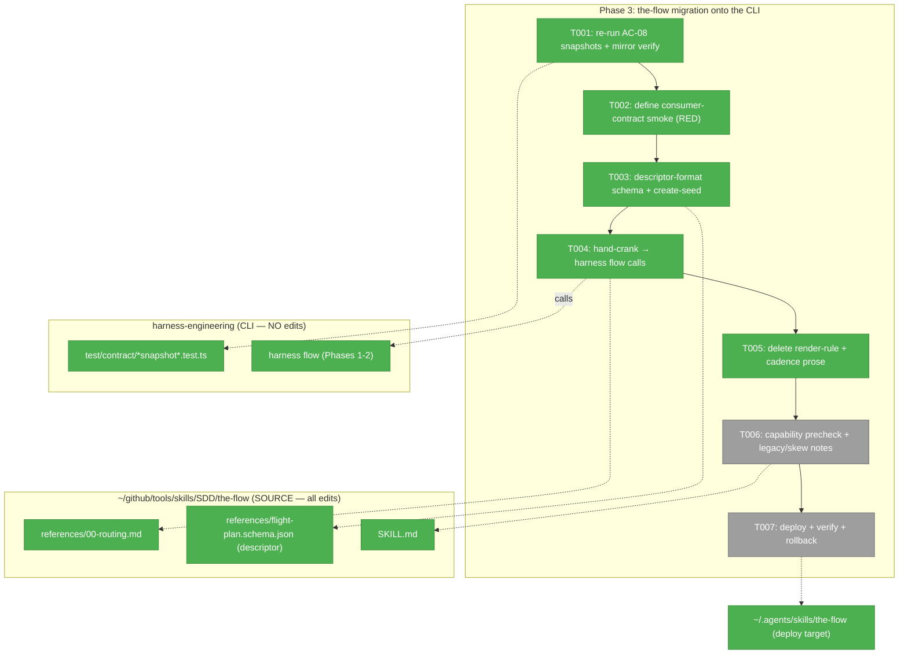
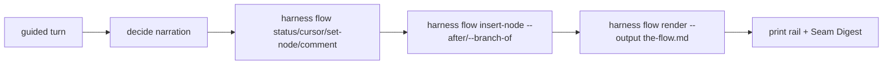
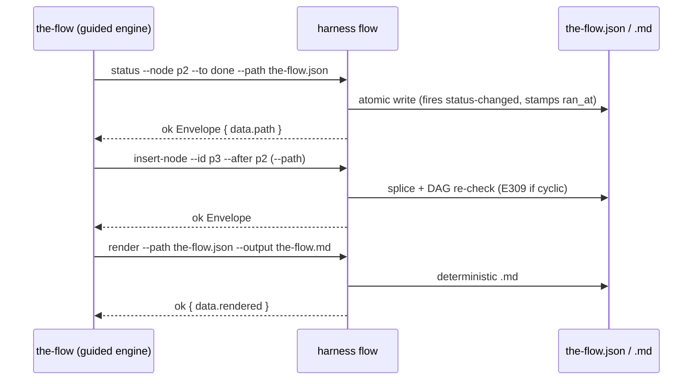

# Phase 3 — `the-flow` migration onto the CLI

> Plan: [`first-class-flow-system-plan.md`](../../first-class-flow-system-plan.md) · Phase 3 of 3 · **Full**, CS-4 · TDD-first.
> Generated: 2026-06-18 · Consumes the plan's Phase 3 table (3.1–3.6), Key Findings 01/02/05/07, AC-08/09/11/13/15.

> ⚠️ **This phase is CROSS-REPO.** Almost all edits land in a **separate, user-controlled repo** — the `the-flow` skill source at `~/github/tools/skills/SDD/the-flow/` — **not** in `harness-engineering`. The only in-repo work is re-running two existing contract snapshots (T001). Per the no-vendor rule, `the-flow` is **never** copied into this repo. Deploy target is `~/.agents/skills/the-flow/` (the `~/.claude/skills/the-flow` symlink resolves there).

---

## Executive Briefing

- **Purpose**: Turn `the-flow` from the *owner* of flow mechanics (hand-cranked `the-flow.json` edits + 8 hand-written mermaid render rules) into a **consumer** of the `harness flow` CLI built in Phases 1–2. The CLI now owns mutation, edge-algebra, event/comment logging, and deterministic render; `the-flow` calls it.
- **What we're building**: (1) `the-flow`'s flight-plan schema re-authored in the CLI **descriptor format** + shipped with the skill (supplied via `--schema`); (2) the guided engine's state-mutation hand-crank replaced with `harness flow` call sequences (incl. `insert-node` for phase-reveal + excursions); (3) deletion of the now-redundant render-rule + cadence prose; (4) a capability/version-floor precheck (error-and-stop on absent/too-old CLI); (5) a reversible cross-repo deploy.
- **Goals**:
  - ✅ Guided mode mutates + renders flow state **exclusively** via `harness flow` (no hand-edits to `the-flow.json`/`.md`).
  - ✅ `the-flow` ships + points at its own flight-plan schema — **no second copy** in the CLI (grill 6/7).
  - ✅ Absent/too-old CLI → a clean, honest stop with "run `harness update`" (CD-05 / version skew).
  - ✅ The AC-08 contract snapshots (hooks + flow-Envelope) still pass post-migration; the `harness-seams.md` mirror is re-verified.
  - ✅ Reversible cutover: revert the skill + `harness update --pin <prev>`.
- **Non-Goals**:
  - ❌ Touch the routing **Graph** in `00-routing.md` — it stays prose, unchanged (decision = data, no routing in the CLI).
  - ❌ Onboarding / `flow agent` / adoption features (grill cut; deferred to the staged adopt plan).
  - ❌ Modify any CLI source in `harness-engineering` (Phase 3 is consumer-side only; the CLI is feature-complete after Phase 2).
  - ❌ Migrate old hand-written flows — **clean break** (`E308`); a short legacy note only.

---

## Prior Phase Context

### Phase 1 — Flow engine (schema, state, mutations, event log) — the verb surface the-flow consumes

**A. Deliverables**: `harness/cli/src/acts/flow.ts` (subcommand dispatcher) + `services/flow/{flow-service,flow-schema,flow-mutations,flow-events}.ts` + bundled `schemas/{flow,harness-loop}.schema.json` + `harness-loop.template.json` + `schemas-content.ts` (gen:flows) + `error-codes.ts` E300–E309 + the two frozen contract snapshots.

**B. Dependencies Exported (the consumer contract)** — the complete `harness flow` verb surface:

| Verb | Key flags | Mutates / returns |
|------|-----------|-------------------|
| `create <type>` | `--slug` (req) · `--path` `--schema` `--template` `--bare` | writes flow file, fires `created`; `data {path,slug,kind,cursor,recommended_next,node_count,event_count}` |
| `show` | `--path` \| `--slug` | read-only; same `data` shape |
| `list` | `--dir` | read-only; `data {flows[],count}` |
| `cursor` | `--to <id>` (move) \| `--recommend <id>` (advisory, no event) · `--path`\|`--slug` | moves cursor / sets `recommended_next` |
| `status` | `--node <id>` `--to <status>` · `--path`\|`--slug` | fires `status-changed`; stamps `ran_at` on done/blocked |
| `add-node` | `--id` `--type` `--label` · `--status` `--next` | appends; fires `node-created` |
| `set-node` | `--node <id>` · `--label` `--note` `--user-input` | merges fields; fires `node-updated` |
| `insert-node` | `--id` `--type` `--label` + **exactly one** of `--after`/`--before`/`--branch-of` (`--rejoin` with branch-of) | splices edges (DAG-rechecked pre-write); fires `node-created` + per-edge `node-updated{edge_op}` |
| `comment` | `--node <id>` `--text` · `--source` `--kind` `--refs` | appends timestamped comment; fires `node-updated` |
| `event <name>` | `--value` `--type` `--kind` `--description` | duck-typed/manual event; `data {event{id,kind,origin}}` |

- **insert-node 3-mode edge algebra** (AC-15): `--after X` → N takes X's out-edges, `X.next=[N]`; `--before X` → all predecessors of X rewire to N, `N.next=[X]` (multi-predecessor safe); `--branch-of X [--rejoin R]` → `N.branch_of=X`, `N.next=[R??X]`, X.next unchanged. Mutually exclusive → `E108`; missing target → `E305`; post-splice cycle/orphan → `E309` (nothing written).
- **Schema resolution precedence**: `--schema <path>` (absolute/out-of-repo **allowed**, JSON-only, 256 KB cap) › `.harness/schemas/flows/<type>.schema.json` › bundled (shared-core + harness-loop only) › `E304`. **Write paths are repo-contained (`E303`); `--schema`/`--template` reads are isWithin-exempt.**
- **Data shapes** (`flow-events.ts`): `FlowDoc{schema_version,kind,slug,cursor,recommended_next?,created_at,provenance(7-key),events[],nodes[]}`; `FlowNode{id,type,label,status,next[],branch_of?,created_at?,modified_at?,ran_at?,user_input?,comments?,authority?,…pass-through}`; `FlowComment{at,text,source?,kind?,refs?}`; provenance reuses record's `ProvenanceFields`.
- **E3xx a consumer hits**: `E304` type-unknown · `E306` schema-version-major-mismatch (→ "run `harness update`") · `E308` legacy-format (no provenance) · `E309` edge-invalid · `E305` node-not-found (mutate-time enforces node **existence** only; a bad **status value** is caught post-mutation by `validateFlowDoc` → **`E300`**, *not* E305 — the "illegal-transition" cause in `error-codes.ts` is dormant).

**C. Gotchas & Debt**: ① the `--hook/--hooks/--json` snapshot freezes **skill-doc bytes** (`skills/eng-harness-flow/...`), not CLI output — the-flow's `harness-seams.md` mirror is a **manual** cross-repo check. ② the existing `flight-plan.schema.json` (JSON-Schema draft) is **REFERENCE-ONLY** — the CLI uses a hand-rolled validator over a **descriptor format**; the-flow must re-ship its schema in that format (T003). ③ Mutations enforce node **existence** (E305) but not status-value validity at mutate time — a post-mutation `validateFlowDoc` (E300) catches bad status/type against the resolved overlay before write.

**D. Incomplete (→ Phase 3)**: the-flow migration, the flight-plan descriptor schema, the capability precheck, the snapshot **re-run** (checkpoint 2).

**E. Patterns to follow**: Envelope discipline (exit 0 ok / 1 error; `--json` full envelope, human = terse line); thread `data.path` from each ok Envelope into the next call's `--path`; provenance stamped once at create; ISO-8601-UTC datetime trio; atomic temp+rename writes; POSIX paths.

### Phase 2 — Deterministic render + CI parity — the render surface the-flow stops owning

**A. Deliverables**: `flow-renderer.ts` (pure `FlowDoc→string`) + `harness flow render [--input|--path|--slug] [--output] [--check] [--against]` + `E310 FLOW_RENDER_DRIFT` + `check:flows`/`gen:flow-fixtures` scripts + `docs/how/harness-flow.md`.

**B. Dependencies Exported (the render contract)**:
- **Call surface**: `harness flow render --path <json> [--output <file>]` regenerates the `.md`; `--check` is read-only drift-guard (exit 1 + `E310` on drift).
- **The exact render rules the renderer owns** — these are *precisely* the hand-written rules the-flow must **DELETE** (T005): `flowchart TD` + classDefs (done/wip/blocked/known/assumed/said/harness/decision/companion/worker/unknown); spine solid `-->`; excursions dotted `-.->`; harness-node violet conditional; status→class; **one genesis `user_input` 🗣 bubble per node**; **`comments[]` → `💬N` badge + per-node markdown body-log** (timestamp·source·kind·refs); **`decision` → `{…}` rhombus**; agents subgraph (companion) / side-node (worker); legend; rail (`◆◐✗◇` pips); unknown-type fallback (never crash).
- **Safety guarantees**: mermaid-safe escaping of user text (`escapeMermaid`/`escapeMd`); reserved-keyword id guard (`end`→`end_`, etc.); deterministic append-order iteration.

**C. Gotchas**: two render defects were caught in self-review — `end` reserved keyword + raw `|[]{}` — both fixed; **build before vitest** (goldens come from the built CLI); biome-normalized output guarded by `git diff --exit-code`.

**D. Incomplete**: `agents[]` **writer** deferred (Phase 2 renders a pre-populated fixture only); body-log is **render-only, never parsed back** (locked Non-Goal — the-flow must not parse the rendered `.md`).

**E. Patterns**: golden fixtures are derived (regenerated, never hand-edited); `gen:docs`/`check:docs` mirror; render determinism (no clock in the renderer).

---

## Pre-Implementation Check

| File | Repo | Exists? | Action | Notes |
|------|------|---------|--------|-------|
| `harness/cli/test/contract/hooks-snapshot.test.ts` | harness-engineering | ✅ | re-run (no edit) | AC-08 checkpoint 2; should pass unchanged (Phase 3 touches no CLI code) |
| `harness/cli/test/contract/flow-envelope-snapshot.test.ts` | harness-engineering | ✅ | re-run (no edit) | freezes `create`/`show`/`event` Envelope `data` shapes the-flow consumes |
| `references/00-routing.md` § Flight plan (~L159–186) | the-flow source | ✅ | **modify** — replace hand-crank cadence (~L166) + delete 8 render rules (~L175–186) | the bulk of T004+T005; the **Graph** (§Graph, ~L101–117) + all of `00-routing.md` outside §Flight plan stays untouched. **Locate by heading — line numbers drift** (file is actively edited) |
| `references/coach.md` | the-flow source | ✅ | modify | strip any "hand-crank"/"you are the generator" residue; rail rendering (host rail) **stays** — it is not the-flow.md mermaid |
| `references/getting-started.md` | the-flow source | ✅ | **sweep** | rendered view of the loop; reconcile stale hand-crank/render prose or confirm clean (AC-13 doc-drift guard) |
| `references/flight-plan.schema.json` | the-flow source | ✅ (JSON-Schema draft, reference-only) | **re-author** in CLI descriptor format | T003; the CLI cannot consume the draft form |
| `references/flight-plan.template.json` | the-flow source | ✅ | align as the **create-seed** template | shipped alongside the schema; deep-copied by `flow create` |
| `SKILL.md` | the-flow source | ✅ | modify | capability precheck note + "no adoption required" + legacy `E308` note (T006) |
| deploy target `~/.agents/skills/the-flow/` | (install target) | ✅ (symlink target of `~/.claude/skills/the-flow`) | **deploy** | T007; via the skill install mechanism, not a hand copy; plan 3.6 says `~/.claude/...` — that is the symlink, real target is `~/.agents/...` |

**Prerequisite (smoke verification): SATISFIED on this machine.** A **capable `harness flow` is already installed globally** — `harness` **v0.4.0** at `~/.npm-global/bin/harness` carries the full surface (`create/new/show/list/cursor/status/add-node/set-node/insert-node/comment/event/render`; `create --schema` accepts out-of-repo paths). So T002/T003 can smoke against the **global** directly — no local build / `npm link` required. Two notes: (a) HEAD may be slightly *ahead* of 0.4.0 (e.g. the Phase-2 renderer fixes), so for **byte-exact `render` parity** build from HEAD (`npm run build` + `node harness/cli/bin/harness.js flow …`); the verb/consumer surface is stable either way. (b) Production deploy (T007) is **CLI-first** — already the case here (the capable CLI predates the skill migration); the T006 precheck still ships for *other* machines / version skew.

**Contract-change risk**: none to the CLI (consumer-side phase). The cross-repo contract (`harness-seams.md` mirror) is **manually** re-verified (T001).

---

## Architecture Map



---

## Tasks

| Status | ID | Task | Domain | Path(s) | Done When | Notes |
|--------|-----|------|--------|---------|-----------|-------|
| [x] | T001 | Re-run **both** frozen contract snapshots (hooks + flow-Envelope `data`) as the AC-08 post-migration gate — they must pass unchanged. Then **manually** byte-verify the-flow's `harness-seams.md` mirror table against the live `/eng-harness-flow --hooks --json` manifest (cross-repo, not CI-reachable). | harness-cli·flow / the-flow | `harness/cli/test/contract/hooks-snapshot.test.ts`, `harness/cli/test/contract/flow-envelope-snapshot.test.ts`; SRC `references/harness-seams.md` | both snapshot suites green; mirror table matches the live manifest (or a documented delta + `harness_seam_contract` bump) | AC-08; Finding 01; plan 3.1; safety baseline — run first **and** re-run last. Snapshot half = real CI gate; the cross-repo mirror byte-match is a **discipline check (not CI)**, mitigated by the `harness_seam_contract` bump |
| [x] | T002 | Define the **consumer-contract verification**: a reproducible `harness flow` smoke sequence — `create flight-plan --schema <the-flow schema>` → `cursor --to` / `status --to` / `insert-node --after` / `insert-node --branch-of --rejoin` / `comment` round-trip, asserting ok Envelopes + `data.path` threading — **plus** the capability-floor abort path (CLI absent **or** too-old → error-and-stop). `the-flow` is a prose skill with **no vitest** → this is a scripted/checklisted smoke (recorded in the execution log), not a unit suite. | the-flow | SRC `references/` (verification script or `execution.log.md` checklist) | smoke sequence runs green against the built CLI **with pasted command transcripts (argv + ok-Envelope JSON + exit codes) recorded in `execution.log.md`**; the absent/old-CLI branch errors-and-stops with the honest-hedge remediation text; **RED before T003–T006** (no schema, hand-crank still present) | AC-09; CD-05; plan 3.2; cross-repo; TDD anchor |
| [x] | T003 | Author the-flow's flight-plan schema in the CLI **descriptor format** — `{ kind, extends?, schema_version?, statuses: string[], nodeTypes: string[] }`, **not** JSON-Schema (the existing draft is reference-only); copy `harness/cli/src/services/flow/schemas/harness-loop.schema.json` verbatim as the exemplar. Declare the flight-plan node types + the overlay status vocabulary; align `flight-plan.template.json` as the **create-seed** the CLI deep-copies. Verify `harness flow create flight-plan --slug X --schema <abs path>` resolves (out-of-repo `--schema` allowed) + validates shared-core + overlay. **No second copy** in the CLI repo. | the-flow | SRC `references/flight-plan.schema.json` (re-author), `references/flight-plan.template.json` | `create … --schema` returns an ok Envelope; a wrong-flow node is rejected; overlay-declared statuses accepted; the schema at its **deployed absolute path** passes the `--schema` read guard (canonicalized, JSON-only, <256 KB); no schema copy lands in `harness-engineering` | AC-11; Findings 05/07; grill 6/7; plan 3.5; **unblocks T002 smoke** |
| [x] | T004 | Replace the **state-mutation hand-crank** — the 4-step "you are the generator" cadence in `references/00-routing.md` § Flight plan — with `harness flow` call sequences: `cursor`/`status`/`add-node`/`set-node`/`comment` for per-turn mutation, and **`insert-node`** for phase-reveal (`--after`) + workshop/fix-loop excursions (`--branch-of [--rejoin]`), replacing all hand edge-recomputation. The engine threads each ok Envelope's `data.path` via `--path`. Capture `user_input` via `set-node --user-input`. | the-flow | SRC `references/00-routing.md` (§ Flight plan), `references/coach.md` (hand-crank residue) | guided mode mutates (incl. inserts) via CLI calls only; **zero** remaining hand-edit-`the-flow.json` prose across `00-routing.md` (incl. the Resume path ~L47) **and** `coach.md`; insert modes map 1:1 to phase-reveal + excursions | AC-09/AC-13; CD-02; ws-003; plan 3.3 (core); AC-15 algebra is engine-owned (Phase 1) — T004 proves the consumer mode→excursion mapping; (create-seed → T003) |
| [x] | T005 | **Delete** the now-redundant render prose from `references/00-routing.md` § Flight plan: the 8 mermaid render rules (L175–186) + the render-relevant status-taxonomy + the hand-crank cadence header (CLI's `flow-renderer.ts` owns them all — incl. the genesis 🗣 bubble, `💬N` badge/body-log, `decision` rhombus). Replace with a one-line "render via `harness flow render --path the-flow.json --output the-flow.md`" pointer + a short legacy note. The routing **Graph stays prose, unchanged**. | the-flow | SRC `references/00-routing.md` (§ Flight plan render block), `references/getting-started.md` | render-rule + cadence prose removed; render delegated to `harness flow render`; **§Graph (~L101–117) + everything outside §Flight plan untouched**; `getting-started.md` swept for stale hand-crank/render prose; the `the-flow.md`-is-generated invariant points at the CLI | AC-13; CD-02; plan 3.3 (deletions); Phase-2 renderer owns rules |
| [x] | T006 | Add the **capability/version-floor precheck** (probe `harness flow --help` / a min-version signal → error-and-stop with "run `harness update`") + the **"no adoption required"** flow-creation path (flows land in `docs/plans/<slug>/`, no `.harness/` setup) + the `E308` legacy note. Document **deploy order = CLI first, then skill** and the **reverse-skew** case (old the-flow + new CLI → the old hand-crank's writes hit `E308` on read = a clean stop, not silent divergence). | the-flow | SRC `SKILL.md`, `references/00-routing.md` | absent/too-old CLI → clean honest stop; no-adoption path documented; reverse-skew + deploy order written | AC-09/AC-13; grill 5/3; Risk #3; plan 3.4 |
| [x] | T007 | **Deploy**: install the updated the-flow source to the deploy target (`~/.agents/skills/the-flow/` via the skill install mechanism — `~/.claude/skills/the-flow` symlinks to it), **after** a capable CLI is in place. Verify a fresh `/the-flow` load + a real mutate→render round-trip works end-to-end. Document the concrete **rollback** = revert the skill + `harness update --pin <prev>` (the CLI is a global npm package; the cutover is additive/reversible). | the-flow | SRC → `~/.agents/skills/the-flow/` | updated skill deployed + fresh load verified + a real mutate→render round-trip green **with pasted command output in `execution.log.md`**; rollback documented | plan 3.6; cross-repo deploy; Risk #3 |

- `Status`: `[ ]` pending · `[~]` in progress · `[x]` complete · `[!]` blocked

---

## Context Brief

**Key findings from plan** (those that bind Phase 3):
- **Finding 01 (Critical)** — CD-02 blast radius: the byte-stable `--hook/--event/--hooks/--json` contract is mirrored by the-flow + the router. Action: re-run the 1.1 snapshots (T001), keep the cutover additive/reversible.
- **Finding 02 (High)** — clean break: old hand-written flows are a supplanted prototype. Action: `E308` honest error, **no** migration; leave a short legacy note (T006).
- **Finding 05 (High)** — schema ownership: harness-owned schemas bundle in the CLI; **the-flow owns + ships its flight-plan schema via `--schema`** — no second copy (T003).
- **Finding 07 (High)** — CD-05 / version skew: the-flow hard-requires a *capable* CLI. Action: capability/version-floor precheck → error-and-stop "run `harness update`" (T006).

**The consumer contract (use, don't re-derive)** — the exact `harness flow` verb/flag surface, the insert-node edge algebra, the schema-resolution precedence, the `FlowDoc`/`FlowNode`/`FlowComment`/provenance shapes, and the `E3xx` codes are tabulated above in **Prior Phase Context → Phase 1 → B**. The render rules to delete are in **Phase 2 → B**.

**Critical discovery — two schema formats**: the existing `references/flight-plan.schema.json` is a **JSON-Schema draft** (human reference). The CLI's `flow-schema.ts` consumes a **descriptor format** (hand-rolled validator, mirrors `recordTypeShapeIssues`). T003 authors the descriptor-format schema; the draft file may stay as documentation or be replaced — but the CLI must resolve the **descriptor** one via `--schema`. The descriptor is **minimal** — `{ kind, extends?, schema_version?, statuses: string[], nodeTypes: string[] }`, with **no** `$schema`/`$defs`/`oneOf`/per-field constraints; copy `harness/cli/src/services/flow/schemas/harness-loop.schema.json` verbatim as the exemplar (status validity checks against `statuses[]`, node kinds against `nodeTypes[]`). Do **not** reach for a JSON-Schema-flavored shape — that is the format being migrated *away* from.

**Cross-repo constraints**:
- No-vendor rule: never copy `the-flow` (or its schema) into `harness-engineering`. Verification points `--schema` at the-flow's real path.
- the-flow has no test runner: "tests" (T002) = reproducible `harness flow` smoke sequences + the re-run of *this* repo's snapshots (T001), recorded in the execution log.
- Deploy is one-directional: SOURCE (`~/github/...`) → install → `~/.agents/skills/the-flow/`.

**Domain dependencies**: `harness-cli·flow` (the consumed verb surface, frozen by Phase 1/2); `the-flow` (the skill being migrated). No `docs/domains/` registry in this repo → G7 N/A; the plan's Domain Manifest is the whole context.

**Domain constraints**: the-flow sub-skills stay **harness-blind** + **flow-blind** (verbs only); only `00-routing.md`/`coach.md`/`harness-seams.md` carry engine knowledge. The routing **Graph** is prose and must not move into the CLI (decision = data, no routing).

**Reusable from prior phases**: the built CLI (`harness flow …`); the `harness-loop.template.json` as a create-seed shape precedent; the `docs/how/harness-flow.md` guide (already documents the verb surface + custom-flow `--schema` authoring).

**Mermaid flow diagram** (the migrated per-turn loop):


**Mermaid sequence diagram** (mutate → render round-trip):


---

## Discoveries & Learnings

_Populated during implementation by the implement verb._

| Date | Task | Type | Discovery | Resolution | References |
|------|------|------|-----------|------------|------------|
| 2026-06-18 | T003 | insight | Flight-plan overlay (statuses/nodeTypes) is enforced ONLY at CREATE (`--schema`); mutation verbs are mechanical-only (E305 existence + E309 DAG) — a bogus node `type` passed `add-node` with `ok`, not E300. | the-flow passes `--schema` at create (overlay enforced + seed validated); constructs correct mutation calls itself; Phase-2 renderer's unknown-type fallback is the net. Candidate future CLI hardening: `--schema` on mutations, or persist the resolved overlay path in the doc. | execution.log T003; `flow-mutations.ts:6-17` |
| 2026-06-18 | T003 | decision | Preserved `flight-plan.template.json` as the worked example (it validates against the new descriptor — 17 nodes deep-copy + validate) rather than gutting it into a minimal seed. | the-flow fresh-start `create` uses `--bare` + `add-node` for the seed (T004); the worked example stays as docs + a valid `--template`. | execution.log T003; 00-routing.md "worked example to copy" |

**Types**: `gotcha` | `research-needed` | `unexpected-behavior` | `workaround` | `decision` | `debt` | `insight`

---

## Validation Record (validate-v2 — broad, 2026-06-18)

**Overall: VALIDATED WITH FIXES — READY for implementation.** 4 parallel validators (Source-Truth · Cross-Reference+Completeness · Thesis-Alignment · Forward-Compatibility). No blocker; 1 HIGH + several MEDIUM/LOW, all applied below.

**Thesis verdict** (Implementation proof target): **Advanced**, evidence **Strong**. No thesis drift (mechanics-not-routing held — Graph stays prose, cursor moves only by explicit call), no non-goal creep, clean-break (`E308`, no migration) honored. All 6 plan tasks (3.1–3.6) and all 5 owned ACs (08/09/11/13/15) map to concrete Done-Whens; the 3.3→T004+T005 split and 3.5→T003 fold lose nothing. Cross-repo facts (verb surface, edge algebra, `~L101–117`/`~L159–186` line ranges, descriptor-vs-draft schema, `~/.agents/...` symlink) independently verified accurate against both repos.

| Agent | Verdict | Issues → disposition |
|-------|---------|----------------------|
| Source-Truth | PASS (no HIGH) | Graph range overshoot (L101–148→~L101–117); E305 "illegal-transition" dormant (bad status → E300) → **fixed** |
| Cross-Ref + Completeness | PASS WITH FIXES | coach.md/Resume hand-crank residue not asserted; `getting-started.md` unlisted; `--schema` read-guard not re-asserted consumer-side; create-seed/deploy-target/AC-15 breadcrumbs → **all fixed** |
| Thesis Alignment | Advanced (1 HIGH) | **HIGH**: T003 named "descriptor format" but never stated its concrete `{kind,extends?,schema_version?,statuses[],nodeTypes[]}` shape (risk: mis-author in JSON-Schema flavor) → **fixed** (shape + `harness-loop.schema.json` exemplar); committed-vs-published nuance → **fixed** |
| Forward-Compatibility | PASS WITH FINDINGS | Review can't verify cross-repo edits from the in-repo diff → **fixed** (T002/T007 require pasted command transcripts in execution.log); T001 mirror half is a discipline check not CI → **noted**; E308 message-quality + line-number brittleness → **fixed** |

**Fixes applied (this pass)**: H1 — T003 concrete descriptor shape + exemplar; M — repo-wide no-hand-crank assertion (00-routing Resume + coach.md), `getting-started.md` sweep row + Done-When, consumer-side `--schema` read-guard, E305→E300 clarification, pasted-transcript reviewability (T002/T007), committed-vs-published note; L — Graph range + locate-by-heading, deploy-target divergence note, create-seed/AC-15 breadcrumbs, T001 mirror-is-discipline note.

**Outcome alignment**: Phase 3 as scoped **advances** the VPO Outcome — "Make the flow a first-class, deterministic concept inside the harness CLI" — by converting the-flow from *owner* to *consumer* of the deterministic engine; the one residual is *reviewability* (the substance lands in a separate repo, attested via recorded transcripts + the in-repo contract baseline), not a defect in the outcome.

---

## Directory layout

```
docs/plans/024-first-class-flow-system/
  ├── first-class-flow-system-plan.md
  └── tasks/phase-3-the-flow-migration-onto-the-cli/
      ├── tasks.md            # this file
      └── execution.log.md    # created by the implement verb

~/github/tools/skills/SDD/the-flow/   # SOURCE (cross-repo — all migration edits)
  ├── SKILL.md
  └── references/{00-routing.md, coach.md, flight-plan.schema.json, flight-plan.template.json, …}

~/.agents/skills/the-flow/            # deploy target (T007); ~/.claude/skills/the-flow → here
```

**STOP** — dossier only. No code changed. Awaiting human GO to implement Phase 3.
