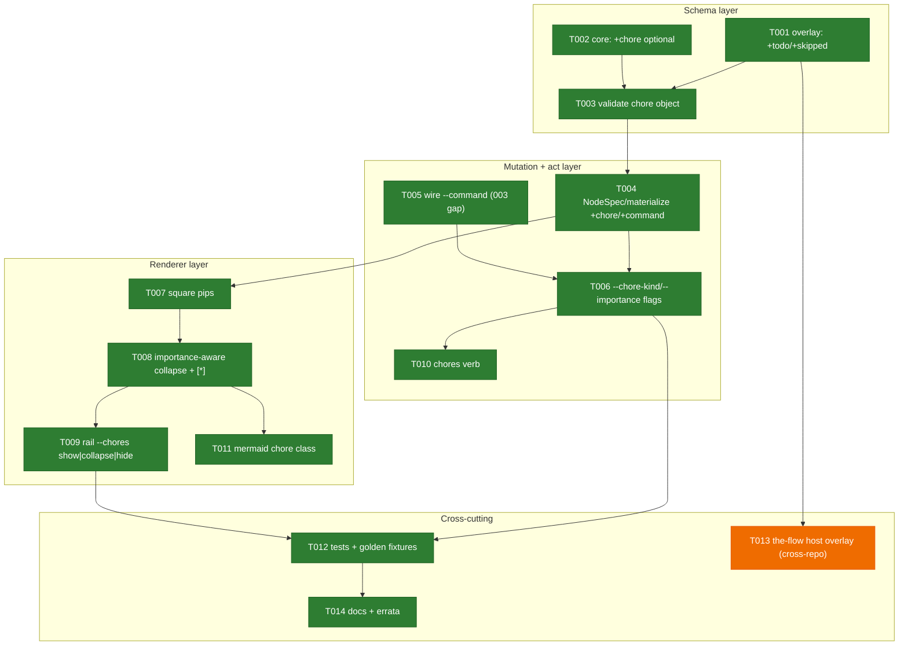
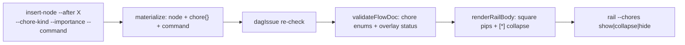
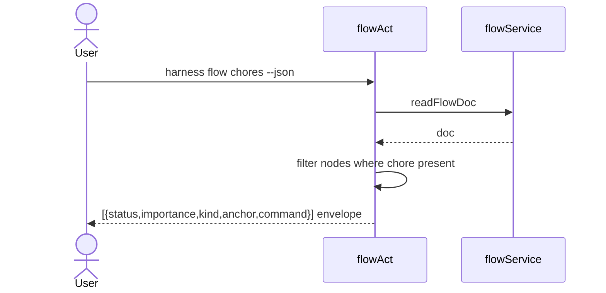

# Phase 4: Chore Nodes — Tasks Dossier

**Plan**: [024-first-class-flow-system](../../first-class-flow-system-plan.md)
**Source**: [workshops/004-chore-nodes.md](../../workshops/004-chore-nodes.md) (authoritative — decisions C1–C8) + the shipped Phase 1–3 code
**Created**: 2026-06-19
**Status**: Proposed — STOP before implementation; wait for human **GO**
**Phase CS**: 3 (additive across schema/mutations/renderer/act + one cross-repo edit; every layer has an existing pattern to follow)

> **Provenance note (read first).** Phase 4 is **not in 024's plan table** — 024 was scoped at 3 phases ("fewest phases that hold"), all shipped. Chores are *new scope* that arrived as **workshop 004** (Preferred Direction, near Contract Ready). This dossier therefore sources its task breakdown from **workshop 004's decisions C1–C8 + its Folds-into deltas**, grounded against the real Phase 1–3 implementation. Landing it is a 024-vNext continuation; whoever runs `plan` next should fold a Phase 4 row + ACs into the plan proper.

> **Open upstream decisions (preconditions — confirm at GO).** Workshop 004 leaves three questions OPEN; this dossier proceeds on a stated lean for each, and the tasks realign if the human decides otherwise — these are surfaced *for* the GO review, not silently closed:
> - **Q1 (name)** — provisionally **"chore"** (ws004 lean). If renamed at GO, **all** of T001–T014 rename uniformly (schema keys, flags, verb, messages, tests, docs).
> - **Q2 (encoding)** — assumed **nested `chore: {kind, importance}` object** (ws004 C1 lean), written by the **flat** `--chore-kind`/`--importance` CLI flags (T006). If Q2 resolves to flat sibling fields, T002/T003/T004/T006 realign together.
> - **Q3 (threshold)** — assumed **three rail modes only** (`show|collapse|hide`); a per-importance threshold is deferred (additive later).

---

## Executive Briefing

- **Purpose**: make **chores** — cross-cutting flight-plan nodes (compact, validate, the harness-loop seams, ad-hoc upkeep) — a first-class part of the `harness flow` engine: a node marked orthogonally as a chore, carrying *what to run* (`kind` + ref) and *how strongly advised* (`importance`), with a **two-tier rail** (square pips always; names collapse to `[*]`). This is the mechanism that lets a host flow (the-flow) carry the eng-harness-flow loop **inside its own spine** (the 028-map resolution) without breaking the router's stateless contract.
- **What we're building**: an optional `chore` attribute on a node + overlay-declared chore statuses (`todo`/`done`/`skipped`); `--chore-kind`/`--importance`/`--command` flags on `add-node`/`insert-node`; chore-aware rail rendering (square pips + importance-aware collapse + `[*]`); a `harness flow chores` read verb + a `rail --chores` flag; the the-flow host overlay edit; tests + golden fixtures + docs.
- **Goals**:
  - ✅ A node can be marked a chore with `{kind, importance}` and a ref, validated against the overlay vocabulary.
  - ✅ Chore statuses `todo`/`done`/`skipped` validate via the **existing** overlay-declared-status path (no validator rewrite).
  - ✅ The rail shows chores as square pips always and collapses their names to `[*]` (strong stay named); three visibility modes.
  - ✅ `harness flow chores` lists pending upkeep (status·importance·kind·anchor·ref).
  - ✅ Loop seams ride the-flow's spine as chores (028 resolution); statelessness preserved.
- **Non-Goals**:
  - ❌ **Routing** — *which* chore to run / when is the prose Graph + the eng-harness-flow router's job, never the CLI's (carries 003's "deterministic mechanics, not routing" Non-Goal).
  - ❌ **Gating/blocking/scoring** — `importance` is advisory; the strongest level (`strongly-recommended`) only refuses to hide, never blocks (the harness invariant).
  - ❌ A `chore` **node type** (rejected — chores are orthogonal, ws004 C1) or a **new event kind** (reuse 002's set, C7).
  - ❌ The **unhosted standalone** loop/adopt flight plan (028-map open question — chores are a *hosted-case* feature).

---

## Prior Phase Context

> Synthesised from the shipped Phase 1–3 source + the plan/execution logs (grounded by direct source read this session, rather than a subagent fan-out — the extension points needed here are code-level and were read directly).

### Phase 1 — Flow engine (schema, state, mutations, event log) · ✅ Done
- **A. Deliverables**: `flow.schema.json` (shared-core — node/comment/authority/root field shapes); `harness-loop.schema.json` overlay (bundled, schema-only); `flow-schema.ts` (`resolveFlowSchema` + `validateFlowDoc` + `checkSchemaVersion`); `flow-mutations.ts` (`setNow`/`setNext`/`setStatus`/`addNode`/`setNode`/`addComment`/`insertNode` + `dagIssue`); `flow-events.ts`; the `flow` act core. `E300–E309` allocated.
- **B. Dependencies exported (for this phase)**:
  - `validateFlowDoc` validates `node.status` against **`schema.statuses`** (the *overlay-declared* set) — `flow-schema.ts:252`. → **chore statuses are an overlay edit, not a validator change.**
  - `validateFlowDoc` is **tolerant of extra fields** ("no additionalProperties:false … pass-through bookkeeping round-trips" — `flow-schema.ts:198`). → **a `chore` object round-trips today without a core schema change**; strict validation is additive.
  - `NodeSpec` + `materialize()` (`flow-mutations.ts:214,227`) — the spread-optional-fields pattern (`branch_of`/`authority`/`artifacts`/`zone`); add `chore`/`command` the same way.
  - `badZone()` (`flow-mutations.ts:248`) — the pre-write "reject an invalid enum value" pattern; mirror for `--chore-kind`/`--importance`.
  - `insertNode()` edge algebra + `dagIssue()` re-check (`flow-mutations.ts:417,365`) — chores reuse this verbatim (inline `--after`, excursion `--branch-of`).
  - `ZONE_VALUES` closed enum (`flow-mutations.ts:247`); `authorityValues` overlay-declared.
- **C. Gotchas & Debt**: **`command` is in the core node `optional` list but has NO CLI flag to set it** — `add-node`/`insert-node`/`set-node` in `acts/flow.ts` expose no `--command`, despite **workshop 003 §I2 listing `--command "<…>"` on insert-node**. So today's seam nodes can carry `command` in JSON but the CLI can't author it. → Phase 4 must wire `--command` (T005).
- **D. Incomplete items (carried forward)**: the `--command` flag (above); `flow agent` deferred to v2 (irrelevant here).
- **E. Patterns to follow**: TDD (failing tests first); PURE mutations on a deep clone (a rejected mutation writes nothing); reuse 002's event kinds + `details{}` discriminator; overlay-declared vocabularies over hard-coded enums.

### Phase 2 — Deterministic render + CI parity + docs · ✅ Done
- **A. Deliverables**: `flow-renderer.ts` (`renderFlow` mermaid `flowchart TD` + node-log; `renderRailBody`/`renderRailLine`/`renderRail`; `pipOf`; `effectiveZone`/`ZONE_BY_TYPE`; `STATUS_PIP`); golden fixtures + `check:flows` drift guard (`npm run gen:flow-fixtures`).
- **B. Dependencies exported (for this phase)**:
  - `STATUS_PIP` `{done:◆, in_progress:◐, blocked:✗}` + `pipOf()` fallback `◇` (`flow-renderer.ts:41,362`) → add a chore-pip branch (squares).
  - `renderRailBody(nodes)` bands the spine `pre ─ [ flight ] ─ post` (`:373`) → the collapse logic + a visibility param land here; `renderRailLine`/`renderRail` call it.
  - `topoOrderMain` excludes `branch_of` excursions from the rail (`:329`) → inline chores (`--after`) appear on the rail; excursion chores (`--branch-of`) stay dotted in the mermaid only. Correct by construction.
  - `effectiveZone` defaults unknown types to `flight` (`:68`) → chore nodes need an explicit `--zone` (already enforced by `badZone`).
  - Renderer **tolerates unknown node types/fields** (falls back, never throws) → square pips/collapse appear only on a chore-aware renderer; old renderers draw a normal node (incremental-safe, ws004 C5).
- **C. Gotchas & Debt**: every renderer change must regenerate golden fixtures + pass `check:flows` (CI drift gate, `FLOW_RENDER_DRIFT`). Mermaid labels are escaped (`escapeMermaid`) — chore markers must survive escaping.
- **E. Patterns to follow**: renderer is a PURE leaf (`FlowDoc → string`, no I/O); byte-stable + golden-pinned.

### Phase 3 — the-flow migration onto the CLI · ✅ Done
- **A. Deliverables**: the-flow drives its flight plan only via `harness flow` (nav/insert-node/render); ships its `flight-plan.schema.json` overlay via `--schema` (skill-owned, not CLI-bundled).
- **B. Dependencies exported**: `flight-plan.schema.json` statuses `[done,in_progress,blocked,known,assumed]` — the **host** overlay chores must extend with `todo`/`skipped` (T013). It already declares the seam node types (`harness-boot`/`backpressure`/`harness-retro`) chores generalise.
- **C. Gotchas & Debt**: the-flow source lives in a **separate user repo** (`~/github/tools/skills/SDD/the-flow/`, deployed to `~/.claude/skills/the-flow/`) — editing its overlay is a **cross-repo change + a deploy step**, never vendored here (no-vendor rule). Land the CLI side first, then the overlay, then deploy.
- **E. Patterns to follow**: additive + reversible; deploy CLI before skill; the byte-stable `--hook/--event` contract is frozen (don't touch).

---

## Pre-Implementation Check

| File | Exists? | Domain | Notes |
|------|---------|--------|-------|
| `harness/cli/src/services/flow/schemas/flow.schema.json` | ✅ | harness-cli·flow (core) | add `chore` to node `optional` (T002); regen via `gen:flows` |
| `harness/cli/src/services/flow/schemas/harness-loop.schema.json` | ✅ | harness-cli·flow (overlay) | add `todo`/`skipped` to `statuses[]` (T001) |
| `harness/cli/src/services/flow/flow-schema.ts` | ✅ | harness-cli·flow | add chore-object validation to `validateFlowDoc` (T003) |
| `harness/cli/src/services/flow/flow-mutations.ts` | ✅ | harness-cli·flow | thread `chore`/`command` through `NodeSpec`+`materialize`; mirror `badZone` (T004) |
| `harness/cli/src/acts/flow.ts` | ✅ | harness-cli·flow | `--command`/`--chore-kind`/`--importance` flags; `chores` verb; `rail --chores` (T005/T006/T009/T010) |
| `harness/cli/src/services/flow/flow-renderer.ts` | ✅ | harness-cli·flow | chore pips + collapse + chore class (T007/T008/T011) |
| `harness/cli/src/services/flow/schemas-content.ts` | ✅ | harness-cli·flow | regenerated by `gen:flows` (T002) |
| `~/github/tools/skills/SDD/the-flow/references/flight-plan.schema.json` | ✅ (cross-repo) | the-flow | add `todo`/`skipped` (T013) — **deploy step**, no-vendor |
| golden fixtures + `harness/cli/test/**` | ✅ | harness-cli·flow | extend (T012); `gen:flow-fixtures` + `check:flows` |

**Contract-change flags (higher risk)**: T002 (core node shape — additive optional), T013 (the-flow host overlay — cross-repo + deploy). All other tasks are internal to harness-cli·flow.

---

## Architecture Map



---

## Tasks

| Status | ID | Task | Domain | Path(s) | Done When | Notes |
|--------|-----|------|--------|---------|-----------|-------|
| [x] | T001 | Add `todo` + `skipped` to the **harness-loop** overlay `statuses[]` (the loop-as-chores case) | harness-cli·flow | `harness/cli/src/services/flow/schemas/harness-loop.schema.json` | a node with status `todo`/`skipped` validates under `harness-loop`; `done` already present | ws004 **C4**; plan **AC-03/AC-10** (overlay-declared status precedent); rides the path at `flow-schema.ts:252` — no validator change. CS 1 |
| [x] | T002 | Add `chore` to the **shared-core** node `optional` list; regenerate the bundled `.ts` | harness-cli·flow | `schemas/flow.schema.json`, `schemas-content.ts` (via `npm run gen:flows`) | a node carrying `chore: {kind:'skill', importance:'recommended'}` round-trips create→show→render; `npm run build` regenerates `schemas-content.ts` (Phase 1 `gen:flows` infra — no new pipeline) | ws004 **C1**; tolerant validator means it round-trips today — this makes it first-class. CS 1 |
| [x] | T003 | Validate the chore object in `validateFlowDoc`: `chore.kind` ∈ {skill,command,builtin,manual}, `chore.importance` ∈ {strongly-recommended,recommended,optional,informational} | harness-cli·flow | `flow-schema.ts` (`validateFlowDoc`) | a bad value (`kind:"invalid"`, `importance:"required"`) → a schema issue (**E300 = `FLOW_SCHEMA_INVALID`**); a valid chore passes; **a node with no chore validates unchanged (additive — back-compat)** | ws004 **C2/C3**; mirror the `authority`/status validation blocks (`:252,:272`). CS 2 |
| [x] | T004 | Thread `chore` (+ `command`) through `NodeSpec` + `materialize()` so `add-node`/`insert-node` persist them | harness-cli·flow | `flow-mutations.ts` (`NodeSpec`, `materialize`) | an inserted node carries `chore:{kind,importance}` + `command`; spread pattern matches `zone`/`authority` | ws004 **C6**; plan **AC-15** (insert-node/`NodeSpec` reuse); `flow-mutations.ts:214,227`. CS 2 |
| [x] | T005 | **Wire `--command`** on `add-node` + `insert-node` (closes the ws-003 §I2 gap — spec'd but never shipped; chores need the ref) | harness-cli·flow | `acts/flow.ts` (`add-node`, `insert-node`) | `insert-node … --command "/validate-v2 …"` persists `node.command`; round-trips to render | **Discovery: 003 §I2 listed `--command`, Phase 1's act has none** (Source-Truth-confirmed). Prerequisite for T006 (chores need the ref) — if it slips, T006 blocks. CS 2 |
| [x] | T006 | Add flat `--chore-kind` + `--importance` flags to `add-node`/`insert-node` that **assemble the nested `chore:{kind,importance}` object** (Q2 = nested; see preconditions); reject invalid values pre-write via a `badChore` guard | harness-cli·flow | `acts/flow.ts` (flags), `flow-mutations.ts` (`badChore`, sibling of `badZone:248`) | `insert-node … --chore-kind skill --importance strongly-recommended` persists `chore:{kind:'skill',importance:'strongly-recommended'}`; a bad enum → **E108** pre-write, nothing written | ws004 **C2/C3/C6**; plan **AC-15**; guard mirrors `flow-mutations.ts:248`. CS 2 |
| [x] | T007 | Chore-aware `pipOf`: square glyphs for chore nodes — `□` todo · `■` done · `▨` skipped · `▣` strongly-recommended+todo; spine nodes keep diamonds | harness-cli·flow | `flow-renderer.ts` (`pipOf` + a chore-pip map) | a chore node renders a square pip by status+importance; non-chore unchanged | ws004 **C5**; `flow-renderer.ts:41,362`. CS 2 |
| [x] | T008 | Importance-aware name collapse in `renderRailBody`: `strongly-recommended`→named (`▸`), `recommended`/`optional`→`[*]`/`[*N]`, `informational` droppable; thread a visibility mode param | harness-cli·flow | `flow-renderer.ts` (`renderRailBody`, `renderRailLine`, `renderRail`) | default rail collapses chores to `[*]`, strong stay named, pips always show squares (ws004 §C5 A) | ws004 **C5**; `flow-renderer.ts:373`. **Co-develops with T009** (T008 = the visibility-mode param threaded through `renderRailBody`/`renderRailLine`; T009 = the CLI flag that sets it) — land together. CS 3 |
| [x] | T009 | `harness flow rail --chores show\|collapse\|hide` (default `collapse`); thread to `renderRailLine` | harness-cli·flow | `acts/flow.ts` (`rail` action) | the three modes render per ws004 §C5 A/B/C | ws004 **C5/C8**; pairs with T008. Per-importance **threshold deferred** (ws004 Q3 open) — ships the 3 modes only. CS 2 |
| [x] | T010 | `harness flow chores [--list] [--json]` — list chore nodes with status·importance·kind·anchor·ref | harness-cli·flow | `acts/flow.ts` (new subcommand) + a reader helper | the table + `--json` envelope render; `builtin` rows note "agent can't run" | ws004 §CLI surface; the `[*]` expand affordance. CS 2 |
| [x] | T011 | Distinct mermaid class/marker for chore nodes in `declareNode` + `CLASS_DEFS` (tolerant; old renderers fall back) | harness-cli·flow | `flow-renderer.ts` (`declareNode`, `CLASS_DEFS`) | chore nodes render with the chore class; golden fixtures regenerated | ws004 **C5** incremental-safety. CS 2 |
| [x] | T012 | Tests + golden fixtures: chore-object validation; overlay `todo`/`skipped`; insert-node `--chore-kind/--importance/--command` (+ rejects); rail pips/collapse/modes; `chores` verb | harness-cli·flow | `harness/cli/test/**`, golden fixtures (`gen:flow-fixtures`) | all green + `check:flows` (no drift). Coverage: (1) chore-object validation (valid + invalid `kind`/`importance`) over **both** the bundled harness-loop **and** a fixture overlay (mirrors plan **AC-03** two-overlay proof); (2) overlay `todo`/`skipped` accepted; (3) `insert-node --chore-kind/--importance/--command` end-to-end (insert→show→render) + rejects (bad enum, missing flag); (4) rail square pips + the 3 collapse modes; (5) `chores` verb table + `--json` envelope; (6) the chore discriminator in event `details{}` (ws004 **C7**); (7) a chore flag on a `decision`-typed node (orthogonality, ws004 **C1**) | TDD per Phase 1/2; write failing first. CS 3 |
| [x]† | T013 | the-flow **host** overlay: add `todo`/`skipped` to `flight-plan.schema.json` `statuses[]` so the-flow can carry chores (028 resolution) | the-flow | `~/github/tools/skills/SDD/the-flow/references/flight-plan.schema.json` | **after T012 is green + the CLI lands**, a the-flow flow with a chore node validates; redeploy to `~/.claude/skills/the-flow/` + verify a fresh load; **rollback = revert the skill edit + `harness update --pin <prev>`** | **Cross-repo + deploy; no-vendor**; depends on T012; CLI-first deploy order per plan **Phase 3** precedent. ws004 §028. CS 2 |
| [x] | T014 | Docs + errata: extend the `docs/how` flow guide; note chores on `insert-node`, the `chores` verb, `rail --chores` (workshop 001/003 errata-style) | harness-cli·flow (docs) | `harness/cli/docs/` or `docs/how/` | chores documented; no stale claim that `command` is unsettable | Phase 2 docs-sweep pattern. CS 1 |

**Status legend**: `[ ]` pending · `[~]` in progress · `[x]` complete · `[!]` blocked · `[x]†` built + verified, **deploy deferred** (T013 — cross-repo source edit done + proven end-to-end; the `~/.claude` deploy + tools-repo commit await the CLI publish at PR time, per the dossier's CLI-first order).
**Suggested order**: T001→T002→T003 (schema), T004→T005→T006 (mutate/act), T007→(T008+T009 together)→T011 (render), T010, T012 (tests, TDD interleaved throughout), then T013 (after T012 green + CLI lands — cross-repo deploy), T014.

---

## Context Brief

**Key findings (from workshop 004 + the code grounding)**:
- **F1 — chore = orthogonal attribute** (ws004 C1): a `chore: {kind, importance}` object on any node (presence = the flag); node `type` stays the render/zone vocabulary. Action required: add to core optional (T002), thread through mutations (T004), render off the flag (T007/T008).
- **F2 — chore statuses are overlay-declared** (ws004 C4 + `flow-schema.ts:252`): `todo`/`done`/`skipped` are added to an overlay's `statuses[]` — the validator already checks against the resolved overlay set. **No validator rewrite for statuses** (T001/T013).
- **F3 — tolerant validator** (`flow-schema.ts:198`): the chore object round-trips today without a core change; T002/T003 make it first-class + validated.
- **F4 — the `--command` gap** (Phase 1 debt): 003 spec'd `--command` on insert-node; the act never shipped it, so `command` (the chore ref) is unsettable. Must wire it (T005).
- **F5 — insert-node reuse** (ws004 C6 + `flow-mutations.ts:417`): chores are inserted with the existing `--after` (inline) / `--branch-of` (excursion) algebra + `dagIssue` re-check; **no new mutation verb**.
- **F6 — events reuse 002** (ws004 C7): chore insert/tick fire `node-created`/`status-changed`; a `chore` discriminator rides `details{}`. **No new event kind.**

**Domain dependencies** (consumed from harness-cli·flow):
- `flow-schema.ts`: `validateFlowDoc` (status/type/authority validation to mirror), `resolveFlowSchema` (overlay merge).
- `flow-mutations.ts`: `NodeSpec`/`materialize` (field threading), `badZone` (pre-write guard pattern), `insertNode`/`dagIssue` (reused as-is).
- `flow-renderer.ts`: `STATUS_PIP`/`pipOf`, `renderRailBody`/`renderRailLine`/`renderRail`, `effectiveZone`, `topoOrderMain` (excursions off-rail), the tolerant `declareNode`.
- `acts/flow.ts`: the `add-node`/`insert-node`/`rail`/`status` actions + the subcommand registration pattern.

**Domain constraints**:
- **Additive only** — reverse no 001/002/003 decision (chores are orthogonal + additive).
- **Renderer is a PURE leaf** + golden-pinned — every render change regenerates fixtures and must pass `check:flows`.
- **Bundled schemas** (core + harness-loop) regenerate via `gen:flows` into `schemas-content.ts`; the-flow's overlay is **skill-owned** (cross-repo, `--schema`, deploy after CLI).
- **No gating** — `importance` never blocks (harness invariant); the strongest level only refuses to collapse.

**Reusable from prior phases**: the `insert-node` edge algebra + `dagIssue`; the `badZone` reject-invalid-enum pattern; `materialize`'s spread-optionals; `STATUS_PIP`/`pipOf`; the golden-fixture harness (`gen:flow-fixtures`/`check:flows`); the overlay-declared-status mechanism (first used for `decision`'s `declined`, ws003 DP2).

**Mermaid — chore write+render flow**:


**Mermaid — `harness flow chores` read sequence**:


---

## Discoveries & Learnings

_Populated during implementation by the implement verb._

| Date | Task | Type | Discovery | Resolution | References |
|------|------|------|-----------|------------|------------|
| 2026-06-19 | T005 | gotcha | `--command` spec'd in ws-003 §I2 but absent from the shipped `acts/flow.ts` (add/insert/set-node) → `command` unsettable via CLI | Wire `--command` as part of T005 | flow.ts add-node/insert-node options |
| 2026-06-19 | T005 | decision (companion MED) | T005 wired `--command` on add/insert-node but **not** `set-node` — so an *existing* node's command stayed unsettable, diverging from the F4 discovery (which named all three) | Added `--command` to `set-node` too (merge-path field) + a test | flow.ts set-node |
| 2026-06-19 | T012 | gotcha (companion MED) | C7's event discriminator is the `{kind, importance}` **pair** (ws004 §153-154); the first cut persisted only `chore: <kind>`, losing importance | Both `node-created` + `status-changed` now carry `chore: {kind, importance}`; T012 assertions updated | flow-mutations.ts (3 event sites) |
| 2026-06-19 | T014 | doc-fix (companion MED) | The guide's pipeline diagram implied `flow event` validates node shape; it's actually an append-only `events[]` write with no re-validation | Narrowed the doc to "structural mutation" + an explicit `event` append-only caveat/branch (and added the missing `set-node` to the validated path) | docs/how/harness-flow.md |

---

## Directory layout

```
docs/plans/024-first-class-flow-system/
  ├── first-class-flow-system-plan.md
  ├── workshops/004-chore-nodes.md          # authoritative source
  └── tasks/phase-4-chore-nodes/
      ├── tasks.md                          # this dossier
      └── execution.log.md                  # created by the implement verb
```

---

**STOP** — no code changed. This dossier is **Proposed**; awaiting human **GO** before implementation.

Routing is the flow's job — run the parent flow bare to continue.

---

## Validation Record (2026-06-19)

### Validation Thesis
- **Raison d'être**: turn workshop 004's chores design into a buildable Phase 4 — exact files/functions/anchors so the implement verb builds chores without re-deriving design or hunting extension points.
- **Value claim**: implementation cheaper/safer/faster; the implementer doesn't re-read the flow engine.
- **Artifact promise**: each task buildable from the dossier alone (path + done-when + the ws004 decision + the reused pattern).
- **Intended beneficiaries**: the implement verb (primary), the reviewer, future maintainers.
- **Proof target**: Implementation. **Evidence standard**: source-code match + each task ↔ a ws004 C1–C8 decision/finding + canonical 7-col + sound dependency chain.
- **Thesis source**: workshop 004 + the tasks-module contract + the user request "create a task phase for this (5)".
- **Thesis verdict**: **Advanced** (post-fix — raised from Contract to Implementation by tightening the soft done-when tasks). **Main thesis risk**: the three genuinely-open upstream decisions (Q1/Q2/Q3), now surfaced as GO-review preconditions rather than silently closed.

| Agent | Lenses Covered | Issues | Verdict |
|-------|---------------|--------|---------|
| Source Truth | Source Truth, Evidence Sufficiency, Technical Constraints | 0 (T005 `--command` gap CONFIRMED real; all anchors accurate) | ✅ |
| Cross-Reference + Completeness | Cross-Reference, Completeness, Concept Documentation, Hidden Assumptions | 1 HIGH · 3 MED · 3 LOW → fixed/folded | ⚠️→✅ |
| Thesis Alignment | Thesis Alignment, Proof-Level Fit, Implementation/Agent Readiness | 4 MED · 3 LOW → fixed | ⚠️→✅ |
| Forward-Compatibility | Forward-Compatibility, Integration & Ripple, Deployment & Ops | 2 HIGH · 3 MED · 1 LOW → fixed | ⚠️→✅ |

### Forward-Compatibility Matrix
| Consumer | Requirement | Failure Mode | Verdict | Evidence |
|----------|-------------|--------------|---------|----------|
| implement verb | buildable tasks + clear done-when | shape mismatch | ✅ (post-fix) | T003/T006/T008/T012 done-when tightened; flat→nested binding now stated |
| review verb | measurable acceptance criteria | test boundary | ✅ (post-fix) | T012 expanded to a concrete 7-point coverage matrix |
| the-flow host overlay (T013) | cross-repo edit ordered + deploy explicit | lifecycle ownership | ✅ (post-fix) | T013 done-when carries deploy + rollback + T012 dependency + CLI-first order |
| upstream ws004 contract | task shape matches nested node shape | contract drift | ✅ (post-fix) | Q2 lean stated (nested, written by flat flags); Q1/Q2/Q3 surfaced as GO preconditions |

**Thesis alignment**: value claim advanced to the Implementation proof level after the soft done-when tasks were tightened; the main residual risk is the three open upstream decisions (Q1/Q2/Q3), now surfaced for GO rather than silently closed.

**Outcome alignment** (Forward-Compatibility agent, verbatim — pre-fix): *"The Phase 4 chores tasks dossier, as written, does NOT fully advance its VPO Outcome … because the dossier silently resolves Open Q2 (nested vs. flat encoding) via T006's flat-flag syntax without explicitly stating the binding, defers critical T013 deployment constraints to prose notes rather than the task contract, under-specifies T012 test scope (omitting overlay split + envelope coverage), and lacks explicit cross-references to the plan's predecessor patterns (AC-03/AC-10/AC-15)."* — **Post-fix**: all four causes addressed (T006 binding stated; T013 deploy + rollback in the contract; T012 matrix; AC cross-refs added); Q1/Q2/Q3 remain open by design.

**Standalone?**: No — downstream consumers are the implement + review verbs and the the-flow host overlay (cross-repo); upstream contract is workshop 004.

**Overall: VALIDATED WITH FIXES.**
