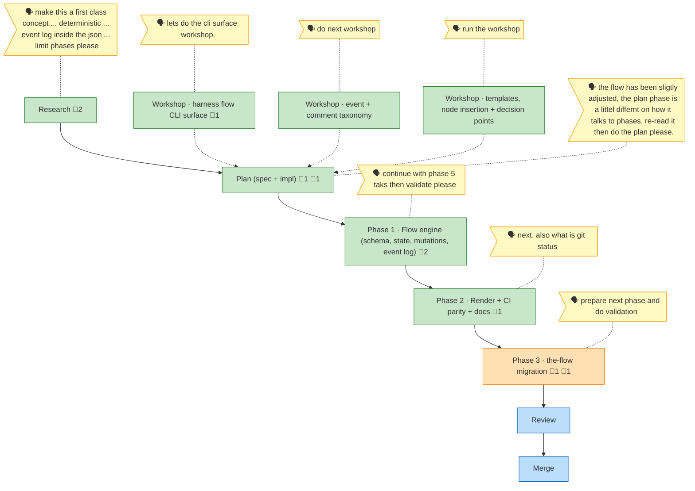

<!-- GENERATED by `harness flow render` — do not hand-edit; regenerate from the flow JSON. -->
# Flow · first-class-flow-system

**Kind**: flight-plan · **Cursor**: p3 · **Next**: p3 · **Nodes**: 10 · **Events**: 30

**Rail**: ◆─◆─◆─◆─◐─◇─◇  research · plan · p1 · p2 · p3 · review · merge

**Legend**: 🟩 done · 🟧 in-progress · 🟥 blocked · 🟦 known (designed) · ⬜ assumed (speculative) · 🔶 decision · 🗣 user input · 🟪 harness loop · 🤖 companion · 🛠 worker.

## Node log

### research · Research
- 📄 artifacts: research-dossier.md, original-ask.md

### plan · Plan (spec + impl)
- 📄 artifacts: first-class-flow-system-plan.md
- `2026-06-18T05:20:59.666Z` · agent · validation — validate-v2 (NARROW) on v1.2.0 = VALIDATED WITH FIXES.

### p2 · Phase 2 · Render + CI parity + docs
- 📄 artifacts: tasks/phase-2-deterministic-render-ci-parity-docs/tasks.md

### p3 · Phase 3 · the-flow migration
- 📄 artifacts: tasks/phase-3-the-flow-migration-onto-the-cli/tasks.md
- `2026-06-18T05:20:59.741Z` · agent · validation — validate-v2 (BROAD, 4 agents) on Phase 3 dossier = VALIDATED WITH FIXES; READY for implement GO.

### p1 · Phase 1 · Flow engine (schema, state, mutations, event log)
- 📄 artifacts: tasks/phase-1-flow-engine/tasks.md, tasks/phase-1-flow-engine/execution.log.md

### ws-cli · Workshop · harness flow CLI surface
- 📄 artifacts: workshops/001-harness-flow-cli-surface.md
