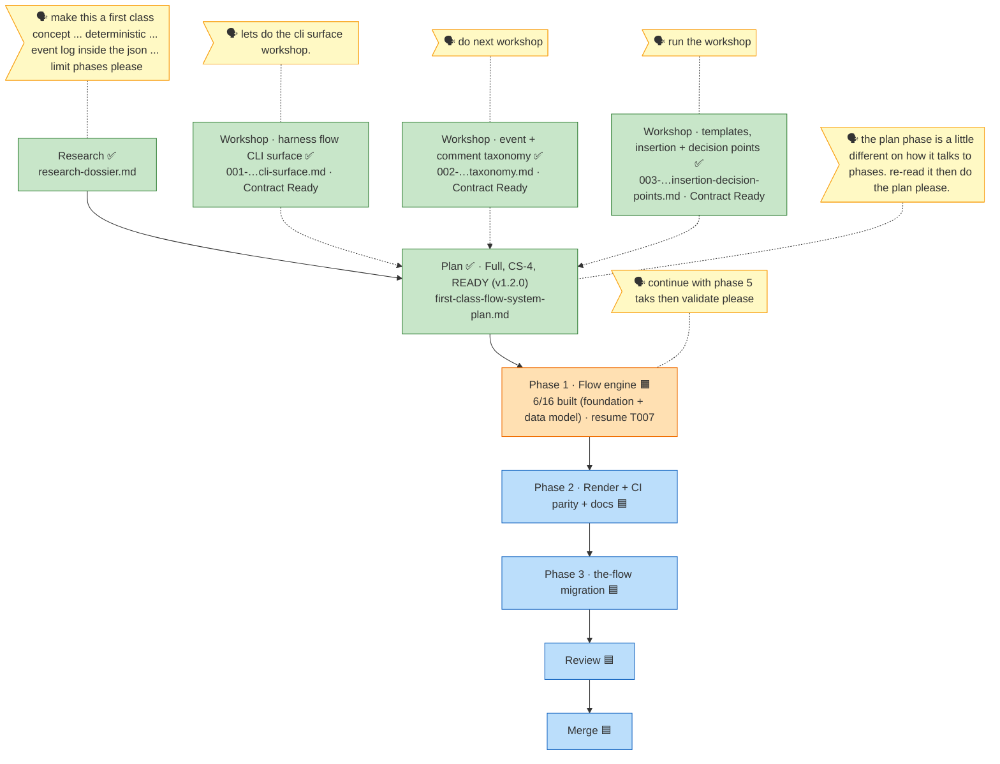

<!-- GENERATED FROM the-flow.json — do not hand-edit; regenerate from the JSON. -->
# Flight plan · 024-first-class-flow-system

**Mode**: Full · **CS-4** · **Cursor**: Phase 1 (🟧 in progress · 6/16 built, green) · **Next**: resume implement from T007 (recommend /compact) · **Workshops**: 001 ✅ 002 ✅ 003 ✅ (all folded)

**Legend**: 🟩 done · 🟧 in-progress · 🟥 blocked · 🟦 known (designed) · ⬜ assumed (speculative) · 🗣 user input · 🟪 harness loop (appears at the phase edges — pre-flight boot before each phase, post-coding retro after).
