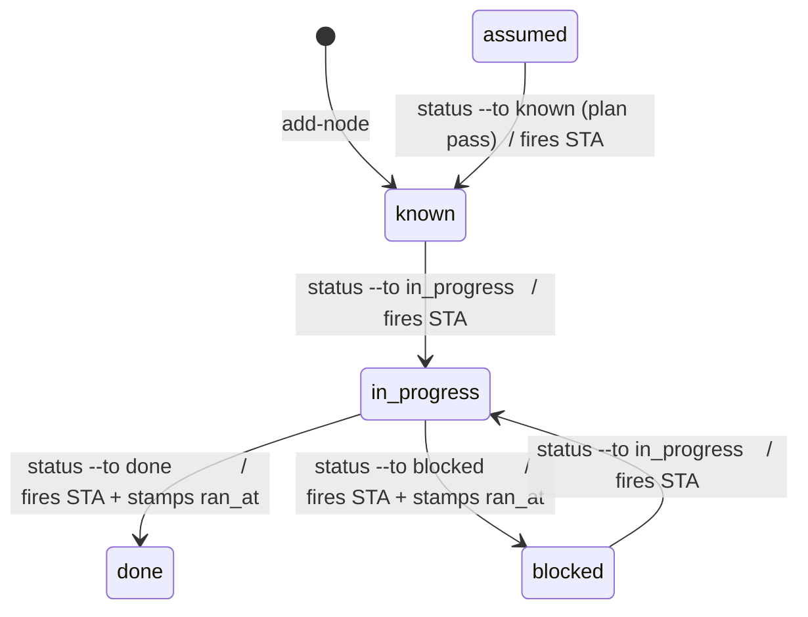

# Workshop: Event + Comment Taxonomy

**Type**: Data Model + State Machine
**Plan**: 024-first-class-flow-system
**Spec**: [first-class-flow-system-plan.md](../first-class-flow-system-plan.md) · § Business Specification
**Created**: 2026-06-17
**Status**: Approved

**Value Thesis**: Pin the one genuinely greenfield piece of the flow system — the embedded `events[]` log + per-node `comments[]`, the datetime semantics, the three-tier event taxonomy, and the duck-typing rules — so Phase 1's data-model tasks (1.3/1.4/1.7/1.8) build to a fixed contract. This is the design with the least to copy and the most freedom: **0 of 20** prior flows used `events[]` or `comments[]`, yet the *need* is proven — the 021 state file and 004 `note` fields are the log "trying to exist" badly.
**Target Proof Level**: Contract Ready
**Current Proof Level**: Contract Ready

**Selected Value Axes**:
- **Knowability**: makes hidden flow history explicit and queryable — *when* each thing happened, not buried in prose.
- **Implementation Readiness**: Phase 1 tasks 1.3/1.4/1.7/1.8 get a fixed event/comment schema, kind enum, id format, and duck-typing algorithm.
- **Learning Compounding**: structured, timestamped history replaces the free-text blobs that today have to be re-read and re-parsed every session.
- **Safety to Change**: append-only + tolerant parsing (never drop an entry) means the log can evolve without losing audit trail.

> **Errata (grill 4, folded into plan v1.1.0)**: this workshop references a `flow agent` verb and an `agents[]`-population migration (below). Both are **deferred to v2** — v1 has **no `flow agent` verb** and the migrated `the-flow` leaves `agents[]` unpopulated. The `agents[]` field stays in the shared-core schema (tolerated + renderable); ignore the `flow agent` mentions when building Phase 1.

**Related Documents**:
- [001-harness-flow-cli-surface.md](./001-harness-flow-cli-surface.md) — pins the *verb shape* of `flow event` / `flow comment`; this workshop pins the *data + kinds* they write.
- [research-dossier.md](../research-dossier.md) § *The event log + per-node comments* (EV-01..EV-16, CD-03/CD-03b) and § *Notes on prior flows*.
- **Real precedents lifted**: `services/observe/buffer-codec.ts` (id format + tolerant parse), `services/record/provenance.ts` (the 7-key provenance block).

**Domain Context**:
- **Primary Domain**: harness-cli · flow (`services/flow/flow-events.ts`)
- **Related Domains**: harness-cli · output (Clock/Git/Env ports for stamping); observe + record services (precedents reused, not imported)

---

## Purpose

Decide the shape and rules for the two timestamped surfaces the user asked for ("inside the main json file, not separate"; "each flow node needs the ability to have one or more comments appended, each with their own datetime"). Drives Phase 1's event/comment/datetime tasks and grounds *why* `.the-flow-state.json` returns to minimal (audit/history moves into `the-flow.json`).

## Fresh Entrant Outcome

A fresh human or agent should reach **Contract Ready** with no extra context — able to:
- Decide whether a given fact belongs in a root `event` or a node `comment`.
- Enumerate the three event tiers (built-in / public-manual / custom) and which kinds are in each.
- Predict the `type` the duck-typer assigns to any `--value`, and where it's stored.
- Know how durations are obtained (derived at read time, never stored) and how provenance is stamped (once, at the root, reusing the record 7-key block).

## Key Questions Addressed

1. **Two surfaces — when `events[]` vs `comments[]`?** → flow-scoped machine facts → events; node-scoped narrative → comments.
2. **Which built-in (un-exposed) event kinds?** → `created`, `cursor-moved`, `status-changed`, `node-created`, `node-updated` (engine-fired side effects).
3. **Any public-but-manual kinds (the "build-run hooks?")?** → yes — a `manual` tier (`build-run`, `test-run`, `deploy`, `checkpoint`, …), same append path, fired deliberately.
4. **Custom telemetry duck-typing?** → `bool | int | float | date | string` auto-selected from `--value` shape, `type` stored explicitly; `--type` overrides.
5. **Where are durations computed?** → derived at **read time** from `fired_at`/`ran_at`; never stored (the log is the immutable source).

---

## Value Frame

| Field | Selection | Why It Matters |
|-------|-----------|----------------|
| Target Proof Level | Contract Ready | Phase 1 needs a fixed event/comment schema + kind enum + duck-typing rule to build to |
| Primary Value Axis | Knowability | Turns prose history into queryable, timestamped structure |
| Supporting Value Axes | Implementation Readiness · Learning Compounding · Safety to Change | Seeds Phase 1 tasks; ends re-parsing; append-only + tolerant |
| Downstream Loop Improved | Implementation (Phase 1) + every future temporal analysis | Fixed shape now; "time between stages" answerable later without schema change |

## The two surfaces at a glance

```
the-flow.json (root)
├── provenance { harness_version, branch (=created_from_branch), repo,
│                created_at, agent, plan_id }        ← stamped ONCE (record 7-key block)
├── events[]   ← flow-scoped, machine-fired + manual + custom; append-only; immutable
│     { id, kind, origin, fired_at, description, details{}, [name,type,value] }
└── nodes[]
      └── <node>.comments[]   ← node-scoped narrative; append-only; immutable
            { at, text, [source], [kind], [refs[]] }
```

> **The dividing rule**: if it is *"the system did X at time T"* (cursor moved, status changed, a build ran, a metric was captured) → **event**. If it is *"someone observed / decided / noted Y about this node at time T"* (a phase's outcome, a workshop's resolution, a review note) → **node comment**. Most of 021's prose keys are node comments; the flow-scoped ones (`closed_out`, `milestones_note`) are root events.

---

## Decision Space

### E1 — Event tiers (the user's three questions, answered)

| Tier | Origin | Fired by | Kinds | `flow event` callable? |
|------|--------|----------|-------|------------------------|
| **Built-in** | `engine` | the CLI, as a **side effect** of a mutation | `created`, `cursor-moved`, `status-changed`, `node-created`, `node-updated` | **No** — un-exposed; you get them for free when you run `cursor`/`status`/`add-node`/`set-node`/`comment` |
| **Public-manual** | `manual` | an agent or external tooling, **deliberately** | `build-run`, `test-run`, `deploy`, `checkpoint`, `gate` (open set) | **Yes** — `flow event build-run --kind manual …` |
| **Custom telemetry** | `manual` | repo-defined, ad-hoc | `custom` (with a free `name`) | **Yes** — `flow event <name> --kind custom --value <v>` |

> Answers the brief directly: built-in = "not exposed (move cursor), node status change (blocked etc)" ✓ · public-manual = "public but manually called by agents or external tooling (like build run hooks)" ✓ · custom = "telemetry style event capture — name, type, value, auto-selected (duck-typed)" ✓. All three append to the **same** `events[]`; the `origin` field (`engine | manual`) + `kind` distinguish them. No per-tier schema — custom events need **no** schema (user requirement).

### E2 — Built-in event payloads (what each side-effect records)

| Kind | Prefix | Fired when | `details{}` |
|------|--------|-----------|-------------|
| `created` | `CRT` | `flow create` | `{ kind, slug }` |
| `cursor-moved` | `CUR` | `flow cursor --to` | `{ from, to }` |
| `status-changed` | `STA` | `flow status` | `{ node, from, to }` |
| `node-created` | `NOD` | `flow add-node` | `{ node, type }` |
| `node-updated` | `UPD` | `flow set-node` / `flow comment` | `{ node, fields[] }` |

> `flow agent` and `flow comment` also leave a trace: a comment append fires `node-updated` (the comment text itself lives in the node's `comments[]`, not duplicated in the event). This keeps every mutation auditable without bloating the event with narrative.

### E3 — Duck-typing algorithm (custom events)

Given `flow event <name> --kind custom --value <raw>` (and optional `--type <t>`):

```
type =
  --type given?                              → use it (explicit wins)
  raw ∈ {true,false} (case-insensitive)      → bool      → value: boolean
  raw matches ISO-8601-UTC datetime          → date      → value: string (the ISO)
  raw matches ^-?(0|[1-9]\d*)$               → int       → value: number   (no leading zeros)
  raw matches ^-?\d+\.\d+([eE]-?\d+)?$        → float     → value: number
  otherwise                                  → string    → value: string
```

- **`type` is stored explicitly** alongside the parsed `value`, so readers deserialize without re-guessing (JSON already duck-types; we persist the decision).
- **Leading-zero rule**: `"007"` → `string` (preserve ids/codes); only canonical integers become `int`.
- `--type` override exists for the ambiguous cases (e.g. force `"42"` to stay a `string` label).

> **Why store `type` when JSON has types**: the *input* is a CLI string; the duck-typer is what turns `"true"`/`"42"`/`"2026-06-17T…Z"` into the right JSON type. Persisting `type` records *which branch fired*, so a `date` (stored as an ISO string) is never confused with a plain string downstream.

### E4 — Durations: derived, never stored

| Option | Decision |
|--------|----------|
| Store computed durations on nodes/events | **Rejected** — duplicates state, goes stale, makes the log mutable |
| Store only timestamps; compute deltas at read time | **Selected** — `fired_at` (events) + `ran_at`/`created_at` (nodes) are the immutable source; "time between stage A→B" = `B.ran_at − A.ran_at`, computed by a reader (`flow show --durations` later, or any downstream analysis) |

> The log is the **source of truth**; a duration is an **interpretation**. v1 stores the timestamps and ships the data; a read-side duration helper is additive and out of scope here.

### E5 — Provenance: stamped once, reusing the record 7-key block

The flow root carries a `provenance` object identical in shape to `services/record/provenance.ts`'s Frozen Contract (minus the template-owned `schema_version`):

```jsonc
"provenance": {
  "harness_version": "0.3.0",      // injected version string
  "branch": "024-first-class-flows", // GitPort.currentBranch() — THIS is created_from_branch
  "repo": "github.com/AI-Substrate/harness-engineering", // GitPort.remoteUrl()
  "created_at": "2026-06-17T21:05:00.000Z", // Clock.nowIso()
  "agent": "claude-opus",          // HARNESS_AGENT env (null if unset)
  "plan_id": "024-first-class-flow-system" // HARNESS_PLAN_ID env (null if unset)
}
```

> **Key reuse**: the user's requested `created_from_branch` ("git branch that was on when created") is *exactly* the record provenance `branch` key — no new mechanism. Stamping once at the root (not per-event) mirrors the record service and keeps events lean. Per-node `created_at`/`modified_at`/`ran_at` are still stamped per-node (different lifecycle).

### E6 — Event id format (reuse observe's `nextId`)

`<PREFIX>-<NNN>` — the exact shape from `services/observe/buffer-codec.ts` (`ID_PATTERN = /^[A-Z]+-\d{3,}$/`, `nextId = ${prefix}-${String(max+1).padStart(3,'0')}`). Prefixes per E2; custom = `CUS`; public-manual derives a 3-letter prefix from the kind (`build-run`→`BLD`, `test-run`→`TST`, `deploy`→`DEP`). Ordinals are per-prefix, monotonic.

### E7 — Comment shape (already dogfooded by *this* flow)

```jsonc
{ "at": "2026-06-17T21:38:46Z",        // required, ISO-8601 UTC (Clock.nowIso())
  "text": "validate-v2 broad = VALIDATED WITH FIXES; …",  // required
  "source": "agent",                    // optional: user | agent | system
  "kind": "validation",                 // optional: note | decision | warning | validation | …
  "refs": ["d2b0504", "workshops/001…"] // optional: commits / artifacts
}
```

- **Append-only, immutable** — a node *accumulates* its history; comments are never rewritten or removed (a correction is a new comment).
- **Self-validating precedent**: this exact shape is already in `024`'s own `the-flow.json` (the `plan` and `ws-cli` nodes carry `{at, source, kind, text}` comments) — the workshop formalises a shape proven by use.

### E8 — Tolerant + append-only (the observe principle)

Never silently drop. A malformed/unknown entry is **preserved** (observe's tolerant parser keeps "deviant blocks"); an unknown event `kind` is stored and rendered as-is rather than rejected. Writes are atomic (temp + rename, per workshop 001). This makes the log safe to evolve and safe under hand-edits.

---

## "Born badly → born well" — the 021 + 004 migration map

The concrete payoff. Every ad-hoc prose key in `021/.the-flow-state.json` and every `note` blob in `004` maps cleanly onto the new structure:

| Today (real, in the wild) | Surface | New form |
|---------------------------|---------|----------|
| `phase1_done` / `phase2_done` / `phase3_done` (021) — *"IMPLEMENTED 2026-06-17 … commits 8e1b4ed…"* | node `comments[]` on p1/p2/p3 | `{ at, text, source:agent, kind:note, refs:[commits] }` — **date out of prose into `at`** |
| `phase3_review_note` (021) | comment on p3 (or review node) | `{ at, kind:decision, text, refs }` |
| `ws1_resolution` (021) | comment on the ws1 node | `{ at, kind:decision, text }` |
| `phase2_budget` (021) — accepted-overage decision | comment on p2 | `{ at, kind:decision, text }` |
| `closed_out` (021) — flow-scoped | root `events[]` | a `checkpoint`/`custom` manual event + node status |
| `milestones_note` (021) — flow-scoped | root `events[]` | a `custom` event |
| `branch` (021) | **structured field** | `provenance.branch` (= `created_from_branch`) — not a key at all |
| 004 phase `note` mega-blobs (commits, F001/F002 findings, coverage %, companion result) | node `comments[]` (the narrative) + `agents[]` (the companion result) | several timestamped comments + the `flow agent` record |

> This table *is* the thesis: `.the-flow-state.json` returns to a minimal resume contract; all history becomes structured, timestamped `events[]` + `comments[]` in `the-flow.json`. Dates that were trapped in sentences (*"IMPLEMENTED 2026-06-17"*) become queryable `at`/`fired_at` fields (CD-03b).

---

## State Machine — which transitions fire which events



| Transition | Built-in event | Side effects |
|------------|----------------|--------------|
| `flow create` | `created` (CRT) | provenance stamped; cursor=null |
| `flow cursor --to X` | `cursor-moved` (CUR) `{from,to}` | `recommended_next` optional |
| `flow status --node n --to s` | `status-changed` (STA) `{node,from,to}` | `modified_at` always; `ran_at` on →done/→blocked |
| `flow add-node` | `node-created` (NOD) | node `created_at` stamped |
| `flow set-node` / `flow comment` | `node-updated` (UPD) | `modified_at` bumped |

> Illegal transitions (backwards moves, unknown node) → `E305` (workshop 001). The event log thus doubles as the transition history.

---

## Render surface — how `user_input` + `comments[]` reach the rendered `.md`

> **Added 2026-06-18** (this workshop designed the `comments[]` *data model* but not how it *renders*; the render-surface decision below closes that gap and folds into Phase 2 + AC-06). Decided with the user at the v1.2.0 re-plan seam.

The render output is **mermaid + markdown** (AC-06). Each surface gets a deliberate home so the diagram stays glanceable while nothing is lost:

| Field | Mermaid (the diagram) | Markdown (the body, below the diagram) |
|-------|------------------------|-----------------------------------------|
| node `status` | **node box colour** (`classDef` per status — render rule 5) | shown in the per-node log header |
| node `user_input` | **the one 🗣 genesis bubble** — the directive that *created / first-directed* the node (e.g. *"do this workshop"*); render rule 6, **unchanged** | repeated in the per-node log header |
| node `comments[]` | **a `💬N` count badge** on the node (N = number of comments) — **never bubbled** | **the full per-node history log**: each comment's `at`, `source`/`kind`, and `text`, in order |
| root `events[]` | (not on the diagram) | optional flow-level event summary in the body (durations derivable per § E4) |

**The dividing rule (render edition)**: exactly **one** bubble per node — the genesis `user_input`. Everything that accrues *after* the node was created (later steers, grill decisions, agent validation notes) lives in `comments[]` and surfaces as the **count badge + body log**, not as more bubbles. This keeps the clean one-bubble-per-node look the prototype already has, while making `comments[]` *discoverable* (the count) and *auditable* (the body) instead of JSON-only.

```
DIAGRAM (glance)                     MARKDOWN BODY (full audit, below the mermaid)
  🗣 "do this workshop"               ### Plan — done · ran 2026-06-17
       ┊                              🗣 genesis: "re-read it then do the plan please"
  ┌──────────────┐                    💬 2026-06-18 user/decision: render-surface decision…
  │ Plan ✅  💬9  │                    💬 2026-06-17 user/decision: NEW templates requirement…
  └──────────────┘                    💬 2026-06-17 agent/validation: validate-v2 = VALIDATED…
                                          …all 9, timestamped + source/kind-tagged
```

- **No flag** — baked in one way (a `flow render` style flag is additive later if ever needed).
- **Render-only** — the body-log is *derived output* (a pure function of the flow JSON's `comments[]`), **never parsed back**. The JSON is the single source of truth; no consumer (incl. `the-flow`) depends on the rendered markdown shape, so the body-log format can evolve freely.
- **Escaping**: bubble/badge/body text is mermaid-safe-escaped (plan task 2.3) — comment text is user-supplied.
- **Decision nodes** (workshop 003 DP2) get their own class on the diagram; their option labels are the successor sub-flow heads. Unknown kinds/types fall back gracefully (§ E8 / workshop 001 tolerance).

**Folds into**: Phase 2 render rules + AC-06 (the markdown-body content is now specified, not just "markdown") + task 2.2 (badge + body-log + decision-node render tests). The-flow's deleted hand-render prose (Phase 3 task 3.3) is replaced by this CLI-owned surface.

---

## Evidence Ledger

| Evidence | Location | Supports | Status |
|----------|----------|----------|--------|
| Two-surface dividing rule | § two surfaces | E1; AC-04/AC-05 | Ready |
| Three-tier kind taxonomy | § E1 | the user's 3 event questions; AC-05 | Ready |
| Built-in payload table | § E2 | task 1.3/1.7 | Ready |
| Duck-typing algorithm | § E3 | task 1.4; AC-05 | Ready |
| Durations = derived | § E4 | "time between stages" (CD-03b) | Ready |
| Provenance reuse (record 7-key) | § E5 | `created_from_branch`; task 1.3 | Ready |
| Id format reuse (observe) | § E6 | task 1.8 | Ready |
| Comment shape (dogfooded) | § E7 | AC-04; proven in 024's own flow | Validated |
| 021 + 004 migration map | § born badly → born well | the whole thesis; CD-03 | Validated (real data) |

## Attention Reduction

| Future Loop | Before | After |
|-------------|--------|-------|
| Implementation (Phase 1) | event/comment shape, kinds, duck-typing all "TBD" | fixed schema + kind enum + algorithm to build to |
| Resuming a flow | re-read prose blobs, parse dates from sentences | query `events[]`/`comments[]` by `at`/`fired_at` |
| Temporal analysis | impossible (dates in prose) | derive any duration from stored timestamps |
| Audit / history | scattered across `.the-flow-state.json` keys | one append-only log in `the-flow.json` |

## Validation / Acceptance

Reaches **Contract Ready** when:
- The two surfaces have a clear dividing rule and field schemas. ✅
- The three event tiers are enumerated with example kinds and `flow event` callability. ✅
- The duck-typing algorithm is deterministic for every input class. ✅
- Durations and provenance have explicit decisions grounded in real precedents. ✅
- Every 021/004 prose blob has a target form. ✅
- Folds into the plan's `### Clarifications` + Phase 1 task criteria (1.3/1.4/1.7/1.8) on the next `plan` pass. ⏳

## Open Questions

### Q1: Is the `events[]` log capped / rotated?

**RESOLVED (no cap v1)**: append-only, unbounded; flows are short-lived (one plan). If a flow ever grows huge, archival is a flow-lifecycle concern (the plan's Open Question on archive-on-completion), not an event-log concern. No silent truncation (tolerant principle).

### Q2: Does `flow event` validate public-manual kind names against a registry?

**RESOLVED (open set, no registry)**: `manual` kinds are an open vocabulary — no registry, no validation beyond `--kind manual|custom`. A typo'd kind is still recorded (tolerant), not rejected. Keeps "custom events need no schema" true.

### Q3: Should built-in events be suppressible (quiet mode)?

**DEFERRED**: built-ins fire unconditionally in v1 (they're the audit trail). A `--no-events` escape hatch is additive if a consumer ever needs it; not v1.

### Q4: Comment `kind` — fixed enum or open?

**RESOLVED (open, suggested set)**: `note | decision | warning | validation` are *suggested*, not enforced — same tolerance as event kinds. The renderer styles known kinds and falls back gracefully for others (ties to workshop 001's "renderer tolerates unknown types").
