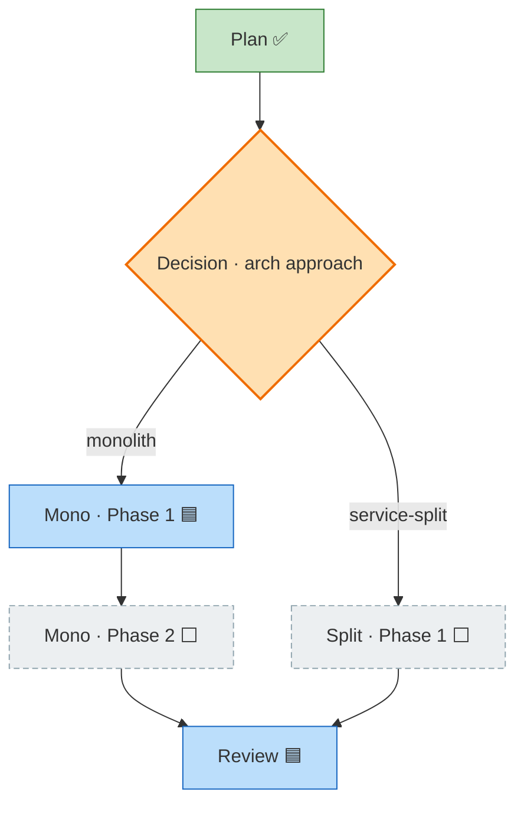

# Workshop: Templates, Dynamic Node Insertion + Decision Points

**Type**: Data Model + State Machine + CLI Flow (hybrid)
**Plan**: 024-first-class-flow-system
**Spec**: [first-class-flow-system-plan.md](../first-class-flow-system-plan.md) · § Business Specification
**Created**: 2026-06-18
**Status**: Approved

**Value Thesis**: A flow is **born from a template** and then **grows dynamically** — phases get revealed, workshops get inserted after they run, decision points fork the path. Today the agent does all of that by **hand-recomputing `next[]` edges** in prose (this very flow inserted three workshop nodes — `ws-cli`/`ws-events`/`ws-insert` — by hand, one edge-edit at a time). This workshop pins the three mechanics that make growth **deterministic and easy for the agent**: (1) `flow create` scaffolds a **template skeleton**, not a bare flow; (2) an `insert-node` verb that **splices the edges for you** (`--after`/`--before`/`--branch-of`); (3) a `decision` node **type** for branch points. The agent names a *relationship*; the CLI does the graph surgery. This is the last build-prerequisite before Phase 1.

**Target Proof Level**: Contract Ready
**Current Proof Level**: Contract Ready

**Selected Value Axes**:
- **Agent Readiness**: the agent says `insert-node --branch-of plan` instead of reading the JSON, finding the right node, editing its `next[]`, and re-checking the DAG by eye. Edge math moves from the prompt into deterministic code — the single biggest hand-crank ergonomics win in the system.
- **Implementation Readiness**: Phase 1's schema (1.5) + mutations (1.7) + create (1.6) tasks get a fixed verb surface, edge-algebra, and template-resolution contract to build to — no new phase.
- **Safety to Change**: every insertion fires fully-auditable events (`node-created` + a `node-updated` per rewired edge, carrying `edge_op`), so a spliced graph is reconstructable from the log; cycle/orphan splices are rejected (`E309`), never silently corrupting the DAG.
- **Knowability**: a `decision` node makes "we forked here, took option A, left B speculative" explicit and queryable, instead of an undocumented multi-`next` blob.

**Related Documents**:
- [001-harness-flow-cli-surface.md](./001-harness-flow-cli-surface.md) — pins `add-node`/`set-node`/`create`; this workshop **adds `insert-node`** and **enriches `create`** (template + `--bare`) on top of that surface (additive; no 001 decision reversed).
- [002-event-and-comment-taxonomy.md](./002-event-and-comment-taxonomy.md) — the built-in event kinds; this workshop **reuses** `node-created`/`node-updated` (no new built-in kind) and adds an `edge_op` discriminator in `details{}` — fully inside 002's tolerant contract.
- [flight-plan.schema.json](../../../../) (the-flow skill `references/flight-plan.schema.json`) — `node.next` is already `string[]` (DAG edges) and `branch_of` already exists; this workshop adds **one** enum value (`decision`) and **one** verb, nothing more to the data shape.
- [flight-plan.template.json](../../../../) (the-flow skill `references/`) — the real template precedent (a worked 6-phase snapshot); T1 decides what `flow create` actually seeds vs. what stays a doc example.
- **The meta dogfood**: this plan's own [the-flow.json](../the-flow.json) — its `ws-cli`/`ws-events`/`ws-insert` excursions and its `plan → p1/p2/p3` phase reveal are the exact insert operations this workshop makes first-class (see § *Dogfood grounding*).

**Domain Context**:
- **Primary Domain**: harness-cli · flow (`services/flow/flow-service.ts` for templates; `services/flow/flow-mutations.ts` for `insert-node`; `services/flow/flow-schema.ts` for the `decision` type; `flow-renderer.ts` for decision rendering).
- **Related Domains**: the-flow (ships the flight-plan **template** alongside its schema; its guided engine becomes the primary `insert-node` caller), harness-cli · output (`E309`).

---

## Purpose

Decide and document how a flow is **scaffolded from a template** and **edited dynamically** after creation. Drives Phase 1's create/schema/mutation tasks and adds one verb (`insert-node`), one node type (`decision`), and one error code (`E309`) to the contract that workshops 001/002 started. After this workshop the "flows are dynamic — we need a robust, agent-easy way to insert records and decision points" requirement (the user ask that spawned `ws-insert`) is Contract Ready and folds back into `### Clarifications` + Phase 1 task criteria on the next `plan` pass.

## Fresh Entrant Outcome

A fresh human or agent should reach **Contract Ready** with no extra context — able to:

- Predict exactly what `flow create flight-plan --slug X` produces (which nodes, statuses, cursor) and how the template is resolved.
- Compute the resulting `next[]` edges of **any** `insert-node --after|--before|--branch-of` call by hand (the algebra is fully specified) — and know which existing nodes get rewired and which events fire.
- Know when to use `insert-node` vs. the lower-level `add-node` from workshop 001.
- Model a branch point with a `decision` node, predict how it renders, and know how an un-taken branch is represented.

## Key Questions Addressed

1. **Does `flow create` make a bare flow or a populated skeleton?** → A **template skeleton**; `--bare` opts out.
2. **Where does the template live, and how is it resolved?** → A **sibling of the schema** (`<type>.template.json`), same precedence chain as the schema; `--template` overrides.
3. **Is insertion a new verb or a flag on `add-node`?** → A **distinct `insert-node` verb** (it mutates *existing* nodes' edges — `add-node` never does).
4. **What exactly does each splice mode do to `next[]`?** → A fully-specified **edge algebra** (§ I2) — `--after` moves out-edges, `--before` moves in-edges, `--branch-of` adds a non-spine excursion.
5. **What is a "decision point"?** → A `decision` **node type** = a node with ≥2 `next[]` heading **serial sub-flows**; **zero new schema fields** (chosen-ness shown by successor status).

---

## Value Frame

| Field | Selection | Why It Matters |
|-------|-----------|----------------|
| Target Proof Level | Contract Ready | Phase 1 needs a fixed verb + edge-algebra + template-resolution contract; the *code* reaching Implementation Ready is Phase 1's job |
| Primary Value Axis | Agent Readiness | Edge recomputation is the worst remaining hand-crank; `insert-node` deletes it |
| Supporting Value Axes | Implementation Readiness · Safety to Change · Knowability | Seeds Phase 1 tasks; audited+validated splices; explicit decision forks |
| Downstream Loop Improved | Implementation (Phase 1) + every future flow edit (Phase 3 the-flow migration) | Templates + splicing + decisions become CLI calls, not prose graph-editing |

---

## Decision Space

### T1 — `flow create` scaffolds a template skeleton (not a bare flow)

| Option | Description | Pros | Cons | Decision |
|--------|-------------|------|------|----------|
| **A — create from a template skeleton** | `flow create <type>` deep-copies the type's template nodes, then stamps root fields | A new flow is immediately useful (`research → plan → … → merge` present); matches how the-flow starts a flow today; the template is the *canonical* shape of a flow type | Needs a template-resolution rule (T2) | **Selected** |
| B — create a bare flow (root + zero nodes) | Caller must `add-node` everything | Simplest CLI | Pushes the whole skeleton back into prose — re-creates the exact hand-crank we're removing; every flow re-invents its own shape | Rejected (as the **default**; available via `--bare`) |

- **`flow create <type>`** → resolves the type's **template**, deep-copies its `nodes[]` (and `agents[]` if any), then stamps the instance root (`slug`, `plan_dir`, `created_at`, `provenance`, `cursor`) over the template — see T2. Fires built-in `created`.
- **`flow create <type> --bare`** → root + provenance only, `nodes: []`, `cursor: null`. The escape hatch for "I'll build the graph myself" (adoption back-fill, tests, exotic flows).
- **Distinguish the seed from the doc example.** The-flow's existing `references/flight-plan.template.json` is a **worked 6-phase snapshot** for *humans/docs* — it is **not** the create-seed (creating that would scaffold someone else's 6 phases). The create-seed is a **minimal skeleton** (T2). Phase 3 ships both, clearly named (seed = `flight-plan.template.json` minimal; the worked example becomes `flight-plan.example.json`), so `create` never instantiates a worked example. *(Naming is a Phase-3 detail; the contract is "create resolves a minimal seed, not the doc example".)*

> **Why this format**: a flow *type* has a canonical shape — flight-plan is always `research → plan → phases → review → merge`. Encoding that shape once in a template (next to the schema that validates it) means `create` produces a real starting point and the agent only edits the *dynamic* parts. This is the same "scaffold a reusable type" instinct as workshop 001's `new`, applied to instances.

### T2 — Template instantiation mechanics (stamp root, copy nodes verbatim; no templating engine)

The minimal flight-plan **create-seed** (what `flow create flight-plan` actually produces):

```jsonc
// flight-plan.template.json (create-seed — minimal; ships with the the-flow skill)
{
  "schema_version": 1, "kind": "flight-plan",
  "slug": "", "plan_dir": "", "mode": "unknown",   // ← stamped at create
  "cursor": "research",
  "nodes": [
    { "id": "research", "type": "research", "label": "Research", "status": "known", "next": ["plan"] },
    { "id": "plan",     "type": "plan",     "label": "Plan (spec + impl)", "status": "known", "next": ["phases"] },
    { "id": "phases",   "type": "phase",    "label": "Phases (revealed at plan)", "status": "assumed", "next": ["review"] },
    { "id": "review",   "type": "review",   "label": "Review", "status": "known", "next": ["merge"] },
    { "id": "merge",    "type": "merge",    "label": "Merge",  "status": "known", "next": [] }
  ]
}
```

| Rule | Decision |
|------|----------|
| **Root fields** | The CLI **stamps** `slug`, `plan_dir`, `mode`(if given), `created_at`, `provenance` (the record 7-key block, `branch`=`created_from_branch`), and validates `cursor` exists — **overwriting** whatever the template carries. |
| **Nodes** | Deep-copied **verbatim** from the template (ids, types, labels, statuses, `next[]`). No `ran_at`/`user_input` (those accrue as the flow runs). |
| **Substitution** | **None — no templating engine.** Templates are *real, schema-valid flow JSON* with empty root identity fields; the CLI fills identity by stamping, not by `{{mustache}}` expansion. (KISS; a template is itself a `create --bare` output you can hand-author.) |
| **The `assumed` phase placeholder** | The seed carries **one** `assumed` phase node (`phases`). The plan pass **replaces** it with real `known` phase nodes — via `insert-node` (§ I) — which is the bridge from T to I. |

> **Why no templating engine**: the only per-instance values are identity (slug/path/dates/branch/provenance), and the CLI already computes every one of those at create time from ports (Clock/Git/Env). A substitution syntax would add a parser, an escaping problem, and a way to produce invalid JSON — for zero values it can't already stamp. A template is just a flow; that symmetry is the feature.

### I1 — `insert-node` is a distinct verb from `add-node`

| | `add-node` (workshop 001) | `insert-node` (this workshop) |
|---|---|---|
| **Caller supplies** | the full `--next <id>…` edge list | a **relationship** (`--after`/`--before`/`--branch-of <id>`) |
| **Touches existing nodes' `next[]`?** | **No** — only creates a leaf pointing where told | **Yes** — rewires the target's (and/or its neighbours') edges |
| **Edge math done by** | the caller (agent computes edges) | the **CLI** (deterministic algebra, § I2) |
| **Used for** | templates, adoption back-fill, explicit edge authoring | dynamic mid-flow growth (the hot path) |

**Decision: keep both; `insert-node` is the ergonomic default for growth, `add-node` stays the primitive.**

> **Why a separate verb (not a `--after` flag on `add-node`)**: the dangerous, valuable behaviour — *mutating an existing node's edges* — deserves its own auditable verb. `add-node` is provably side-effect-free on the rest of the graph (it only adds a leaf); `insert-node` is provably the only verb that rewires existing edges. That split keeps reasoning (and the event log) clean: see a `node-updated{edge_op}` and you know a splice happened. A future `add-node --after` sugar is additive, but v1 keeps the surgical verb explicit.

### I2 — The edge algebra (the core of this workshop)

For a new node **N** and a target **X**, exactly one mode (`--after` / `--before` / `--branch-of`) is required. Worked against the spine **A → B → C**:

#### `--after X` — splice N *downstream* of X (on the spine)

```
before:   A → B → C            insert-node N --after B
after:    A → B → N → C
```
- `N.next = (old X.next)`  then  `X.next = [N]`.
- **Multi-successor**: if `X.next = [C, D]`, then `N.next = [C, D]` and `X.next = [N]` — **all** of X's out-edges move to N. (To insert before only one of several successors, use `--before` on that successor.)
- Terminal X (`X.next = []`): `N.next = []`, `X.next = [N]` — N becomes the new terminal.
- **Events**: `node-created(N)` + `node-updated(X, {fields:["next"], edge_op:"splice-after"})`.

#### `--before X` — splice N *upstream* of X

```
before:   A → B → C            insert-node N --before B
after:    A → N → B → C
```
- Find **predecessors** P where `X ∈ P.next` (CLI does the reverse scan); in each, replace `X` with `N`. Then `N.next = [X]`.
- **Multi-predecessor**: every node pointing at X is rewired to N (N becomes the single join-in front of X).
- Entry X (no predecessor): `N.next = [X]`, N becomes the new entry; nothing else rewired.
- **Events**: `node-created(N)` + `node-updated(Pᵢ, {fields:["next"], edge_op:"splice-before"})` **per** rewired predecessor.

#### `--branch-of X` — N is an excursion off X (the workshop / fix-loop case)

```
before:   A → B → C            insert-node N --branch-of B
after:    A → B → C            (spine unchanged)
               ┊                N.branch_of=B, N.next=[B]  (dotted excursion off B,
               N                 rejoins B; B.next stays [C])
```
- `N.branch_of = X`; `N.next = [X]` (rejoin target; override with `--rejoin <id>`); **`X.next` is unchanged** — the spine is *not* interrupted (renderer rule 3: excursions are dotted `-.->`).
- This is exactly what `ws-cli`/`ws-events`/`ws-insert` are (`branch_of: plan`, `next: ["plan"]`).
- **Events**: `node-created(N)` only (no existing edge mutated).

| Mode | New node's `next` | Existing edges rewired | On the spine? | Typical use |
|------|-------------------|------------------------|---------------|-------------|
| `--after X` | old `X.next` | `X.next → [N]` | yes | reveal a phase; add a step between two spine nodes |
| `--before X` | `[X]` | each predecessor of X: `X → N` | yes | insert a gate/step ahead of an existing node |
| `--branch-of X` | `[X]` (or `--rejoin`) | none | no (dotted excursion) | a workshop that ran, a fix-loop, deep-research |

**Shared `insert-node` flags**: `--id` `--type` `--label` (required) · `--status` (default `known`) · one of `--after`/`--before`/`--branch-of <id>` (required, mutually exclusive) · `--rejoin <id>` (branch-of only) · `--phase <n>` · `--command "<…>"` · `--path`/`--plan-dir` · `--json`. (Node *content* flags mirror `add-node`; the *placement* flags are what's new.)

### I3 — Insertion is validated (illegal splices rejected, never silently corrupting the DAG)

| Condition | Result |
|-----------|--------|
| Target id `X` doesn't exist | `E305 FLOW_NODE_NOT_FOUND` |
| New id `N` already exists | `E305` (duplicate id) |
| Zero or >1 of `--after`/`--before`/`--branch-of` | `E108 INVALID_ARGS` |
| Splice would create a **cycle** (graph no longer a DAG) | **`E309 FLOW_EDGE_INVALID`** (new) |
| `--rejoin`/`--after`/`--before` target id absent | `E305` |

- The CLI re-runs a **reachability/DAG check** after computing the splice, *before* the atomic write — a rejected splice never lands. This is the determinism the agent is buying: not just "edges rewired" but "edges rewired **and** still a valid DAG, or nothing changed."
- **`E309 FLOW_EDGE_INVALID`** is a new code (verified free — `error-codes.ts` is allocated only through `E204`; the plan reserves `E300–E308`; `E309` is the next free slot). Covers cycle / would-orphan / illegal splice. Folds into Phase 1 task 1.11's `E3xx` block (the same way workshop 001 grew the block from `E300–E304` to `E300–E307`).

### I4 — Insertion is fully auditable (reuse 002's kinds; add an `edge_op` discriminator)

- Each splice fires `node-created` (N) plus one `node-updated` **per** existing node whose `next[]` changed, with `details: { node, fields: ["next"], edge_op: "splice-after" | "splice-before", from: [...], to: [...] }`.
- **No new built-in event kind** — this stays inside workshop 002's frozen set `{created, cursor-moved, status-changed, node-created, node-updated}`. The `edge_op` lives in the free-form `details{}` (002 §E2/E8: `details` is open, parser is tolerant), so a reader distinguishes a plain field-edit from an edge-splice without expanding the enum. **Reconciles cleanly with 002.**
- Net: the event log replays the graph's construction — *"`ws-cli` created, `plan` edges spliced"* — making "how did this DAG get this shape?" answerable from the log alone (002's "the event log doubles as transition history", extended to topology).

### DP1 — `decision` node type: ≥2 `next[]` = serial sub-flows, with **zero new schema fields**

| Option | Description | Pros | Cons | Decision |
|--------|-------------|------|------|----------|
| **A — `decision` type, edges via existing `next[]`, options are the successor nodes** | `type: "decision"`, `next: [headA, headB]`; each successor is the head of a sub-flow; "chosen" shown by successor **status** | Zero new schema fields (`next[]` is already `string[]`); renderer already draws multi-`next`; the singular cursor naturally makes the sub-flows **serial** | Edge labels = successor node labels (no separate per-edge label) | **Selected** |
| B — add an `options[]` field `[{to,label,chosen}]` | Per-edge labels + explicit `chosen` flag | Richer labels | New schema surface; duplicates `next[]`; needs sync rules; over-built for v1 | Rejected (additive later if per-edge labels are ever needed) |

- A **decision node** is a node with `type: "decision"` and **≥2 `next[]`**, each successor being the **head of a sub-flow** (a chain that typically rejoins the spine). It's grown with `insert-node` like everything else (`insert-node optA --after dec1`, `insert-node optB --after dec1` → `dec1.next = [optA, optB]`).
- **"Serial sub-flows"** falls out of the **singular cursor**: the cursor visits one successor's sub-flow at a time (work option A to done, then `flow cursor --to` option B's head if both are taken). True *parallel* nodes are an explicit plan **Non-Goal** (deferred) — `decision` gives the fork **without** parallelism.
- **Chosen-ness needs no new field**: the taken branch advances `assumed → known → in_progress → done`; an un-taken branch stays `assumed` (speculative, never run).

> **Why reuse `next[]`**: the DAG already supports multiple out-edges; the only thing missing was a *type* that says "this is a deliberate fork" so the renderer and reader treat it as one. Adding a node-type value (tolerated by 002/001's "renderer tolerates unknown types") is the smallest change that delivers the concept — no parallel field to keep in sync with `next[]`.

### DP2 — Decision render, cursor traversal, and pruning an un-taken branch

- **Render**: a `decision` node gets its own `classDef` (a distinct fill, e.g. amber-diamond styling) so a fork reads differently from straight spine; its `next[]` render as the labelled branches (edge order = `next[]` order), each leading into its sub-flow. Unknown to old renderers → falls back to the default class (001's tolerance rule), so it's safe to ship incrementally.
- **Cursor**: the cursor may rest on a `decision` node and move to **any one** successor (`flow cursor --to <head>`). The CLI does **not** choose — routing/"what's next" stays in the prose Graph (plan **Non-Goal**). It only permits the move and fires `cursor-moved`.
- **Pruning / declining a branch**: the frozen flight-plan status set is `{done, in_progress, blocked, known, assumed}` — an un-taken branch stays **`assumed`**. A flow type that wants an explicit **`declined`** status **declares it in its overlay** — exactly the **overlay-declared status vocabulary** the plan added for forward-compat (Finding 02b; AC-03/AC-10). So decision-point pruning is the *first real consumer* of that extension hook: the-flow's flight-plan overlay leaves un-taken branches `assumed`; the later adopt-flow overlay (which already needs `declined`) renders them as declined — **without any core change**. (Nice convergence: the FC fix wasn't speculative — `decision` uses it.)

---

## Overview — additions to the workshop-001 surface

```
harness flow
├── new <type>                          author a flow TYPE (schema)            [001]
├── create <type> [--bare] [--template] instantiate from a TEMPLATE skeleton   [001 + T1/T2 here]
├── show / list                                                                [001]
│   ── mutations ──
├── cursor / status / add-node / set-node / comment / event                    [001]
├── insert-node --id … --type … --label …                                      [NEW — this workshop]
│        (one of) --after <id> | --before <id> | --branch-of <id> [--rejoin <id>]
└── render [--check]                                                           [001]
```

- **`create`** gains `--bare` (skeleton off) and `--template <path>` (override the resolved seed). Template resolves as a **sibling of the schema** (`<dir-of-resolved-schema>/<type>.template.json`), so the-flow's skill-shipped schema + template travel together (single owner; `--schema` already points the CLI at the skill home, AC-11).
- **`insert-node`** is the one net-new verb. Everything else is unchanged from 001.
- **`decision`** is added to the node `type` enum (the only data-shape change).

| Command | Purpose | Writes? | Key error codes |
|---------|---------|---------|-----------------|
| `flow create <type> [--bare]` | Instantiate from a template skeleton (or bare) | yes | E304, E303, E302, E306 |
| `flow insert-node … --after\|--before\|--branch-of <id>` | Insert a node, splicing edges deterministically | yes | E305, **E309**, E108, E301, E302 |

---

## Dogfood grounding — this flow built itself by hand; here's the CLI form

Every dynamic edit `024`'s own `the-flow.json` made by hand maps to one `insert-node` (or `create`) call. This *is* the proof the verb is needed — the agent did this edge math manually three-plus times this session:

| What happened in `024` (hand-cranked) | The CLI call that would have done it |
|----------------------------------------|--------------------------------------|
| Created the flow (research → plan → … skeleton) | `flow create flight-plan --slug first-class-flow-system` |
| Plan revealed 3 phases → replaced the `assumed` placeholder | `flow insert-node p1 --type phase --after plan` · `… p2 --after p1` · `… p3 --after p2` (then `status` the placeholder out) |
| Ran the CLI-surface workshop → added `ws-cli` | `flow insert-node ws-cli --type workshop --branch-of plan` |
| Ran the event-taxonomy workshop → added `ws-events` | `flow insert-node ws-events --type workshop --branch-of plan` |
| Surfaced *this* workshop → added `ws-insert` | `flow insert-node ws-insert --type workshop --branch-of plan` |

> Three `--branch-of plan` excursions + a three-node `--after` phase reveal — done by hand, edge by edge, this session. With `insert-node` each is one deterministic, audited call. The requirement isn't hypothetical; it's the transcript.

## Decision-point worked example

A post-plan architecture fork (monolith vs. service-split), each option a **serial sub-flow** that rejoins at `review`:



- `dec1` = `{ type: "decision", next: ["monoA", "svcA"] }` — built with two `insert-node … --after dec1` calls.
- The monolith branch is being taken (`monoA` known/in-progress); the service-split branch stays `assumed` (un-taken). Edge labels are the successor sub-flow heads' meaning; the singular cursor keeps them **serial**.
- No new schema field — `type: "decision"` + `next[]` + the `decision` classDef is the whole feature.

---

## Error Codes — one addition to the `E3xx` block

| Code | Constant | Message / Cause |
|------|----------|-----------------|
| **E309** | `FLOW_EDGE_INVALID` | An `insert-node` splice would create a cycle / orphan / otherwise-invalid DAG; rejected before write |

> Extends workshop 001's `E300–E307` and the plan's `E308` (legacy). `E309` verified free (`error-codes.ts` allocated only through `E204`). Folds into Phase 1 task 1.11.

---

## Folds into the plan (deltas for the next `plan` pass)

This workshop is **additive** — no new phase, no prior decision reversed. The re-plan folds:

| Target | Delta |
|--------|-------|
| **AC-01** (`create`) | …instantiates from a **template skeleton** (default) or `--bare`; template resolves as a sibling of the schema. |
| **AC-06** (render) | renderer handles the **`decision`** node type (distinct class; unknown-type tolerance already covers older renderers). |
| **New AC** (suggest **AC-15**) | `flow insert-node --after/--before/--branch-of` splices `next[]` per the § I2 algebra, validates the result is still a DAG (`E309`), and fires `node-created` + per-edge `node-updated{edge_op}`. |
| **Task 1.5** (schema) | add `decision` to the node `type` enum; document the `edge_op` `details` convention. |
| **Task 1.6** (create/service) | resolve + deep-copy the template seed; stamp root; `--bare`/`--template`; ship the minimal flight-plan create-seed (Phase 3 for the-flow's copy). |
| **Task 1.7** (mutations) | implement `insert-node` (the three-mode edge algebra + DAG re-check + audit events). |
| **Task 1.11** (`E3xx`) | allocate `E309 FLOW_EDGE_INVALID`. |
| **Tasks 1.2 / 2.2** (tests) | edge-algebra tests (all three modes incl. multi-successor/predecessor + cycle-rejection); decision-render test. |
| **Workshop 001** | note (errata-style): `create` gains template/`--bare`; `insert-node` added to the surface; both additive. |
| **Phase 3 (the-flow)** | the-flow ships the create-seed template; its guided engine calls `insert-node` for phase-reveal + workshop/fix-loop excursions (replacing the hand-crank edge edits). |

---

## Evidence Ledger

| Evidence | Location | Supports | Status |
|----------|----------|----------|--------|
| `create` from template vs `--bare` | § T1 | AC-01; template-not-bare default | Ready |
| Minimal create-seed + stamp-not-substitute rule | § T2 | task 1.6; no-templating-engine decision | Ready |
| `insert-node` vs `add-node` boundary | § I1 | task 1.7; auditability rationale | Ready |
| The three-mode edge algebra (worked) | § I2 | the core contract; tasks 1.7/1.2 | Ready |
| Splice validation + `E309` | § I3 | DAG integrity; task 1.11 | Ready |
| Audit events reuse 002's kinds + `edge_op` | § I4 | reconciles with workshop 002; task 1.3 | Ready |
| `decision` type, zero new fields | § DP1 | the user's "decision points" ask; task 1.5 | Ready |
| Decision render + overlay-`declined` tie-in | § DP2 | AC-06; Finding 02b convergence | Ready |
| Dogfood mapping (024's own 3 inserts + phase reveal) | § Dogfood grounding | every decision grounded in real, in-this-flow usage | Validated (real data) |
| `E309` free; `flight-plan.template.json` exists | code/skill check | `error-codes.ts` ≤E204; template precedent real | Validated |

## Attention Reduction

| Future Loop | Before Workshop | After Workshop |
|-------------|-----------------|----------------|
| Implementation (Phase 1) | "flows are dynamic" with no verb/edge contract | fixed `insert-node` algebra + template rule + `decision` type to build to |
| Every flow edit (the-flow, Phase 3) | agent reads JSON, finds node, edits `next[]`, re-checks DAG by eye | one `insert-node --after/--before/--branch-of` call; CLI does the math + checks |
| Audit | "how did this graph get this shape?" unanswerable | replay `node-created` + `node-updated{edge_op}` from the log |
| Decision forks | undocumented multi-`next` blob | a typed, rendered, status-tracked branch point |

## Validation / Acceptance

Reaches **Contract Ready** when:
- `flow create`'s template-vs-bare behaviour and template resolution are specified. ✅
- The edge algebra is deterministic and hand-computable for all three modes incl. multi-edge cases. ✅
- Splice validation (incl. cycle → `E309`) and the audit-event set are defined and reconcile with workshops 001/002. ✅
- The `decision` type is specified with zero new schema fields, a render rule, and a pruning story. ✅
- Every dynamic edit `024` made by hand maps to a CLI call. ✅
- It folds into the plan's `### Clarifications` + Phase 1 task criteria on the next `plan` pass. ⏳ (pending re-plan)

## Open Questions

### Q1: Does `insert-node` support inserting an existing node (re-parenting), or only new nodes?

**RESOLVED (new nodes only, v1)**: `insert-node` creates a node and splices it. Moving an *existing* node to a new position (re-parenting) is a different, rarer operation — do it with `set-node --next` on the affected nodes (the `add-node`-level primitive). A dedicated `flow move-node` is additive later if the need proves real. Keeps the verb's contract "create + splice", single-purpose.

### Q2: When `flow create` runs and a node id in the template collides with `--bare` expectations or a re-run, what happens?

**RESOLVED**: `create` refuses to overwrite an existing flow file (`E302`/exists guard from 001's atomic-write contract) unless `--force`; templates are internally id-unique by construction. No partial merges.

### Q3: Should a `decision` node enforce ≥2 `next[]`?

**RESOLVED (warn, don't block)**: a `decision` with <2 successors is unusual but not invalid (it may be mid-construction — you insert the first option, then the second). The renderer styles it as a decision regardless; no schema `minItems` beyond the base `next[]`. Tolerant per 002 §E8.

### Q4: Can `--branch-of` rejoin somewhere other than its anchor (a non-trivial excursion)?

**RESOLVED (yes, via `--rejoin`)**: default `N.next = [X]` (rejoin the anchor, the common workshop case); `--rejoin <id>` lets a fix-loop/excursion rejoin downstream (e.g. `--branch-of p3 --rejoin review`). Still DAG-checked (`E309`).
