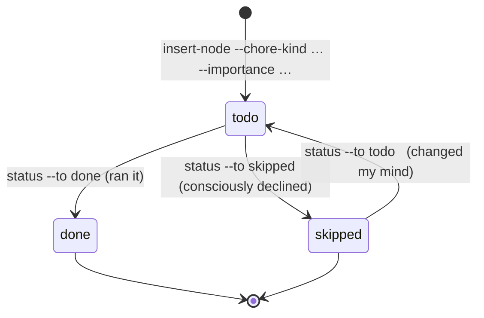

# Workshop: Chores — cross-cutting nodes on the spine

**Type**: Data Model + CLI Flow + State Machine (hybrid)
**Plan**: 024-first-class-flow-system
**Spec**: [first-class-flow-system-plan.md](../first-class-flow-system-plan.md) · § Business Specification
**Created**: 2026-06-19
**Status**: Draft

**Value Thesis**: A flight plan's spine is *substantive work* (research, plan, phases, review). But real flows are punctuated by **cross-cutting upkeep** — run `/compact`, run `/validate-v2`, fire the harness-loop seams (`boot`, `backpressure`, `retro`), tidy imports — that is neither a deliverable nor a fork, yet the agent and human both need to *see it, rank it, and act on it*. Today the only such nodes are the engine-owned harness seams (`harness-boot`/`backpressure`/`harness-retro`, workshop 003 + the flight-plan overlay), hand-wired and rendered like any other node. This workshop promotes that implicit concept to a **first-class chore class**: a cross-cutting node, marked orthogonally (any `type` can be a chore), carrying **what to run** (`kind` + `command`) and **how strongly the harness leans on you** (`importance`), with a **two-tier rail** that always shows chores as a square pip but collapses their names to `[*]` so the spine stays legible. It is the clean resolution of the [028 map](../../028-eng-harness-flow-flight-map/eng-harness-flow-flight-map.md)'s "embed-vs-standalone" fork: the eng-harness-flow loop seams (and `/compact`, `/validate`, …) **ride the host's spine as chores** — one spine, one source of truth — without breaking the router's stateless contract.

**Target Proof Level**: Contract Ready
**Current Proof Level**: Preferred Direction *(Contract Ready pending the 3 open items in § Open Questions — the feature name, the field encoding, and the per-caller visibility threshold)*

**Selected Value Axes**:
- **Agent Readiness**: an agent inserts/ticks a chore with one `insert-node`/`status` call (reusing 003's edge algebra) and reads pending upkeep from `harness flow chores --json` — no JSON spelunking, no memorized "did I compact?" ritual.
- **Cost / Attention Reduction**: the two-tier rail keeps the rail *calm but never silent* — chores collapse to `[*]`/squares so the spine reads cleanly, while strongly-recommended ones still nudge. Less human attention per glance.
- **Knowability**: `[*]` + `harness flow chores` make "what upkeep is pending, of what kind, how important" explicit and queryable instead of tribal/implicit.
- **Safety to Change**: `importance` is *advisory only* (tops out below "required" — the harness never gates/blocks); chore statuses reuse the overlay-declared-status hook (no core reshape); events reuse 002's set. Additive on every axis.

**Related Documents**:
- [003-templates-insertion-decision-points.md](./003-templates-insertion-decision-points.md) — chores **reuse** `insert-node`'s three-mode edge algebra (§ I2), its DAG re-check (`E309`), and the **overlay-declared status vocabulary** (the same hook `decision`'s `declined` uses). Orthogonal to the `decision` type.
- [001-harness-flow-cli-surface.md](./001-harness-flow-cli-surface.md) — chores add a few flags to `insert-node` + a `chores` read verb + a `rail --chores` flag; **no 001 decision reversed**.
- [002-event-and-comment-taxonomy.md](./002-event-and-comment-taxonomy.md) — chore ops reuse `node-created`/`node-updated`/`status-changed`; a `chore` discriminator rides in the tolerant `details{}`. **No new event kind.**
- [../../028-eng-harness-flow-flight-map/eng-harness-flow-flight-map.md](../../028-eng-harness-flow-flight-map/eng-harness-flow-flight-map.md) — the map where chores were born; supersedes its §6/§9 embed-vs-standalone fork for the **hosted** case.
- Plan **AC-03/AC-10** (overlay-declared statuses + the bundled harness-loop overlay) and **AC-15** (insert-node) — chores are a direct consumer of both.

**Domain Context**:
- **Primary Domain**: harness-cli · flow (`services/flow/flow-schema.ts` for the chore fields + chore statuses; `flow-mutations.ts` for the `insert-node` chore flags; `flow-renderer.ts` for square pips + collapse + `[*]`; `acts/flow.ts` for the `chores` verb + `rail --chores`).
- **Related Domains**: the-flow (the dominant *host* — its flight-plan overlay declares chore support; its guided engine inserts chores), eng-harness-flow (whose loop seams become chores), harness-cli · output (`rail`/`chores` envelopes).

---

## Purpose

Decide and document the **chore** — a cross-cutting flight-plan node (compact, validate, the harness-loop seams, ad-hoc upkeep) — its data shape (`kind` + `command` + `importance` + chore statuses), how it is inserted and tracked (reusing 003), and how it renders in a **two-tier rail** (pips always; names collapsible to `[*]`). This is the mechanism that lets a host flow (the-flow) carry the eng-harness-flow loop **inside its own spine** instead of forking a second flight plan.

## Fresh Entrant Outcome

A fresh human or agent should reach **Contract Ready** (modulo the 3 open items) with no extra context — able to:

- Author a chore node by hand and predict its rail rendering in all three visibility modes.
- Choose the right `kind` (`skill`/`command`/`builtin`/`manual`) and `importance` (`strongly-recommended`…`informational`) for a given upkeep item, and know why there is deliberately **no** `required` level.
- Insert a chore with `insert-node` (inline or excursion) and tick it with `status`, knowing which events fire.
- Explain how chores dissolve the 028 embed-vs-standalone fork without breaking the router's stateless contract.

## Key Questions Addressed

1. **Is a chore a node type, or an orthogonal attribute?** → **Orthogonal** (any `type` can be a chore) — § C1.
2. **What does a chore carry?** → `kind` (what to run) + `command` (the ref, reusing the existing field) + `importance` (how strongly advised) — § C2/C3.
3. **What's the right word for "need," and what scale?** → **`importance`**: `strongly-recommended | recommended | optional | informational` — deliberately no `required` — § C3.
4. **What are a chore's statuses?** → overlay-declared `todo | done | skipped` (reusing 003's hook) — § C4.
5. **How does the rail show chores without cluttering?** → **two tiers**: square pips always; names collapse to `[*]` unless strongly-recommended — § C5.
6. **How are chores inserted/tracked/audited?** → 003's `insert-node` + `status`, 002's events — no new mutation verb — § C6/C7.

---

## Value Frame

| Field | Selection | Why It Matters |
|-------|-----------|----------------|
| Target Proof Level | Contract Ready | a future re-plan needs a fixed node shape + enums + rail rules + CLI surface to build to |
| Primary Value Axis | Cost / Attention Reduction | the rail stays legible no matter how much upkeep is sprinkled in — the whole point |
| Supporting Value Axes | Agent Readiness · Knowability · Safety to Change | one-call insert/tick; queryable upkeep; advisory + additive, never gating |
| Downstream Loop Improved | Every hosted flow (the-flow) + the eng-harness-flow loop | loop seams + compact + validate become a uniform, rankable, collapsible class on the host spine |

---

## Decision Space

### C1 — A chore is an orthogonal attribute, not a node type

| Option | Description | Pros | Cons | Decision |
|--------|-------------|------|------|----------|
| **A — orthogonal `chore` object on any node** | presence of a `chore: {…}` object marks the node a chore; the node keeps its real `type` | composes with *any* type (a `harness-boot` chore stays violet; a `validate` chore keeps its type); no type-enum fork; renderer keys pips off the flag | one new optional object on the node shape | **Selected** |
| B — a `chore` node *type* (symmetry with 003's `decision`) | `type: "chore"` | mirrors how `decision` was added | can't mark an *existing* seam type (`harness-boot`) as a chore without losing its type; forces every chore to one type; collides with zone/render-by-type | Rejected |

- **Why orthogonal**: the existing engine-owned seam nodes (`harness-boot`/`backpressure`/`harness-retro`) are *already chores in spirit*. Making `chore` a flag means they **become** chores by adding the object — keeping their type (and violet rendering) intact — while `compact`/`validate`/`tidy` chores carry their own types. A chore is a *role a node plays*, not a kind of node. (This is the same orthogonality the plan's optional `authority` tag uses — a slot that composes, not a new type.)
- A chore is **not** a `decision` and not an excursion by definition — though it can be *placed* as either (inline on the spine via `--after`, or as a dotted excursion via `--branch-of`, § C6).

### C2 — `chore.kind`: what the chore invokes

| `kind` | `command` (the ref) example | Who can run it |
|---|---|---|
| `skill` | `/validate-v2 --artifact <plan>`, `/eng-harness-flow --hook pre-flight` | agent (this is how loop seams + the router ride in — the existing seam `command` pattern, generalized) |
| `command` | `harness boot`, `harness observe …`, `just fix` | agent |
| `builtin` | `/compact` | **user only** — the agent may *recommend*, never run (invariant #3). Its own value precisely so the rail/CLI can encode "agent can't run this" structurally |
| `manual` | "get design sign-off", "bump changelog" | human; no runnable ref — `command` is prose |

- The **payload reuses flow-core's existing `command` field** — which already holds `/eng-harness-flow --hook …` on today's seam nodes — so no new "ref" field is added; `kind` just classifies how `command` is executed.
- Rejected: a single freeform string with no `kind` — it loses the load-bearing *can-the-agent-run-it* signal (`builtin` vs the rest).

### C3 — `chore.importance`: how strongly the harness leans on you

The better word for "need" is **`importance`**. (`priority` implies *ordering* — but chores are already ordered by their spine anchor, so `priority` would fight that; `importance` carries "how much should I" without the ordering baggage.)

| value | ≈ RFC-2119 | meaning | rail behaviour (§ C5) |
|---|---|---|---|
| `strongly-recommended` | strong SHOULD | you really want this (e.g. `/compact` when context is full) | **never collapses** — always named, attention pip `▣` |
| `recommended` | SHOULD | the default for most seams (`backpressure` self-describes as "recommended") | collapses to `[*]` |
| `optional` | MAY | nice-to-have (a tidy command) | collapses, quiet |
| `informational` | FYI | a marker, no action expected ("loop healthy") | may drop from names entirely |

> **Deliberately no `required`/`must`/`blocking` level.** The harness loop *"never gates, scores, or blocks"* and the-flow invariant #4 forbids compliance floors. The strongest a chore gets is *strongly-recommended* — it refuses to hide, but it never stops the flow. `importance` is itself advisory.

- Rejected: `priority` (ordering baggage); a numeric `1–5` (less self-documenting, and a number reads like a *score* — which the harness explicitly forbids).

### C4 — Chore statuses are overlay-declared: `todo | done | skipped`

- Chores need their own status words. Rather than touch the frozen flight-plan set (`done/in_progress/blocked/known/assumed`), a host overlay **declares** the chore statuses — exactly the **overlay-declared status vocabulary** (plan AC-03/AC-10, Finding 02b) that 003 § DP2 used for `decision`'s `declined`. **Chores are the second real consumer of that forward-compat hook** — no core change.
- `skipped` is **first-class and honest**: "I consciously skipped backpressure" ≠ "haven't gotten to it." It renders distinctly (§ C5) so a skipped chore stays visible as a decision made, not a gap hidden.
- Mapping to base statuses for old/!chore-aware renderers: `todo→known`, `done→done`, `skipped→assumed` (tolerant fallback; § C5 incremental-safety).

### C5 — Two-tier rail: pips always show chores; names collapse to `[*]`

The rule that keeps the rail **calm but never silent**: **`strongly-recommended` never collapses; everything below folds into `[*]`** — but the *pip* row always shows every chore as a square, so you can never lose track that upkeep exists.

- **Pip glyphs** — chores use *squares* (distinct from spine diamonds `◆ ◐ ✗ ◇`):
  - `□` todo · `■` done · `▨` skipped · `▣` strongly-recommended + todo (attention).
- **Name band** — `▸name` for a strongly-recommended chore (always shown); `[*]` (or `[*N]` with a count) for collapsed recommended/optional; `informational` may drop entirely.
- **`[*]` is the sentinel** — "chore(s) here; expand or `harness flow chores`." It only ever hides `recommended`/`optional`/`informational` (strong never collapses), so `[*]` never hides something urgent.
- **Incremental-safe**: an old or non-chore-aware renderer ignores the unknown `chore` object + chore statuses (001/002/003 tolerance rule) and draws a normal node — no crash; squares + collapse appear only on a chore-aware renderer.

```
Key:  spine ◆done ◐wip ◇todo ✗blocked   ·   chore ■done □todo ▨skipped ▣strong+todo
      ▸name = strongly-recommended (always shown)   ·   [*N] = N collapsed (recommended/optional)

Scenario: context filling → /compact is strongly-recommended + todo

A · default (importance-aware collapse)
  pips:  [the-flow]  ◆─◆─■─■   [ ■─◐─▣─□─□ ]   ◇─◇
  text:  research · plan · ▸validate · [*] ─ [ [*] · phase-1 · ▸compact · [*2] ] ─ review · merge
                                 └ backpressure   └ boot                └ retro + tidy

B · --chores show (full)
  text:  research · plan · ▸validate · backpressure ─ [ boot · phase-1 · ▸compact · retro · tidy ] ─ review · merge

C · --chores hide (names drop; squares + footer remain)
  text:  research · plan ─ [ phase-1 ] ─ review · merge
         ⓘ 6 chores (3 done · 2 todo · 1 strong) — `harness flow chores` to list
```

### C6 — Inserted/placed with 003's `insert-node` (no new mutation verb)

Chores reuse the **entire** 003 splice machinery — edge algebra, DAG re-check (`E309`), audit events:

- **Inline chore** (on the spine, e.g. `compact` between steps): `insert-node compact --after phase-1 --chore-kind builtin --command "/compact" --importance strongly-recommended` → `--after` edge algebra (§ 003 I2) splices it in.
- **Excursion chore** (off-spine, e.g. a deep validate): `insert-node val --branch-of plan --chore-kind skill --command "/validate-v2 …" --importance recommended` → dotted excursion, spine untouched.
- **New CLI surface is minimal**: two flags on the existing `insert-node` (`--chore-kind`, `--importance`; `--command` already exists per 003 I2), plus a read verb `harness flow chores [--list] [--json]` and a render flag `harness flow rail --chores show|collapse|hide`. **No new node-mutation verb** (honours 001 D3 / 003 I1 — don't proliferate verbs).
- Ticking a chore: the existing `harness flow status --node <id> --to done|skipped`.

### C7 — Events + audit reuse 002/003's set

- Chore insert → `node-created` (+ per-edge `node-updated{edge_op}` if spliced inline, exactly 003 § I4). Chore tick → `status-changed`.
- **No new built-in event kind.** A `chore` discriminator (the `kind`/`importance`) rides in the tolerant open `details{}` (002 § E2/E8), so the log replays chore activity without enum growth — consistent with how 003 put `edge_op` there.

### C8 — Default visibility (and the per-caller question)

- **Default human rail** = `collapse` (strong shown, rest `[*]`). `--json` and `harness flow chores` always render **full** (machine callers see everything).
- Whether a caller can set the collapse *threshold* (e.g. a CI agent hides everything ≤ `recommended`) is **Open Q3**. v1 lean: ship the three modes (`show|collapse|hide`); a threshold is additive later.

---

## Data Model — the chore node (additive, overlay-declared)

Recommended shape (Option A, § C1 — a nested `chore` object; node `type` and all flow-core fields unchanged):

```jsonc
{
  "id": "validate-plan",
  "type": "validate",                  // the node's REAL type — drives zone default + base class (unchanged contract)
  "label": "Validate plan",
  "status": "todo",                    // overlay-declared chore status: todo | done | skipped  (§ C4)
  "next": ["phase-1"],
  "zone": "preflight",                 // explicit zone (chore types have no ZONE_BY_TYPE default → set it)
  "command": "/validate-v2 --artifact <plan>",  // REUSED flow-core field = the chore's ref/payload (§ C2)
  "chore": {                           // ← presence marks the node a chore (orthogonal flag, § C1)
    "kind": "skill",                   //   skill | command | builtin | manual           (§ C2)
    "importance": "strongly-recommended" //  strongly-recommended | recommended | optional | informational (§ C3)
  }
}
```

```typescript
type ChoreKind       = 'skill' | 'command' | 'builtin' | 'manual';
type ChoreImportance = 'strongly-recommended' | 'recommended' | 'optional' | 'informational';
type ChoreStatus     = 'todo' | 'done' | 'skipped';   // overlay-declared (AC-03/AC-10)

interface Chore { kind: ChoreKind; importance: ChoreImportance; }
// On a FlowNode: optional `chore?: Chore`; `command` (existing) carries the ref; `status` uses ChoreStatus.
```

A loop-seam chore (how eng-harness-flow rides a host spine — the 028 resolution):

```jsonc
{ "id": "boot", "type": "harness-boot", "label": "Boot", "status": "done",
  "next": ["phase-1"], "zone": "preflight",
  "command": "/eng-harness-flow --hook pre-flight",
  "chore": { "kind": "skill", "importance": "recommended" } }
```

> **Why reuse `command` + a nested object**: `command` already holds skill-style invocations on today's seam nodes, so the payload needs no new field; nesting `{kind, importance}` namespaces the two genuinely-new properties and makes *presence* the flag (zero redundant boolean). Flat fields (`chore_kind`/`importance` as separate optionals) is the runner-up — see Open Q2.

---

## Chore lifecycle (state)



| Status | Pip | Name-band (collapsed mode) | Meaning |
|--------|-----|----------------------------|---------|
| `todo` | `□` (or `▣` if strongly-recommended) | `[*]`, or `▸name` if strongly-recommended | pending upkeep |
| `done` | `■` | folded into `[*]` once done | ran / satisfied |
| `skipped` | `▨` | folded, but listed in `harness flow chores` | consciously declined (honest, not hidden) |

---

## CLI surface — additions to the 001/003 tree

```
harness flow
├── insert-node … (--after|--before|--branch-of)            [003]
│     + --chore-kind <skill|command|builtin|manual>          [NEW — marks + classifies]
│     + --importance <strongly-recommended|…|informational>  [NEW]
│       (--command already exists [003 I2] = the ref)
├── status --node <id> --to <todo|done|skipped>             [001 + chore statuses C4]
├── rail [--chores show|collapse|hide]                      [rail from 026; --chores NEW]
├── chores [--list] [--json]                                [NEW — the read/expand verb]
└── render …                                                [001/026; square pips + [*] C5]
```

`harness flow chores` (the "ask about `[*]`" affordance — surfaces every property):

```
Chores on the-flow.json  (6 · 3 done · 2 todo · 1 strong):
  STATUS   IMPORTANCE             KIND     ANCHOR          COMMAND (ref)
  ■ done   strongly-recommended   skill    after  plan     /validate-v2 --artifact <plan>
  ■ done   recommended            skill    before phase-1  /eng-harness-flow --hook pre-flight
  ■ done   recommended            skill    after  phase-1  /eng-harness-flow --hook post-coding
  ▣ todo   strongly-recommended   builtin  in     phase-1  /compact         ← you run this; agent can only nudge
  □ todo   optional               command  after  phase-1  just fix
  ▨ skip   recommended            skill    after  plan     /eng-harness-flow --hook pre-coding
```

---

## How chores resolve the 028 embed-vs-standalone fork

The [028 map](../../028-eng-harness-flow-flight-map/eng-harness-flow-flight-map.md) hit a wall: making eng-harness-flow "its own flow" collides with the router's **stateless, file-less** contract, so the only contract-clean home for loop state is a host that is already stateful — `the-flow.json`. Chores are exactly that mechanism:

- **Hosted (using the-flow)** → the loop seams are **chores on the host spine** — `boot`/`backpressure`/`observe`/`retro` as `chore.kind: skill`, `command: /eng-harness-flow --hook …`. One spine, one source of truth (it generalizes what the-flow's overlay *already* embeds, and adds `/compact`, `/validate`, future upkeep). The router only **suggests** inserting them; the host's CLI does the insert — **statelessness preserved**.
- **No host** → unchanged from the 028 map: a standalone *rendered reference*, not driven state. Chores are primarily a **hosted-case** feature.
- **Adoption** → still standalone (the-flow can't host adoption — it precedes it), per the 028 map.

So chores don't replace the 028 map — they **close its §6/§9 open question for the hosted path** and leave the unhosted/adoption paths as the map described.

---

## Folds into a future plan (deltas — 024 Phase 1 is already shipped)

Unlike 003 (a build-prerequisite folded into 024 before Phase 1), this workshop is **forward-looking**: 024's flow engine is built, so chores land as a **024 vNext amendment or a new plan**. Deltas for whoever implements:

| Target | Delta |
|--------|-------|
| **schema (flow-schema.ts / overlays)** | optional `chore: {kind, importance}` on a node; overlay-declared chore statuses `todo/done/skipped` (reuses the AC-03/AC-10 hook — no core enum change) |
| **mutations (insert-node)** | `--chore-kind` + `--importance` flags (set the object); everything else is 003's algebra unchanged |
| **renderer** | square pips (`□■▨▣`), the importance-aware name collapse, the `[*]`/`[*N]` sentinel, `--chores show|collapse|hide`; tolerant fallback for old renderers |
| **act (flow.ts)** | `harness flow chores [--list] [--json]`; `rail --chores`; chore statuses accepted by `status --to` |
| **events** | `chore` discriminator in `details{}` (no new kind) |
| **the-flow (host)** | its flight-plan overlay declares chore support; its guided engine inserts loop-seam + `/compact` + `/validate` chores (the 028 resolution) |
| **eng-harness-flow** | the router *suggests* chore inserts at seams; owns no chore state (stateless contract intact) |
| **AC candidates** | new ACs for the chore attribute + enums, the two-tier rail rules, the `chores` verb, and the overlay-status reuse |

---

## Evidence Ledger

| Evidence | Location | Supports | Status |
|----------|----------|----------|--------|
| Orthogonal-attribute vs node-type decision | § C1 | the core shape; composition with seam types | Ready |
| `kind` enum (skill/command/builtin/manual) + `builtin` rationale | § C2 | the run-it/can't-run-it signal; invariant #3 | Ready |
| `importance` name + 4-level scale, no `required` | § C3 | the advisory invariant; RFC-2119 pedigree | Ready |
| Chore statuses reuse overlay-declared hook | § C4 | AC-03/AC-10 second consumer; `skipped` honesty | Ready |
| Two-tier rail rules + glyph key + 3 modes | § C5 | the attention-reduction thesis; render contract | Ready (pending Open Q3) |
| insert-node reuse (no new verb) | § C6 | 003 I1–I4 reuse; minimal CLI surface | Ready |
| Events reuse 002/003 | § C7 | reconciles with 002; no enum growth | Ready |
| Node shape + TS types | § Data Model | the schema delta to build to | Ready (pending Open Q2 encoding) |
| Chore lifecycle state machine | § Chore lifecycle | status transitions + render | Ready |
| 028 fork resolution (hosted/unhosted/adoption) | § How chores resolve… | the thesis; statelessness preserved | Ready |
| `command` already holds `/eng-harness-flow --hook …` on seam nodes | flight-plan.schema.json desc + 003 § I2 | reuse-`command` decision is grounded, not invented | Validated |

## Attention Reduction

| Future Loop | Before Workshop | After Workshop |
|-------------|-----------------|----------------|
| Reading the rail | every seam/upkeep node competes with real work for rail space | chores collapse to `[*]`/squares; spine reads clean; strong ones still nudge |
| "Did I run X?" | tribal memory / scroll the JSON | `harness flow chores` lists pending upkeep + importance + the exact command |
| Embedding the loop in the-flow | unresolved embed-vs-standalone (028) colliding with statelessness | loop seams are chores on the host spine; one source of truth |
| Skipping a check | a silent gap, indistinguishable from "not yet" | `skipped ▨` — an honest, visible decision |

## Validation / Acceptance

Reaches **Contract Ready** when:
- The node shape + `kind`/`importance`/chore-status enums are fixed (field encoding settled — **Open Q2**). ⏳
- The two-tier rail rules (pips/collapse/`[*]`/glyphs) are specified for all importance levels and visibility modes — and the per-caller threshold decision is made (**Open Q3**). ⏳ (rules ✅, threshold open)
- Chores reuse 003's insert-node algebra + 002's events with no new mutation verb / event kind. ✅
- The 028 embed-vs-standalone fork is resolved for the hosted case without breaking the stateless contract. ✅
- The feature name is settled (**Open Q1**). ⏳
- It folds into a 024-vNext / new plan's ACs + tasks on the next `plan` pass. ⏳

## Open Questions

### Q1: Is "chore" the right name?

**OPEN (lean: keep `chore`)**. "Chore" signals *non-deliverable, skippable, collapsible* — which is the whole point — and the user coined it.
- **`chore`** (lean) — humble, clearly not the main work; pairs with "collapse to `[*]`".
- `seam` — accurate (these fire at seams) but **already means** "the moment a host fires the router" (00-routing.md), so it'd be overloaded.
- `checkpoint` — over-implies a *gate* (and the harness never gates).
- `aside` / `interlude` — too soft / obscure.

### Q2: Nested `chore: {kind, importance}` object, or flat `chore_kind` + `importance` fields?

**OPEN (lean: nested)**. Nested namespaces the two new props and makes *presence = the flag* (no redundant boolean); flat matches flow-core's existing flat-optional style (`command`, `phase`, `note`). Both reuse `command` for the ref. Decide alongside the schema task.

### Q3: Can a caller set the collapse *threshold* (not just show/collapse/hide)?

**OPEN (lean: v1 = three modes; threshold additive later)**. A CI agent might want "hide everything ≤ recommended." v1 ships `--chores show|collapse|hide`; a numeric/level threshold is an additive flag if the need proves real (mirrors 003 Q1's "additive sugar later").

### Q4: Do chores ever count toward spine progress?

**RESOLVED (no)**. Chores are a separate pip class (squares), so the spine's `◆/◇` progress ("3 of 5 phases done") is **never diluted** by however many chores are sprinkled in. A nice side effect of C1's orthogonality.

### Q5: Does a chore fire its own built-in event kind?

**RESOLVED (no)**. Reuse `node-created`/`node-updated`/`status-changed` with a `chore` discriminator in `details{}` (§ C7) — consistent with 003's `edge_op`. No enum growth.

---

✅ **Workshop created**: `docs/plans/024-first-class-flow-system/workshops/004-chore-nodes.md`

- **Type**: Data Model + CLI Flow + State Machine (hybrid)
- **Target Proof Level**: Contract Ready · **Current**: Preferred Direction (3 open items)
- **Selected Value Axes**: Cost/Attention Reduction · Agent Readiness · Knowability · Safety to Change
- **Key Questions Addressed**: 6 · **Decisions**: C1–C8 · **Open**: Q1 (name) · Q2 (encoding) · Q3 (threshold)
- **Related workshops**: 001 (CLI surface) · 002 (events) · 003 (insert/decision — direct ancestor); **028 map** (origin)

Routing is the flow's job — run the parent flow bare to continue.
