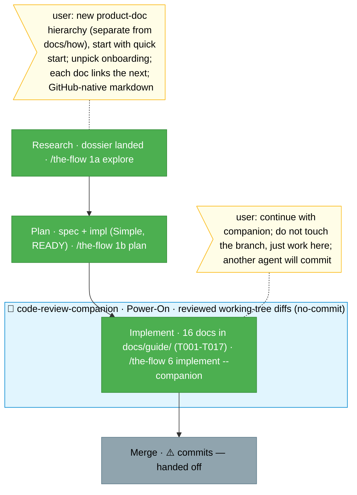

<!-- 🔄 RENDERED from the-flow.json — regenerate, never hand-edit this file as the primary. -->
# Flight plan — product-documentation-hierarchy

**Plan**: product-documentation-hierarchy · **Mode**: Simple · **Phases**: 1 (single implement phase)
**Rail**: `[the-flow] ◆─◆─◆─◇`   ·   **now**: Implement DONE — 16 docs in docs/guide/ (uncommitted), companion-reviewed, drift-clean · **next**: Merge (commits — handed off to another agent; not auto-run)

**Legend**: done | in progress | blocked | known future | assumed future | user input | 🤝 companion

_Generated from `the-flow.json`. Research + Plan + **Implement** done. Authored 16 docs in `docs/guide/` (README router + 01-15; `14-metrics-and-measures` an intentional stub), working-tree only (no commits, no branch ops, per the user). Commands verified vs `app.ts` + `--help`; the `installing-the-harness` deck reconciled to local reality. Drift guard PASS (links + commands + nav continuity AC-07). 6 call-outs surfaced (AC-08); root-README guide link supplied to plan 023 (AC-10, not edited here). `code-review-companion` reviewed every doc + a final drain (3 MEDIUM: F001 accepted-by-design, F002/F003 fixed) — superseding a separate review pass. **Next is Merge, which commits — the user deferred commits to another agent, so the docs are left complete + uncommitted for hand-off; merge is not auto-run.** Running alongside `023-documentation-updates`._
