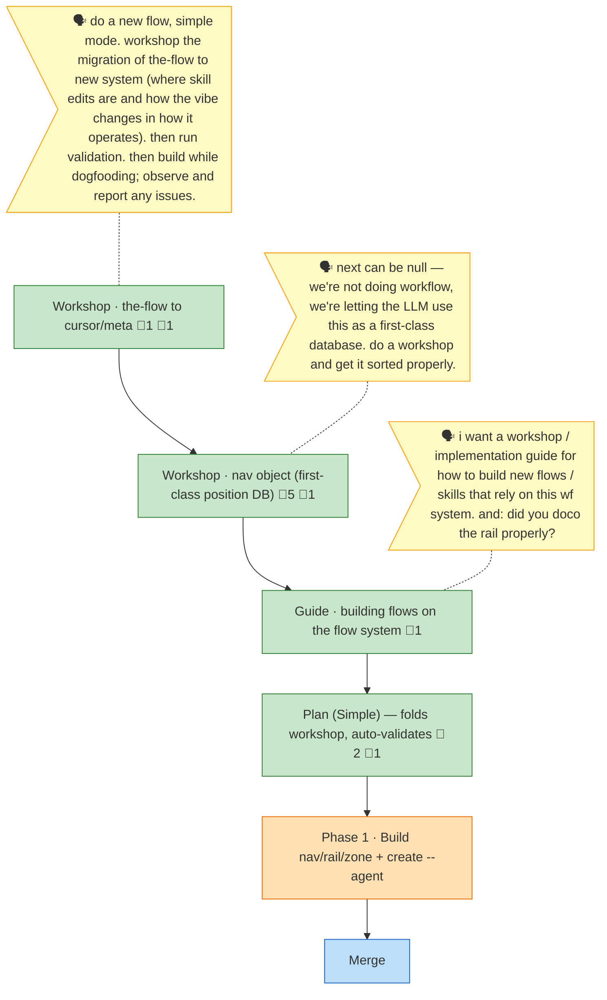

<!-- GENERATED by `harness flow render` — do not hand-edit; regenerate from the flow JSON. -->
# Flow · the-flow-cursor-meta-migration

**Kind**: flight-plan · **Now**: p1 · **Next**: merge · **Intent**: building nav/rail/zone + create --agent — dogfooding the live CLI · **Nodes**: 6 · **Events**: 35

**Rail**: ◆─◆─◆─◆─[ ◐ ]─◇  Workshop · the-flow to cursor/meta · Workshop · nav object (first-class position DB) · Guide · building flows on the flow system · Plan (Simple) — folds workshop, auto-validates ─ [ Phase 1 · Build nav/rail/zone + create --agent ] ─ Merge

**Legend**: 🟩 done · 🟧 in-progress · 🟥 blocked · 🟦 known (designed) · ⬜ assumed (speculative) · 🔶 decision · 🗣 user input · 🟪 harness loop · 🤖 companion · 🛠 worker.

## Node log

### plan · Plan (Simple) — folds workshop, auto-validates
- 📄 artifacts: the-flow-cursor-meta-migration-plan.md
- `2026-06-18T08:06:16.029Z` · agent · validation — validate-v2 (3 agents, narrow) = VALIDATED WITH FIXES: corrected G2/G3 (project-rules exist), added schema-descriptor task T002a, clarified next-validation + N5 (assumed-node) + zone defaults + nav-absent test. · refs: the-flow-cursor-meta-migration-plan.md
- `2026-06-18T08:32:34.866Z` · agent · validation — Validation pass 2 (broad, 4 agents, pre-build gate): source-truth 100% vs live CLI v0.4.0 (cursor exists, no nav/rail yet — matches Findings 01-05); thesis intact (CLI never routes); CS-3 honest. 6 clarifications applied (AC-1 nav-show shape, zone unknown-&gt;flight, T006 reader-audit, slug fallback, deploy-order, proof-level wording). READY. · refs: docs/plans/026-the-flow-cursor-meta-migration/the-flow-cursor-meta-migration-plan.md

### ws-migration · Workshop · the-flow to cursor/meta
- 📄 artifacts: workshops/001-cursor-meta-migration.md
- `2026-06-18T06:49:49.268Z` · agent · validation — validate-v2 (4 agents) = VALIDATED WITH FIXES. Fixed: in-flight count (23/8), added Contract 2b CLI-site map, named meta FlowDoc field + semantics, trimmed neighbour envelope, Q1 dogfood-resolved (cursor --to validates → E305). · refs: workshops/001-cursor-meta-migration.md

### ws-nav · Workshop · nav object (first-class position DB)
- 📄 artifacts: workshops/002-nav-first-class-position-db.md
- `2026-06-18T07:31:31.637Z` · agent · decision — Q2 RESOLVED: clean break — drop cursor entirely; nav is the only position verb (no alias).
- `2026-06-18T07:38:53.604Z` · agent · decision — Q1 RESOLVED: new sibling verb 'harness flow rail' derives the rail from the spine + live node statuses (pips from status, names from labels); no stored milestone counters; optional nav.rail curation override.
- `2026-06-18T07:40:32.026Z` · agent · decision — N12: each spine node gets a 'zone' enum (preflight\|flight\|postflight); harness flow rail renders pre - [flight] - post (brackets = flight zone, deterministic). Default-by-type, --zone override. Named zone (not phase) to avoid colliding with the phase node type.
- `2026-06-18T07:50:36.201Z` · agent · decision — N13: harness flow rail prefixes the line with the flow TITLE = provenance.agent (e.g. [the-flow]), optional title override, never the filename/slug. New flows get their own prefix automatically (e.g. [eng-harness-flow]).
- `2026-06-18T07:52:58.101Z` · agent · warning — DOGFOOD D-06: harness flow create stamps provenance but leaves agent + plan_id = null (no --agent/--plan-id flag); branch/repo/version auto-derive correctly. The 024 fixture's agent=the-flow is hand-authored. Phase 1 must add create --agent (and --plan-id) so the rail title (N13) works; slug fallback meanwhile.

### ws-guide · Guide · building flows on the flow system
- 📄 artifacts: workshops/003-building-flows-on-the-system.md
