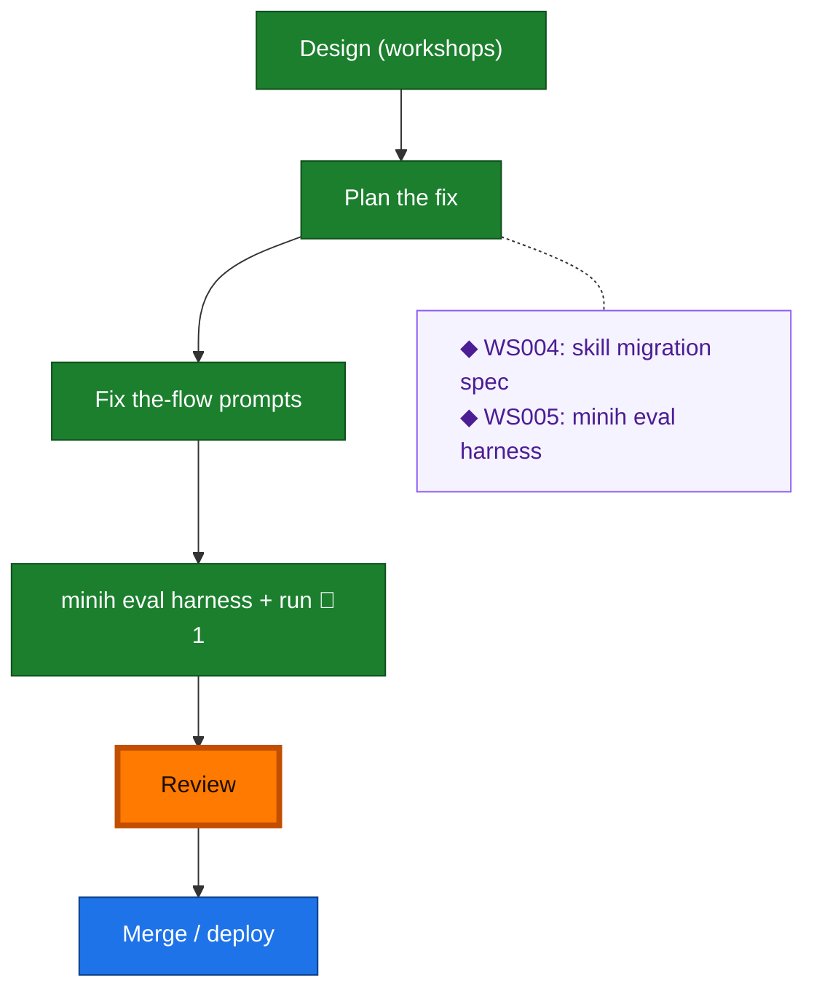

<!-- GENERATED by `harness flow render` — do not hand-edit; regenerate from the flow JSON. -->
# Flow · the-flow-skill-migration

**Kind**: flight-plan · **Now**: review · **Next**: merge · **Intent**: Build complete — cursor→nav migration + minih eval harness done; all 6 ACs proven; next: review then deploy (CLI-first) · **Nodes**: 8 · **Events**: 19

**Rail**: ◆─◆─[ ◆─◆ ]─◇─◇  ◆ Design (workshops) · ◆ Plan the fix · [ ◆ Fix the-flow prompts · ◆ minih eval harness + run ] · ◇ Review · ◇ Merge / deploy

**Legend** — colour = type/status: 🟩 done · 🟢 in-progress · 🟥 blocked · 🟦 known · ⬜ assumed · 🔶 decision · 🗣 user input · 🟪 harness chore (faded = not yet done) · 🤖 companion · 🛠 worker · 🟧 current (you are here). Badges: 💬 comments · 📄 artifacts · 📝 instructions · 🧰 chore (° optional / recommended / ‼ strongly-recommended; ✓ done · ✕ skipped).

## Node log

### p2 · minih eval harness + run
- `2026-06-18T11:54:27.853Z` · agent · validation — Eval harness built + run; scorer discriminates (migrated exit 0, un-migrated exit 1); all 6 ACs proven.
