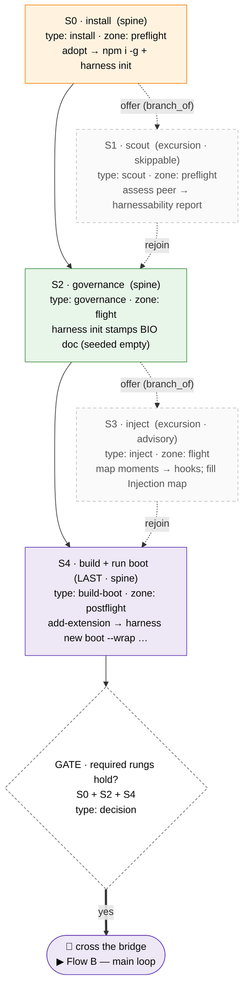
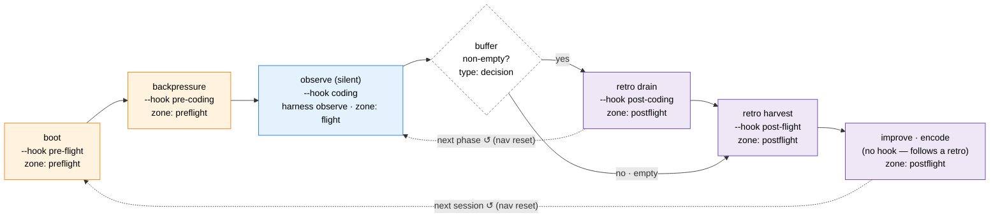
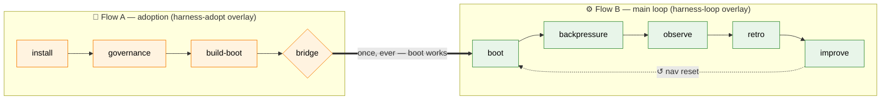

# eng-harness-flow — Flight-Plan Map

**Ordinal**: 028 · **Branch**: `026-flow-nav-rail-zone` (no new branch) · **Date**: 2026-06-19
**Scope**: research + map only (no `harness flow` JSON authored here — see [§9 Next step](#9-next-step-the-build-phase-not-this-ordinal))
**Subject**: model the `eng-harness-flow` skill onto the new `harness flow` flight-plan system — the harness-loop analogue of what plan 027 did for `the-flow`.

---

## 1. TL;DR — the thesis

`eng-harness-flow` is today a **stateless prose dispatcher**. Its graph is *implicit* — scattered across a routing table (`00-routing.md`), a five-rung adoption gate, and a six-row engineering dispatch. This map makes that graph **legible and first-class** by drawing it in the `harness flow` flight-plan idiom (nodes · types · zones · nav · rail), the same idiom `the-flow` was migrated onto.

The load-bearing insight, in the user's words: **there are two flows, and they never run at the same time.**

| | 🧰 **Adoption flow** | ⚙️ **Main loop** |
|---|---|---|
| **When** | once per repo (onboarding) | every session, forever |
| **Frequency** | rare | the ~99% case |
| **Shape** | a finite **journey** with a terminus (a working `boot`) | a **cycle** re-entered wherever the work is |
| **Ends by** | crossing the bridge into the main loop | never "completing" — it compounds |
| **Modeled today?** | ❌ not at all | ⚠️ partially (bundled `harness-loop` overlay, schema-only, stale template) |

Because they are disjoint, they should be **two separate flight plans / overlays — never one graph**. This document maps each flow's **stages → nodes** in the real CLI vocabulary, with mermaid for each, and ends with the modeling deltas a future build phase would encode.

> **The smoking gun.** Plan 024 already bundled a `harness-loop` overlay (`harness/cli/src/services/flow/schemas/harness-loop.schema.json` + `.template.json`) **schema-only**, with a description that reads verbatim: *"nothing in 024 creates or drives a harness-loop instance (that is the later eng-harness-flow work)."* This map is the research phase of that "later work."

---

## 2. What `eng-harness-flow` is (the subject)

The single front door to the harness loop — the harness-loop analogue of `the-flow` (which guides the SDD pipeline). It is a **pure dispatcher**: `(repo signals, conversation, optional hint) → next harness action`. It:

- **writes no artifacts of its own** — child verbs own their reports/buffers/records;
- **never gates, scores, or blocks** — every route is a suggestion;
- **re-derives position every call** from deterministic substrate (so it survives `/compact`, serves any caller, never drifts);
- routes to **exactly one** verb per call, with a one-line *why*.

Its verbs (post-022 consolidation) are **harness-blind modules** under `references/stages/`, loaded one at a time:

| Verb | Module | Consumes → Produces |
|---|---|---|
| `adopt` | `stages/adopt.md` | repo signals → installed + injected harness (delegates `assess`, `add-extension`) |
| `assess` | *peer skill* `eng-harness-0-harnessability-assessment` | repo → `.harness/reports/harnessability/latest.{md,json}` |
| `add-extension` | `stages/add-extension.md` | intent → `.harness/extensions/<name>/` (incl. `boot` at S4) |
| `boot` | `stages/boot.md` | governance doc → boot verdict (HEALTHY/SLOW/UNHEALTHY/UNAVAILABLE) |
| `backpressure` | `stages/backpressure.md` | spec → `backpressure-coverage.md` |
| `retro` | `stages/retro.md` | observe buffer + records → drained `.retro.md` / harvested view |
| *(observe)* | — **CLI verb** `harness observe` | a noticing → one buffer entry (silent) |

The router exposes the loop to host flows as **five neutral lifecycle hooks** — the stable, host-facing vocabulary (`the-flow` is one host; any dev/SDD flow plugs in the same way):

| `--hook` | Moment | Kind | Resolves to |
|---|---|---|---|
| `pre-flight` | session/boot start | fire | `boot --validate` |
| `pre-coding` | spec settled, pre-build | fire | `backpressure` |
| `coding` | mid-build, friction bites | **silent** | `harness observe` |
| `post-coding` | phase/session end | fire | `retro --drain` |
| `post-flight` | plan/journey end | fire | `retro --harvest` + improve |

(`--event` seams alias onto these: `session-start`/`pre-implement`→`pre-flight`, `post-spec`→`pre-coding`, `task-pause`→`coding`, `phase-end`→`post-coding`, `plan-complete`→`post-flight`.)

---

## 3. The flight-plan model (the vocabulary this map speaks)

Grounded in the CLI source (`harness/cli/src/services/flow/`), not invented. Every flow is a JSON **DAG of nodes** validated against a **shared core** (`flow-core`) plus a per-flow **overlay** that names the allowed `statuses` + `nodeTypes`.

### 3.1 Node + root shape (`flow.schema.json` = `flow-core`)

- **Node — required**: `id`, `type`, `label`, `status`, `next[]`.
- **Node — optional (the ones this map uses)**: `branch_of` (excursion attach point), `zone` (rail band), `phase`, `command` (the exact CLI/router invocation), `artifacts[]`, `comments[]`, `note`, `agents[]`.
- **Root — required**: `schema_version`, `kind`, `slug`, `created_at`, `provenance`, `events[]`, `nodes[]`.
- **Root — optional**: `nav` (the position object), `title`, `plan_dir`, `mode`.

### 3.2 nav, rail, zones (the UX surfaces)

- **nav** = the position object (`now` / `next` advisory / `intent` / free-form `meta` bag). Set via `harness flow nav set --now <node> [--next <node>] [--clear-next] [--intent …]`. **This replaced the legacy top-level `cursor` field** (clean break, plan 027).
- **rail** = the one-line progress view: `[title] pips  names`, banded `pre ─ [ flight ] ─ post`. Title resolves `provenance.agent` → `title` → `slug` → `'flow'`. Pips by status: `done ◆` · `in_progress ◐` · `blocked ✗` · else hollow `◇`.
- **zone** = which rail band a node sits in: `preflight | flight | postflight`. An explicit `zone` wins; else the renderer's `ZONE_BY_TYPE` default; else `flight`. Current defaults: `research/plan/workshop/tasks/adr → preflight`, `phase → flight`, `review/merge/retro → postflight`. **Seam types `harness-boot/harness-retro/backpressure` always render violet.**

### 3.3 Spine vs excursion — the load-bearing distinction

- The **spine** is the main path (each node's `next` chains forward).
- An **excursion** is a side-quest attached with `insert-node --branch-of <node> [--rejoin <node>]` — it hangs off the spine and rejoins, without being *on* it.
- **This is exactly how "required vs skippable" should be modeled**: required rungs/stages are the spine; skippable/advisory ones are excursions. (Mirrors `the-flow`, where workshops/ADRs are excursions `branch_of` plan.)

### 3.4 CLI verbs (the only writers)

`create` · `new` (scaffold an overlay) · `nav set` · `rail` · `status` · `add-node` · `set-node` · `insert-node` · `comment` · `event` · `render`. The `.md` is **always** generated by `harness flow render` (mermaid `flowchart TD` + per-node body-log + a `**Rail**:` line); it is never hand-edited.

### 3.5 What already exists for the loop — and its gaps

`harness-loop.schema.json` (bundled, schema-only):

```jsonc
{ "kind": "harness-loop", "extends": "flow-core", "schema_version": 1,
  "statuses": ["assumed","known","in_progress","done","blocked"],
  "nodeTypes": ["boot","backpressure","observe","retro","improve","decision"] }
```

`harness-loop.template.json` (bundled seed):

```jsonc
{ "cursor": "boot",
  "nodes": [
    {"id":"boot","type":"boot","next":["backpressure"]},
    {"id":"backpressure","type":"backpressure","next":["observe"]},
    {"id":"observe","type":"observe","next":["retro"]},
    {"id":"retro","type":"retro","next":["improve"]},
    {"id":"improve","type":"improve","next":[]} ] }
```

**Gaps this map must close (carried into the build phase):**

| # | Gap in the bundled overlay/template | Fix direction |
|---|---|---|
| G1 | **Adoption isn't modeled at all** — no node types for install/scout/governance/inject/build-boot | a separate `harness-adopt` overlay (two disjoint flows ⇒ two overlays) |
| G2 | Template uses the **legacy `cursor` field** (pre-027) | regenerate with a `nav` block (`now: boot`) |
| G3 | Template has **no root identity** (`schema_version/kind/slug/created_at/provenance/events`) → would `E308` on render | `create` stamps these; the seed must carry a provenance-able shape |
| G4 | **Single `retro` node** collapses two distinct lifecycle positions | split into `retro-drain` (post-coding) + `retro-harvest` (post-flight) |
| G5 | **No decision node** for drain-before-harvest, despite `decision` being in `nodeTypes` | add a `decision` "buffer non-empty?" |
| G6 | **No cycle / re-entry** (`improve.next=[]`, linear) | model the cycle as **nav re-entry**, not a stored edge (see §6.3) |
| G7 | **No zones set** — `boot/observe/improve/decision` fall through to `flight` | set explicit `zone` per node (or extend `ZONE_BY_TYPE`) |
| G8 | **No hook annotation** — the 5 lifecycle hooks aren't visible on nodes | carry the hook in `label`/`command` |

---

## 4. Flow A — Adoption (🧰 the gate)

**The one-time on-ramp.** A repo *adopts* the harness: install → (scout) → governance → (inject) → build+run boot **LAST**, then cross the bridge into the loop. Required rungs hard-gate; skippable/advisory rungs are offered, never blocking.

### 4.1 Stages → nodes

| Rung | Node `id` | `type` | `zone` | spine? | seed `status` | `next` | Verb / command behind it |
|---|---|---|---|---|---|---|---|
| **S0 · Install** | `install` | `install` | preflight | **spine** | `assumed` | `[governance]` | `adopt` — `npm i -g @ai-substrate/engineering-harness` + `harness init`; gate on `harness doctor` healthy (signals A·B) |
| **S1 · Scout** | `scout` | `scout` | preflight | *excursion* `branch_of install` | `known` | `[governance]` (rejoin) | `assess` peer → `.harness/reports/harnessability/latest.{md,json}` — **skippable** |
| **S2 · Governance** | `governance` | `governance` | flight | **spine** | `assumed` | `[build-boot]` | `harness init` stamps `.harness/engineering-harness.md` (BIO contract, **seeded empty** — L0, TODO fields) |
| **S3 · Inject** | `inject` | `inject` | flight | *excursion* `branch_of governance` | `known` | `[build-boot]` (rejoin) | `adopt` Step 3 — map flow moments → hooks; fill the governance `## Injection map` — **advisory** |
| **S4 · Boot (LAST)** | `build-boot` | `build-boot` | postflight | **spine** | `assumed` | `[bridge]` | `add-extension` — `harness new boot --wrap "<readiness cmd>"`, then **run it once** |
| **Gate** | `bridge` | `decision` | postflight | **spine** (terminus) | `assumed` | `[]` | router check: do **S0 + S2 + S4** hold? → cross into Flow B |

Node types **new to the harness flow vocabulary** (not in `harness-loop` overlay): `install`, `scout`, `governance`, `inject`, `build-boot`. Plus the reused `decision`. → a dedicated `harness-adopt` overlay (G1).

### 4.2 Why required = spine, skippable = excursion

The router routes the *first missing required rung* and *offers* the skippable ones. That is **exactly** the spine/excursion semantics: `install → governance → build-boot → bridge` is the required spine; `scout` and `inject` hang off it as `insert-node --branch-of` excursions that rejoin. A repo that skips both still has an unbroken spine to a working boot. The gate's "required vs skippable" stops being prose and becomes graph structure.

### 4.3 Diagram



**Rail (illustrative, fresh repo, install in progress):**
`[adopt] ◐─◇  [ ◇─◇ ]  ◇─◇   install · scout ─ [ governance · inject ] ─ build-boot · bridge`

---

## 5. Flow B — Main loop (⚙️ the cycle)

**The everyday loop.** Boot proves the system runs, Backpressure asks what's provable before building, Observe catches friction silently while you work, Retro turns friction into encoded improvements — then the next session boots cleaner. This is the existing `harness-loop` overlay, **refined** per the G1–G8 gaps.

### 5.1 Stages → nodes

| Stage | Node `id` | `type` | `--hook` | `zone` | `next` | Verb / command behind it |
|---|---|---|---|---|---|---|
| **Boot** | `boot` | `boot` | `pre-flight` | preflight | `[backpressure]` | `boot --validate` — re-run the boot adoption built |
| **Backpressure** | `backpressure` | `backpressure` | `pre-coding` | preflight | `[observe]` | `backpressure` → `backpressure-coverage.md` (advisory) |
| **Observe** | `observe` | `observe` | `coding` (**silent**) | flight | `[drain-gate]` | `harness observe "<what>" --kind <kind>` — one buffer entry per noticing |
| **Drain gate** | `drain-gate` | `decision` | — | flight | `[retro-drain, retro-harvest]` | router: buffer non-empty? (drain-before-harvest) |
| **Retro drain** | `retro-drain` | `retro` | `post-coding` | postflight | `[retro-harvest]` | `retro --drain` → committed `.retro.md` via `harness record retro` |
| **Retro harvest** | `retro-harvest` | `retro` | `post-flight` | postflight | `[improve]` | `retro --harvest` → curated cross-plan view |
| **Improve** | `improve` | `improve` | — (follows a retro) | postflight | `[]` | encode the fix: `retro [e]ncode` / `add-extension` / fix-plan / upstream issue → `harness-change` record |

All **five lifecycle hooks** land on a node (`pre-flight`→boot, `pre-coding`→backpressure, `coding`→observe, `post-coding`→retro-drain, `post-flight`→retro-harvest). `improve` and `drain-gate` carry no hook by design — Improve follows whatever a retro decides; the gate is internal routing.

The overlay's existing `nodeTypes` already cover this (`boot/backpressure/observe/retro/improve/decision`) — **no schema change needed for Flow B**; the work is in the **template** (G2–G8): split retro into two nodes, add the gate, set zones, add the nav block + provenance, and annotate hooks.

### 5.2 Diagram



**Rail (illustrative, mid-build, observe active):**
`[harness-loop] ◆─◆  [ ◐ ]  ◇─◇─◇   boot · backpressure ─ [ observe ] ─ drain · harvest · improve`

### 5.3 The cycle is in `nav`, not in the edges (the key modeling insight)

A flight plan is a **DAG** — `insert-node` is "DAG-rechecked before write," so a literal `improve → boot` back-edge is illegal. The harness loop *is* a cycle. These reconcile cleanly:

> **One stored lap, many traversals.** The DAG encodes a single canonical lap (`boot → … → improve`, `improve.next = []`). The *cycle* is the stateless router **resetting `nav.now`** — back to `observe` for the next phase, back to `boot` for the next session. The dashed arcs above are nav moves, not edges. This is *why* the bundled template already has `improve.next: []`, and it is the natural fit for a router that "re-derives position every call" rather than walking a stored pointer.

---

## 6. How the two flows relate



- **Disjoint, by construction.** Two overlays, two flight-plan instances. The only connection is the **bridge**: adoption's terminus hands to the loop's `boot`. They never co-run — exactly the user's framing.
- **The router is the through-line.** `/eng-harness-flow` sits *beside* both, stateless, picking the first-missing adoption rung **or** the right loop stage every call. Neither flight plan stores router state; both are re-derivable from substrate.
- **Relationship to `the-flow` (the SDD pipeline).** `the-flow`'s flight-plan overlay already carries **engine-owned seam nodes** — `harness-boot`, `backpressure`, `harness-retro` — whose `command` is *always* a `/eng-harness-flow --hook …` invocation. So the SDD journey *embeds* the loop's seams as nodes that call this router; the Flow B flight plan is the **native** view of that same loop. The two are consistent: `the-flow` *calls* the hooks; Flow B *is* the hooks.

---

## 7. Node-type vocabulary — delta summary

| Node type | In `harness-loop` overlay today? | Flow A (adopt) | Flow B (loop) | Action |
|---|---|---|---|---|
| `install` | ❌ | ✅ | — | add to new `harness-adopt` overlay |
| `scout` | ❌ | ✅ (excursion) | — | add to `harness-adopt` |
| `governance` | ❌ | ✅ | — | add to `harness-adopt` |
| `inject` | ❌ | ✅ (excursion) | — | add to `harness-adopt` |
| `build-boot` | ❌ | ✅ | — | add to `harness-adopt` |
| `boot` | ✅ | — | ✅ | reuse |
| `backpressure` | ✅ | — | ✅ | reuse (renders violet) |
| `observe` | ✅ | — | ✅ | reuse |
| `retro` | ✅ | — | ✅ ×2 (drain, harvest) | reuse; two nodes of this type |
| `improve` | ✅ | — | ✅ | reuse |
| `decision` | ✅ | ✅ (bridge) | ✅ (drain-gate) | reuse in both |

**Net:** Flow B needs **no schema change** (template work only). Flow A needs a **new `harness-adopt` overlay** with five new node types + `decision`.

---

## 8. Zone assignments (so the rail reads right)

The renderer's `ZONE_BY_TYPE` only knows the-flow types, so most loop/adopt types fall through to `flight`. Each node above therefore needs an **explicit `zone`** (passed to `add-node`/`insert-node --zone`), or `ZONE_BY_TYPE` gets extended. Proposed bands:

- **Flow A**: `install`, `scout` → preflight · `governance`, `inject` → flight · `build-boot`, `bridge` → postflight.
- **Flow B**: `boot`, `backpressure` → preflight · `observe`, `drain-gate` → flight · `retro-drain`, `retro-harvest`, `improve` → postflight.

This yields the clean three-band rails shown in §4.3 and §5.2.

---

## 9. Next step — the build phase (NOT this ordinal)

This ordinal is the **map**. When the build phase is greenlit, it would:

1. **Author the `harness-adopt` overlay** — `harness flow new harness-adopt`, then set `statuses` + the five new `nodeTypes` + `decision`.
2. **Refresh the `harness-loop` template** — split `retro` → `retro-drain`/`retro-harvest`, add the `drain-gate` decision, set explicit `zone`s, replace the legacy `cursor` with a `nav` block (`now: boot`), and ensure a provenance-able root (fix G2/G3 so `render` doesn't `E308`).
3. **Seed two reference instances** + `harness flow render` them, golden-file pinned + `--check` drift-guarded (the same proof discipline plans 024/027 used).
4. **Decide cycle-as-nav explicitly** — document that the router resets `nav.now` for re-entry; `improve.next` / `bridge.next` stay `[]`.
5. **Wire provenance** — `--agent eng-harness-flow` so both rails title as `[eng-harness-flow]` (or `[harness-loop]` / `[harness-adopt]` per instance).

### Open questions for the build phase

- **One overlay or two?** This map argues **two** (disjoint flows → `harness-adopt` + `harness-loop`). Alternative: one `harness-loop` overlay with an `adopt` zone. Recommendation: **two** — it makes "the flows never co-run" a structural fact, not a convention.
- **Does the router actually instantiate these flight plans?** Today the router is *stateless and owns no artifacts*. A driven flight plan is durable state — so either (a) these stay **reference/visualisation artifacts** (a rendered map of the loop, like getting-started.md but CLI-generated), or (b) the stateless contract gets a carefully-scoped exception. Recommendation: start at (a); revisit (b) only if a concrete need for stored loop-position appears.
- **`decision`-node rendering.** Confirm the renderer's distinct `decision` class reads well for the bridge/drain-gate (it has a dedicated classDef).

---

## Appendix — sources read

- Skill: `skills/eng-harness-flow/SKILL.md`, `references/00-routing.md`, `references/getting-started.md`
- Verb modules: `references/stages/{adopt,boot,backpressure,retro,add-extension}.md`
- CLI flow system: `harness/cli/src/acts/flow.ts`, `services/flow/flow-renderer.ts`, `services/flow/schemas/{flow,harness-loop,flight-plan}.schema.json`, `harness-loop.template.json`
- `the-flow` overlay + seams: `~/.agents/skills/the-flow/references/flight-plan.schema.json`, `references/harness-seams.md`
