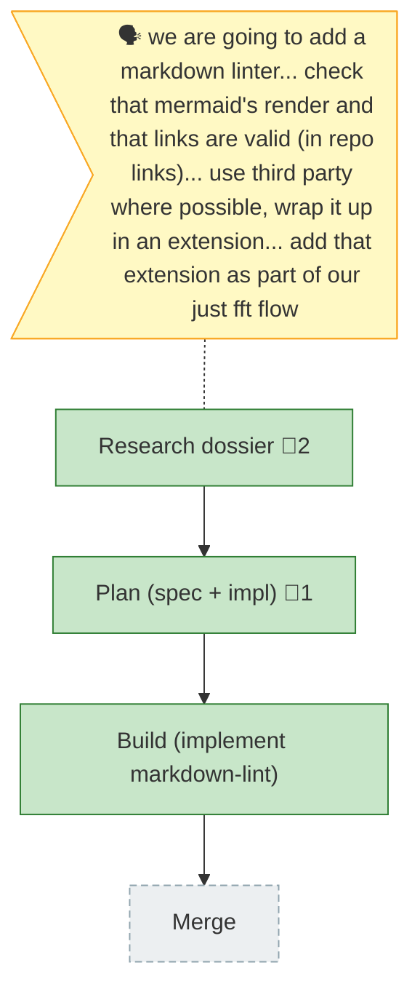

<!-- GENERATED by `harness flow render` — do not hand-edit; regenerate from the flow JSON. -->
# Flow · markdown-lint-extension

**Kind**: flight-plan · **Now**: build · **Next**: merge · **Nodes**: 4 · **Events**: 18

**Rail**: ◆─◆─[ ◆ ]─◇  ◆ Research dossier · ◆ Plan (spec + impl) · [ ◆ Build (implement markdown-lint) ] · ◇ Merge

**Legend**: 🟩 done · 🟧 in-progress · 🟥 blocked · 🟦 known (designed) · ⬜ assumed (speculative) · 🔶 decision · 🗣 user input · 🟪 harness loop · 🤖 companion · 🛠 worker · 🧰 chore (upkeep).

## Node log

### plan · Plan (spec + impl)
- 📄 artifacts: docs/plans/029-markdown-lint-extension/markdown-lint-extension-plan.md

### research · Research dossier
- 📄 artifacts: docs/plans/029-markdown-lint-extension/research-dossier.md, docs/plans/029-markdown-lint-extension/original-ask.md
