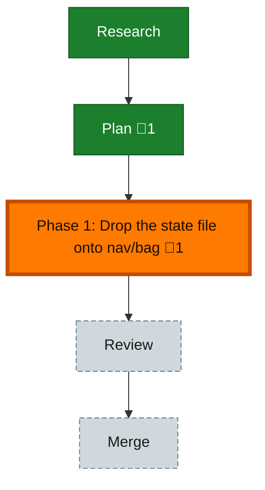

<!-- GENERATED by `harness flow render` — do not hand-edit; regenerate from the flow JSON. -->
# Flow · the-flow-state-determinism

**Kind**: flight-plan · **Now**: phase-1 · **Next**: review · **Intent**: Finish dropping .the-flow-state.json onto the deterministic nav/bag store: fold session state into nav.intent + nav.bag, derive pending_command/milestones/status, eliminate the hand-written state file. · **Nodes**: 5 · **Events**: 13

**Rail**: ◆─◆─[ ◆ ]─◇─◇  ◆ Research · ◆ Plan · [ ◆ Phase 1: Drop the state file onto nav/bag ] · ◇ Review · ◇ Merge

**Legend** — colour = type/status: 🟩 done · 🟢 in-progress · 🟥 blocked · 🟦 known · ⬜ assumed · 🔶 decision · 🗣 user input · 🟪 harness chore (faded = not yet done) · 🤖 companion · 🛠 worker · 🟧 current (you are here). Badges: 💬 comments · 📄 artifacts · 📝 instructions · 🧰 chore (° optional / recommended / ‼ strongly-recommended; ✓ done · ✕ skipped).

## Node log

### phase-1 · Phase 1: Drop the state file onto nav/bag
- `2026-06-19T03:13:54.110Z` · system · note — Group A (source prose) + Group B (eval harness) done. Deferred follow-ups: deploy via just install-skills-from-source (gated), eng-harness-flow repoint (028), full minih e2e behavioural run (T-B3b, AC-06b/08).

### plan · Plan
- `2026-06-19T02:40:38.969Z` · system · validation — validate-v2 (4 parallel agents): VALIDATED WITH FIXES. 3 CRITICAL + 3 HIGH found & fixed — §6 migration redesigned (nav authoritative, never clobber; current_stage-&gt;node lift dropped) + eng-harness-flow blast radius captured. Core thesis, edit sites (14/14), field map, nav.bag.status mechanism verified against live source/CLI.
