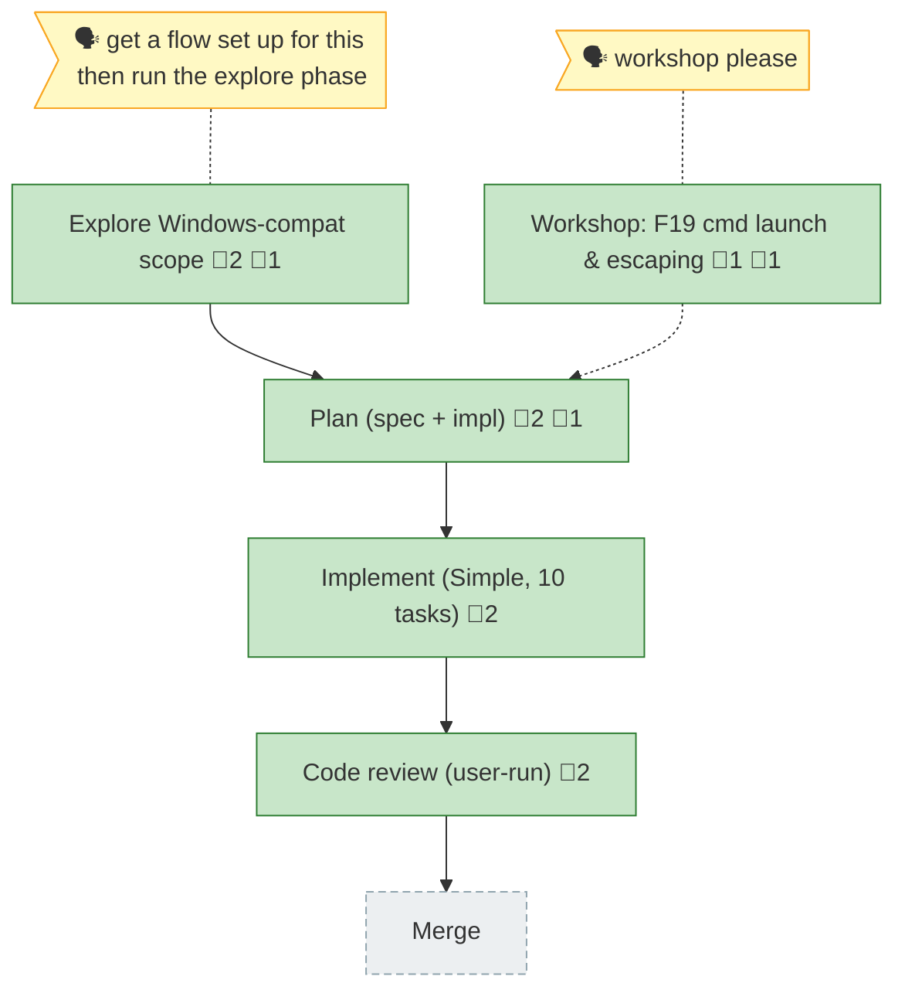

<!-- GENERATED by `harness flow render` — do not hand-edit; regenerate from the flow JSON. -->
# Flow · windows-portability-and-check

**Kind**: flight-plan · **Now**: review · **Next**: merge · **Intent**: Flow closed out: explore→plan→workshop(F19)→implement(T001-T010)→review(APPROVE WITH NOTES, all findings fixed) all done. Ship/merge DEFERRED — user commits on 026-flow-nav-rail-zone later (push as jakkaj). · **Nodes**: 6 · **Events**: 39

**Rail**: ◆─◆─[ ◆ ]─◆─◇  ◆ Explore Windows-compat scope · ◆ Plan (spec + impl) · [ ◆ Implement (Simple, 10 tasks) ] · ◆ Code review (user-run) · ◇ Merge

**Legend**: 🟩 done · 🟧 in-progress · 🟥 blocked · 🟦 known (designed) · ⬜ assumed (speculative) · 🔶 decision · 🗣 user input · 🟪 harness loop · 🤖 companion · 🛠 worker · 🧰 chore (upkeep).

## Node log

### plan · Plan (spec + impl)
- 📄 artifacts: windows-portability-and-check-plan.md
- `2026-06-19T03:16:39.559Z` · — · validation — validate-v2: 4 agents → VALIDATED WITH FIXES. Thesis advanced (Implementation, Strong); Forward-Compat all 3 consumers ✅. Fixes: CS 4→5 (Simple honoured, Full split recommended), CWE-59 single confine-copy (TOCTOU closed), BatBadBut residual made explicit, run-id-capture-timeout coverage, detached-port contract test, consumer-breaking engines note.
- `2026-06-19T03:51:03.743Z` · — · note — F19 folded via surgical edits (not a full plan re-run): corrected AC-07/T002 (reuse resolveSpawn + verbatim, no bare-.cmd spawn — EINVALs on Node &gt;=20.12.2), withdrew T010 rewrite -&gt; regression test, re-scored Risk 03/KF 03. Evidence: workshop 001 (Node docs + CVE-2024-27980). Plan stays Simple/READY. Post-Validation Amendment appended.

### research · Explore Windows-compat scope
- 📄 artifacts: research-dossier.md
- `2026-06-19T02:39:27.382Z` · — · note — Central open decision for the plan: where the detached-spawn primitive lives (core ctx vs sidecar). Handover assumed A (sidecar); research favors B/C — workshop candidate.
- `2026-06-19T02:59:10.615Z` · — · decision — Deep research (Perplexity DR-1/DR-2) folded into dossier → Design Fork RESOLVED toward Option B (core read/write FS port + fakeable BackgroundProcessPort). New F19: core windows-command.ts uses windowsVerbatimArguments:true for .cmd — DR-1 says patched Node (&gt;=20.12.2) makes that the riskier path; simplify/harden as a workshop item.

### implement · Implement (Simple, 10 tasks)
- `2026-06-19T04:37:54.877Z` · — · note — Companion booted (active, working-tree-diff protocol). Build groups: T001-T003 contract+adapters; T004-T005 verb ports; T006-T007 windows-check+wiring; T008 sensors; T009 docs; T010 regression. F19 honoured: T002 reuses resolveSpawn, never bare .cmd.
- `2026-06-19T05:38:38.335Z` · — · validation — Full suite 933 passed (83 files; +43 new). tsc clean; biome-clean (my files); windows-check self-scan ok/0 findings. All 8 ACs met (see execution.log.md phase summary). No per-task commits (shared branch). Companion completed after T008 with no findings.

### workshop-f19 · Workshop: F19 cmd launch & escaping
- 📄 artifacts: docs/plans/031-windows-portability-and-check/workshops/001-windows-cmd-launch-escaping.md
- `2026-06-19T03:44:01.433Z` · — · decision — Selected Option C: reuse resolveSpawn (cmd.exe /d /s /c + verbatim) for the detached launch. Rejected Option A (bare-.cmd spawn / DR-1 premise) — EINVAL on Node &gt;=20.12.2. T010 'simplify' WITHDRAWN -&gt; regression test only. Rewrites plan AC-07/T002/T010; resolves Risk 03 + Open-Q F19.

### review · Code review (user-run)
- `2026-06-19T06:47:39.008Z` · — · validation — Post-review fixes applied; full suite 961 passed (+28); tsc + biome clean; windows-check ok/0. reviews/review.md.
- `2026-06-19T06:50:41.517Z` · — · note — Flow closed out by user request. Implementation + review complete; 961 tests green; windows-check ok/0. Merge/ship intentionally deferred (no per-task commits this run — shared branch; commit + ship later via /the-flow 8 ship, push as jakkaj).
