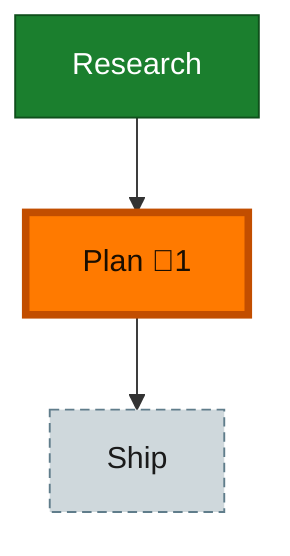

<!-- GENERATED by `harness flow render` — do not hand-edit; regenerate from the flow JSON. -->
# Flow · eng-harness-flow-flight-plans

**Kind**: flight-plan · **Now**: plan · **Intent**: First-class CLI-driven harness flow for eng-harness-flow: two mutually-exclusive flows (adopt + loop), chores-into-the-flow integration, schema + nav-mechanics docs, plus three validation agents (validate-harness-flow adapt, loop-flow-eval, flow-coexist-eval). · **Nodes**: 3 · **Events**: 13

**Rail**: ◆─◆─◇  ◆ Research · ◆ Plan · ◇ Ship

**Legend** — colour = type/status: 🟩 done · 🟢 in-progress · 🟥 blocked · 🟦 known · ⬜ assumed · 🔶 decision · 🗣 user input · 🟪 harness chore (faded = not yet done) · 🤖 companion · 🛠 worker · 🟧 current (you are here). Badges: 💬 comments · 📄 artifacts · 📝 instructions · 🧰 chore (° optional / recommended / ‼ strongly-recommended; ✓ done · ✕ skipped).

## Node log

### plan · Plan
- `2026-06-19T05:18:44.118Z` · — · validation — validate-v2: VALIDATED WITH FIXES — 2 CRITICAL + 3 HIGH addressed; all 4 agents ⚠️→✅; 12→13 ACs all covered.
