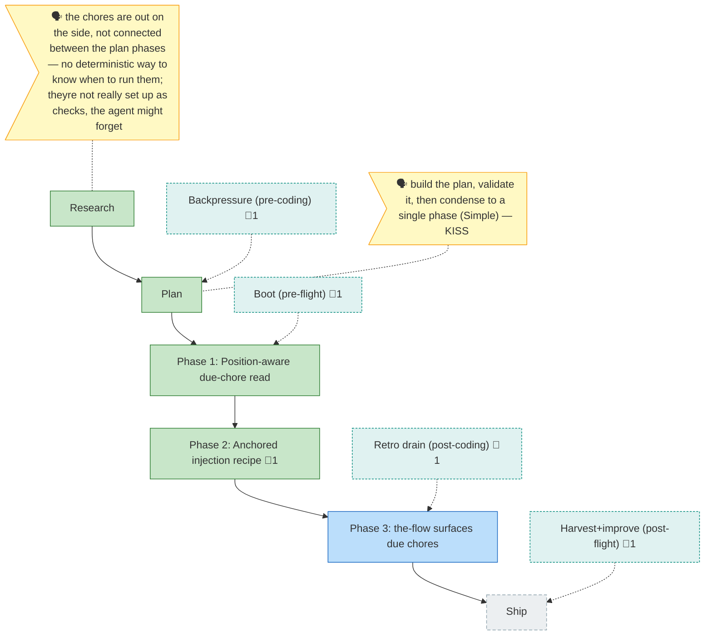

<!-- GENERATED by `harness flow render` — do not hand-edit; regenerate from the flow JSON. -->
# Flow · flow-chore-anchoring

**Kind**: flight-plan · **Now**: phase-2 · **Next**: phase-3 · **Intent**: Anchor injected loop-chores so they are deterministic checks, not orphans · **Nodes**: 10 · **Events**: 26

**Rail**: ◆─◆─[ ◆─◆─◇ ]─◇  ◆ Research · ◆ Plan · [ ◆ Phase 1: Position-aware due-chore read · ◆ Phase 2: Anchored injection recipe · ◇ Phase 3: the-flow surfaces due chores ] · ◇ Ship

**Legend**: 🟩 done · 🟧 in-progress · 🟥 blocked · 🟦 known (designed) · ⬜ assumed (speculative) · 🔶 decision · 🗣 user input · 🟪 harness loop · 🤖 companion · 🛠 worker · 🧰 chore (upkeep).

## Node log

### phase-2 · Phase 2: Anchored injection recipe
- `2026-06-23T04:02:18.740Z` · — · validation — Implemented + verified (tsc 0, 986 tests, T014 fixture). This flight plan was RE-CREATED so its own chores are anchored — the exemplar of the fix, not the before-repro.

### ehf-pre-flight · Boot (pre-flight)
- `2026-06-23T04:19:18.044Z` · — · validation — Boot = the CLI vitest suite (just test): 986 green this session.

### ehf-pre-coding · Backpressure (pre-coding)
- `2026-06-23T04:02:18.823Z` · — · note — Anchored to plan via branch_of — the FIXED injection (contrast the earlier pre-fix orphan).

### ehf-post-coding · Retro drain (post-coding)
- `2026-06-23T04:19:18.131Z` · — · note — Drained 6 observations -&gt; committed retro .harness/records/retro/2026-06-23/001-033-flow-chore-anchoring.md; buffer cleared.

### ehf-post-flight · Harvest+improve (post-flight)
- `2026-06-23T04:19:18.219Z` · — · note — Harvest+improve: DL-001 ENCODED (033 fixes the orphan recipe). Routed as candidate follow-ups: DL-002 (backpressure vs unified spec), MW-001 (flow agent verb + auto-capture richness), DL-003 (orphan remediation / re-parent verb).
