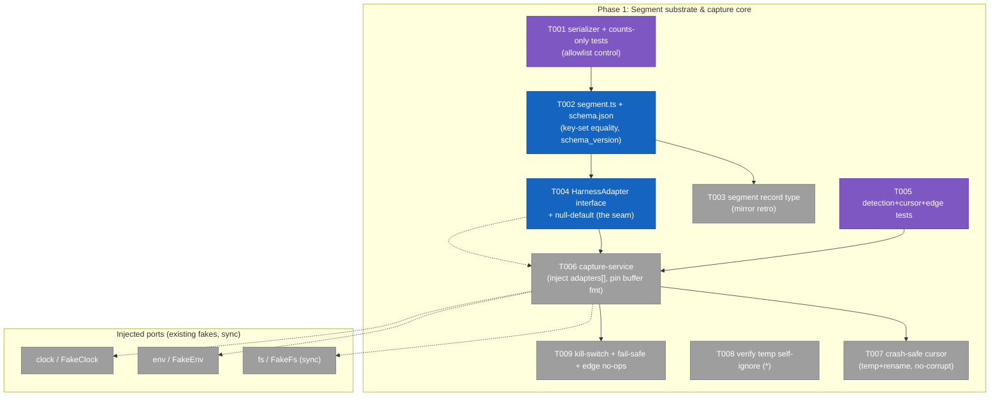
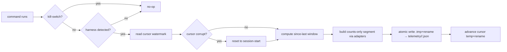
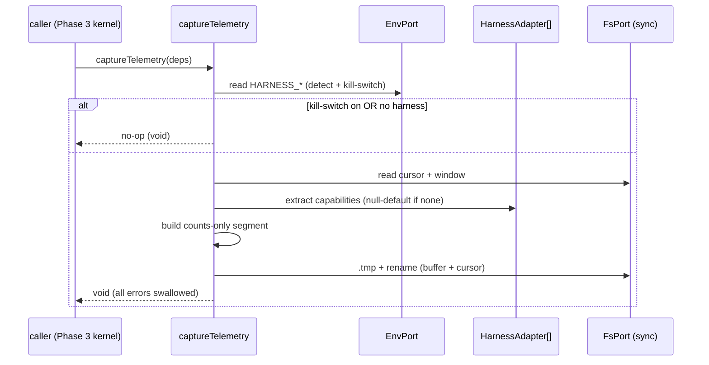

# Phase 1: Segment substrate & capture core — Tasks

**Plan**: [harness-telemetry-collection-plan.md](../../harness-telemetry-collection-plan.md)
**Phase**: Phase 1 of 4 · **Domain**: telemetry · **Depends on**: none
**Generated**: 2026-06-23 · **Revised**: 2026-06-23 (post-validate-v2) · **Status**: ✅ COMPLETE — all tasks done, companion-reviewed (0 open findings), 1038/1038 tests green

> **Validation note (validate-v2, 4 lenses):** revised to (a) build the **adapter seam** in Phase 1 so Phase 2 plugs in without rewriting capture-service [F1], (b) redefine the cursor-safety test against the **synchronous** FsPort [C2], (c) correct the atomic-write precedent — `observe` uses direct `writeText`; the real temp+rename precedent is `flow-service.ts` [Source-Truth], (d) pin the buffer on-disk format + capture entry name for Phases 3/4 [F2/F4], (e) reframe T001's privacy control to the serializer/allowlist boundary since adapters are Phase 2.

### Executive Briefing
- **Purpose**: Establish the normalized **counts-only `segment`** record, the **adapter seam** that later harnesses plug into, and a pure ports-only **capture service** that buffers "since last command" telemetry to a self-ignoring temp dir. This is the substrate Phases 2–4 build on (adapters fill it, the kernel triggers it, sync flushes it).
- **What We're Building**: the `segment` type + its cross-tool JSON schema (versioned); a `segment` core record type reusing the existing provenance; the `HarnessAdapter` capability interface + a null-default adapter (the seam); a capture service that detects the innermost harness, reads an incremental window via a session cursor, builds a counts-only segment through the adapter seam, and writes a buffer file atomically; a crash-safe cursor; the `HARNESS_NO_TELEMETRY` kill-switch; and a fail-safe wrapper so capture can never break a host command.
- **Goals**:
  - ✅ A serialized segment provably carries **only** allowlisted counts/identifiers — no content, no secrets, no absolute paths (serializer-allowlist negative control).
  - ✅ Capture is **ports-only** (passes `no-direct-node-io` + dep-cruiser) and writes only to the self-ignoring `.harness/temp/telemetry/`.
  - ✅ **Phase 2 plugs in without editing capture-service** — the `HarnessAdapter` seam + null-default exist now (AC-12 literally true).
  - ✅ Kill-switch → zero side effects; a thrown error (or absent/corrupt source) inside capture is a clean no-op, never a host-command failure.
- **Non-Goals**:
  - ❌ Any Claude/Copilot adapter *implementation* — Phase 2 (this phase ships the **interface** + a null-default only).
  - ❌ The kernel preamble that triggers capture — Phase 3 (this phase exposes the named entry it will call).
  - ❌ Any git write / orphan ref / sync — Phase 4 (this phase pins the buffer format it will read).

### Pre-Implementation Check
| File | Exists? | Domain Check | Notes |
|------|---------|-------------|-------|
| `harness/cli/src/services/telemetry/` | **No** (all-new) | telemetry (new tree) | Create; mirror `services/observe/` *structure* (not its write impl — see KF-05 correction) |
| `…/telemetry/segment.ts` | No → **create** | telemetry · contract | Type + serializer (the Phase 2/3/4 public contract) |
| `…/telemetry/segment.schema.json` | No → **create** | telemetry · contract | Versioned cross-tool/repo consumer schema |
| `…/telemetry/adapters/harness-adapter.ts` | No → **create** | telemetry · **contract** | The capability-adapter **interface** (the seam) + null-default — pulled into Phase 1 per F1 |
| `…/telemetry/capture-service.ts` | No → **create** | telemetry · internal | Ports-only; accepts injected `adapters[]` |
| `…/telemetry/cursor.ts` | No → **create** | telemetry · internal | Crash-safe watermark store (temp+rename) |
| `harness/cli/src/services/record/core-types/segment.ts` | No → **create** | record · contract | **Mirror** `core-types/retro.ts` (a `{kind,type,description,template}` scaffold — orthogonal to `segment.ts`; see F5) |
| `harness/cli/src/services/record/provenance.ts` | **Yes** | record | **Reuse** unchanged — **7 CLI-stamped keys** + template-owned `schema_version` (PROVENANCE_KEYS has 7) |
| `harness/cli/src/services/record/registry.ts` | **Yes** | record | **Modify** — import + add `segment` to `coreRecordTypes` array |
| `harness/cli/src/services/shared/temp.ts` (`ensureTemp`) | **Yes** | shared | **Reuse** — it writes `temp/.gitignore` = `*`, so any subdir self-ignores (this is the real AC-06 mechanism, not repo-root `.gitignore:159`) |
| `harness/cli/src/services/flow/flow-service.ts` | **Yes** | flow | **Atomic-write precedent** — write `${p}.tmp` then `fs.rename` (T006/capture mirror THIS, not observe) |
| `harness/cli/src/services/observe/observe-service.ts` | **Yes** | observe | Structure/Deps-seam precedent only — note it uses **direct `writeText`**, NOT atomic |
| `harness/cli/src/adapters/fs/fake-fs.ts` (+ env/clock) | **Yes** | adapters | **FsPort is synchronous** (`readText`/`writeText`/`rename` return values) — drives the T006 redefinition |

> **Contract-change flags**: `registry.ts` gains a record type (additive). `harness-adapter.ts` is a **new contract** (the seam). `provenance.ts` is reused **unchanged**.

### Architecture Map


### Tasks
| Status | ID | Task | Domain | Path(s) | Done When | Notes |
|--------|-----|------|--------|---------|-----------|-------|
| [x] | T001 | Write serializer + counts-only tests, **incl. the allowlist negative control** | telemetry | `harness/cli/test/services/telemetry/segment.test.ts` | Serializer given an object carrying a **planted secret in a non-allowlisted field + an absolute `/Users/` path** emits a segment containing **neither**; output key set ⊆ schema allowlist; repo-relative paths only; control **fails** if the allowlist regresses | plan 1.1 · AC-04 · control reframed to the **serializer** boundary (adapter-boundary planted-secret is Phase 2, task 2.2/2.3); TDD-first before T002 |
| [x] | T002 | Implement `segment.ts` (type + serializer) and `segment.schema.json` from `### Segment Schema` | telemetry · contract | `…/telemetry/segment.ts`, `…/telemetry/segment.schema.json` | Schema's property set **equals** the enumerated field set (key-set **equality**, not just validates-one); golden segment populates **every** top-level field (capability fields `null`); `schema_version` pinned to `"1.0"`; a test fails if the field set changes without a version bump | plan 1.2 · AC-12 · C4/F3 (equality + version freeze) |
| [x] | T003 | Add `segment` **core record type** reusing provenance; register it | record · contract | `…/record/core-types/segment.ts`, `…/record/registry.ts` | `harness record segment` scaffolds with the 7 provenance keys stamped; frozen-body-keys test passes; **mirrors** `core-types/retro.ts` | plan 1.3 · PL-02/06/14 · F5: this is the markdown-scaffold record type, **orthogonal** to T002's serializer — the Phase 2/3/4 contract is T002 |
| [x] | T004 | Define the `HarnessAdapter` capability **interface** + a **null-default adapter** | telemetry · contract | `…/telemetry/adapters/harness-adapter.ts` | Interface declares partial capability (tokens/skills/tools/subagents/files/model-changes/compaction/branch — each optional → `null`); a null-default adapter returns all-null; a test builds a schema-valid segment **with only the null-default** (no Claude/Copilot logic) | F1 · AC-12 · **pulls plan task 2.1's interface forward** so Phase 2 implements *against* it; de-risks T001's "adapter output" reference |
| [x] | T005 | Write tests for innermost-harness detection + cursor windowing **+ edge no-ops** (`FakeEnv`/`FakeFs`/`FakeClock`) | telemetry | `…/test/services/telemetry/capture-service.test.ts`, `…/cursor.test.ts` | Detects Copilot-over-Claude; "since last" delta correct; first run = since session start; **edge cases as designed paths (not exceptions)**: zero-harness env → clean no-op (no buffer write); missing/truncated session source → empty/null window; **corrupt cursor → reset to session-start** | plan 1.4 · AC-01 · C3 (edge no-ops explicit, not via the T009 catch-all); TDD-first before T006 |
| [x] | T006 | Implement `capture-service`: detection, cursor read, window compute, **build segment via injected `adapters[]`**, atomic buffer write | telemetry · internal | `…/telemetry/capture-service.ts`, `…/cursor.ts` | Ports-only (`no-direct-node-io` + dep-cruiser pass); accepts `adapters: HarnessAdapter[]` (defaults to `[nullDefault]`); **with no real adapter, writes a schema-valid all-`null`-capability segment**; named entry `export function captureTelemetry(deps: CaptureDeps): void`; **buffer = one JSON segment per file at `.harness/temp/telemetry/<harness_session_id>/<seq>.json`**, cursor at `…/telemetry/<session>.cursor`; atomic write via `${p}.tmp`+`rename` (mirror **flow-service**); T005 green | plan 1.5 · P2 · §T3 · AC-01, AC-06, AC-12 · F1/F2/F4/C5 |
| [x] | T007 | **Crash-safe cursor** read-modify-write + corruption test (given the **synchronous** FsPort) | telemetry | `…/telemetry/cursor.ts`, `…/test/services/telemetry/cursor-safety.test.ts` | Asserts cursor write uses **temp+rename** (`FakeFs.renames` history); a crashed/partial write (temp present, rename never ran) leaves the **prior watermark intact and readable** (no corrupt/empty cursor). **Note:** intra-process parallelism is a non-threat — FsPort is sync, so a read-then-write is atomic within one tick; this task proves crash-safety + last-writer-wins, not thread-interleaving | plan 1.6 · AC-01 · **C2 redefinition** (the old "two parallel captures" test was unfalsifiable against a sync port) |
| [x] | T008 | Verify the telemetry buffer dir self-ignores via the shared `ensureTemp` | telemetry | `…/test/services/telemetry/gitignore.test.ts` | Capture uses `services/shared/temp.ts` `ensureTemp` (which writes `temp/.gitignore` = `*`); a test writes a buffer file under `.harness/temp/telemetry/…` and asserts `git check-ignore` reports it ignored — **independent of repo-root `.gitignore` or runtime cwd** | plan 1.7 · AC-06 · Source-Truth/C1: the `*`-self-ignore is the real mechanism; do **not** rely on repo-root `.gitignore:159` (cwd-dependent) |
| [x] | T009 | Add `HARNESS_NO_TELEMETRY` kill-switch + fail-safe wrapper (catch-all → no-op) | telemetry | `…/telemetry/capture-service.ts` (+ tests) | `HARNESS_NO_TELEMETRY=1` → **zero** side effects (no temp write, asserted via `FakeFs`); any thrown error inside `captureTelemetry` is swallowed and returns cleanly; the **designed** edge no-ops (T005) are distinct from this last-resort catch-all | plan 1.8 · AC-05, AC-09 · naming-consistent with `HARNESS_NO_EXTENSIONS` |

> **Task-count note:** plan tasks 1.1–1.8 map to T001–T003, T005–T009; **T004 (adapter interface) is net-new in Phase 1**, pulled from plan task 2.1 per validation F1 (Phase 2 keeps the adapter *implementations*).

### Context Brief

**Key findings from plan**:
- **KF-03 (High)**: record system + 7-key provenance auto-stamp branch/repo/created_at/agent/plan_id → `segment` is a core record type that **reuses** provenance; don't rebuild (T003).
- **KF-05 (High, corrected)**: the gitignored `.harness/temp/` buffer is the right hot-path target — but **`observe` writes directly (`writeText`), it is NOT the atomic precedent**. Use the shared `ensureTemp` for the self-ignoring dir (T008) and **`flow-service`'s `${p}.tmp`+`rename`** for atomic writes (T006/T007).
- **KF-07 (Medium)**: provenance splice must be **pure-string** (no YAML parse in the service); fakes-not-mocks (T003/T005).
- **Done Contract**: AC-04 Phase-1 control is **serializer-allowlist** (T001); the adapter-boundary planted-secret on a real transcript is **Phase 2** (task 2.2/2.3).

**Domain dependencies** (consumed this phase):
- `record`: provenance splice (`provenance.ts`, 7 keys) + registry (`registry.ts`).
- `shared`: `temp.ts` `ensureTemp` (self-ignoring temp dir).
- `flow`: `flow-service.ts` atomic temp+rename pattern (precedent to copy).
- ports: `fs`/`env`/`clock` with `FakeFs`(**sync**)/`FakeEnv`/`FakeClock`.

**Domain constraints**:
- Services are **ports-only**: no `node:*` — enforced by `test/architecture/no-direct-node-io.test.ts` + dep-cruiser `services-only-adapter-ports`/`services-ports-type-only` (config at **repo root** `.dependency-cruiser.cjs`).
- Fakes stay out of prod (`no-fakes-in-prod`); keep `adapters-stay-leaf`/`output-stays-leaf`.
- **FsPort is synchronous** — model crash-safety/last-writer-wins, not thread interleaving.

**Reusable from prior phases**: n/a (Phase 1). Reuse existing: 9 port fakes, `provenance.ts`, `core-types/retro.ts` (record-type template), `shared/temp.ts`, `flow-service.ts` (atomic write).

**Mermaid flow diagram** (capture path):


**Mermaid sequence diagram** (seam + ports):


### Discoveries & Learnings
_Populated during implementation by the implement verb._

| Date | Task | Type | Discovery | Resolution | References |
|------|------|------|-----------|------------|------------|

---

**Directory layout**
```
docs/plans/034-harness-telemetry-collection/
  ├── harness-telemetry-collection-plan.md
  ├── backpressure-coverage.md
  └── tasks/phase-1-segment-substrate-and-capture-core/
      ├── tasks.md
      └── execution.log.md   # created by the implement verb
```

STOP — dossier only, no code. Awaiting human GO to implement.
