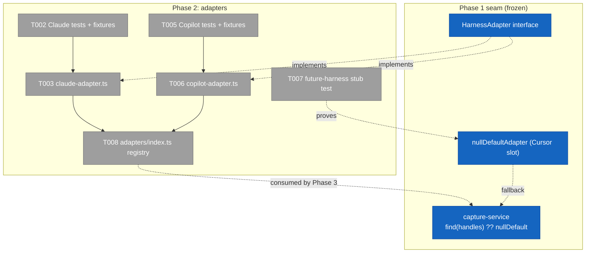
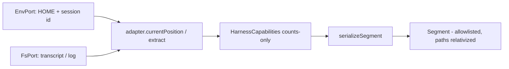
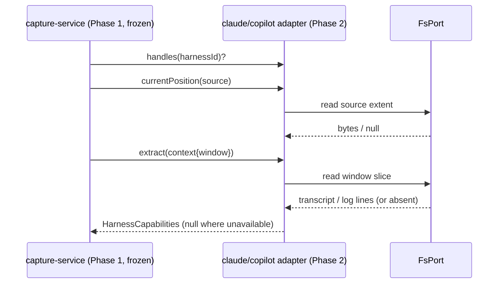

# Tasks — Phase 2: Per-harness capability adapters

**Plan**: [harness-telemetry-collection-plan.md](../../harness-telemetry-collection-plan.md) · **Mode**: Full · **Phase**: 2 of 4 · **Depends on**: Phase 1 (done)
**Generated**: 2026-06-23 · **Stage**: tasks (the-flow `5 tasks`)

---

## Executive Briefing

- **Purpose**: Translate each harness's native session artifacts into the shared counts-only `Segment` through the `HarnessAdapter` seam built in Phase 1 — so capture works for Claude Code and Copilot CLI, with Cursor a documented null slot.
- **What we're building**: A Claude transcript adapter and a Copilot process-log adapter (each a `HarnessAdapter`), their golden-fixture test suites with hand-derived expected counts + negative controls, a tiny core-adapter registry Phase 3 will consume, and a stub "future-harness" adapter test that proves AC-12 (a new harness needs **no** schema or capture-core change).
- **Goals**:
  - ✅ Claude adapter: dedupe-by-`message.id`, sum all 4 token buckets, subagent cost from the inline `Agent` tool_result, skills/tools/files/models/compaction/thinking extracted.
  - ✅ Copilot adapter: `assistant_usage` from the process log, per-model metrics, tools/code-changes, subagent identity; **null on absence**, **innermost-harness aware**.
  - ✅ **Adapter-boundary privacy control (AC-04, second boundary)**: a planted secret + absolute `/Users/` path in a real tool-arg/message must never reach the segment.
  - ✅ Adapters register WITHOUT editing `capture-service.ts` (AC-12); unimplemented/unavailable capability → `null`, never estimated.
- **Non-Goals**:
  - ❌ Wiring capture into the CLI kernel (Phase 3) — this phase only produces adapters + a registry list; it does not call them from `app.ts`.
  - ❌ Any durable git write / orphan ref / docs (Phase 4).
  - ❌ A live Cursor adapter — Cursor stays the `nullDefaultAdapter` slot, documented only.
  - ❌ Token estimation / tiktoken — authoritative server `usage` only; absent source → `null`.
  - ❌ Changing `Segment`, `segment.schema.json`, the record type, or `capture-service.ts`.

---

## Prior Phase Context — Phase 1 (Segment substrate & capture core, done)

_Synthesized from the committed Phase 1 source + `execution.log.md` (read directly — no reconstruction)._

**A. Deliverables (the seam this phase plugs into)**
- `harness/cli/src/services/telemetry/adapters/harness-adapter.ts` — the `HarnessAdapter` interface + `nullDefaultAdapter`. **This is the contract Phase 2 implements; do not edit it.**
- `harness/cli/src/services/telemetry/capture-service.ts` — already consumes adapters via `(deps.adapters ?? []).find(a => a.handles(harness)) ?? nullDefaultAdapter`, then calls `adapter.currentPosition?.(source)` and `adapter.extract(ctx)`. **No change needed here — that's the AC-12 proof.**
- `segment.ts` (`Segment`, `SegmentInput`, `serializeSegment` = allowlist-by-construction, `relativizePath`), `segment.schema.json`, `cursor.ts`, `record/core-types/segment.ts`.

**B. Dependencies exported (signatures Phase 2 consumes)**
```ts
interface HarnessSource   { env: EnvPort; fs: FsPort; repoRoot: string; harness: string }
interface HarnessContext extends HarnessSource { window: SegmentWindow }   // window = {since, from, to}
interface HarnessCapabilities {            // EVERY field optional + nullable
  harness_session_id?, tokens?, models?, effort?, skills?, tools?,
  subagents?, files?, branch_changed?, compactions?, api_errors?,
  local_commands?, thinking?               // (types from segment.ts)
}
interface HarnessAdapter {
  readonly harness: string;                // stable id, e.g. 'claude-code'
  handles(harnessId: string): boolean;
  currentPosition?(src: HarnessSource): number | null;   // source extent → cursor window; null = missing source
  extract(ctx: HarnessContext): HarnessCapabilities;      // each cap null if unavailable
}
```
- `serializeSegment` relativizes paths and **drops any non-allowlisted field** — but the adapter is the *first* boundary, so secrets must be stopped here too (controls in T002/T005).
- Detection chain (`HARNESS_ENV_CHAIN`, innermost first): `COPILOT_AGENT_SESSION_ID` → `copilot-cli`, then `CLAUDE_CODE_SESSION_ID` → `claude-code`. The adapter's `handles()` keys off these ids.

**C. Gotchas & debt carried in**
- **Ports-only (P2, arch-tested)**: `no-direct-node-io.test.ts` forbids **`node:fs` and `node:child_process`** in services (it does **not** ban `node:path`/`node:url` — `shared/posix-path.ts` itself imports `node:path`). Convention: do all I/O through injected `env`/`fs`, and use `shared/posix-path.ts` helpers instead of raw `node:path`. The `node:os` ban is *indirect* — get the home dir from **`env.home()`** (resolves `$HOME`/`%USERPROFILE%` cross-platform), **never** `os.homedir()` and **never** `env.get('HOME')`.
- **Home-dir port (corrected by validation)**: `EnvPort.home(): string | undefined` is the home dir, a **separate method** from `env.get(name)`. `FakeEnv` stores home as its **second constructor arg** (`new FakeEnv(vars, homeDir)`), *not* in the `vars` map — so `env.get('HOME')` and `env.home()` are different sources and using the wrong one fails silently in tests and on Windows.
- **`FakeFs.readdir` only enumerates mkdirp'd dirs**, not files written via `writeText`/`rename` (Phase 1 T006 note). Fixture tests must seed transcript/log files at **deterministic paths** the adapter reads directly, not via `readdir` enumeration.
- Installed `harness` v0.5.0 won't reflect new source until a package rebuild — **proof is the unit tests**, not the live CLI (Phase 1 T003 note).

**D. Incomplete items**: none blocking — Phase 1 closed at 1038/1038 green, 0 open companion findings (F001 fixed).

**E. Patterns to follow**
- Hand-written `Fake*` ports (`FakeFs` is **synchronous**), **never** `vi.mock` (Constitution P3).
- TDD RED→GREEN: fixture + failing test first, then the adapter.
- Negative controls are mandatory and **hand-derived** (grill-agent-done) — never lift expected totals from a live run (circular).

---

## Pre-Implementation Check

| File | Exists? | Domain | Notes |
|------|---------|--------|-------|
| `src/services/telemetry/adapters/harness-adapter.ts` | ✅ yes | telemetry | The interface — **read-only this phase** |
| `src/services/telemetry/capture-service.ts` | ✅ yes | telemetry | Consumer — **must NOT be modified** (AC-12 proof) |
| `src/services/telemetry/adapters/claude-adapter.ts` | ❌ create | telemetry | New `HarnessAdapter` (`harness:'claude-code'`) |
| `src/services/telemetry/adapters/copilot-adapter.ts` | ❌ create | telemetry | New `HarnessAdapter` (`harness:'copilot-cli'`) |
| `src/services/telemetry/adapters/index.ts` | ❌ create | telemetry | Core registry list (Phase 3 consumes) |
| `test/services/telemetry/fixtures/claude-*.jsonl` | ❌ create | telemetry | Sanitized golden transcript + controls |
| `test/services/telemetry/fixtures/copilot-*` | ❌ create | telemetry | Sanitized events.jsonl + process-log |
| `test/services/telemetry/claude-adapter.test.ts` | ❌ create | telemetry | RED-first |
| `test/services/telemetry/copilot-adapter.test.ts` | ❌ create | telemetry | RED-first |
| `test/services/telemetry/future-harness-adapter.test.ts` | ❌ create | telemetry | AC-12 capability null-fill |

No new concepts duplicate existing domain code; no contract changes. Adapters are additive modules behind a frozen interface — low contract risk.

---

## Architecture Map



---

## Tasks

| Status | ID | Task | Domain | Path(s) | Done When | Notes |
|--------|----|------|--------|---------|-----------|-------|
| [x] | T001 | Build the **sanitized Claude golden transcript fixture** with all negative controls baked in: a **duplicated `message.id`** (dedupe must drop it), a `message.usage` with **non-zero `cache_creation_input_tokens` + `cache_read_input_tokens`** (no bucket dropped), an `Agent` tool_result carrying inline `<usage>subagent_tokens: N\ntool_uses: M</usage>`, `Skill`/`Edit`/`Write` tool_uses, a compaction marker + a thinking block, and a **planted secret + absolute `/Users/` path inside a `Bash` tool-arg and a user message** | telemetry | `test/services/telemetry/fixtures/claude-transcript.jsonl` | Fixture is a realistic, fully sanitized JSONL; every control is present and documented in a header comment; secret/abs-path appear only in non-counted fields | AC-02, AC-04; expected totals are hand-derived in T002, **not** lifted from a run |
| [x] | T002 | Write **Claude adapter tests** (RED) asserting: token total = dedupe-by-`message.id` × (input+output+cache_creation+cache_read); subagent tokens/tool_uses parsed from the inline `Agent` tool_result; skills (`Skill` tool_use), tools histogram, files (`Edit`/`Write` paths, relativized), models, compactions, thinking counted; `currentPosition` returns the chosen **opaque monotonic offset** (see Pinned mechanics M2); an **empty window** (`from==to`) yields zero/null caps without re-counting; **adapter-boundary privacy control: run the caps through `serializeSegment` (like T007) and deep-scan the *whole serialized Segment* — assert the planted secret literal AND any `/Users/`/absolute fragment are absent AND `files` entries are repo-relative** | telemetry | `test/services/telemetry/claude-adapter.test.ts` | All assertions use **hand-derived expected numbers**; suite fails (no adapter yet); the privacy control fails if a tool-arg/message string survives in *any* serialized field (not just an unscanned one) | AC-02, AC-04; FakeFs seeded at the deterministic transcript path; **FakeEnv home via its ctor `homeDir` arg** (`new FakeEnv({CLAUDE_CODE_SESSION_ID:…}, '/home/x')`), not a `HOME` key |
| [x] | T003 | Implement the **Claude transcript adapter** (`harness:'claude-code'`, `handles` matches it): build the path `<env.home()>/.claude/projects/<mangled cwd>/<session-id>.jsonl` where *mangled cwd* = `ctx.repoRoot` with every non-alphanumeric char → `-` **preserving the leading dash** (`/Users/x`→`-Users-x`) via a new pure helper on `posix-path` helpers (no `node:path`); read the whole file with `fs.readText` then **slice in-memory by `[window.from, window.to)`** (Pinned mechanics M1/M2); dedupe usage by `message.id`; extract all capabilities; return `null` caps when the transcript is missing/unreadable; **ports-only** | telemetry | `src/services/telemetry/adapters/claude-adapter.ts` | T002 green; `no-direct-node-io` + dep-cruiser + tsc + biome clean; missing transcript → all-null (no throw); uses `env.home()` not `env.get('HOME')` | AC-02, AC-04, AC-12; mirrors `nullDefaultAdapter` shape |
| [x] | T004 | Build the **sanitized Copilot golden fixtures**: an `events.jsonl` (`session.start`, `session.model_change` with `{newModel,reasoningEffort}`, `tool.execution_*`, `assistant.message`) **and** a process-log slice with `assistant_usage` events (`input_tokens`,`input_tokens_uncached`,`output_tokens`,`reasoning_tokens`) + per-model `modelMetrics`; include a **planted secret + `/Users/` path in a `tool.execution` argument**, and an **absent-log** variant for the null path | telemetry | `test/services/telemetry/fixtures/copilot-events.jsonl`, `.../copilot-process.log` | Fixtures realistic + sanitized; controls + the absent-source variant present; documented in header | AC-03, AC-04; **no `session.shutdown` reliance** (not live — memory-confirmed) |
| [x] | T005 | Write **Copilot adapter tests** (RED) asserting: tokens summed from process-log `assistant_usage` (never `session.shutdown`); per-model `models`; effort from `session.model_change`; tools from `tool.execution_*`; subagent identity `{agent_name,model,status}` with **`tokens: null` unless cleanly correlatable** via `interaction_id`/`tool_call_id` (the test expects `null` — do not assert a derived number you cannot hand-derive); **null-on-absence** when no matching log; **innermost-harness aware** (Copilot wins when both Copilot+Claude env vars are set); **adapter-boundary privacy control via `serializeSegment` deep-scan** (same shape as T002) | telemetry | `test/services/telemetry/copilot-adapter.test.ts` | Hand-derived expecteds; suite fails (no adapter); absent-log case asserts all-null; nesting case asserts `handles('copilot-cli')` path chosen | AC-03, AC-04; FakeFs+FakeEnv seeded (home via ctor arg) |
| [x] | T006 | Implement the **Copilot process-log adapter** (`harness:'copilot-cli'`): correlate `env.get('COPILOT_AGENT_SESSION_ID')` → `<env.home()>/.copilot/session-state/<id>/events.jsonl` and the process log under `<env.home()>/.copilot/logs/` — **discover via `fs.readdir`, filter by the `process-` prefix, `fs.readText` each, keep the one whose contents match the session id**; parse `assistant_usage`; extract model/effort/tools/subagents/code-changes; **zero matching logs → `tokens: null`** (never `session.shutdown`); `null` on any missing source; **ports-only, no estimation** | telemetry | `src/services/telemetry/adapters/copilot-adapter.ts` | T005 green; arch + dep-cruiser + tsc + biome clean; absent source → all-null; uses `env.home()` | AC-03, AC-04, AC-12 |
| [x] | T007 | Add the **stub "future-harness" adapter test** proving AC-12: define a throwaway adapter for an unknown harness id returning partial caps, run it through `serializeSegment`/capture path, assert a **schema-valid all-null-filled segment** with **no change** to `segment.ts`/`segment.schema.json`/`capture-service.ts` | telemetry | `test/services/telemetry/future-harness-adapter.test.ts` | New adapter needs zero schema/core edits; unimplemented caps serialize `null`/empty per the Phase-1 defaults | AC-12; the seam's headline guarantee |
| [x] | T008 | Add the **core-adapter registry** `coreTelemetryAdapters = [claudeAdapter, copilotAdapter]` (real adapters only — `nullDefaultAdapter` stays the capture-service fallback, **not** in the list) so Phase 3 imports one list; test asserts order + each `handles` its own id + null-default excluded | telemetry | `src/services/telemetry/adapters/index.ts`, `test/services/telemetry/adapter-registry.test.ts` | Registry exports both adapters in a stable order; capture-service still unmodified | AC-12; the clean Phase-3 consumption point |

**Status legend**: `[ ]` pending · `[~]` in progress · `[x]` complete · `[!]` blocked.

---

## Context Brief

**Key findings from plan (applied here)**
- **F1 (validation)**: the interface is already in Phase 1 (T004) — Phase 2 implements *against* it, never redefines it. Plan task 2.1's "define interface" is therefore satisfied; 2.1 collapses into T003+T006.
- **KF-03**: `segment` reuses provenance; adapters emit **counts only** — no record/provenance work here.
- **Done Contract (AC-04, second boundary)**: the serializer-allowlist control was Phase 1; this phase owns the **adapter-boundary** planted-secret control on a *real transcript* (T002/T005). Both boundaries must drop the secret.

**Domain dependencies (consumed)**
- `telemetry`: `HarnessAdapter`/`HarnessSource`/`HarnessContext`/`HarnessCapabilities` (`adapters/harness-adapter.js`) — the interface to implement.
- `telemetry`: `SegmentWindow`, `SegmentTokens`, `SegmentSubagent`, … (`segment.js`) — capability value types.
- adapters (`_platform`): `EnvPort` — **`env.home()`** for the home dir + `env.get(name)` for session-id vars; `FsPort` — `readText` (whole file), `readdir`, `exists` (all return `null`/`[]` on absence, never throw). This is **the only I/O channel** (P2).
- `shared/posix-path.js`: `toPosix`/`posixJoin`/`posixNormalize` — path building without `node:path`.

**Domain constraints**
- Ports-only: `no-direct-node-io.test.ts` forbids `node:fs`/`node:child_process` (not `node:path`). Home dir via `env.home()`; correlation paths built with `posix-path` helpers; reads go through `fs`.
- Capture-core is **frozen**: do not edit `capture-service.ts` or the segment contract. Adapters compose by being added to `deps.adapters` (assembly is Phase 3).
- `nullDefaultAdapter` is the capture-service `?? ` fallback, **not** a registry entry — selection is `find(handles) ?? nullDefault`. Adapter order is **not** load-bearing (Claude/Copilot `handles` are disjoint on the detected id); T008 asserts a stable order only for determinism.

**Implementation mechanics (pinned by validation — the implement verb must not guess these)**
- **M1 — whole-file read + in-memory slice**: `FsPort` has no byte-range read. Adapters `fs.readText` the whole source, then slice to `[window.from, window.to)`. Copilot's `events.jsonl` is **naturally pre-segmented per invocation** (its own session id) — the window is effectively the whole file; state that rather than slicing.
- **M2 — offset unit**: `currentPosition` returns an **opaque monotonic offset** — pick **one** unit (string length OR line count) and use it *identically* in `currentPosition` and the slice. "Byte length" is wrong (`String.length` is UTF-16 code units). Phase-1 `computeWindow` treats the value as opaque, so self-consistency is the only requirement.
- **M3 — Claude path mangling**: `ctx.repoRoot` → every non-alphanumeric char to `-`, **leading dash preserved** (`/Users/x` → `-Users-x`). New pure helper; no `node:path`.
- **M4 — privacy assertion shape**: controls run caps through `serializeSegment` and deep-scan the **whole serialized Segment** for the secret literal AND any `/Users/`/absolute fragment, AND assert `files` are repo-relative — a leak surviving as a relativized basename or in an unscanned field must still fail the test.
- **M5 — intentionally-null caps (Phase 2)**: `api_errors` and `local_commands` are `null`/0 for both adapters this phase (not yet mined); `branch_changed` is supplied by capture-service from git, not the adapter. State this so omission doesn't read as oversight.
- **M6 — empty/missing window**: an empty window (`from==to`) returns zero/null caps without re-reading the whole file; missing source → all-null (no throw).

**Reusable from Phase 1**
- `FakeFs` (sync), `FakeEnv`, `FakeClock`, `FakeGit`, `FakeProcess` — seed transcript/log content + env vars in tests.
- The `killswitch-failsafe.test.ts` pattern for building `CaptureDeps` with an adapter list (T007 can reuse it to drive the future-harness adapter end-to-end).
- `serializeSegment`'s relativization — adapters return repo-relative-or-basename paths; the serializer is the backstop.

**Correlation cheat-sheet (verified — see project memory)**
- **Claude**: `~/.claude/projects/<cwd nonalnum→'-'>/<CLAUDE_CODE_SESSION_ID>.jsonl`; dedupe usage by `message.id`; 4 buckets; subagent cost inline in `Agent` tool_result `<usage>…</usage>`; skills=`Skill` tool_use, files=`Edit`/`Write`.
- **Copilot**: `~/.copilot/session-state/<COPILOT_AGENT_SESSION_ID>/events.jsonl` + process log `assistant_usage` (live; `session.shutdown` is **not** live — never the source); per-model `modelMetrics`; subagent tokens best-effort/`null`.

**System flow**




---

## Discoveries & Learnings

_Populated during implementation by the implement verb._

| Date | Task | Type | Discovery | Resolution | References |
|------|------|------|-----------|------------|------------|

**Types**: `gotcha` | `research-needed` | `unexpected-behavior` | `workaround` | `decision` | `debt` | `insight`

---

## Directory layout

```
docs/plans/034-harness-telemetry-collection/
  ├── harness-telemetry-collection-plan.md
  └── tasks/phase-2-per-harness-capability-adapters/
      ├── tasks.md            # this file
      └── execution.log.md    # created by the implement verb
```

**✅ COMPLETE** — all tasks T001–T008 implemented (TDD, companion-reviewed every commit, 0 open findings). See `execution.log.md`.
