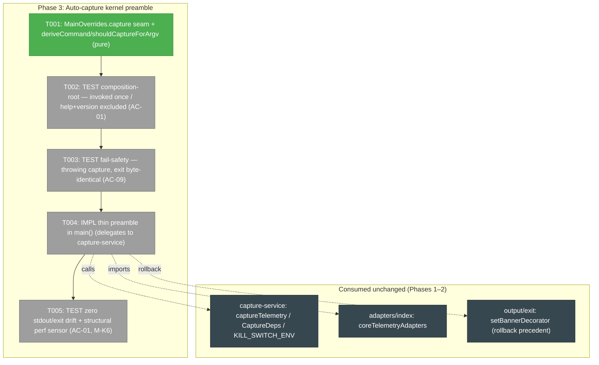
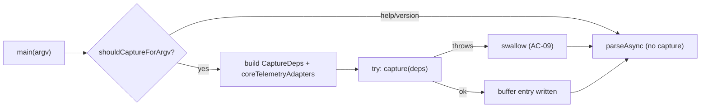
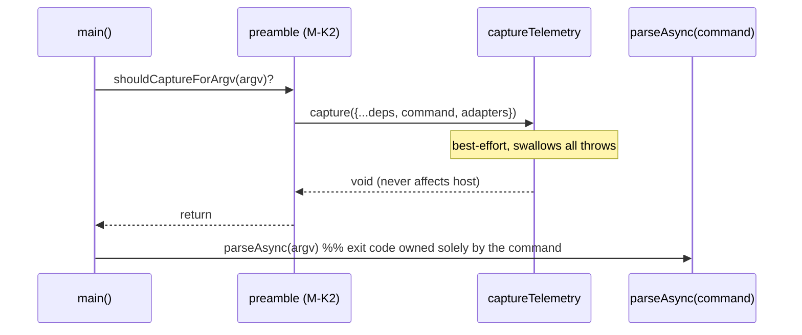

# Tasks — Phase 3: Auto-capture kernel preamble

**Plan**: [harness-telemetry-collection-plan.md](../../harness-telemetry-collection-plan.md)
**Phase**: 3 of 4 · **Domain**: cli-kernel · **Mode**: Full · **CS**: 4 (one load-bearing kernel edit; rollback keeps it CS-4 not CS-5)
**ACs**: AC-01 (composition-root: invoked once / help+version excluded / byte-identical output) · AC-09 (fail-safe: a throwing capture never changes the host exit code) · AC-06 guard (T005 re-asserts `git status --porcelain` unchanged now that capture fires on every command — primary proof stays Phase-1 task 1.7 / Phase-4 task 4.2)

---

## Executive Briefing

- **Purpose**: Wire the (already-complete) capture-service into the CLI so **every** `harness` command auto-captures one `segment` — fail-safely, with **zero** observable change to stdout, stderr, or exit code. This is the trigger that turns the Phase-1/2 sensor from "callable" into "ambient".
- **What We're Building**: A **thin preamble** at the `app.ts` composition root (`main()`) that builds `CaptureDeps` from the ports already wired there, attaches `coreTelemetryAdapters`, and calls `captureTelemetry(deps)` **once** per command — guarded to skip `--help`/`--version` and wrapped so it can never perturb the host command.
- **Goals**:
  - ✅ Capture fires exactly **once** per real command, with the correct top-level `command` label.
  - ✅ `--help`/`--version` (display-only) are **excluded**.
  - ✅ A throwing capture (or a throwing deps build) leaves the host command's **exit code and output byte-identical** (defense-in-depth over capture-service's own internal guard).
  - ✅ Logic stays in the **service**; the preamble is a one-call delegation (Architecture §7 anti-pattern: no business logic in the kernel).
  - ✅ A **structural** perf sensor proves capture is cursor-incremental and reads the source a **bounded** number of times — no per-line / O(history) re-scan (NOT a wall-clock threshold).
- **Non-Goals**:
  - ❌ Any change to `capture-service.ts`, the segment schema, or the adapters (Phases 1–2 are frozen; touching them would break AC-12).
  - ❌ Durable git writes / sync / orphan ref / docs — that is **Phase 4** (and **§T1-gated**).
  - ❌ Per-individual identity or `git config user.email` handling (Phase 4 / §T1).
  - ❌ Plan-link capture wiring beyond what the service already does (AC-08 lives in Phase 4 task 4.3).

---

## Prior Phase Context

> Synthesized from the in-repo artifacts I read directly: `src/services/telemetry/capture-service.ts`, the Phase-2 adapters + `adapters/index.ts`, and `tasks/phase-2-.../execution.log.md`. No fabrication — every signature below is quoted from source.

### Phase 1 — Segment substrate & capture core (DONE)

**A. Deliverables**: `src/services/telemetry/capture-service.ts` (the `captureTelemetry` entry + `captureUnsafe` core), `segment.ts` + `segment.schema.json` (enumerated, capability-nullable), `cursor.ts` (`cursorPathFor`, `sessionDirFor`, `ensureTemp`, `readCursor`/`writeCursor`), the gitignored `.harness/temp/telemetry/` buffer, the `HARNESS_NO_TELEMETRY` kill-switch.

**B. Dependencies Exported** (the seam Phase 3 consumes — quoted from `capture-service.ts`):
```ts
export interface CaptureDeps {
  fs: FsPort; env: EnvPort; clock: Clock; proc: ProcessPort; git?: GitPort;
  command: string;              // the kernel preamble passes this (Phase 3)
  adapters?: HarnessAdapter[];  // null-default is the final fallback (AC-12)
}
export const KILL_SWITCH_ENV = 'HARNESS_NO_TELEMETRY';
export function captureTelemetry(deps: CaptureDeps): void;  // SYNC, ports-only, best-effort
```
- `captureTelemetry` is **already fail-safe**: kill-switch short-circuits (AC-05); any internal throw is swallowed (AC-09). Detection returns `null` for zero-harness → clean no-op (no writes).
- It writes one atomic buffer entry to `sessionDirFor(cwd, sessionId)/<n>.json` and advances the cursor.

**C. Gotchas & Debt**: capture builds the segment via `buildInput(deps, …)` which stamps `command: deps.command` verbatim — **the preamble owns deriving that label**. `cwd` comes from `deps.proc.cwd()` (POSIX-normalized).

**D. Incomplete Items**: none blocking Phase 3.

**E. Patterns to Follow**: ports-only (no `node:*` in services), synchronous fakes, hand-written `Fake*`, never `vi.mock`. Home via `env.home()`.

### Phase 2 — Per-harness capability adapters (DONE)

**A. Deliverables**: `adapters/claude-adapter.ts`, `adapters/copilot-adapter.ts`, `adapters/index.ts`.

**B. Dependencies Exported** (the import Phase 3 needs — quoted from `adapters/index.ts`):
```ts
export const coreTelemetryAdapters: HarnessAdapter[] = [claudeAdapter, copilotAdapter];
// null-default EXCLUDED on purpose — it is capture-service's `??` fallback.
```

**C. Gotchas & Debt** *(load-bearing for Phase 3's 3.4 perf sensor)*: the Claude adapter reads the **whole transcript file** — and reads it **twice** per capture (once in `currentPosition` to count lines, once in `extract` to slice). `FsPort` has **no range read** (M1, Phase 2). ⟹ **The plan's literal "no full-transcript read / ≤ windowed byte range" wording (3.4 / coverage line) is NOT achievable as written.** Phase 3 reshapes that sensor honestly — see **M-K6**.

**D. Incomplete Items**: Copilot `files`/`compactions`/`thinking` intentionally `null` (documented). Not a Phase-3 concern.

**E. Patterns to Follow**: TDD (hand-derived golden fixtures, RED→GREEN); companion-reviewed every commit; never amend after a companion ping ([[companion-no-amend-after-ping]]).

---

## Pre-Implementation Check

| File | Exists? | Domain Check | Notes |
|------|---------|--------------|-------|
| `src/app.ts` | ✅ exists (304 ln) | cli-kernel ✅ | **MODIFY** — add preamble call in `main()`; add `capture` seam to `MainOverrides`; add tiny pure helpers `deriveCommand`/`shouldCaptureForArgv`. The **one load-bearing edit.** |
| `src/services/telemetry/capture-service.ts` | ✅ exists | telemetry ✅ | **NO CHANGE** — consumed as-is (`captureTelemetry`, `CaptureDeps`, `KILL_SWITCH_ENV`). |
| `src/services/telemetry/adapters/index.ts` | ✅ exists | telemetry ✅ | **NO CHANGE** — import `coreTelemetryAdapters`. |
| `src/output/exit.ts` | ✅ exists | cli-kernel ✅ | **NO CHANGE** — `setBannerDecorator` is the documented **rollback** precedent (at-exit capture), not used now. |
| `test/app.test.ts` | ✅ exists | test ✅ | **MODIFY/EXTEND** — kernel preamble tests (or a sibling `test/app-telemetry.test.ts` to keep the file focused). |

**Contract-change flag**: extending `MainOverrides` with one **optional** field (`capture?`) is additive and back-compatible — no existing caller breaks (default binds the real `captureTelemetry`). No public CLI surface changes.

---

## Implementation mechanics (pinned before coding)

These resolve every "how exactly" so implementation has no open decisions. They are the Phase-3 analogue of Phase 2's M1–M6.

- **M-K1 — the testability seam.** Extend `MainOverrides` with `capture?: (deps: CaptureDeps) => void` (default `captureTelemetry`). The preamble builds `CaptureDeps` and calls `overrides.capture ?? captureTelemetry`. This is the **only** way to assert "invoked once / with command X" and "a thrower is swallowed" **without `vi.mock`** (ports-only doctrine). Mirrors the existing `MainOverrides` intent ("injectable seams so the composition root is testable").
  - ⚠️ **Env trap (FC validator F1)**: `main()` holds **two** env objects — the local `env: NodeJS.ProcessEnv` (used for mode/safe-mode) and `deps.env: EnvPort`. `CaptureDeps.env` **must** be `deps.env` (the `EnvPort`). Harness detection (`CLAUDE_CODE_SESSION_ID`) **and** the AC-08 plan-link feed (`HARNESS_PLAN_ID`, stamped into `plans_touched` by `buildInput` at capture time) both flow through `deps.env` — passing the raw `NodeJS.ProcessEnv` would silently break both and leave Phase 4's dedupe nothing to dedupe.
- **M-K2 — placement.** Call the preamble **once** in `main()`, **after** registry validation (`validateVerbRegistry`) and **immediately before** the `parseAsync` try-block. Rationale: it is a *preamble* (records the agent's work *since the last command*, before this command runs); placing it after registry validation means a malformed-registry early-exit doesn't double-fire, and it runs for every dispatched command exactly once.
- **M-K3 — help/version exclusion.** `shouldCaptureForArgv(argv): boolean` → **false** iff argv contains any of `-h`, `--help`, `-v`, `--version`, **or** the first non-flag token is `help`. Everything else captures, **including bare `harness`** (label `harness`) — bare invocation is a real command and capturing the prior window is the whole point. (AC says "exclude help/version"; bare orientation is not version/help display.)
  - **Argv-shape, not semantic (completeness HIGH-1)**: the exclusion is a token scan, not a "display-only?" judgement. The only display-only surfaces today are `help` / `--help` / `-v` / `--version`. **Any future display-only verb must be added to `shouldCaptureForArgv`** — a one-line comment in the helper must say so, else a new display verb silently captures.
  - **`-h`/`-v` anywhere excludes (completeness HIGH-2)**: the scan is a flat `includes` (mirrors `jsonFlag`/`isExtensionsDisabled`), so `harness doctor --help` excludes (correct — commander treats `-h/-v` as globals) but a verb defining its own `-h/-v` would be wrongly excluded. We **accept anywhere-excludes** — identical to the documented `isExtensionsDisabled` v1 caveat (`app.ts:70-72`); the helper comment must name this symmetry. Revisit only if a verb ever needs its own `-h/-v`.
  - **Invalid command captures (completeness MEDIUM-3)**: because the preamble runs **before** `parseAsync`, `harness bogus` (→ E108 unknown command) **does** capture, label `'bogus'`. This is **intended** — the trigger is the *invocation* (real agent activity in the window), not successful dispatch (consistent with the M-K2 "records the window before this command" rationale). T002 pins this with an explicit case.
- **M-K4 — command label.** `deriveCommand(argv): string` = the **first token at index ≥ 2 that does not start with `-`**, else `'harness'`. Top-level command only (`flow nav …` → `'flow'`), matching `segment.command`'s single-token contract. Pure, no I/O. **Safe because every global flag is boolean** (`--json`/`--no-json`/`--no-extensions`/`-v`/`-h` — none consume a following value, `app.ts:167-170`): so `harness --json doctor` → `'doctor'`. A value-taking global (e.g. a hypothetical `--config <path>`) would break this heuristic — guard noted for the future (completeness MEDIUM-6).
- **M-K5 — fail-safe wrapper (defense in depth).** Wrap the **entire** preamble (deps construction **and** the capture call) in its own `try { … } catch { /* swallow */ }`. `captureTelemetry` already swallows *internal* throws, but the kernel guard also covers a throw in `CaptureDeps` construction or an injected/over-eager `capture` seam. AC-09 at the kernel layer = host exit + output byte-identical even when `capture` throws.
- **M-K6 — structural perf sensor (honest reshape of plan 3.4).** The plan's "no full-transcript read / ≤ windowed byte range" is **not buildable** (M1: whole-file read, twice). The buildable, honest sensor is **two assertions** via FakeFs call inspection:
  1. **Bounded reads**: capture reads each source path a **small constant** number of times per command (Claude path = 2: `currentPosition` + `extract`) — never per-line, never O(history).
  2. **Cursor-incremental processing**: with a prior cursor watermark at `N`, only lines `[N..end)` contribute to the segment counts (advancing the cursor shrinks the processed window) — proving repeat commands don't re-count the whole history.
  This is recorded as a **discovery** (the plan wording is corrected here, not silently met).
  - ⚠️ **Honest scope of the guarantee (thesis validator F1)**: each capture still **reads + splits the full transcript twice** (FsPort has no range read). The guarantee is bounded read-**count** + windowed **parse** — **not** bounded **bytes**. The residual O(file-size) read is the accepted M1 debt; do not let M-K6 read as "per-command cost is sub-linear in transcript size" — it is not.

---

## Architecture Map



---

## Tasks

| Status | ID | Task | Domain | Path(s) | Done When | Notes |
|--------|-----|------|--------|---------|-----------|-------|
| [x] | T001 | Add the testability seam + pure helpers: `MainOverrides.capture?: (deps: CaptureDeps) => void`; export pure `deriveCommand(argv)` (M-K4) and `shouldCaptureForArgv(argv)` (M-K3). No wiring yet. | cli-kernel | `harness/cli/src/app.ts` | Helpers exported + unit-tested in isolation; `tsc` clean; no behavior change to existing commands | M-K1/K3/K4; mirrors `jsonFlag`/`isExtensionsDisabled` pure-helper pattern |
| [ ] | T002 | **TEST (RED→GREEN)** composition-root wiring: with a recording `capture` seam + `FakeEnv` carrying `CLAUDE_CODE_SESSION_ID`, `main()` calls capture **once** with `command` = derived label. Cases: normal verb → 1 (label = verb); **bare `harness`** → 1 (label `harness`); `--help`/`-h`/`--version`/`-v`/`help` subcommand → **0**; **malformed-registry early-exit → 0** (proves M-K2 placement after `validateVerbRegistry` can't double-fire); **`harness bogus` (unknown → E108) → 1** (label `bogus`, M-K3 invalid-command decision); `harness --json doctor` → 1 (label `doctor`, M-K4 boolean-global skip). Pin the once-per-process assumption (extensions are loaded modules, not in-process re-dispatch). | cli-kernel | `harness/cli/test/app.test.ts` (or `test/app-telemetry.test.ts`) | Each case asserts exact call count + `deps.command`; help/version + early-exit assert 0 calls; RED before T004, GREEN after | AC-01; Done-Contract "double-fire" negative; uses M-K1 seam, no `vi.mock` |
| [ ] | T003 | **TEST (RED→GREEN)** kernel fail-safety: inject a `capture` seam that **throws synchronously**; assert the host command's **exit code AND stdout AND stderr are byte-identical** to the no-telemetry run (same envelope, same exit; stderr matters — the banner decorator writes there, `app.ts:185-193`). Also a deps-build-throw variant. The throwing seam must be sync (matches `captureTelemetry`'s `void` signature) so removing the M-K5 `try/catch` makes the test fail. | cli-kernel | `harness/cli/test/app.test.ts` | With a throwing seam, `main('… doctor')` exits with its normal code; stdout+stderr unchanged; no unhandled rejection | AC-09; proves M-K5 belt-and-suspenders beyond capture-service's own guard; stderr is a deliberate strengthening beyond the plan's literal AC text |
| [ ] | T004 | **IMPL** the thin preamble in `main()`: after `validateVerbRegistry`, before the `parseAsync` try-block — if `shouldCaptureForArgv(argv)`, build `CaptureDeps` = `{ fs: deps.fs, env: deps.env, clock: deps.clock, proc: deps.proc, git: deps.git, command: deriveCommand(argv), adapters: coreTelemetryAdapters }` — **`env` is `deps.env` (EnvPort), NOT the local `NodeJS.ProcessEnv`** (M-K1 trap) — then call `(overrides.capture ?? captureTelemetry)(deps)`, all inside a swallowing `try/catch`. **One delegation, no logic.** | cli-kernel | `harness/cli/src/app.ts` | T002 + T003 GREEN; `captureTelemetry` + `coreTelemetryAdapters` imported; `env: deps.env` wired; single delegation; no business logic in the kernel (§7) | CLI-03/04; M-K2/K5; FC-F1 env pin; logic stays in service |
| [ ] | T005 | **TEST** zero-drift golden + **structural perf sensor**: on representative core commands (`doctor`, `flow`, `record`) assert stdout+stderr+exit **byte-identical** with capture on vs off (kill-switch `HARNESS_NO_TELEMETRY=1` — note: the **service** short-circuits; the preamble still delegates, so this exercises the real path). Add `git status --porcelain` **unchanged** across each command (AC-06 PR-invisibility now that capture fires on every command). Structural — count `FakeFs.readText` calls on the transcript path (bounded constant, M-K6.1) and assert a prior cursor shrinks the processed window (M-K6.2). | cli-kernel | `harness/cli/test/app.test.ts` | Output byte-identical both ways on all three commands; `git status --porcelain` unchanged; readText call count bounded; cursor-incremental proven | AC-01 + AC-06 guard; perf **reshaped** per M-K6 (NOT wall-clock); records the plan-wording discovery |

---

## Context Brief

**Key findings from plan**:
- **KF-01 (Critical)**: extensions are invocation-only (no kernel hooks) → auto-capture **must** be a **core** preamble in `app.ts`, not an extension. This phase is exactly that core edit.
- **CLI-03/04**: keep the kernel a composition root — no fs/process/git logic, no business logic (Architecture §7 anti-pattern). The preamble is a single `captureTelemetry(deps)` call.
- **Rollback (plan §Phase 3)**: if the composition-root preamble proves problematic (latency/ordering), fall back to the `setBannerDecorator` at-exit precedent in `output/exit.ts` for an at-exit capture — strictly additive, removable. This is the CS-4-not-CS-5 mitigation; the trigger is isolated to one call site.

**Domain dependencies** (consumed unchanged):
- `telemetry`: `captureTelemetry(deps)` + `CaptureDeps` + `KILL_SWITCH_ENV` (`capture-service.ts`) — the fail-safe sync entry.
- `telemetry`: `coreTelemetryAdapters` (`adapters/index.ts`) — the Claude+Copilot adapter array (null-default excluded; it is capture-service's `??` fallback).
- `cli-kernel`: `MainOverrides`, `defaultDeps()`, `main()` (`app.ts`) — the composition root + its existing injectable seams.

**Domain constraints**:
- No `node:*` imports leak into services (already satisfied; the preamble only *calls* the service). The kernel may use `node:*` (it is the composition root) but adds **none** here.
- No business logic in `app.ts` — one delegation only.
- Don't touch `capture-service.ts` / schema / adapters (AC-12 invariant; the arch + dep-cruiser gates and the future-harness test guard this).

**Reusable from prior phases / existing tests**:
- `test/app.test.ts` harness: `deps(overrides)`, `io`, `main(argv, overrides)` with `MainOverrides` — the seam to drive `main()` with fakes.
- `FakeFs` (synchronous), `FakeEnv(env, home)`, `FakeProcess({}, '/repo')`, `FakeClock` — already imported in `app.test.ts`.
- `sessionDirFor` / `cursorPathFor` (telemetry/cursor) — to assert buffer/cursor state in the integration-style T005 if asserting via real `captureTelemetry` rather than a recording seam.

**Mermaid — capture trigger flow**:


**Mermaid — kernel sequence**:


---

## Discoveries & Learnings

_Populated during implementation by the implement verb._

| Date | Task | Type | Discovery | Resolution | References |
|------|------|------|-----------|------------|------------|
| 2026-06-23 | T005 | decision | Plan 3.4's "no full-transcript read / ≤ windowed byte range" is not achievable: the Claude adapter reads the whole transcript **twice** per capture (`currentPosition` + `extract`) and `FsPort` has no range read (Phase-2 M1). | Reshaped the structural sensor to **bounded read-count + cursor-incremental processing** (M-K6); plan §3.4 + coverage line 303 are now stale and corrected in the plan during reconcile. | M-K6; plan lines 255, 303 |
| 2026-06-23 | T003/T005 | decision | Plan AC-01 names only stdout+exit; AC-09 names only exit. | **Deliberately strengthened** to also assert **stderr** byte-identical — the banner decorator writes to stderr (`app.ts:185-193`), so stderr is the most likely drift channel. Recorded so a future reconcile doesn't read it as scope creep. | validators LOW-7 |
| 2026-06-23 | T002 | decision | An unknown command (`harness bogus` → E108) fires capture because the preamble runs before `parseAsync`. | **Intended**: the trigger is the invocation (real window activity), not successful dispatch; label = the raw token. Pinned by a T002 case. | M-K3 |

---

## Directory layout

```
docs/plans/034-harness-telemetry-collection/
  ├── harness-telemetry-collection-plan.md
  └── tasks/phase-3-auto-capture-kernel-preamble/
      ├── tasks.md          # this file
      └── execution.log.md  # created by the implement verb
```

---

## Validation (validate-v2 — 4 parallel thesis-aware agents · 2026-06-23)

**Verdict: GO — no CRITICAL findings.** Source-truth agent confirmed every load-bearing claim against source with line refs (the `CaptureDeps`/`captureTelemetry` signatures, `coreTelemetryAdapters` export, the `app.ts:292→294` insertion point, and the M-K6 "reads-whole-file-twice" basis). Thesis + forward-compat + completeness agents returned hardening items only — all folded in:

| Finding | Sev | Folded into |
|---|---|---|
| Pass `env: deps.env` (EnvPort), not local `NodeJS.ProcessEnv` — else detection + AC-08 plan-link silently break | MED | M-K1 trap + T004 explicit |
| Perf guarantee is bounded read-**count** + windowed **parse**, NOT bounded bytes (residual O(file-size) read = M1 debt) | MED | M-K6 caveat + plan 3.4/303 corrected |
| Double-fire only single-path asserted | MED | T002: bare-harness + early-exit-zero + once-per-process cases |
| AC-06 PR-invisibility not re-asserted under 100% write frequency | LOW | T005: `git status --porcelain` unchanged |
| `help` exclusion is argv-shape not semantic; `-h/-v` anywhere-excludes; invalid-cmd captures; value-global guard | HIGH×2/MED | M-K3 + M-K4 notes; T002 cases |
| stderr asserted beyond plan's literal AC text (banner writes to stderr) | LOW | T003/T005 + Discoveries (deliberate strengthening) |
| Plan §3.4 + coverage line 303 stale ("no full-transcript read") | LOW | **plan corrected** |

STOP — dossier only. No code changed. Validated. Awaiting human GO to implement.
