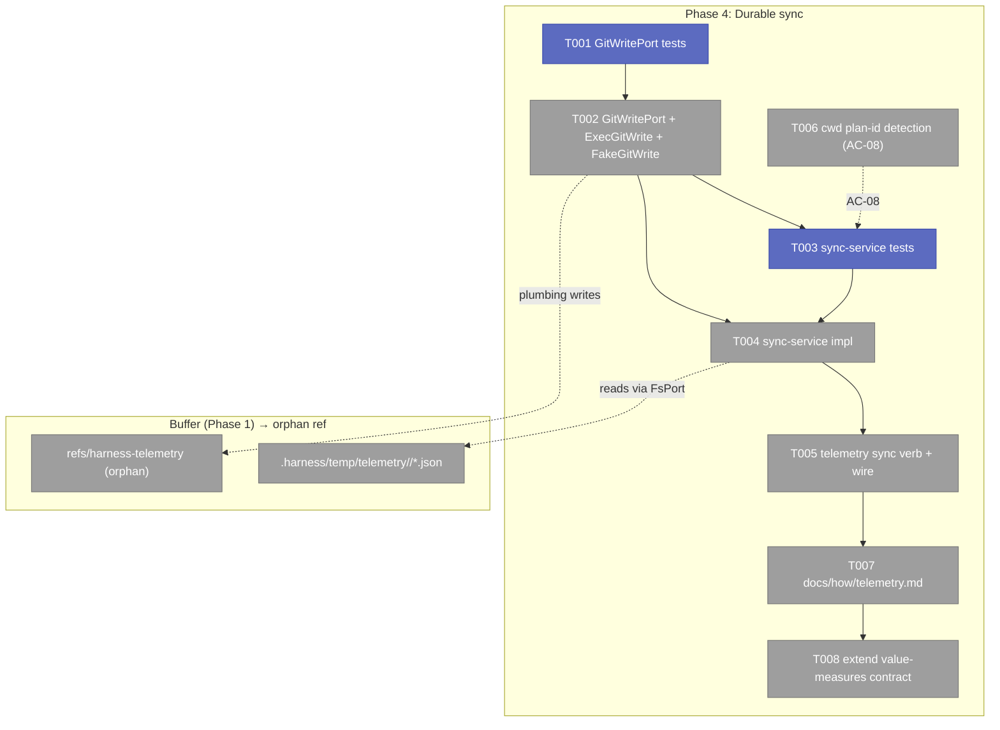
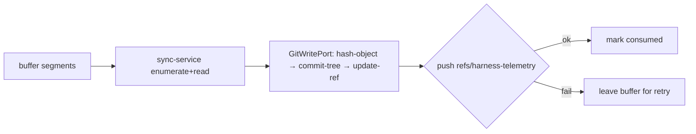
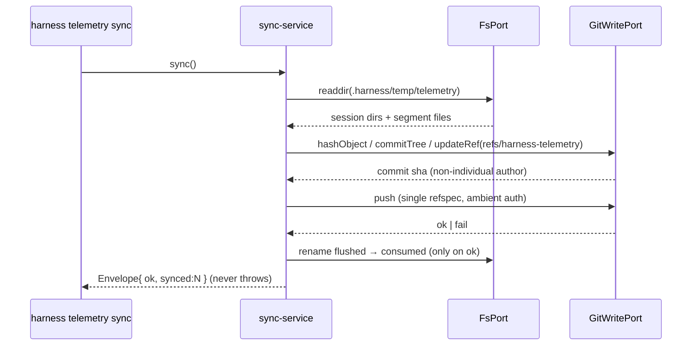

# Phase 4 — Durable sync: GitWritePort + orphan ref + docs

**Plan**: [harness-telemetry-collection-plan.md](../../harness-telemetry-collection-plan.md) · **Mode**: Full · **Phase**: 4 of 4 (terminal)
**Depends on**: Phase 1 (buffer + segment + provenance). Phases 2–3 inform real-data behaviour but are not hard deps.
**Governance (§T1 — RATIFIED 2026-06-23, verbatim binding decision)**: commit **author AND committer** = the non-individual identity `harness-telemetry <noreply@anthropic.com>`; **no `git config user.email` is read or stored** at the storage layer; the serialized segment carries **no per-individual identity field**; the optional `agent` provenance field stays **nullable** (house pattern, `null` when unset, never reported per-individual); **per-user attribution is out of scope** (a separate governance-gated decision). This is the hard contract T001/T002 (AC-07/13) assert and T008 (AC-11) documents — implementers do not re-litigate it.

---

## Executive Briefing

**Purpose**: Make captured telemetry *durable* without polluting any working tree or PR. Phases 1–3 write counts-only `segment` JSON to a gitignored buffer (`.harness/temp/telemetry/<session>/<seq>.json`). This phase adds the **write** half of git (a `GitWritePort` plumbing adapter), a **sync-service** that flushes the buffer into a single orphan ref via plumbing (never touching the index/working tree), a first-class **`harness telemetry sync`** verb, and the **consumer/measures documentation** the eng-thrive scraper depends on.

**What We're Building**
- `GitWritePort` (plumbing contract) + `ExecGitWrite` (real) + `FakeGitWrite` (test) — hash-object → commit-tree → update-ref → push, authored by a **non-individual** identity.
- `sync-service` — enumerate buffer segments, build the orphan commit, flush once, **leave the buffer intact on a failed push** (offline-safe), dedupe plan links across segments.
- `harness telemetry sync` core verb (a `telemetry` command family mirroring `flow`) wired at the `app.ts` composition root.
- cwd-based **plan-id detection** so AC-08's "run inside `docs/plans/<id>/`" clause is genuinely met (closes live-smoke finding #2).
- `docs/how/telemetry.md` (the guide) + an extension to `docs/how/harness-value-measures.md` (the segment **contract**, team/repo grain).

**Goals**
- ✅ Flush buffered segments → `refs/harness-telemetry` via plumbing; `git status --porcelain` **unchanged** across capture + flush (AC-06).
- ✅ Commit author/committer = non-individual identity; serialized segment carries no per-individual field (AC-07, AC-13).
- ✅ Best-effort single-refspec push; a failed push errors nothing and leaves the buffer for retry (AC-14).
- ✅ Plan links recorded when run inside `docs/plans/<id>/` or with `HARNESS_PLAN_ID`; multi-plan sessions deduped (AC-08).
- ✅ `docs/how/` guide + value-measures contract at team/repo grain, one hand-traced example (AC-10, AC-11).

**Non-Goals**
- ❌ Cross-repo scraper / measure-engineering / DORA correlation (downstream eng-thrive).
- ❌ Reworking subagent-token correlation (live-smoke finding #1) — documented as a known limitation, not fixed here.
- ❌ A general core `ship` command (out of scope; `telemetry sync` is the concrete capability).
- ❌ Any change to the segment schema or capture core (AC-12 — adapters/schema FROZEN).
- ❌ Token handling in CLI code — push uses the **ambient git credential mechanism** (AC-14).

---

## Prior Phase Context

### Phase 1 — Segment substrate & capture core (the buffer Phase 4 flushes)
**A. Deliverables consumed**: `services/telemetry/segment.ts` (`Segment` type, `serializeSegment`, `SEGMENT_SCHEMA_VERSION="1.0"`); `segment.schema.json`; `services/telemetry/cursor.ts`; `services/record/core-types/segment.ts` (the `segment` record type, 7-key provenance reuse).
**B. Buffer contract (load-bearing for sync)**:
```
.harness/temp/telemetry/
  ├── <session>.cursor        # decimal watermark, atomic temp+rename
  └── <session>/              # sanitizeSessionId() — no path escape
      ├── 1.json              # one serialized Segment per file, max(n)+1 naming
      ├── 2.json
      └── …
```
- Self-ignoring via nested `.harness/temp/.gitignore` = `*` (NOT the repo-root `.gitignore`) — the real AC-06 control.
- Atomic write precedent = **`flow-service`** (temp+rename), NOT `observe`.
**C. FsPort surface available**: `exists`, `readText`, `readdir`, `mkdirp`, `writeText`, `rename`, `realpath`. ⚠️ **No range read** and **no delete/unlink** — flushing "consume" semantics must use `rename` (e.g. move flushed files to a `.synced/` subdir) rather than delete, OR advance a per-session "flushed watermark" file. Decide in T003/T004.
**D. Incomplete for Phase 4**: full plan-id detection (Phase 1 only reads `HARNESS_PLAN_ID` env); real `git status --porcelain` proof was promised here for Phase-4 4.2.
**E. Patterns**: ports-only services (no `node:*` — arch-checked); fakes-not-mocks; atomic temp+rename; adapters stay leaf (impls in `adapters/`, never in `services/`).

### Phases 2–3 — adapters + kernel preamble (what real segments contain)
- `coreTelemetryAdapters = [claudeAdapter, copilotAdapter]` (`adapters/index.ts`); `CaptureDeps { fs, env, clock, proc, git?, command, adapters? }`; `command` derived by `deriveCommand(argv)`; `env` is the **EnvPort** (`deps.env`), never `process.env`.
- `plans_touched` populated **only** from `deps.env.get('HARNESS_PLAN_ID')` (capture-service `buildInput`); dedupe already at serialize time (`segment.ts` `dedupe(...)`). **No cwd-based detection exists** → AC-08 first clause unmet.
- **3 live-smoke real-data findings** (see memory `telemetry-phase3-live-smoke-findings`): ① `subagents[].tokens` null in practice; ② `plans_touched: []` without env var; ③ out-of-repo writes → bare basename (`relativizePath` fallback). ② is closed here (T006); ① & ③ are **documented** in T007.

---

## Pre-Implementation Check

| File | Exists? | Domain | Notes |
|------|---------|--------|-------|
| `harness/cli/src/adapters/git/git-write-port.ts` | **NEW** | git | New plumbing contract beside read-only `git-port.ts` |
| `harness/cli/src/adapters/git/exec-git-write.ts` | **NEW** | git | `spawnSync` plumbing — mirror `exec-git.ts` shape |
| `harness/cli/src/adapters/git/fake-git-write.ts` | **NEW** | git | Records plumbing calls — mirror `fake-git.ts` |
| `harness/cli/src/services/telemetry/sync-service.ts` | **NEW** | sync | Ports-only flush; no `node:*` |
| `harness/cli/src/acts/telemetry.ts` | **NEW** | sync | `telemetry sync` command family — mirror `acts/flow.ts` `registerFlowAct` |
| `harness/cli/src/app.ts` | exists | cli-kernel | Wire `registerTelemetryAct` + add `gitWrite` to `defaultDeps`; T006 cwd plan-id |
| `harness/cli/src/services/telemetry/capture-service.ts` | exists | telemetry | T006 only — cwd plan-id fallback (no schema/adapter change) |
| `docs/how/telemetry.md` | **NEW** | docs/measures | The guide |
| `docs/how/harness-value-measures.md` | exists | docs/measures | Extend with the segment contract |
| `harness/cli/test/adapters/git/fake-git-write.test.ts` | **NEW** | git | T001 |
| `harness/cli/test/services/telemetry/sync-service.test.ts` | **NEW** | sync | T003 |
| `harness/cli/test/acts/telemetry.test.ts` | **NEW** | sync | T005 |

**Contract-change flag (higher risk)**: `app.ts` `defaultDeps()` gains a `gitWrite` port (composition-root edit); `VerbActDeps` grows one field. Isolated, additive.

---

## Architecture Map



---

## GitWritePort — interface sketch (so the implementer doesn't invent it)

The contract T001/T002 build to (refine signatures during TDD; this pins the shape, not the final types):

```ts
// src/adapters/git/git-write-port.ts
export interface GitWritePort {
  /** Write a blob/tree/commit object to the object DB; returns its sha. */
  hashObject(type: 'blob' | 'tree' | 'commit', data: string): string;
  /** Build a tree from path→blobSha entries; returns the tree sha. */
  writeTree(entries: { path: string; sha: string }[]): string;
  /** commit-tree with FORCED non-individual author+committer; parent null = orphan/first. */
  commitTree(tree: string, parent: string | null, message: string): string;
  /** Current tip of a ref, or null (used as commitTree parent + updateRef oldSha). */
  refTip(ref: string): string | null;
  /** Compare-and-set update-ref; false on stale oldSha → caller retries (ff-loop). */
  updateRef(ref: string, newSha: string, oldSha: string | null): boolean;
  /** Best-effort push of a single refspec via ambient git auth; throws on failure. */
  push(refspec: string): void;
}
```
- **Author/committer are NOT parameters** — `ExecGitWrite` forces `harness-telemetry <noreply@anthropic.com>` internally (via `GIT_AUTHOR_*`/`GIT_COMMITTER_*` env on the `commit-tree` spawn), so no call site can leak an individual identity (§T1, AC-13).
- Append model: `refTip('refs/harness-telemetry')` → parent; first write → `null` (orphan root). `updateRef` is compare-and-set; on `false` (concurrent writer moved the tip) re-read `refTip` and retry.

## Tasks

| Status | ID | Task | Domain | Path(s) | Done When | Notes |
|--------|-----|------|--------|---------|-----------|-------|
| [x] | T001 | **Write GitWritePort tests** against `FakeGitWrite`: records `hashObject`/`writeTree`/`commitTree`/`refTip`/`updateRef`/`push` calls; asserts the **orphan commit shape** (parent `null` on first write; parent = `refTip` on append; ff-retry when `updateRef` returns `false`) and **non-individual author/committer**. | git | `harness/cli/test/adapters/git/fake-git-write.test.ts` | Fake records the plumbing sequence; recorded author **and** committer = `harness-telemetry <noreply@anthropic.com>` (a hard-coded constant, never a parameter); `updateRef` retries on stale-tip then succeeds | TDD-first; AC-07, AC-13; PL-15 (fakes-not-mocks) |
| [x] | T002 | **Define `GitWritePort` (per the sketch above) + implement `ExecGitWrite` (spawnSync plumbing) + `FakeGitWrite`**. Commit to `refs/harness-telemetry` via hash-object/commit-tree/update-ref; **never** `git add`/index/worktree touch; author **and** committer forced to the non-individual identity via `GIT_AUTHOR_*`/`GIT_COMMITTER_*` env on the spawn. Add a **real `git status --porcelain` unchanged** integration test across an actual write (closes Phase-1 deferred porcelain proof). | git | `harness/cli/src/adapters/git/{git-write-port.ts,exec-git-write.ts,fake-git-write.ts}`; integration test at `harness/cli/test/adapters/git/exec-git-write.int.test.ts` (temp-repo) | Passes T001; in a temp repo the integration test reads the repo's `git config user.email`, performs a real write, then asserts the orphan commit author email **≠ that value** AND **== `noreply@anthropic.com`**; `git status --porcelain` byte-identical before/after | AC-06, AC-07, AC-13; mirror `exec-git.ts`/`fake-git.ts`; AC-13 is the §T1 constitutional gate — assert *inequality to the live config*, not just "author is set" |
| [x] | T003 | **Write sync-service tests** (FakeFs + FakeGitWrite + FakeEnv/Clock): flush all `<session>/*.json` once → one orphan commit; **plan-link dedupe across the whole flush** (segment-A `[X,Y]` + segment-B `[X,Z]` → commit records the **set** `[X,Y,Z]`, no dups — AC-08 multi-plan); **failed push leaves the buffer intact** (offline-safe, no host error); empty buffer = clean no-op; kill-switch (`HARNESS_NO_TELEMETRY`) = no-op; **consume via per-session flushed-watermark** (a `<session>.flushed` file written atomic temp+rename, mirroring the cursor — NOT delete, FsPort has none; NOT a `.synced/` move). | sync | `harness/cli/test/services/telemetry/sync-service.test.ts` | Buffered segments flushed exactly once; plan links deduped to a set across all flushed segments; on `push` throw the buffer **and** the flushed-watermark are unchanged and no exception escapes; a second sync with no new segments re-flushes nothing | TDD-first; AC-08, AC-14; **consume mechanism DECIDED = flushed-watermark file** (per validation — simplest, atomic, matches cursor; avoids O(n) renames) |
| [x] | T004 | **Implement `sync-service`** (ports-only): enumerate sessions via `FsPort.readdir`, read segments **after** each session's flushed-watermark, build one tree/commit through `GitWritePort`, push once, then advance the watermark (atomic temp+rename) **only on push success**; dedupe plan links into a set across the flush. Fail-safe wrapper (mirrors capture-service) so sync never throws to the host. **No segment-schema change** — the watermark lives OUTSIDE the segment (AC-12 frozen). On push failure return `{ ok:false }` (no throw); the verb maps that to exit 1; buffer + watermark untouched. | sync | `harness/cli/src/services/telemetry/sync-service.ts` | Passes T003; no `node:*` (arch-check + dep-cruiser clean); buffer + watermark untouched on push failure; segment schema/keys unchanged | AC-08, AC-14, AC-12; atomic temp+rename for the watermark |
| [x] | T005 | **Implement `harness telemetry sync` verb + wire it**: a `telemetry` command family (`registerTelemetryAct`, mirroring `registerFlowAct`) mapping the service outcome onto the Envelope (ok→0; `{ok:false}` from a failed push → exit 1, host still healthy); register in `app.ts`; add a `gitWrite: GitWritePort` field to `VerbActDeps` + `defaultDeps()` (`new ExecGitWrite()`). Push only the single `refs/harness-telemetry:refs/harness-telemetry` refspec, best-effort, ambient git auth. | sync | `harness/cli/src/acts/telemetry.ts`, `harness/cli/src/app.ts`, `harness/cli/test/acts/telemetry.test.ts` | `harness telemetry sync` runs the service; pushes only that one refspec; no other ref/branch modified; failed push → Envelope `ok:false`/exit 1 but the host process is otherwise unaffected | AC-07, AC-14; verb name fixed by validation; composition-root edit isolated/additive |
| [x] | **T006** | **[DECISION — RESOLVED: implement] cwd-based plan-id detection** (closes live-smoke finding #2 → AC-08 **first clause**, which is otherwise unmet: capture today reads plan id ONLY from `HARNESS_PLAN_ID`). When the env var is unset, derive the plan id by matching the cwd against `docs/plans/(<id>-<slug>)/` and walking **up** from cwd; take capture group 1 (the `<ordinal>-<slug>` dir name, e.g. `034-harness-telemetry-collection`); no match → empty (→ `plans_touched: []`). Env var still **wins** when present. Pure helper + tests; wired into the capture path's plan-id resolution. **No schema/adapter change.** | telemetry / cli-kernel | `harness/cli/src/services/telemetry/capture-service.ts` (or a small pure helper beside it) + `harness/cli/src/app.ts`, tests alongside | Running with cwd inside `docs/plans/034-harness-telemetry-collection/…` and no env var records `plans_touched:["034-harness-telemetry-collection"]`; `HARNESS_PLAN_ID` overrides when set; cwd outside any plan dir → `[]` | AC-08; **DECISION committed** (was a scope addition; validation confirmed AC-08's wording is the contract → implement). Keep ports-only |
| [ ] | T007 | **Write `docs/how/telemetry.md`** — the guide: capture model (ambient per-command, since-last-command window), the enumerated segment schema (link, don't copy), `HARNESS_NO_TELEMETRY` kill-switch, the `telemetry sync` flow + orphan ref, offline/failed-push behaviour, trailing-tail caveat, **path semantics** (repo-relative; out-of-repo → basename only — finding #3, **with a worked path example**), and the **known limitation** that `subagents[].tokens` is null in practice on live transcripts (finding #1, **stated explicitly as a current gap**, not silently). | docs/measures | `docs/how/telemetry.md` | Covers all listed sections; finding #3 includes a concrete before/after path example; finding #1 is called out verbatim as a known limitation (a reader/reviewer can confirm both are documented, not merely alluded to) | AC-10; reference memory `telemetry-phase3-live-smoke-findings` (don't restate verbatim) |
| [ ] | T008 | **Extend `docs/how/harness-value-measures.md`** with the segment **contract** (which fields feed the eng-thrive measures) at **team/repo grain only** — contract doc, NOT measure computation. One hand-traced segment example; explicit statement that commit-author/`agent` are **never** surfaced per-individual. **Plus a deterministic AC-11 audit**: a test (grep/AST scan over `src/`) asserting no CLI code path surfaces a per-individual identity (no read of `git config user.email`; no rendering of `agent`/`commit.author` per-user). | docs/measures | `docs/how/harness-value-measures.md`; audit test at `harness/cli/test/architecture/no-per-individual-surface.test.ts` | Hand-traced example present; states team/repo-only; no measure-engineering added; **the audit test passes** (scans for `user.email` reads + per-individual rendering of `agent`/author and finds none) | AC-10, AC-11; the audit upgrades AC-11 from doc-presence (inferential) to a deterministic governance sensor |

**Status legend**: `[ ]` pending · `[~]` in progress · `[x]` complete · `[!]` blocked.
**TDD ordering**: T001→T002 (port), T003→T004 (service), then T005 (verb), T006 (AC-08), T007/T008 (docs). Test tasks precede their implementation per house TDD.

---

## Context Brief

**Key findings from plan (Phase 4 relevant)**
- KF-04 (High): `GitPort` is read-only; plumbing unwrapped; `harness ship` doesn't exist → `GitWritePort` + sync entry are net-new, isolated here.
- KF-05 (High): `.harness/temp/` self-ignores via nested `ensureTemp` gitignore; atomic precedent is `flow-service` (temp+rename), not `observe`.
- KF-02 (Critical): per-user attribution conflicts with P12 + value-measures doctrine → team/repo grain; non-individual author (AC-07/11/13, §T1 ratified).

**Domain constraints**
- Services stay **ports-only** (no `node:fs`/`node:child_process` in `src/services/**`) — enforced by `test/architecture/no-direct-node-io.test.ts` + dep-cruiser. All git plumbing lives behind `GitWritePort`; the impl (`ExecGitWrite`) is a **leaf adapter** in `adapters/git/`.
- The segment schema + capture core + adapters are **FROZEN** (AC-12). T006 touches only plan-id *resolution*, not the schema or any adapter.
- Push uses **ambient git credentials** — no token handling in CLI code (AC-14).

**Reusable from prior phases / repo**
- `exec-git.ts` + `fake-git.ts` — copy their `spawnSync`/recorder shapes for the write twins.
- `registerFlowAct` (`acts/flow.ts`) — the command-family → Envelope → exit-code pattern to mirror for `telemetry`.
- `flow-service` atomic temp+rename; `capture-service` fail-safe wrapper; `FakeFs`/`FakeEnv`/`FakeClock` fakes.
- 7-key provenance splice (`record/provenance.ts`) — for stamping the orphan commit/record metadata if a record type is used.

**Sync flow (system states)**


**Sync actor interactions**


---

## Discoveries & Learnings

_Populated during implementation by the implement verb._

| Date | Task | Type | Discovery | Resolution | References |
|------|------|------|-----------|------------|------------|

**Types**: `gotcha` | `research-needed` | `unexpected-behavior` | `workaround` | `decision` | `debt` | `insight`

---

## Watch-outs (carry into implementation)

All validation-surfaced decisions are now **resolved in the task rows above**; these are the durable reminders:

1. **FsPort has no delete (verified)** — consume-after-flush uses a **per-session `<session>.flushed` watermark file** (atomic temp+rename, mirroring the cursor). NOT delete (none exists), NOT a `.synced/` move (avoids O(n) renames). Decided; pinned by T003's second-sync test.
2. **T006 is RESOLVED = implement** — AC-08's "run inside `docs/plans/<id>/`" clause is the contract; capture today only reads `HARNESS_PLAN_ID` (live-smoke finding #2), so the cwd path must be built. Not optional.
3. **AC-13 = §T1 constitutional gate** — assert the orphan author email is **≠ the live `git config user.email`** AND **== `noreply@anthropic.com`** (T002 integration test reads the real config and compares), not merely "author is set". Author+committer are forced, never parameters.
4. **Subagent tokens null (finding #1) & out-of-repo basename (finding #3)** are NOT fixed here — **documented** (T007, each with an explicit statement/example). Do not let #1 expand into a Phase-2 adapter rework (non-goal creep); the schema already null-fills correctly (Phase-1 `future-harness` null-fill test covers the mechanism).
5. **AC-11 is now deterministic** — T008 adds a code-path audit test (no `user.email` read; no per-individual `agent`/author rendering), upgrading it from doc-presence inference to a real sensor.
6. **AC-12 stays frozen** — the flushed-watermark lives OUTSIDE the segment; no schema/key/adapter change anywhere in Phase 4.

---

## Validation Record (validate-v2, 2026-06-23)

4 parallel agents (Source-Truth · Cross-Reference/Completeness · Thesis-Alignment · Forward-Compatibility), proof target **Implementation**.

- **Source-Truth: ✅ all 7 codebase claims CONFIRMED** — incl. the load-bearing *FsPort has no delete/unlink and no range read* (consume-via-rename design is sound), and that `registerFlowAct`/`ExecGit`/`FakeGit`/`defaultDeps`/`buildInput`-plan-id-env-only/`dedupe`+basename-fallback/buffer-layout all match the cited paths. No path or signature errors.
- **Thesis: advanced at Implementation level** — no drift, no non-goal creep; durable-sync layer is exactly what the plan asked.
- **Fixes applied** (all folded into the rows above): ① §T1 restated verbatim + author≠live-`git config user.email` made the AC-13 assertion (was "author is set"); ② consume mechanism **decided** = flushed-watermark file; ③ T006 **committed** as required (closes AC-08 first clause / live-smoke #2) with a concrete cwd-regex; ④ AC-11 **upgraded to deterministic** via a no-per-individual-surface audit test (T008); ⑤ added a `GitWritePort` interface sketch so the implementer doesn't invent signatures; ⑥ dedupe scope clarified to flush-time set across all segments; ⑦ AC-12 frozen-schema reaffirmed (watermark outside the segment); ⑧ findings #1/#3 documentation made checkable (explicit statement + worked example).
- **Verdict: ✅ Implementation-ready** — every Phase-4 AC (06/07/08/10/11/13/14) maps to a task with a deterministic or knowingly-inferential sensor; the few implementer-decision points the agents flagged are now pre-decided in the rows.

## Directory layout
```
docs/plans/034-harness-telemetry-collection/
  ├── harness-telemetry-collection-plan.md
  └── tasks/phase-4-durable-sync-gitwriteport-orphan-ref-docs/
      ├── tasks.md            # this file
      └── execution.log.md    # created by the implement verb
```

**STOP** — dossier only. No code changed. Awaiting validation, then human GO to implement.
