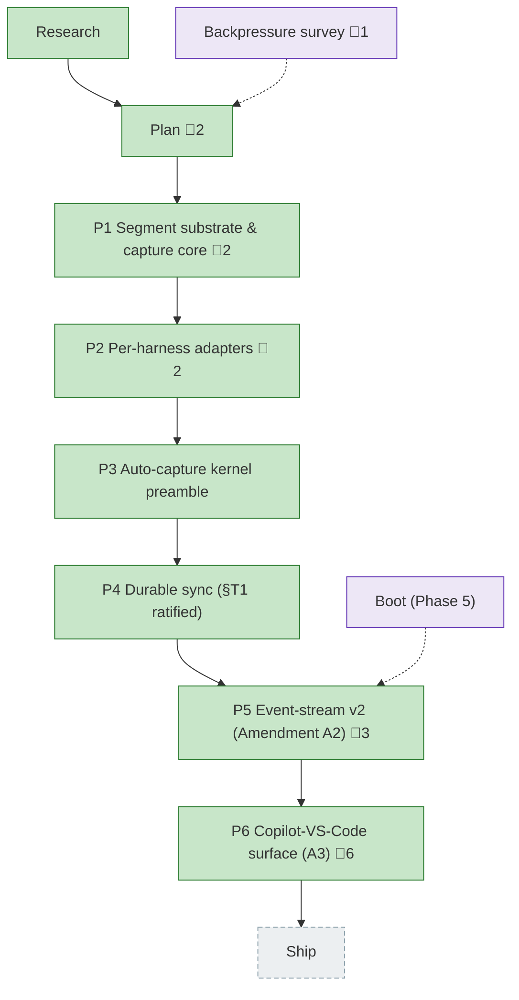

<!-- GENERATED by `harness flow render` — do not hand-edit; regenerate from the flow JSON. -->
# Flow · harness-telemetry-collection

**Kind**: flight-plan · **Now**: phase-6 · **Next**: ship · **Intent**: Harness telemetry collection — per-command sensor emitting normalized per-session segments (tokens/skills/tools/subagents/files/plan-links) committed to an orphan git ref for eng-thrive; Claude + Copilot adapters, Cursor later · **Nodes**: 11 · **Events**: 77

**Rail**: ◆─◆─[ ◆─◆─◆─◆─◆─◆ ]─◇  ◆ Research · ◆ Plan · [ ◆ P1 Segment substrate & capture core · ◆ P2 Per-harness adapters · ◆ P3 Auto-capture kernel preamble · ◆ P4 Durable sync (§T1 ratified) · ◆ P5 Event-stream v2 (Amendment A2) · ◆ P6 Copilot-VS-Code surface (A3) ] · ◇ Ship

**Legend**: 🟩 done · 🟧 in-progress · 🟥 blocked · 🟦 known (designed) · ⬜ assumed (speculative) · 🔶 decision · 🗣 user input · 🟪 harness loop · 🤖 companion · 🛠 worker · 🧰 chore (upkeep).

## Node log

### plan · Plan
- `2026-06-23T05:45:35.647Z` · — · validation — validate-v2 (4 agents) VALIDATED WITH FIXES: CRITICAL §T1 per-individual commit-author vs anti-surveillance doctrine -&gt; defaulted non-individual author + gated before Phase 4; HIGH schema-shape/kill-switch-name/concurrency/push-auth fixed; sync verb named.
- `2026-06-23T06:43:29.281Z` · — · decision — Done Contract folded into plan (grill-agent-done): planted-secret control (task 1.1), dup-message.id token control (2.2), structural perf sensor replaces flaky &lt;10ms (3.4). Privacy scope decided: branch names kept verbatim. One open gap = §T1 author ratification, gates Phase 4.

### phase-1 · P1 Segment substrate & capture core
- `2026-06-23T07:06:00.509Z` · — · validation — validate-v2 (4 lenses): ALIGNED on coverage; 3 HIGH fixes applied to dossier — (1) adapter seam built in Phase 1 [F1] so Phase 2 plugs in w/o rewriting capture-service (new T004); (2) cursor-safety test redefined for the synchronous FsPort [C2] (T007); (3) atomic precedent corrected observe-&gt;flow-service [Source-Truth]. Plus buffer format/entry pinned, schema key-set equality, edge no-ops, serializer-vs-adapter privacy split. Plan reconciled (1.1/2.1/2.2/KF-05/Done Contract). Dossier T001-T009.
- `2026-06-23T07:44:04.539Z` · — · validation — code-review-companion APPROVE across all commits; 1 MEDIUM (F001 path-traversal) fixed in 56a1033 and verified; 1038/1038 tests green

### phase-2 · P2 Per-harness adapters
- `2026-06-23T08:10:49.626Z` · — · validation — Phase 2 tasks validated: 2 corrections applied to the dossier (home-dir port, ports-only arch rule), 6 implementation mechanics pinned (whole-file slice, offset unit, path mangling, privacy assertion shape, intentionally-null caps, empty-window); forward-compat with Phase 3 registry seam confirmed.
- `2026-06-23T08:41:49.579Z` · — · validation — Companion code-review-companion reviewed all commits; 3 findings (incl 1 HIGH cross-session token contamination) caught + fixed inline + verified. A separate review pass is superseded.

### backpressure · Backpressure survey
- `2026-06-23T06:14:33.653Z` · — · validation — Backpressure survey ran against the plan. No blockers; plan is well-instrumented (CLI hexagonal arch tests already cover the ports-only invariant). Advisory: pull the 2 reshapes into Phase 1/3. Re-plan not required.

### phase-5 · P5 Event-stream v2 (Amendment A2)
- `2026-06-24T06:30:35.543Z` · — · note — T5.1-5.3 landed (commit 7d33083): event substrate (events.ts) + pure rollup engine (rollup.ts) + segment v2.0 (event_stream + derived rollup, serializeEvent allowlist). 1210/1210 green; arch-check clean for new code (1 pre-existing P4 warn). Companion reviewing. Remaining: 5.4-5.9 (adapter emission, skill/flow/outcomes, session-end flush, docs).
- `2026-06-24T06:49:47.047Z` · — · note — T5.4 done (commits c2a0712 Claude, 5be03e5 Copilot): both adapters emit event_stream via shared event-builder; rollup.tools==v1 tools, rollup.tokens==v1 buckets (AC-16); privacy held (AC-15). Companion clean on c2a0712; 2 findings on substrate addressed. 1225/1225 green. Remaining: 5.5 Cursor, 5.6 skill/flow, 5.7 outcomes, 5.8 flush, 5.9 docs.
- `2026-06-24T07:08:30.205Z` · — · note — T5.5 done (7f68d17): Cursor bubble-anchored event stream. All 3 adapters (Claude/Copilot/Cursor) now emit event_stream. 5 commits this session (7d33083 substrate, c2a0712 claude, 5be03e5 copilot, 610b872 companion-HIGH-fix, 7f68d17 cursor). 1231/1231 green; arch-check clean. Companion caught a real AC-16 drift bug (copilot tool-name) — fixed. Remaining: 5.6 skill/flow-stage, 5.7 outcomes, 5.8 flush, 5.9 docs.

### phase-6 · P6 Copilot-VS-Code surface (A3)
- `2026-06-25T01:09:58.707Z` · — · validation — validate-v2 (narrow): 2 HIGH + 1 MED found & folded — dedup relocated to measures contract (no cross-segment rollup here); scope:session reconciled with AC-16 (headline vs rollup); codeChanges.filesModified count-only + planted-path control. Sidecar: validations/phase-6-copilot-vscode-validation.md
- `2026-06-25T02:15:49.319Z` · — · decision — Design correction: VS Code Copilot Chat != Copilot CLI. Extension store is session-store.db (SQLite, tokenless); CLI store is ~/.copilot (client github/cli). session.shutdown fires after our command (can never read live). Reworked to model cursor-adapter.ts: read-only DbPort, tokens null, timeline from turns, session by cwd. Proven live on session 7fb3a97f (branch 036-copilot-vscode-telemetry).
- `2026-06-25T02:18:52.795Z` · — · validation — validate-v2 (narrow, reworked design): VALIDATED WITH FIXES — 1 HIGH (revert scope missed harness-value-measures.md), 2 MED (resolver is a NEW detection-time db read not a Cursor parallel; currentPosition=turn count) — all folded. tokens-null+AC-16 confirmed sound vs cursor precedent. Sidecar updated. Ready to build post-compact.
- `2026-06-25T02:20:24.159Z` · — · validation — Re-validation (pre-compact): 3 prior fixes confirmed in-plan; DbPort.query supports sessions/turns + best-effort []-on-failure backs AC-21. +1 MED caught & folded: FakeDb returns same rows for every query but adapter does 2 (sessions,turns) → extend FakeDb query-aware (6.4). VALIDATED WITH FIXES — ready to build.
- `2026-06-25T02:41:04.317Z` · — · validation — Live proof on real VS Code Copilot session 7fb3a97f: harness=copilot-vscode, schema 2.0, 7 prompt+7 turn anchored events, tokens/models null, no text/abs-path leak (AC-20–23 + revert AC all met).
- `2026-06-25T02:47:11.975Z` · — · decision — Built with live code-review-companion. It caught a HIGH (F001): AC-23 is a read-side contract — fixed by computing word-count/presence at the SQL boundary so message text never enters the process. F001+F002 addressed inline (7cf0b25). Commits 463d7ea, 87470cc, 7cf0b25. 246 tests green; live-proven on 7fb3a97f.
