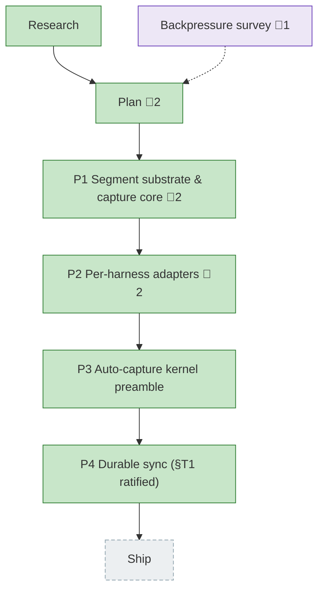

<!-- GENERATED by `harness flow render` — do not hand-edit; regenerate from the flow JSON. -->
# Flow · harness-telemetry-collection

**Kind**: flight-plan · **Now**: ship · **Next**: ship · **Intent**: Harness telemetry collection — per-command sensor emitting normalized per-session segments (tokens/skills/tools/subagents/files/plan-links) committed to an orphan git ref for eng-thrive; Claude + Copilot adapters, Cursor later · **Nodes**: 8 · **Events**: 49

**Rail**: ◆─◆─[ ◆─◆─◆─◆ ]─◇  ◆ Research · ◆ Plan · [ ◆ P1 Segment substrate & capture core · ◆ P2 Per-harness adapters · ◆ P3 Auto-capture kernel preamble · ◆ P4 Durable sync (§T1 ratified) ] · ◇ Ship

**Legend**: 🟩 done · 🟧 in-progress · 🟥 blocked · 🟦 known (designed) · ⬜ assumed (speculative) · 🔶 decision · 🗣 user input · 🟪 harness loop · 🤖 companion · 🛠 worker · 🧰 chore (upkeep).

## Node log

### plan · Plan
- `2026-06-23T05:45:35.647Z` · — · validation — validate-v2 (4 agents) VALIDATED WITH FIXES: CRITICAL §T1 per-individual commit-author vs anti-surveillance doctrine -&gt; defaulted non-individual author + gated before Phase 4; HIGH schema-shape/kill-switch-name/concurrency/push-auth fixed; sync verb named.
- `2026-06-23T06:43:29.281Z` · — · decision — Done Contract folded into plan (grill-agent-done): planted-secret control (task 1.1), dup-message.id token control (2.2), structural perf sensor replaces flaky &lt;10ms (3.4). Privacy scope decided: branch names kept verbatim. One open gap = §T1 author ratification, gates Phase 4.

### phase-1 · P1 Segment substrate & capture core
- `2026-06-23T07:06:00.509Z` · — · validation — validate-v2 (4 lenses): ALIGNED on coverage; 3 HIGH fixes applied to dossier — (1) adapter seam built in Phase 1 [F1] so Phase 2 plugs in w/o rewriting capture-service (new T004); (2) cursor-safety test redefined for the synchronous FsPort [C2] (T007); (3) atomic precedent corrected observe-&gt;flow-service [Source-Truth]. Plus buffer format/entry pinned, schema key-set equality, edge no-ops, serializer-vs-adapter privacy split. Plan reconciled (1.1/2.1/2.2/KF-05/Done Contract). Dossier T001-T009.
- `2026-06-23T07:44:04.539Z` · — · validation — code-review-companion APPROVE across all commits; 1 MEDIUM (F001 path-traversal) fixed in 56a1033 and verified; 1038/1038 tests green

### phase-2 · P2 Per-harness adapters
- `2026-06-23T08:10:49.626Z` · — · validation — Phase 2 tasks validated: 2 corrections applied to the dossier (home-dir port, ports-only arch rule), 6 implementation mechanics pinned (whole-file slice, offset unit, path mangling, privacy assertion shape, intentionally-null caps, empty-window); forward-compat with Phase 3 registry seam confirmed.
- `2026-06-23T08:41:49.579Z` · — · validation — Companion code-review-companion reviewed all commits; 3 findings (incl 1 HIGH cross-session token contamination) caught + fixed inline + verified. A separate review pass is superseded.

### backpressure · Backpressure survey
- `2026-06-23T06:14:33.653Z` · — · validation — Backpressure survey ran against the plan. No blockers; plan is well-instrumented (CLI hexagonal arch tests already cover the ports-only invariant). Advisory: pull the 2 reshapes into Phase 1/3. Re-plan not required.
