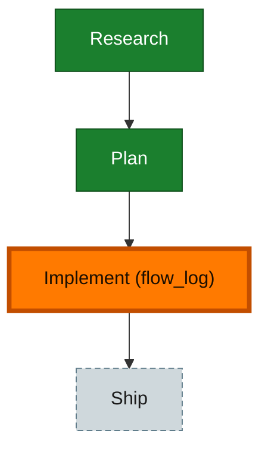

<!-- GENERATED by `harness flow render` — do not hand-edit; regenerate from the flow JSON. -->
# Flow · flow-replay-telemetry

**Kind**: flight-plan · **Now**: implement · **Next**: ship · **Intent**: Capture the-flow flight-plan activity (the events[] log: moves, status changes, edits, with timestamps) into telemetry so a flow session can be roughly reconstructed with timings. · **Nodes**: 4 · **Events**: 14

**Rail**: ◆─◆─[ ◆ ]─◇  ◆ Research · ◆ Plan · [ ◆ Implement (flow_log) ] · ◇ Ship

**Legend** — colour = type/status: 🟩 done · 🟢 in-progress · 🟥 blocked · 🟦 known · ⬜ assumed · 🔶 decision · 🗣 user input · 🟪 harness chore (faded = not yet done) · 🤖 companion · 🛠 worker · 🟧 current (you are here). Badges: 💬 comments · 📄 artifacts · 📝 instructions · 🧰 chore (° optional / recommended / ‼ strongly-recommended; ✓ done · ✕ skipped).
