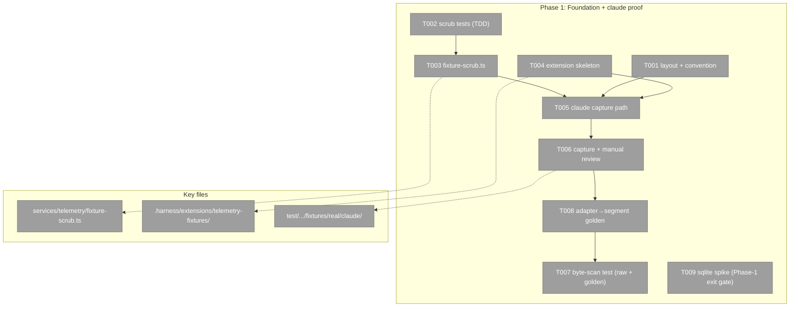
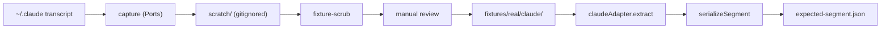
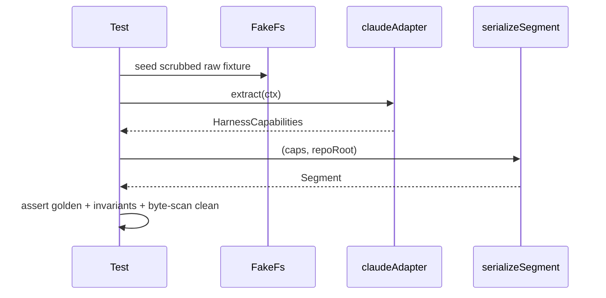

# Phase 1: Foundation + claude proof — Tasks

**Plan**: `../../telemetry-fixture-corpus-plan.md` · **Phase**: 1 of 3 · **Mode**: Full · **Generated**: 2026-06-25

### Executive Briefing
- **Purpose**: Land every reusable pattern for the fixture corpus — the fixture-library layout, the pure scrub service, the `.harness` capture extension, and the two-guard privacy + golden test shape — by proving the whole pipeline end-to-end on **one real, scrubbed claude session**.
- **What We're Building**: A pure `fixture-scrub.ts` service; a `.harness/extensions/telemetry-fixtures/` capture verb; one committed real claude fixture + its `expected-segment.json` golden; a raw+golden byte-scan privacy test; a claude adapter→segment golden/invariant test; and a `node:sqlite` round-trip spike that de-risks Phase 2.
- **Goals**:
  - ✅ Scrub strips machine paths / identity / secrets across POSIX + Windows shapes while keeping prompts + commands verbatim.
  - ✅ The committed raw fixture **and** its golden pass a byte-scan with a live (in-test) negative control.
  - ✅ claude `extract → serializeSegment` is pinned by a golden + hand-pinned invariants, exercising the timestamped `event_stream` path.
  - ✅ The writable-build → read-only-`NodeDb` SQLite mechanism is proven before Phase 2 depends on it.
- **Non-Goals**:
  - ❌ Capturing copilot-cli / copilot-vscode / cursor (Phase 2).
  - ❌ The `--check` drift guard, runbook, Deviation Ledger (Phase 3).
  - ❌ Touching the 3 existing synthetic fixtures or their tests.

### Prior Phase Context
_None — this is Phase 1._

### Pre-Implementation Check

| File | Exists? | Domain Check | Notes |
|------|---------|-------------|-------|
| `harness/cli/src/services/shared/posix-path.ts` | ✅ exists | telemetry/shared (consume) | `toPosix`/`posixNormalize` confirmed; `relativizePath` in `segment.ts` |
| `harness/cli/src/services/telemetry/segment.ts` | ✅ exists | telemetry (consume) | `serializeSegment` + `relativizePath`; allowlist-by-construction |
| `harness/cli/src/services/telemetry/adapters/claude-adapter.ts` | ✅ exists | telemetry (consume) | `claudeAdapter.extract`; project-dir mangle `-Users-<user>-` |
| `harness/cli/src/adapters/db/node-db.ts` | ✅ exists | adapters/db (consume) | `DatabaseSync(path,{readOnly:true})` — spike builds writable separately |
| `.harness/extensions/arch-check/` | ✅ exists | _tooling (template) | Copy structure: `extension.ts` (shell) + pure logic module + `instructions.md` |
| `harness/cli/src/services/telemetry/fixture-scrub.ts` | 🆕 new | telemetry (create) | Pure; no `node:*` |
| `.harness/extensions/telemetry-fixtures/extension.ts` | 🆕 new | _tooling (create) | Verb `run()` = composition root (injects `NodeFs`/`NodeEnv`/`NodeDb`) |
| `harness/cli/test/services/telemetry/fixtures/real/claude/…` | 🆕 new | telemetry (create) | First real instance; additive to existing `fixtures/` |
| `harness/cli/test/services/telemetry/{fixture-scrub,fixture-privacy-scan,real-capture.e2e,sqlite-spike}.test.ts` | 🆕 new | telemetry (create) | TDD: scrub test precedes impl |
| `.gitignore` | ✅ exists | _tooling (modify) | Confirm `scratch/` staging is ignored before any capture |

### Architecture Map



### Tasks

| Status | ID | Task | Domain | Path(s) | Done When | Notes |
|--------|-----|------|--------|---------|-----------|-------|
| [x] | T001 | Define the `fixtures/real/<surface>/<instance>/` layout + the per-instance convention (`raw.*` input, `expected-segment.json` golden, `invariants` block) | telemetry | `harness/cli/test/services/telemetry/fixtures/real/README.md` | Layout documented; `…/real/claude/` instance dir scaffolded; additive to existing `fixtures/` | Plan 1.1; Finding 06 (keep synthetic alongside) |
| [x] | T002 | **(test-first)** Write `fixture-scrub.test.ts` — cases: `/Users/<user>`, `C:\Users\<user>`, the `-Users-<user>-` claude mangle, api-key shapes, emails, configured person-name → scrubbed; prompts/commands preserved verbatim | telemetry | `harness/cli/test/services/telemetry/fixture-scrub.test.ts` | Tests written and **failing** (no impl yet) | TDD per G6; Findings 01/03; Plan 1.2 |
| [x] | T003 | Implement `fixture-scrub.ts` — pure functions; **reuse** `toPosix`/`posixNormalize`/`relativizePath`; no `node:*` import | telemetry | `harness/cli/src/services/telemetry/fixture-scrub.ts` | T002 green; `grep node: src/services/telemetry/fixture-scrub.ts` empty | Finding 03; Plan 1.3 |
| [x] | T004 | Scaffold the capture extension — `extension.ts` default-exports a `HarnessVerb` named **`capture-fixtures`** whose `run()` is the composition root (injects `NodeFs`/`NodeEnv`/`NodeDb`); copy `arch-check` structure (+ pure logic split) | _tooling | `.harness/extensions/telemetry-fixtures/extension.ts` | `harness capture-fixtures --help` resolves; name is **not** in the reserved set (help/doctor/new/docs/skills/record/instructions/observe/init/flow) | AC-06; Plan 1.4; subagent: copy `arch-check/` |
| [ ] | T005 | Implement the **claude** capture path in `run()` — read `~/.claude/projects/<mangled>/…jsonl` via injected Ports, stage to gitignored `scratch/`, run `fixture-scrub`, promote to `fixtures/real/claude/<instance>/`; return canonical Envelope; confirm `.gitignore` covers `scratch/` | _tooling | `.harness/extensions/telemetry-fixtures/extension.ts`, `.gitignore` | `harness capture-fixtures --surface claude` yields a scrubbed claude raw fixture; `git status` shows `scratch/` ignored | AC-06; Findings 02/03; Plan 1.4/3.6 |
| [ ] | T006 | Capture + scrub one real claude session; perform the **manual "anything bad" review**; record the review outcome in the execution log | telemetry | `harness/cli/test/services/telemetry/fixtures/real/claude/<instance>/raw.jsonl` | Scrubbed fixture committed; reviewer note logged confirming clean | AC-08 manual step (runbook lands Phase 3); Plan 1.5 |
| [ ] | T008 | Write `real-capture.e2e.test.ts` (claude) — drive the fixture through `claudeAdapter` → `serializeSegment`; commit `expected-segment.json`; assert golden + invariants (token `grand_total`, prompt count, `event_stream` present + `t_precision==='anchored'`) | telemetry | `harness/cli/test/services/telemetry/real-capture.e2e.test.ts`, `…/fixtures/real/claude/<instance>/expected-segment.json` | Test green; golden committed; `event_stream` non-null (the path synthetics never hit) | AC-01; Finding 06; Plan 1.7. **Produces the golden T007 scans → must precede T007** |
| [ ] | T007 | Write `fixture-privacy-scan.test.ts` — byte-scan **both** the raw fixture and the `expected-segment.json` golden for `/Users/`, `C:\`, username, api-key shapes, names; prove liveness by feeding a known-bad string **in test code** asserted *flagged* (never committed) | telemetry | `harness/cli/test/services/telemetry/fixture-privacy-scan.test.ts` | Real artifacts scan clean; the in-test known-bad string is flagged | AC-02; Findings 01/03; validator Findings 2/3; Plan 1.6. **Depends on T008 (golden must exist before it is scanned)** |
| [ ] | T009 | **SQLite mechanism spike** (Phase-1 **exit gate** — must complete before Phase 2) — in one test, build a throwaway `node:sqlite` `DatabaseSync(path)` (writable), seed `sessions`/`turns` rows, then read it back through the read-only `NodeDb` adapter | telemetry | `harness/cli/test/services/telemetry/sqlite-spike.test.ts` | A throwaway db is built, seeded, and read via `NodeDb` in one passing test | De-risks AC-04 before Phase 2; validator Finding 4; Plan 1.8 |

### Context Brief

**Key findings from plan**:
- **F01 (raw fixture = sole guard)**: the allowlist serializer protects *output*; the committed raw file's safety rests entirely on the scrub → T007 byte-scan is mandatory, with the negative control in test code only.
- **F02 (P12)**: capture stages through gitignored `scratch/` before promotion; the Deviation Ledger row is Phase 3, but the `scratch/`-first discipline starts here (T005).
- **F03 (layering)**: scrub/extract are pure services (no `node:*`); the extension `run()` is the only place `Node*` adapters are constructed.

**Domain dependencies** (consumed):
- `services/shared/posix-path`: `toPosix` / `posixNormalize` — path normalization the scrub must reuse (never roll its own).
- `services/telemetry/segment`: `serializeSegment` + `relativizePath` — the golden producer + the out-of-repo→basename rule T007 must account for.
- `services/telemetry/adapters/claude-adapter`: `claudeAdapter.extract` + the `-Users-<user>-` project-dir mangle the scrub must neutralize.
- `adapters/db/node-db`: `NodeDb`/`DatabaseSync` (read-only) — the spike's read side.

**Domain constraints**:
- No `node:fs` / `node:child_process` / `node:sqlite` inside services — only behind injected Ports (`FsPort`/`EnvPort`/`DbPort`). The extension `run()` composition root is the sole I/O wiring point.
- A command path returns the canonical Envelope — no `console.log` / `process.exit` outside the output kernel.

**Reusable from prior phases**:
- None (Phase 1). **Reference patterns**: the existing synthetic fixtures' `_fixture_note` + planted-secret negative-control style; `cursor-adapter.test.ts` privacy deep-scan; `arch-check/` extension structure; `scripts/flow-fixtures.mjs` (the `--check` pattern Phase 3 reuses).

**Mermaid flow diagram** (capture pipeline):


**Mermaid sequence diagram** (test-time E2E):


### Discoveries & Learnings

_Populated during implementation by the implement verb._

| Date | Task | Type | Discovery | Resolution | References |
|------|------|------|-----------|------------|------------|

### Directory layout
```
docs/plans/037-telemetry-fixture-corpus/
  ├── telemetry-fixture-corpus-plan.md
  └── tasks/phase-1-foundation-claude-proof/
      ├── tasks.md
      └── execution.log.md   # created by the implement verb
```
