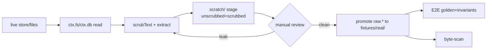
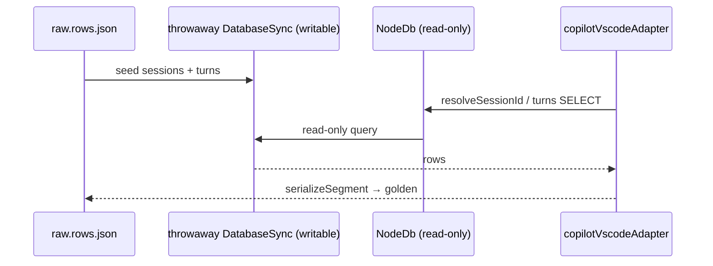

# Tasks — Phase 2: Fan out — copilot-cli + copilot-vscode + cursor

**Plan**: `../../telemetry-fixture-corpus-plan.md` · **Phase**: 2 of 3 · **Domain**: telemetry · **Mode**: Full · **Depends on**: Phase 1 (pattern proven)

> Elegance: the 7-column table is the contract; Notes stay terse (`references/00-routing.md` § Artifact Elegance). CS 1–5 only — no time estimates.

---

## Executive Briefing

- **Purpose**: Apply Phase 1's now-proven pipeline (capture → gitignored `scratch/` → scrub → manual review → promote → golden+invariants E2E → byte-scan) to the three remaining capturable surfaces, so every adapter is tested against *real* logs, not synthetic guesses.
- **What we're building**: real scrubbed fixtures + golden/invariant E2E coverage for **copilot-cli** (`events.jsonl` + process-log, with token correlation), **copilot-vscode** (extracted SQL rows + a throwaway-`node:sqlite` round-trip int-test), and **cursor** (on-disk transcript + `cursorDiskKV` model/timing rows, with the transcript↔bubble join).
- **Goals**:
  - ✅ AC-03 — committed copilot-cli fixture + E2E golden incl. token correlation from the process log.
  - ✅ AC-04 — copilot-vscode extracted-rows fixture + an int-test that builds a real writable `node:sqlite` and reads it back through `NodeDb` (read-only) via the adapter's actual SQL.
  - ✅ AC-05 — committed cursor fixture (transcript + `cursorDiskKV` rows) + E2E golden incl. the model/timing join.
  - ✅ Every new committed `raw.*` byte is covered by the AC-02 privacy scan (incl. the **plain-text** process-log variant F003 anticipated).
- **Non-Goals**:
  - ❌ No `--check` drift guard / runbook / Deviation Ledger — those are **Phase 3** (parallelizable).
  - ❌ No adapter behaviour changes. A real fixture that exposes an extraction bug is logged **Deferred**, not fixed here (plan Risk: "Real captures may surface adapter bugs").
  - ❌ The 3 synthetic fixtures and their tests are **not** touched (AC-10).

---

## Prior Phase Context — Phase 1 (Foundation + claude proof)

**A. Deliverables**
- `harness/cli/src/services/telemetry/fixture-scrub.ts` — pure scrub (`scrubText(text, cfg)`, `ScrubConfig{homeDir,repoRoot,username,names?}`); exports `SECRET_DETECTORS` / `SECRET_PATTERNS`. No `node:*`; imports only `../shared/posix-path` (`toPosix`).
- `.harness/extensions/telemetry-fixtures/` — `extension.ts` (verb `capture-fixtures`, composition root injecting `ctx.fs/fsWrite/env` Node ports), `capture-logic.ts` (pure orchestration: `SURFACES`, `rawFilename`, `claudeMangle/claudeProjectDir`, `scratchRoot`, `instanceDir`, `deriveCaptureConfig`, `buildMeta`+`SCRUB_CATEGORIES`, `sessionFiles`), `capture-logic.test.ts`, `instructions.md` (stub).
- `fixtures/real/` library: `README.md` (layout + two-guard model + scrub attestation), and the claude instance `fixtures/real/claude/2026-06-25-static-site/` (`raw.jsonl`, `expected-segment.json`, `invariants.json`, `meta.json`).
- Tests: `fixture-scrub.test.ts` (15), `real-capture.e2e.test.ts` (claude golden+invariants, `REGEN_GOLDEN=1` mint), `fixture-privacy-scan.test.ts` (byte-scan, artifact-kind-aware), `sqlite-spike.test.ts` (AC-04 mechanism de-risked).

**B. Dependencies exported (reuse these — do not re-invent)**
- `scrubText` + `SECRET_DETECTORS` — single source of truth for both scrub and byte-scan. **Import, never copy.**
- `rawFilename(surface)` already maps `copilot-cli → raw.events.jsonl`, `copilot-vscode → raw.rows.json`, `cursor → raw.jsonl`. `instanceDir(repo, surface, instance)` + `scratchRoot(repo)` are surface-generic.
- `real-capture.e2e.test.ts` is the **golden+invariants template**: `FakeFs({[path]: text})` + `FakeEnv({...}, HOME)` → `adapter.extract({...source, window})` → `serializeSegment(input, REPO)` → assert `expected-segment.json` + `invariants.json`. `REGEN_GOLDEN=1` mints both.
- `sqlite-spike.test.ts` is the **throwaway-db template**: build writable `DatabaseSync(path)` (no `readOnly`), seed rows, read back through read-only `NodeDb` (Node ≥22). Tests *may* use `node:*` directly.
- Byte-scan (`fixture-privacy-scan.test.ts`) auto-globs every `raw.*` / `expected-segment.json` / `invariants.json` / `meta.json` under `fixtures/real/` — a new instance dir is scanned **for free**; it is already **artifact-kind-aware** (JSON doubled-backslash vs plain-text single-backslash Windows paths — F003).

**C. Gotchas & debt (carry forward)**
- **Fixture selection is load-bearing**: a self-referential/meta session (one that *discusses* `/Users/`, `C:\`) trips the strict byte-scan even with zero real leaks. Pick a substantive, non-meta conversation for each surface.
- **Manual review is non-skippable and catches what the scrub can't**: the home-derived username misses git handles (`jakkaj` survived until re-captured with `--names`). Pass git handles + display names via `--names` at capture.
- **Identity scan durability**: generic markers are CI-durable; capture-time identity tokens are scanned via runtime env **and** the never-committed `HARNESS_FIXTURE_SCRUB_TOKENS` denylist + `meta.json` `scrub_categories` attestation.
- claude carried **exact** per-line timestamps (`event_stream` exact, no `t_precision`). **Cursor's transcript is untimed → expect `t_precision: 'anchored'`** on cursor events; assert that, not "exact".

**D. Incomplete items**: none — Phase 1 closed clean (all tasks `[x]`, 1343/1343 suite green, companion findings F001–F004 fixed).

**E. Patterns to follow**
- TDD for pure logic (`fixture-extract.ts` test-first per G6 Hybrid); golden+invariants as the E2E oracle elsewhere.
- Capture stages to gitignored `scratch/` first; promotion to `fixtures/real/` is the publication gate and happens only on scrub-pass + human sign-off.
- Scrub stays single-source in core; the extension imports it (no vendored security control).

---

## Pre-Implementation Check

| File | Exists? | Domain | Notes |
|------|---------|--------|-------|
| `src/services/telemetry/adapters/copilot-adapter.ts` | ✅ | telemetry | `copilotEventsPath(home,sid)`, `copilotLogsDir(home)`; process-log `assistant_usage` → token correlation; `extract(ctx)` |
| `src/services/telemetry/adapters/copilot-vscode-adapter.ts` | ✅ | telemetry | `copilotVscodeStoreDbPaths(env)`, `resolveCopilotVscodeSessionId` (`SELECT id FROM sessions WHERE cwd=?`), turns SQL (`FROM turns WHERE session_id=? ORDER BY turn_index`); uses `DbPort` |
| `src/services/telemetry/adapters/cursor-adapter.ts` | ✅ | telemetry | `cursorTranscriptPath(dir,conv)`, `cursorStateDbPaths(env)`, `cursorDiskKV` SELECT; env `CURSOR_CONVERSATION_ID`+`AGENT_TRANSCRIPTS`; join on conv id, `modelInfo.modelName` |
| `src/services/telemetry/fixture-extract.ts` | ❌ create | telemetry | NEW — pure SQL-row → extracted-rows projection (no message text) |
| `.harness/extensions/telemetry-fixtures/extension.ts` | ✅ modify | _tooling | Add copilot-cli / copilot-vscode / cursor capture branches to `run()` |
| `.harness/extensions/telemetry-fixtures/capture-logic.ts` | ✅ modify | _tooling | Add per-surface source-path derivation (pure) |
| `test/services/telemetry/real-capture.e2e.test.ts` | ✅ extend | telemetry | Add copilot-cli + cursor instances (claude case untouched) |
| `test/services/telemetry/fixture-extract.test.ts` | ❌ create | telemetry | NEW — TDD for the projection |
| `test/services/telemetry/copilot-vscode-sqlite.int.test.ts` | ❌ create | telemetry | NEW — throwaway-sqlite round-trip (reuses spike pattern) |
| `test/services/telemetry/fixtures/real/{copilot-cli,copilot-vscode,cursor}/` | ❌ create | telemetry | New instance dirs (byte-scan covers them automatically) |
| `test/services/telemetry/fixtures/{copilot-events.jsonl,copilot-process-log.txt,cursor-transcript.jsonl}` | ✅ **DO NOT TOUCH** | telemetry | Synthetic — AC-10 |

No contract changes. `fixture-extract.ts` is new but internal-pure (no new public surface).

---

## Architecture Map

```mermaid
flowchart TD
    classDef pending fill:#9E9E9E,stroke:#757575,color:#fff
    classDef test fill:#1976D2,stroke:#0D47A1,color:#fff
    classDef cap fill:#6A1B9A,stroke:#4A148C,color:#fff

    subgraph CLI["copilot-cli (AC-03)"]
        T001["T001 capture branch"]:::cap
        T002["T002 capture+review"]:::cap
        T003["T003 E2E golden+invariants<br/>(token correlation)"]:::test
        T004["T004 byte-scan covers new files"]:::test
        T001-->T002-->T003-->T004
    end
    subgraph VSC["copilot-vscode (AC-04)"]
        T005["T005 fixture-extract.test (RED)"]:::test
        T006["T006 fixture-extract.ts + capture"]:::cap
        T007["T007 capture rows + review"]:::cap
        T008["T008 throwaway-sqlite int-test"]:::test
        T005-->T006-->T007-->T008
    end
    subgraph CUR["cursor (AC-05)"]
        T009["T009 capture branch<br/>(transcript + cursorDiskKV)"]:::cap
        T010["T010 capture+review (substantive convo)"]:::cap
        T011["T011 E2E golden+invariants<br/>(model/timing join)"]:::test
        T009-->T010-->T011
    end

    P1["Phase 1: scrub + extension + e2e + byte-scan"]:::pending
    P1 -.reuse.-> CLI
    P1 -.reuse.-> VSC
    P1 -.reuse.-> CUR
```



---

## Tasks

| Status | ID | Task | Domain | Path(s) | Done When | Notes |
|--------|-----|------|--------|---------|-----------|-------|
| [x] | T001 | Add **copilot-cli** capture branch to the extension: derive `events.jsonl` (`copilotEventsPath`) + `process-*.log` (`copilotLogsDir`) source paths (pure, in `capture-logic.ts`), read via `ctx.fs`, `scrubText` both, stage UNSCRUBBED+SCRUBBED to `scratch/`, promote SCRUBBED to `fixtures/real/copilot-cli/<instance>/` (`raw.events.jsonl` + `raw.process.log`) | _tooling | `.harness/extensions/telemetry-fixtures/{extension.ts,capture-logic.ts}` | `harness capture-fixtures --surface copilot-cli --dry-run` stages both scrubbed files to `scratch/`; promotes without `--dry-run` | Reuses 1.3/1.4; plan 2.1 |
| [ ] | T002 | Capture one **real** copilot-cli session + **manual "anything bad" review** (pass git handles via `--names`); promote on clean review | telemetry | `fixtures/real/copilot-cli/<instance>/{raw.events.jsonl,raw.process.log,meta.json}` | Fixture committed; reviewer confirms clean; substantive non-meta session chosen | Non-skippable manual step (AC-08); plan 2.1 |
| [ ] | T003 | **(test-first→golden)** Extend `real-capture.e2e.test.ts` with a copilot-cli instance: `FakeFs` both files → `copilotAdapter.extract` → `serializeSegment` → assert `expected-segment.json` + `invariants.json` incl. **token correlation** from the process-log `assistant_usage` blocks. `REGEN_GOLDEN=1` mints golden+invariants; human-review them | telemetry | `test/services/telemetry/real-capture.e2e.test.ts` + `fixtures/real/copilot-cli/<instance>/{expected-segment.json,invariants.json}` | Test green; golden+invariants committed; token total in invariants traces to the process log | AC-03; plan 2.2 |
| [ ] | T004 | Confirm the AC-02 byte-scan covers the new copilot-cli `raw.*` bytes — **incl. the plain-text `raw.process.log`** (single-backslash Windows variant the scan already handles, F003); add the instance to the scan if globbing misses it | telemetry | `test/services/telemetry/fixture-privacy-scan.test.ts` | Scan green over the new files; liveness control still flags every label | AC-02; plan 2.2 |
| [ ] | T005 | **(test-first, RED)** `fixture-extract.test.ts` — define the pure projection of copilot-vscode `sessions`/`turns` rows → an extracted-rows shape that **carries no message text** (turn metadata/timing/token counts only), mirroring the adapter's `SELECT` columns | telemetry | `test/services/telemetry/fixture-extract.test.ts` | Tests written and failing (module not found) | AC-04; Finding 05; plan 2.3 |
| [ ] | T006 | Implement `fixture-extract.ts` (pure; no `node:*`) to satisfy T005; add the **copilot-vscode** capture branch to the extension — read the live store rows via `ctx.db` at `run()`, project via `fixture-extract`, promote `raw.rows.json` (no message text) | telemetry / _tooling | `src/services/telemetry/fixture-extract.ts`, `.harness/extensions/telemetry-fixtures/{extension.ts,capture-logic.ts}` | T005 green; `harness capture-fixtures --surface copilot-vscode` promotes `raw.rows.json` | AC-04; Finding 03/05; plan 2.3 |
| [ ] | T007 | Capture **real** copilot-vscode rows + manual review; if the store is thin (~4 KB → few turns) capture what exists and note the thinness | telemetry | `fixtures/real/copilot-vscode/<instance>/{raw.rows.json,meta.json}` | Extracted-rows fixture committed (no message text); thinness documented if applicable | Risk: thin store; plan 2.3 |
| [ ] | T008 | **`copilot-vscode-sqlite.int.test.ts`** — build a throwaway **writable** `node:sqlite` `DatabaseSync` from `raw.rows.json` (sessions+turns), then read it back through the read-only `NodeDb` via the adapter's **actual SQL** → `serializeSegment` → golden segment. (Reuses the 1.8 spike pattern.) If rows too thin for a segment, still assert the SQL round-trip | telemetry | `test/services/telemetry/copilot-vscode-sqlite.int.test.ts` + `fixtures/real/copilot-vscode/<instance>/expected-segment.json` | Test green; real SQL round-trip proven (or thin-capture documented) | AC-04; Finding 05; plan 2.4 |
| [ ] | T009 | Add the **cursor** capture branch to the extension: read the on-disk transcript `~/.cursor/projects/<mangled-cwd>/agent-transcripts/<conv>/<conv>.jsonl` (content) **and** extract the `cursorDiskKV` model/timing rows from `state.vscdb` (via `ctx.db`); `scrubText` both; promote `raw.jsonl` + `raw.rows.json`. Pass `conv` id as `CURSOR_CONVERSATION_ID` (capture reads the path directly — `AGENT_TRANSCRIPTS` only gates the *runtime* auto-detect, Finding 04) | _tooling | `.harness/extensions/telemetry-fixtures/{extension.ts,capture-logic.ts}` | `harness capture-fixtures --surface cursor` promotes both files | AC-05; Finding 04; plan 2.5 |
| [ ] | T010 | Capture one **real** cursor session + manual review — pick a **substantive** conversation (many on-disk convos are short stubs / partly self-redacted); pass git handles via `--names` | telemetry | `fixtures/real/cursor/<instance>/{raw.jsonl,raw.rows.json,meta.json}` | Scrubbed cursor fixture committed; reviewer confirms clean + substantive | Non-skippable manual step; Risk: stub convos; plan 2.5 |
| [ ] | T011 | Extend `real-capture.e2e.test.ts` with a cursor instance: transcript (`FakeFs`) + `cursorDiskKV` rows → `cursorAdapter.extract` → `serializeSegment` → assert golden + invariants incl. the **transcript↔bubble model/timing join**; assert cursor events carry **`t_precision: 'anchored'`** (untimed transcript — not "exact"). Confirm synthetic `cursor-transcript.jsonl` + its test untouched (AC-10) | telemetry | `test/services/telemetry/real-capture.e2e.test.ts` + `fixtures/real/cursor/<instance>/{expected-segment.json,invariants.json}` | Test green; model/timing join proven; `anchored` asserted; synthetic intact | AC-05/AC-10; Finding 04/06; plan 2.5 |

- `Status`: `[ ]` pending · `[~]` in progress · `[x]` complete · `[!]` blocked

---

## Context Brief

**Key findings from plan (acted on here)**:
- **Finding 04** — Cursor *is* capturable: transcripts persist on disk; `AGENT_TRANSCRIPTS` only gates the runtime auto-detect, not capture. copilot-vscode store is thin → SQL round-trip still proves the mechanism.
- **Finding 05** — `NodeDb` opens read-only; build the throwaway db **writable** then read via `NodeDb`. Goldens are committed `expected-segment.json` + `invariants.json`, not `toMatchSnapshot`.
- **Finding 06** — real captures are timestamped; **cursor's transcript is untimed → `t_precision: 'anchored'`** (unlike claude's exact stamps).
- **Finding 01/02** — the committed raw fixture's sole guard is the byte-scan; every new `raw.*` must be scanned (auto-globbed).

**Domain dependencies (consumed, not modified)**:
- `telemetry/adapters/copilot-adapter`: `extract(ctx)` + `copilotEventsPath`/`copilotLogsDir` — copilot-cli events + process-log token correlation.
- `telemetry/adapters/copilot-vscode-adapter`: `extract(ctx)` + `copilotVscodeStoreDbPaths`/`resolveCopilotVscodeSessionId` + the sessions/turns SQL — driven via `DbPort`.
- `telemetry/adapters/cursor-adapter`: `extract(ctx)` + `cursorTranscriptPath`/`cursorStateDbPaths` + `cursorDiskKV` SELECT — transcript + model/timing join.
- `telemetry/segment`: `serializeSegment(input, repoRoot)` — the allowlist serializer (output guard).
- `telemetry/fixture-scrub`: `scrubText` + `SECRET_DETECTORS` — **single-source** scrub + scan detectors.

**Domain constraints**:
- P2/Finding 03: **no `node:*` in services** (`fixture-extract.ts` stays pure). All real I/O (`fs`/`env`/`db`) is injected at the extension `run()` composition root via `ctx.*` ports. **Tests may** use `node:*` directly (the throwaway-sqlite build).
- P12/Finding 02: capture → gitignored `scratch/` → scrub → manual review → promote. Promotion (commit) is the publication gate.
- AC-10: synthetic fixtures and their tests are immutable.

**Reusable from Phase 1**:
- `real-capture.e2e.test.ts` golden+invariants harness + `REGEN_GOLDEN=1`.
- `sqlite-spike.test.ts` throwaway writable-db → read-only `NodeDb` pattern (template for T008).
- `capture-logic.ts` surface-generic helpers (`rawFilename`, `instanceDir`, `scratchRoot`, `deriveCaptureConfig`, `buildMeta`).
- `fixture-privacy-scan.test.ts` auto-globbing, artifact-kind-aware byte-scan.

**Mermaid — capture→commit flow (per real surface)**:


**Mermaid — copilot-vscode SQL round-trip (T008)**:


---

## Discoveries & Learnings

_Populated during implementation by the implement verb._

| Date | Task | Type | Discovery | Resolution | References |
|------|------|------|-----------|------------|------------|

**Types**: `gotcha` | `research-needed` | `unexpected-behavior` | `workaround` | `decision` | `debt` | `insight`

---

```
docs/plans/037-telemetry-fixture-corpus/
  ├── telemetry-fixture-corpus-plan.md
  └── tasks/phase-2-fan-out-copilot-cli-copilot-vscode-cursor/
      ├── tasks.md
      └── execution.log.md   # created by the implement verb
```

**STOP** — tasks dossier only; no code changed. Awaiting GO to implement Phase 2.
