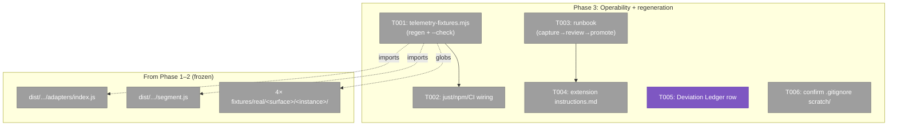
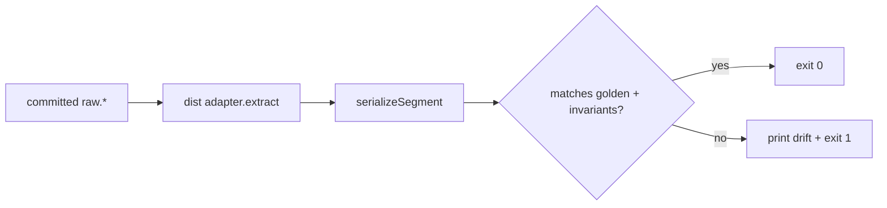
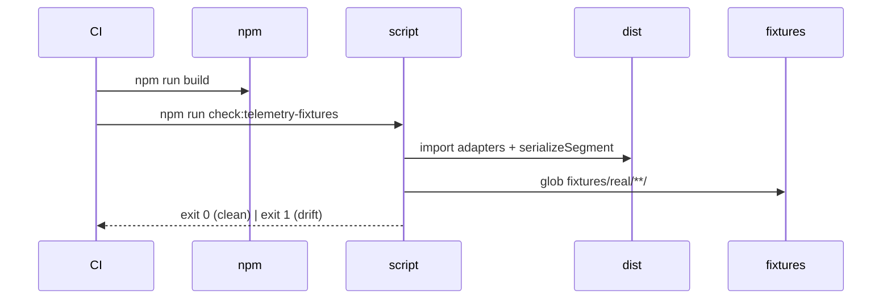

# Phase 3: Operability + regeneration — Tasks

**Plan**: [`telemetry-fixture-corpus-plan.md`](../../telemetry-fixture-corpus-plan.md) · **Phase**: 3 of 3 · **Domain**: `_tooling` (+ one `_governance`) · **CS-2** (small)
**Depends on**: Phase 1 (pattern) — parallelizable with Phase 2 (both done) · **Status**: ready for GO

---

## Executive Briefing

- **Purpose**: Make the real-fixture corpus **regenerable, documented, and governance-clean** — the operability shell around the bytes Phases 1–2 committed. No new fixtures, no adapter changes; this phase wires the maintenance + provenance contract.
- **What We're Building**: A `scripts/telemetry-fixtures.mjs` regen/`--check` drift guard over every committed fixture, its `just`/npm/CI wiring, a `docs/how/telemetry-fixtures.md` capture→scrub→review→promote runbook, an expanded extension `instructions.md`, a Deviation Ledger row, and a `.gitignore` confirm.
- **Goals**:
  - ✅ `npm run check:telemetry-fixtures` re-derives every golden from `dist/` and **fails non-zero on drift** (AC-07).
  - ✅ A runbook makes the **non-skippable manual "anything bad" review** explicit for all four surfaces, including cursor's on-disk path (AC-08/AC-05).
  - ✅ The deliberate doctrine exception (committing scrubbed session content) is recorded as a Deviation Ledger row (AC-09).
  - ✅ Extension `instructions.md` points at the runbook + ledger (AC-06).
- **Non-Goals**:
  - ❌ No new captures / no adapter or serializer changes (Phase 1–2 are frozen).
  - ❌ No `harness <verb>` CLI surface for regen — it's a plain script (plan Non-Goal; Finding 05).
  - ❌ Not fixing any adapter extraction bug a real fixture exposed — those stay Deferred follow-ups (plan Risks).

---

## Prior Phase Context

### Phase 1 — Foundation + claude proof (done)

- **A. Deliverables**: `harness/cli/src/services/telemetry/fixture-scrub.ts` (pure; `scrubText`, `SECRET_DETECTORS`, placeholder consts); `.harness/extensions/telemetry-fixtures/{extension.ts,capture-logic.ts,instructions.md}` (Phase-1 stub); the two-guard tests `real-capture.e2e.test.ts` + `fixture-privacy-scan.test.ts`; the first real claude fixture; `fixtures/real/README.md` (layout spec).
- **B. Dependencies exported (Phase 3 consumes)**: built modules `harness/cli/dist/services/telemetry/adapters/index.js` (`claudeAdapter`/`copilotAdapter`/`copilotVscodeAdapter`/`cursorAdapter`, each `.extract(source, window)`) + `harness/cli/dist/services/telemetry/segment.js` (`serializeSegment(input, repoRoot)`). Per-instance artifacts: `raw.<ext>` · `expected-segment.json` · `invariants.json` · `meta.json`. **`REGEN_GOLDEN=1`** in the e2e mints both golden **and** invariants for review.
- **C. Gotchas & debt**: goldens are machine-independent **by construction** (scrub normalizes every machine token) → the `--check` guard must stay deterministic across machines. Identity tokens (USER/HOME basename, git handles) are scanned at runtime via `process.env` + `HARNESS_FIXTURE_SCRUB_TOKENS` (never committed). Avoid self-referential sessions (a transcript that *discusses* scrubbing fails the byte-scan).
- **D. flow-fixtures drift contract** (the pattern T001/T002 reuse — `scripts/flow-fixtures.mjs`): repo-root = one level up from `scripts/` via `fileURLToPath`; `--check` re-renders and exits non-zero on divergence; regen mode writes in place. Wired as `gen:flow-fixtures` + (inside) `check:flows` in `package.json`, gated in CI after `npm run build`.
- **E. Patterns to follow**: regen by **importing `dist/`** (never `src/`); single-source `fixture-scrub` (extension + byte-scan both import it, no vendoring).

### Phase 2 — Fan out copilot-cli/vscode/cursor (done)

- **A. Deliverables**: three more real fixtures (copilot-cli, copilot-vscode, cursor) + `copilot-vscode-sqlite.int.test.ts`, `fixture-extract.ts` projections, all four surfaces wired in `extension.ts`/`capture-logic.ts`.
- **B. Dependencies exported**: the four committed instance dirs the regen glob must cover (below). The cursor on-disk capture path the runbook must document: `~/.cursor/projects/<mangled-cwd>/agent-transcripts/<conv>/<conv>.jsonl` (mangle = strip leading `/`, `/`→`-`).
- **C. Gotchas & debt → this phase**: the punted items ARE Phase 3 (runbook, ledger, `--check`). SQLite-trim fidelity (`sqliteTrim` space-only mirrors `TURNS_SQL`), cursor dual-source asymmetry (transcript verbatim, bubbles projected), and DL-001 (`NodeDb` composed at `run()`) are settled — Phase 3 touches none of them, only documents the workflow.
- **D. Manual-review / privacy** (the runbook payload): two guards = serializer allowlist (output golden) + auto-globbing byte-scan (committed raw bytes, artifact-kind-aware). The review checks: leak scan (`/Users/`, `C:\`, emails, `alice`, **`example-handle`** git-handle, names, api-key shapes) on raw files; content is innocuous/non-self-referential; vendor system prompt redacted, user content verbatim. **Lesson**: home-derived username misses git handles → capture must pass `--names "git-handle,…"`.
- **E. Patterns**: sibling extensions (`boot`/`checks`/`arch-check`/`windows-check`) each carry an `instructions.md` to mirror; capture is per-surface `resolve<Surface>()` returning `{files,harnessId}`.

---

## Pre-Implementation Check

| File | Exists? | Domain | Notes |
|------|---------|--------|-------|
| `scripts/telemetry-fixtures.mjs` | **create** | `_tooling` | model on `scripts/flow-fixtures.mjs` (the drift-contract source) |
| `scripts/flow-fixtures.mjs` | exists (read-only ref) | `_tooling` | repo-root discovery + `--check` non-zero-exit pattern |
| `package.json` | exists — **modify** | `_tooling` | add `gen:telemetry-fixtures` + `check:telemetry-fixtures`, mirroring `gen:flow-fixtures`/`check:flows` (lines 37/39) |
| `.github/workflows/ci.yml` | exists — **modify** | `_tooling` | add a check step after `npm run build` (line 78), mirroring the `check:flows` step (line 84) |
| `justfile` | exists — **modify (thin)** | `_tooling` | optional passthrough target; the npm script is the real gate |
| `docs/how/telemetry-fixtures.md` | **create** | `_tooling` | sits beside sibling runbooks in `docs/how/` |
| `.harness/extensions/telemetry-fixtures/instructions.md` | exists (1.7 KB stub) — **modify** | `_tooling` | expand: link runbook + ledger |
| `docs/project-rules/rules.md` | exists — **modify** | `_governance` | **hand-edited** (no generator); append one row to the § 9 Deviation Ledger table (one row already present) |
| `.gitignore` | exists — **verify only** | `_tooling` | `scratch/` already present (line 148) ✓ — T006 is a confirm, not an edit |

⚠️ **Path correction (carry into every task)**: fixtures live at **`harness/cli/test/services/telemetry/fixtures/real/<surface>/<instance>/`**, *not* the repo-root `fixtures/real/` the plan prose names. The regen glob + runbook paths use the test-tree location.

---

## Architecture Map



T001→T002 (script must exist before its targets/CI gate). T003→T004 (instructions links the runbook). T005, T006 independent.

---

## Tasks

| Status | ID | Task | Domain | Path(s) | Done When | Notes |
|--------|-----|------|--------|---------|-----------|-------|
| [x] | T001 | `scripts/telemetry-fixtures.mjs`: for each committed fixture, build the surface's `source` from its `raw.*`, run the matching `dist/` adapter `.extract` → `serializeSegment` → compare to `expected-segment.json` + `invariants.json`. Default = regen (write goldens); `--check` = compare-only, **exit non-zero on any divergence**. Repo-root + non-zero-exit pattern from `flow-fixtures.mjs`. | `_tooling` | `scripts/telemetry-fixtures.mjs` (new) | `--check` passes clean on HEAD; mutating any golden makes `--check` exit non-zero; regen mode rewrites goldens identically (no diff) | AC-07; Finding 05; validator Finding 1. **Key decision — see Context Brief §1**: direct-import vs `REGEN_GOLDEN=1` vitest + `git diff --exit-code`. Per-surface input construction currently lives in the e2e test |
| [x] | T002 | Add `gen:telemetry-fixtures` (`node scripts/telemetry-fixtures.mjs`) + `check:telemetry-fixtures` (`… --check`) to `package.json`; add a CI step running `npm run check:telemetry-fixtures` after `npm run build`; thin `just` passthrough. | `_tooling` | `package.json`, `.github/workflows/ci.yml`, `justfile` | `npm run check:telemetry-fixtures` runs; CI step present + green; mirrors `check:flows` shape | AC-07. Depends on T001 |
| [x] | T003 | `docs/how/telemetry-fixtures.md` runbook: capture → gitignored `scratch/` → scrub → **non-skippable manual "anything bad" review** → promote, for all four surfaces. Include cursor's on-disk `~/.cursor/projects/<mangle>/agent-transcripts/...` path, the `--names "git-handle"` lesson, per-surface session selection, and the two-guard model. | `_tooling` | `docs/how/telemetry-fixtures.md` (new) | Runbook covers all 4 surfaces; manual review step is explicit + marked non-skippable; cursor path documented | AC-08/AC-05. Pulls Phase 1–2 review specifics (Prior Context D) |
| [x] | T004 | Expand `.harness/extensions/telemetry-fixtures/instructions.md` from the Phase-1 stub: link the runbook + the Deviation Ledger, restate the privacy discipline (scrub + raw-scan + manual review), mirror sibling-extension structure. | `_tooling` | `.harness/extensions/telemetry-fixtures/instructions.md` | Present + expanded; links runbook + ledger | AC-06. Depends on T003 (link target) |
| [x] | T005 | Append a Deviation Ledger row to `docs/project-rules/rules.md` § 9: committing scrubbed real session content vs the keep-tracked-docs-sanitized rule; controls = scrub + raw-scan test + non-skippable manual review. Reference plan 037. | `_governance` | `docs/project-rules/rules.md` | Row present in the § 9 table; G2 (Constitution gate) satisfied | AC-09; Finding 02. rules.md is hand-edited — append, don't regenerate |
| [x] | T006 | Confirm `.gitignore` ignores the capture staging `scratch/` (already line 148); add a one-line comment tying it to telemetry capture if absent. | `_tooling` | `.gitignore` | `git check-ignore scratch/telemetry-fixtures/x` returns ignored | Finding 02. Verify-only; no behavior change |

---

## Context Brief

**§1 — Key decision (T001 implementation shape).** The plan states T001 should regenerate "by **importing the built `dist/` modules** over each committed fixture." That is the intended design (a plain script, no test runner, AC-07/Finding-05). The tension: the per-surface logic that turns committed `raw.*` bytes into an adapter `source` (the `FakeFs`/`FakeDb`/`FakeEnv` wiring, the window, the cursor transcript↔bubble pairing) currently lives **only** in `real-capture.e2e.test.ts` + `copilot-vscode-sqlite.int.test.ts`. Two viable shapes:
- **(a) Direct dist import (plan's stated intent)** — the script reconstructs each surface's `source` and calls `adapter.extract` → `serializeSegment` itself. Cost: duplicates the per-surface input construction from the tests (or extracts a shared `buildSource(surface, dir)` helper both consume — the cleaner version).
- **(b) `REGEN_GOLDEN=1` vitest + `git diff --exit-code`** — reuse the test's existing input construction; `gen` runs the e2e with the env knob, `--check` runs gen then asserts a clean tree. Mirrors `check:docs`/`check:flows` more closely; zero duplication.
- **Recommendation**: (a) **with a shared `buildSource` helper** so there's one source-construction path — honors the plan's "import dist/" intent without duplicating logic. Fall back to (b) if extracting the helper proves invasive. Flag the chosen shape in the execution log; the validator will check it against AC-07.

**Key findings from plan**:
- *Finding 05* (privacy projection is pure + tested) — already satisfied; T001 only **reads** the committed projected fixtures, never re-projects.
- *Validator Finding 1* — the `--check` guard is the AC-07 anchor; it must fail loudly on drift (non-zero exit), not warn.

**Domain dependencies** (consumed, all frozen):
- `dist/services/telemetry/adapters/index.js` — the four `*.extract(source, window)` entry points.
- `dist/services/telemetry/segment.js` — `serializeSegment(input, repoRoot)` (the allowlist serializer).

**Domain constraints**:
- Import **`dist/`**, never `src/` (the script runs built output, like `flow-fixtures.mjs` runs the built bin). `npm run build` precedes any check (CI already builds at line 78).
- Goldens are machine-independent post-scrub — the guard must not depend on local paths/identity.

**Reusable from prior phases**:
- `scripts/flow-fixtures.mjs` — copy its repo-root discovery + `--check` exit semantics verbatim.
- `package.json` lines 37/39 + `ci.yml` line 84 — the `gen:`/`check:` + CI-step templates.
- The e2e tests' per-surface input construction — the source for the shared `buildSource` helper (§1).
- Sibling `instructions.md` files under `.harness/extensions/*/` — the T004 structure.

**Mermaid flow** (the `--check` gate):


**Mermaid sequence** (CI gate):


---

## Discoveries & Learnings

_Populated during implementation by the implement verb._

| Date | Task | Type | Discovery | Resolution | References |
|------|------|------|-----------|------------|------------|

**Types**: `gotcha` | `research-needed` | `unexpected-behavior` | `workaround` | `decision` | `debt` | `insight`

---

```
docs/plans/037-telemetry-fixture-corpus/
  ├── telemetry-fixture-corpus-plan.md
  └── tasks/phase-3-operability-regeneration/
      ├── tasks.md
      └── execution.log.md   # created by the implement verb
```
