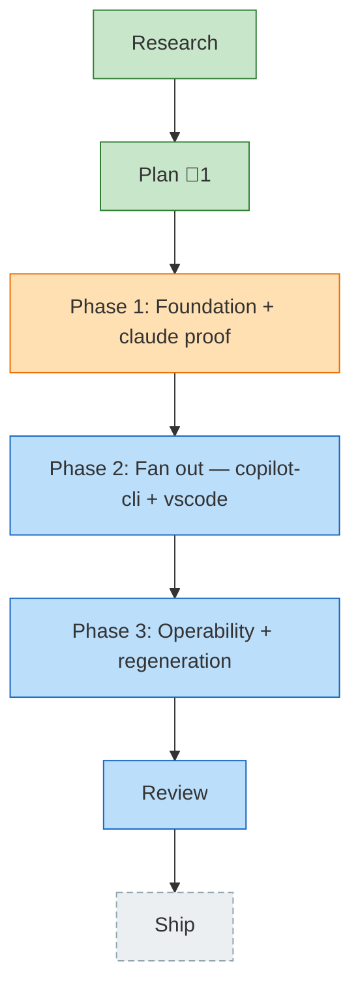

<!-- GENERATED by `harness flow render` — do not hand-edit; regenerate from the flow JSON. -->
# Flow · telemetry-fixture-corpus

**Kind**: flight-plan · **Now**: phase-1 · **Next**: phase-2 · **Intent**: Capture real logs from all four harness surfaces on this machine, scrub machine paths/identity/secrets while keeping verbatim prompts+tool usage (with a manual 'anything bad' review), commit them as durable fixtures, and add end-to-end tests that drive each real fixture through its adapter to the serialized segment to validate the data we produce. · **Nodes**: 7 · **Events**: 21

**Rail**: ◆─◆─[ ◐─◇─◇ ]─◇─◇  ◆ Research · ◆ Plan · [ ◐ Phase 1: Foundation + claude proof · ◇ Phase 2: Fan out — copilot-cli + vscode · ◇ Phase 3: Operability + regeneration ] · ◇ Review · ◇ Ship

**Legend**: 🟩 done · 🟧 in-progress · 🟥 blocked · 🟦 known (designed) · ⬜ assumed (speculative) · 🔶 decision · 🗣 user input · 🟪 harness loop · 🤖 companion · 🛠 worker · 🧰 chore (upkeep).

## Node log

### plan · Plan
- `2026-06-25T06:24:55.240Z` · — · validation — validate-v2 VALIDATED WITH FIXES — two-guard privacy model sound; raw-fixture+golden byte-scan tightened; sqlite spike pulled into Phase 1.
